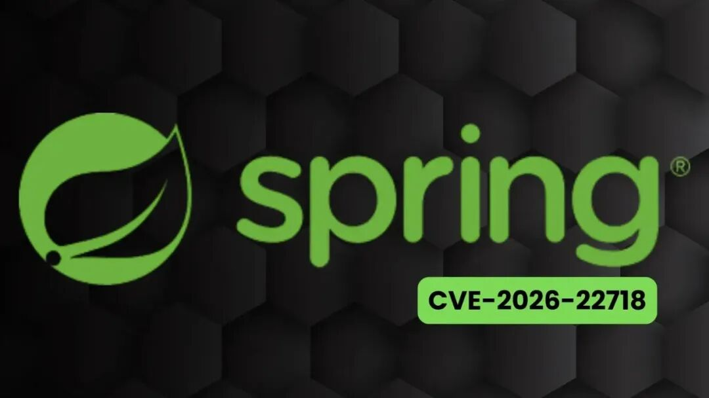

## 核对与使用边界

本文已按保存的全文审阅记录进行文字校订；本轮仅静态核对，未运行 PoC、请求目标或逐图验证。

适用条件与版本记录（来源主张，未列为明确更正的部分仍待权威资料核对）：&lt;=0.9.0、2025-05-14 EOL无补丁为文中声明，需官方核验

代码与实验材料：只普通shell注入示意，未给VSCode操作入口、参数传递与实际结果

来源证据范围：未给任何官方公告/扩展商店链接，转载称找不到原来源

- **适用与权限边界（1）**：CVE机制和本地权限先决条件未证明；依据：让用户执行带;的shell命令本来执行命令，不能证明扩展何处错误；CVSS AV:L不自动等于攻击者已有本地账号。按此限制解释本文结论，版本相同不足以证明所需角色、入口、配置、依赖或可控参数均已满足；原操作和失败记录一并保留。

- **操作与副作用边界（2）**：危险示意命令无必要且易误用；依据：例含删除根目录命令，不宜作无害验证；这里不执行或改进。保留原步骤及请求方法。执行条件包括隔离且获授权的可恢复环境、预先记录相关文件/账号/配置/业务记录状态；响应完成不能等同无副作用，恢复时须核对该操作涉及的实际对象。

- **实验改动边界（3）**：EOL与评分必须来源化；依据：给精确EOL/6.8向量和强制批量卸载建议但无公告，需区分Spring CLI扩展与其他Spring工具。以下步骤按原实验条件保留；人工改动后的行为只支持该修改环境，不用于证明未修改发行版默认可利用。

历史原文标识：下文原技术材料按来源保留；仅本节明确确认的更正替代相应旧说法，标为待核的观察仍不是事实确认。

#  Spring CLI 存在允许攻击者在用户系统上执行命令漏洞  
 网安百色   2026-01-15 11:47  
  
  
  
Spring CLI VSCode扩展存在**命令注入漏洞**  
，攻击者可利用该漏洞在目标系统上执行任意命令。该漏洞被追踪为CVE-2026-22718，影响所有0.9.0及更早版本（均已结束生命周期）。  
<table><thead><tr style="-webkit-font-smoothing: antialiased;"><th style="-webkit-font-smoothing: antialiased;">漏洞编号</th><th style="-webkit-font-smoothing: antialiased;">CVE-2026-22718</th></tr></thead><tbody><tr style="-webkit-font-smoothing: antialiased;"><td style="-webkit-font-smoothing: antialiased;">组件名称</td><td style="-webkit-font-smoothing: antialiased;">Spring CLI VSCode扩展</td></tr><tr style="-webkit-font-smoothing: antialiased;"><td style="-webkit-font-smoothing: antialiased;">漏洞类型</td><td style="-webkit-font-smoothing: antialiased;">命令注入（Command Injection）</td></tr><tr style="-webkit-font-smoothing: antialiased;"><td style="-webkit-font-smoothing: antialiased;">CVSS评分</td><td style="-webkit-font-smoothing: antialiased;">6.8（AV:L/AC:L/PR:L/UI:R/S:C/C:H/I:H/A:L）</td></tr><tr style="-webkit-font-smoothing: antialiased;"><td style="-webkit-font-smoothing: antialiased;">严重等级</td><td style="-webkit-font-smoothing: antialiased;">Medium</td></tr><tr style="-webkit-font-smoothing: antialiased;"><td style="-webkit-font-smoothing: antialiased;">攻击条件</td><td style="-webkit-font-smoothing: antialiased;">本地访问 + 用户交互</td></tr><tr style="-webkit-font-smoothing: antialiased;"><td style="-webkit-font-smoothing: antialiased;">影响范围</td><td style="-webkit-font-smoothing: antialiased;">所有0.9.0及更早版本</td></tr></tbody></table>

### 1. 漏洞原理  
  
攻击者通过以下方式触发漏洞：  
1. 诱导开发者在VSCode中执行恶意构造的Spring CLI命令  
1. 利用扩展未正确过滤特殊字符（如;  
、&  
、|  
）的缺陷  
1. 在目标系统上执行任意Shell命令  
### 2. 攻击场景  
- **初始访问**  
：需已具备本地系统访问权限（如共享开发环境）  
- **漏洞利用**  
：通过诱导用户执行特制命令（如spring init --dependencies=web;rm -rf /  
）  
- **执行权限**  
：继承当前用户权限（通常为开发者账户）  
- **持久化**  
：修改.bashrc  
或VSCode扩展配置文件实现后门植入  
## 受影响版本及修复方案  
### 官方声明：  
  
该扩展已于**2025年5月14日结束生命周期**  
（EOL），不再提供安全更新。Spring团队仍为此漏洞分配CVE编号，旨在提醒用户及时移除旧版工具。  
<table><thead><tr style="-webkit-font-smoothing: antialiased;"><th style="-webkit-font-smoothing: antialiased;">扩展版本</th><th style="-webkit-font-smoothing: antialiased;">修复建议</th></tr></thead><tbody><tr style="-webkit-font-smoothing: antialiased;"><td style="-webkit-font-smoothing: antialiased;">≤ 0.9.0</td><td style="-webkit-font-smoothing: antialiased;"><strong style="-webkit-font-smoothing: antialiased;">立即卸载</strong>（无可用补丁）</td></tr></tbody></table>

## 防御建议  
- **强制卸载**  
：通过配置管理工具（如Ansible、SCCM）批量移除扩展  
- **环境审计**  
：检查CI/CD流水线中的VSCode镜像是否包含该扩展  
- **权限管控**  
：限制开发人员对系统级配置文件的修改权限  
本公众号所载文章为本公众号原创或根据网络搜索下载编辑整理，文章版权归原作者所有，仅供读者学习、参考，禁止用于商业用途。因转载众多，无法找到真正来源，如标错来源，或对于文中所使用的图片、文字、链接中所包含的软件/资料等，如有侵权，请跟我们联系删除，谢谢！  
  
  
  
  

---

> 来源：gelusus/wxvl（微信公众号漏洞文章自动归档，原文见文首链接）
