## 核对与使用边界

本文已按保存的全文审阅记录进行文字校订；本轮仅静态核对，未运行 PoC、请求目标或逐图验证。

适用条件与版本记录（来源主张，未列为明确更正的部分仍待权威资料核对）：没有受影响和修复版本，只有固定补丁commit；三前提WebFlux/静态资源/非permitAll较明确

代码与实验材料：源码路径叙述与demo外链，配置/请求/响应大多图片，缺完整实验依赖

来源证据范围：mouadk原PoC和SpringSecurity固定commit，未给官方安全公告

- **结论使用边界（1）**：安全链选择语义和HTTP状态错误；依据：称所有安全过滤器都接受才通过，混淆多SecurityWebFilterChain与链内过滤器；HTTP400NOTFOUND不一致。此项限制直接适用于下文对应结论；现有正文不足以作更宽泛推论，所列方法和原始证据均保留。

- **结论使用边界（2）**：字符与动态路由影响泛化；依据：把/叫反斜杠；动态资源永不受影响的解释应限定本文具体路径匹配，而非所有自定义handler。此项限制直接适用于下文对应结论；现有正文不足以作更宽泛推论，所列方法和原始证据均保留。

- **事实待核（3）**：修复可操作范围缺失；依据：只建议升级依赖，没有各安全分支版本，SpringMVC类型HttpRequestHandler也混入WebFlux说明。该项尚不能从转载本身确定外部事实；下文相应编号、版本或修复说法只作为来源记录，不能据此判定部署受影响或已修复。明确更正另列于本节。

历史原文标识：下文原技术材料按来源保留；仅本节明确确认的更正替代相应旧说法，标为待核的观察仍不是事实确认。

#  Spring WebFlux 授权绕过：CVE-2024-38821 详解   
 Ots安全   2025-01-27 06:18  
  
  
  
Spring 于 2024 年 10 月 25 日宣布了 CVE-2024-38821，这是一个严重漏洞，允许攻击者在某些情况下访问受限资源。该漏洞特别影响 Spring WebFlux 的静态资源服务。要影响应用程序，必须满足以下所有条件：它必须是 WebFlux 应用程序。  
  
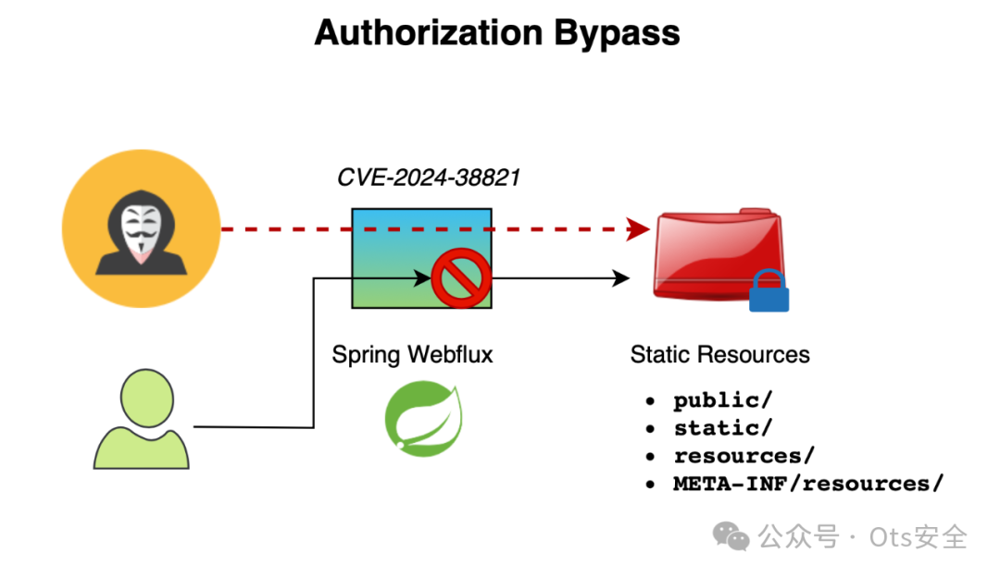  
  
Spring 于 2024 年 10 月 25 日宣布了 CVE-2024-38821，这是一个严重漏洞，允许攻击者在某些情况下访问受限资源。  
  
该漏洞特别影响 Spring WebFlux 的静态资源服务。要影响应用程序， 必须满足以下所有条件：  
- 它必须是一个 WebFlux 应用程序。  
  
- 它必须使用 Spring 的静态资源支持。  
  
- 必须对静态资源支持应用非permitAll授权规则。  
  
在本文中，我们将深入研究此漏洞的细节，并分析它为何只影响静态资源。  
  
PoC 可在以下位置找到：https://github.com/mouadk/cve-2024-38821/tree/main  
  
**漏洞**  
  
在本节中，我们将深入探讨该漏洞的细节，包括一些背景信息。  
  
如果你不喜欢阅读，这里有一个演示漏洞流程的图。  
  
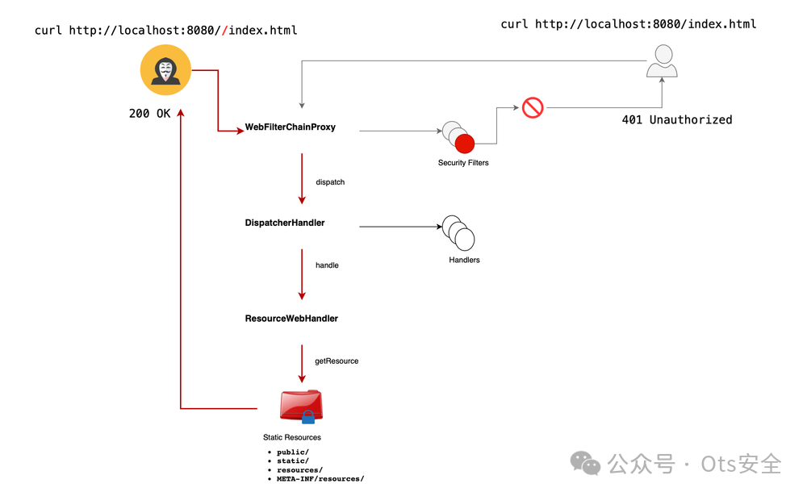  
  
**WebFilterChainProxy 类**  
  
Spring Security 使用安全过滤器执行其大部分核心逻辑。通常，当我们定义多个安全过滤器时，为了方便委托，过滤器链位于顶部，并负责将响应转发给下一个过滤器。  
  
DefaultWebFilterChain 实际上是 WebFilterChain 的默认实现。WebFilterChainProxy 是一个用于委托给 SecurityWebFilterChain 实例列表的过滤器。  
  
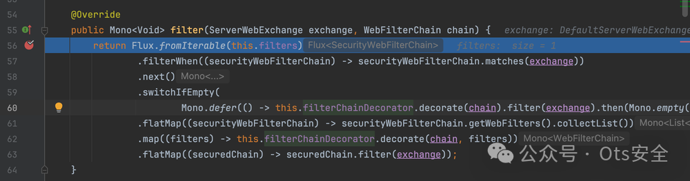  
  
**网页过滤链代理**  
  
我们可以在应用程序中配置多个安全过滤器。只有当所有过滤器都接受请求时，请求才能继续在应用程序中传输。  
  
**调度处理程序类**  
  
**DispatcherHandler**  
类似于**DispatcherServletSpring MVC**，负责处理 http 请求。在初始化阶段，它会根据收到的请求发现需要委托任务的特殊 bean。处理逻辑实际上是在下面显示的 DispatcherHandler 的 handle 方法中实现的。  
  
这基本上是这样的：  
- 对于每个尝试获取适当处理程序的映射，此处的语义以首先找到的处理程序为准。如果找不到处理程序，则会引发异常。  
  
- 接下来，invoke handler 将尝试解析支持当前 handler 的 HandlerAdapter。如果未找到，则会向下游发送错误。  
  
给定一个 http 请求（封装在 ServerWebExchange 中），getHandler 实际上负责解析该请求的处理程序。  
  
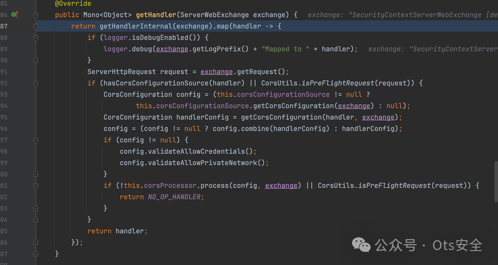  
  
抽象处理程序映射  
  
当请求到达时， **DispatcherHandler** 只有安全过滤器通过后才会调用。如果安全过滤器链允许或拒绝请求失败，则会 DispatcherHandler 识别适当的处理程序（通过顺序评估潜在匹配项并选择第一个成功的处理程序）。  
  
攻击者可以利用精心设计的 URL 路径绕过安全过滤器，从而避免对受保护资源进行检查。例如，如果您想要保护 /index.html，攻击者可以操纵 URL 以 **//index.html**。由于安全过滤器执行严格的路径匹配，因此它不适用于这种情况，可能会导致资源不受保护。如果绕过所有安全过滤器，则可能导致不受限制的访问。  
  
一旦通过安全过滤器，特定处理程序就会处理请求。Spring 中默认添加了 一个特定处理程序ResourceWebHandler （  ），用于从 中定义的特定位置提供静态资源（如图像、HTML 和 YAML 文件） ，包括：**HttpRequestHandler、****ResourceHandlerRegistry**  
- **public/**  
  
- **static/**  
  
- **resources/**  
  
- **META-INF/resources/**  
  
例如，使用路径 **..//index.html**，请求的路径将使用 进行解析 **exchange.getRequiredAttribute(HandlerMapping.PATH_WITHIN_HANDLER_MAPPING_ATTRIBUTE)**，结果为 index.html。因此，攻击者可以利用此机制。  
  
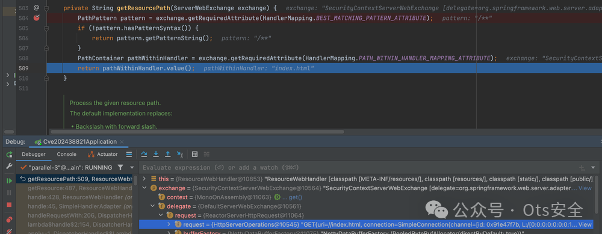  
  
ResourceWebHandler  
  
**为何非静态资源不受影响**  
  
非静态资源的行为有所不同。这些路由的处理程序使用谓词来验证请求，即使绕过所有安全过滤器也是如此。例如， PathPatternPredicate 严格匹配路径并拒绝未通过此匹配的请求，导致 HTTP 400 NOT FOUND，而不是授予意外访问权限。  
  
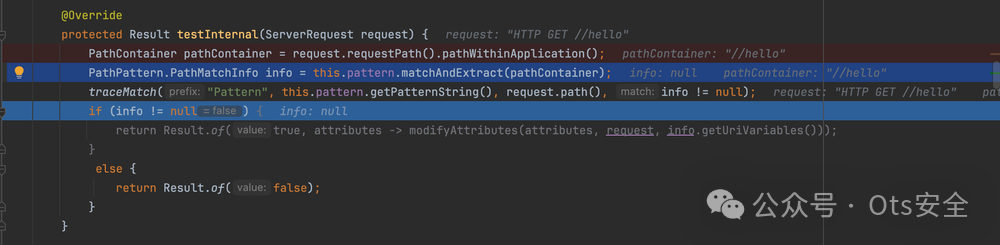  
  
请求谓词  
  
**攻击流程**  
  
攻击者通过应用程序的路径如下：**DispatcherHandler -> SimpleHandlerAdapter -> ResourceWebHandler -> PathResourceResolver -> Resource -> Attacker Access**  
  
该漏洞由d4y1ightl@gmail.com负责任地报告 。  
  
**演示**  
  
PoC 可在以下位置找到：https://github.com/mouadk/cve-2024-38821/tree/main  
  
让我们配置以下设置来保护对特定路径的访问，包括 **/secure/hello、 /index.html和 /application.yaml：**  
  
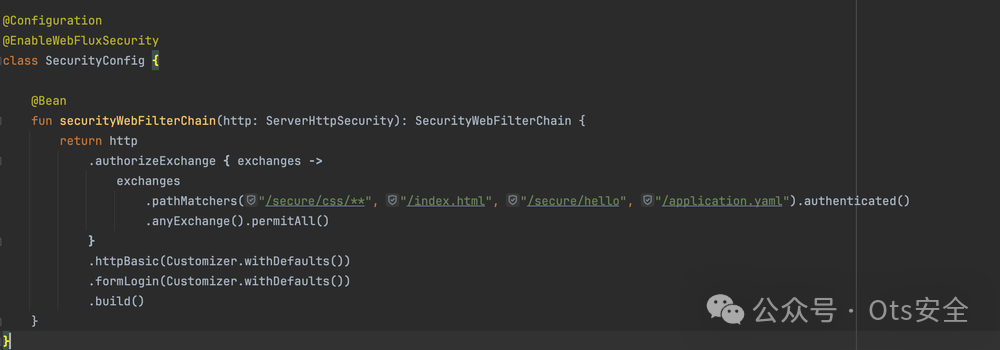  
  
接下来我们配置以下路线：  
  
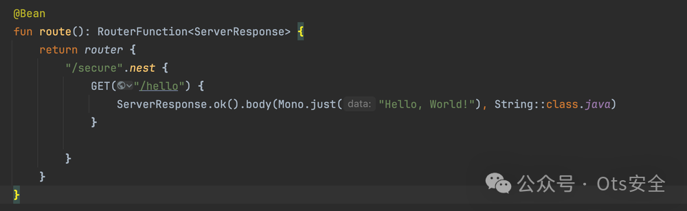  
  
我们可以确认此配置对于非恶意请求能够按预期工作。  
  
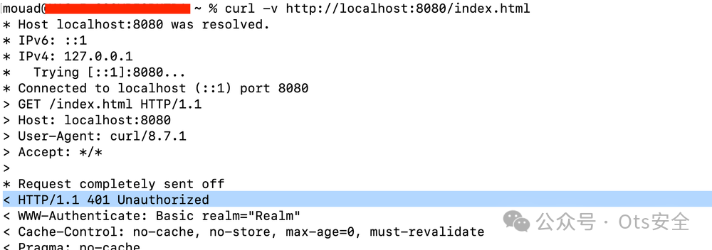  
  
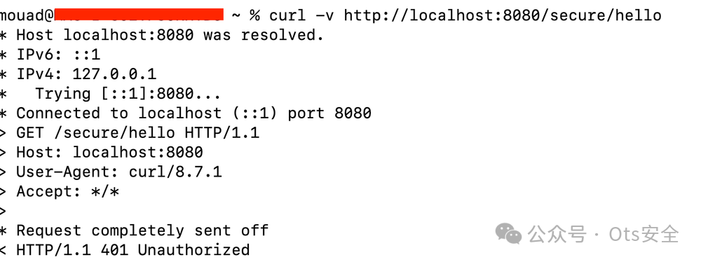  
  
然而，只需进行轻微修改（例如添加反斜杠（/），攻击者就可以绕过过滤器并访问静态资源。  
  
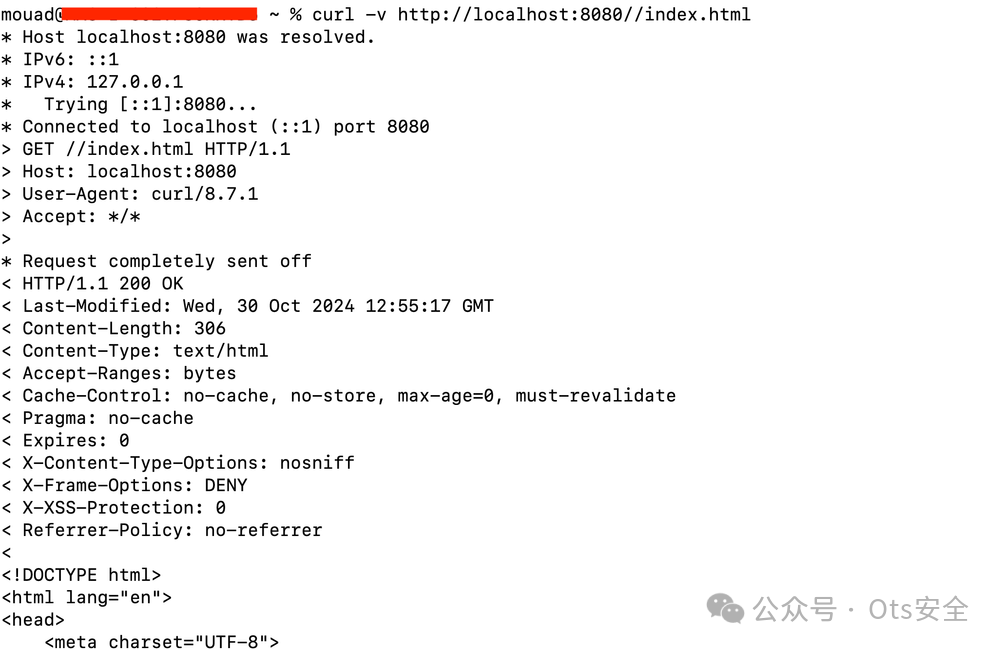  
  
相反， /secure/hello使用此修改来访问动态资源（如）会导致“未找到”错误，如前所述。  
  
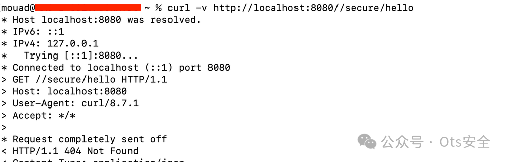  
  
**修复**  
  
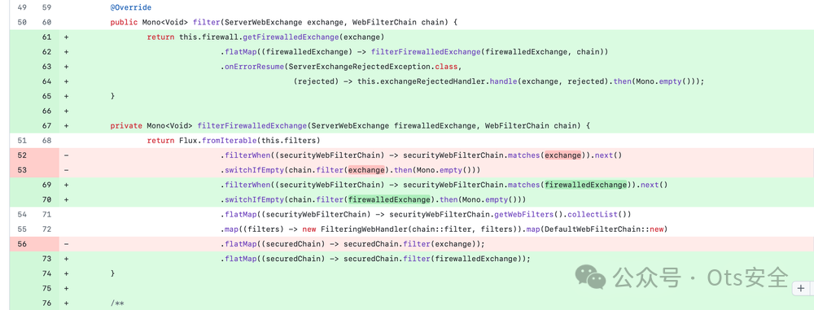  
  
https://github.com/spring-projects/spring-security/commit/4ce7cde15599c0447163fd46bac616e03318bf5b#diff-dd76f194f47c99da94b2808df1bf614d087a8ebbbd1fca1fea9a096ea9bbd176R11  
  
该解决方案涉及增强查询验证。具体来说，在安全链中引入了防火墙，以在请求到达过滤器链之前对其进行验证。您可以在此处（上方）查看提交：    
GitHub Commit-https://github.com/spring-projects/spring-security/commit/4ce7cde15599c0447163fd46bac616e03318bf5b?ref=deep-kondah.com#diff-dd76f194f47c99da94b2808df1bf614d087a8ebbbd1fca1fea9a096ea9bbd176R11  
 **ServerWebExchangeFirewall** 。此更新引入了 （特别是 **StrictServerWebExchangeFirewall**）具有附加验证方法的版本 。  
  
强烈建议升级您的 Spring 依赖项，并采用“默认拒绝”方法。此外，请考虑使用声明式安全性，这对攻击者来说更具挑战性，因为他们经常操纵安全过滤器链。  
  
如果我们重试之前的请求，我们会收到“错误请求”错误：  
  
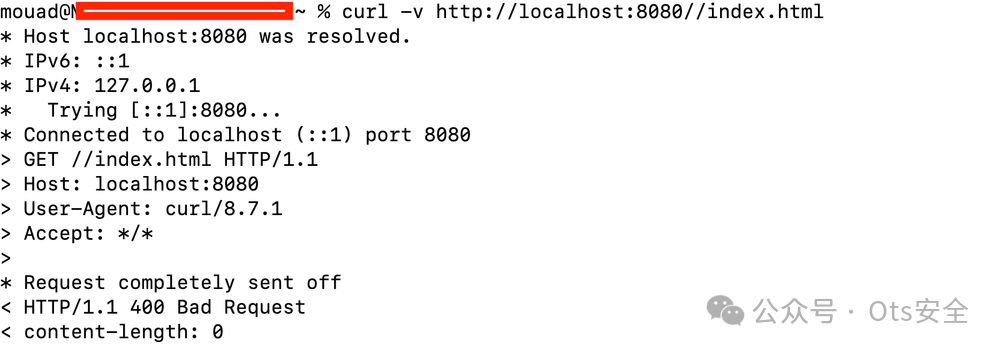  
  
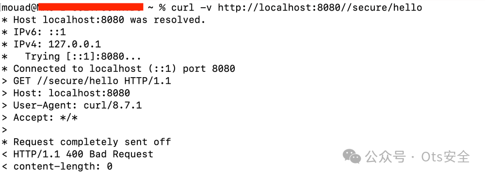  
  
这也表明，虽然 RASP 很有用，但它可能无法发现这一漏洞。至于 ADR，其有效性可能会有所不同。  
  
要强硬，要严格（对于攻击者:)）  
  
  
  
感谢您抽出  
  
  
  
.  
  
  
  
.  
  
  
  
来阅读本文  
  
  
  
**点它，分享点赞在看都在这里**  
  
  

---

> 来源：gelusus/wxvl（微信公众号漏洞文章自动归档，原文见文首链接）
