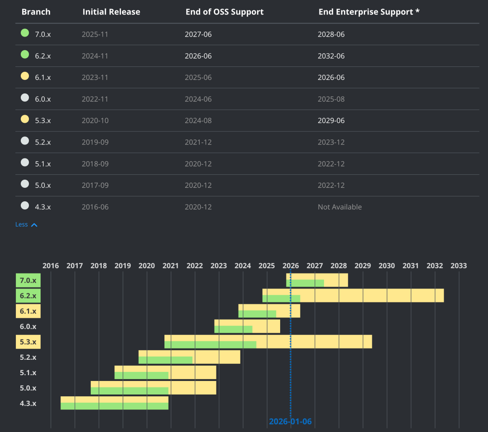
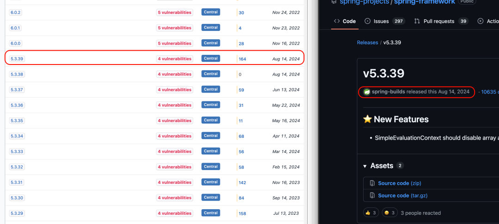
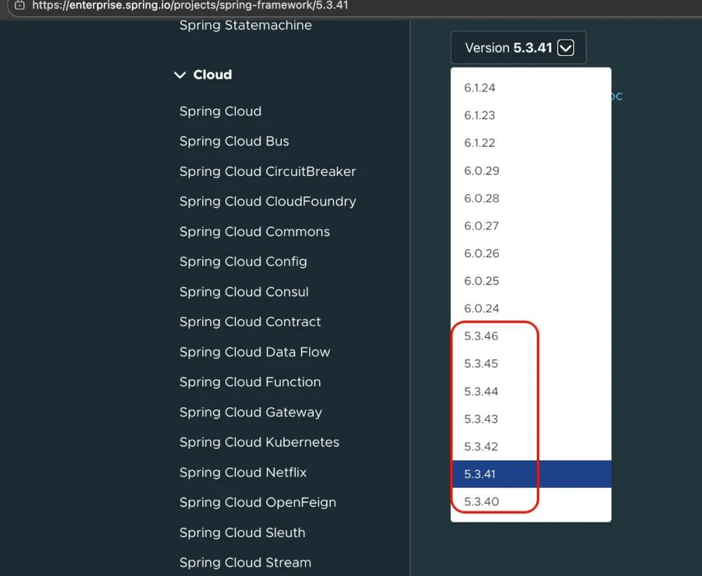
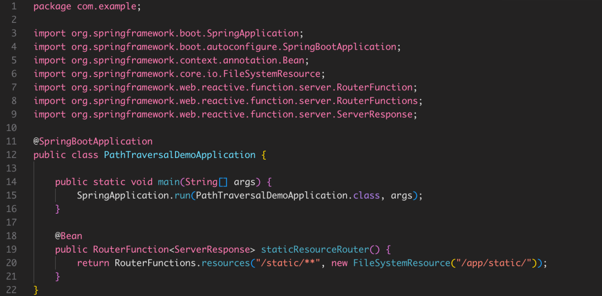
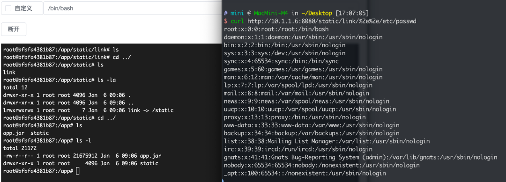
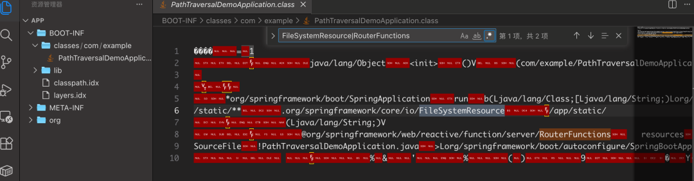
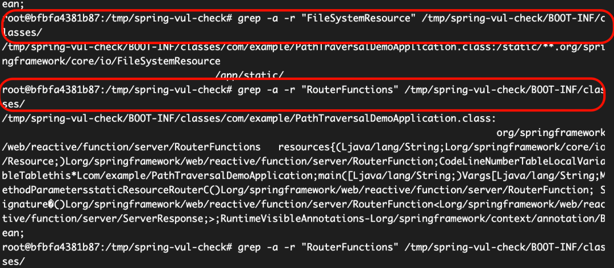
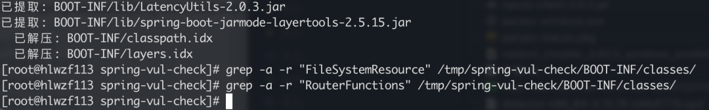

## 核对与使用边界

本文已按保存的全文审阅记录进行文字校订；本轮仅静态核对，未运行 PoC、请求目标或逐图验证。

适用条件与版本记录（来源主张，未列为明确更正的部分仍待权威资料核对）：安全5.3.41/6.0.25/6.1.14为覆盖两漏洞建议；支持状态是2026-01-06快照

代码与实验材料：grep BOOT-INF/classes两个关键字判有/无漏洞不可靠；shell命令被粘连/注释吞掉

来源证据范围：原创国光，截图但无官方公告/支持政策URL

- **来源与引用处置（1）**：关键字不能自证安全或可利用；依据：命中可不可达/无关；未命中可能依赖BOOT-INF/lib、反射、动态配置/封装，需实际Bean与路由可达性。保留这部分来源材料并与技术结论分开；其引用或宣传内容不能补足本文漏洞的证据。

- **适用与权限边界（2）**：条件/支持状态被过度用作缓修依据；依据：不同CVE还涉及容器/防火墙，不能两字串即漏洞；替ClassPathResource会改变业务，需测试。按此限制解释本文结论，版本相同不足以证明所需角色、入口、配置、依赖或可控参数均已满足；原操作和失败记录一并保留。

- **实验改动边界（3）**：操作示例不可执行；依据：mkdir/cp/cd/grep无换行，一条注释吞全部命令。以下步骤按原实验条件保留；人工改动后的行为只支持该修改环境，不用于证明未修改发行版默认可利用。

历史原文标识：下文原技术材料按来源保留；仅本节明确确认的更正替代相应旧说法，标为待核的观察仍不是事实确认。

#  自证安全，聊聊 Spring Framework 鸡肋漏洞 CVE-2024-38816/CVE-2024-38819 的破局之道  
原创 国光  安全小姿势   2026-01-06 11:43  
  
## 事情背景  
  
在企业安全运维场景中，普遍痛点始终存在：不少主机安全产品仅通过组件版本比对，就将低版本组件直接标记为高危漏洞；而监管层面的“动态清零”要求虽初衷是筑牢安全防线，但往往未能充分考量企业实际运维困境：一旦检测出高危漏洞，无论其实际利用难度与业务影响，均需限期整改。  
  
正好国光最近遇到的 Spring Framework 目录遍历漏洞 CVE-2024-38816/CVE-2024-38819，正是这类鸡肋漏洞的典型代表，需特定场景触发，实际攻击风险有限，却让不少企业陷入了“不修复过不了监管，修复又面临诸多阻碍”的两难境地。  
  
为何这类漏洞的修复如此棘手？首先修复这2个漏洞的最低安全版本为 Spring Framework 5.3.41 那我们来看看官方目前的支持情况如何？  
  
  
  
  
截止到目前2026年01月06日，Spring Framework 社区免费版本的最低分支为 6.2.x 系列，该系列分支要求最低的 **JDK 版本为 JDK 17**  
，很明显国内目前的传统企业大多数都还是 JDK 1.8 版本，总不能为了修一个低风险漏洞重构整个应用吧？安全从来不能凌驾于业务之上，强推 JDK 升级显然不现实。  
  
那退一步，直接升级到 5.3.41 行不行？也不行 ——Spring 社区免费版本的 5.3 系列最高只更到 5.3.39：  
  
  
  
  
想要 5.3.41 及以上的安全版本，必须购买企业付费版本：  
  
  
  
所以既然升级修复这条路走不通的话，我们就得直面问题，这被检测出来的 Spring Framework 漏洞 CVE-2024-38816/CVE-2024-38819 漏洞真的存在可以被利用吗？  
## 漏洞分析  
  
这两个漏洞本质是**路径遍历（目录穿越）漏洞**  
，当应用通过 RouterFunctions  
 处理静态资源，且资源配置使用 FileSystemResource  
 对接服务器物理文件系统时，攻击者可构造恶意 HTTP 请求，读取服务器上的任意文件，造成敏感信息泄露。  
  
**安全版本**  
：5.3.41、6.0.25、6.1.14 及以上  
  
**触发条件**  
：漏洞存在的**必要前提**  
（缺一不可）  
1. 在使用RouterFunctions.resources()  
或RouterFunctions.resource()  
方法时，未正确限制资源访问路径  
  
1. 映射的是**服务器物理文件系统路径**  
（FileSystemResource  
），而非 jar 包内的ClassPathResource  
  
下面是漏洞 Demo 代码片段：  
  
  
  
  
  
漏洞利用 POC：  
  
  
  
## 自证清白  
  
其实自证清白很简单，就是直接解压 jar 包，搜索漏洞函数相关特征，如果存在则存在漏洞：  
- 检查是否使用 FileSystemResource（漏洞触发必要前提），关键词：  
  
```
FileSystemResource
```  
- 检查 WebFlux 静态资源映射配置，关键词：  
  
```
RouterFunctions
```  
  
  
  
那么既然知道原理了，直接使用命令来解压验证。  
### 存在漏洞的情况  
```
# 将有漏洞的 jar 包拷贝到临时目录下mkdir -p /tmp/spring-vul-checkcp /app/app.jar /tmp/spring-vul-check/# 直接解压 jar 并搜索关键词验证cd /tmp/spring-vul-check/jar xvf app.jar# 检查是否使用 FileSystemResourcegrep -a -r "FileSystemResource" /tmp/spring-vul-check/BOOT-INF/classes/# 检查 WebFlux 静态资源映射配置grep -a -r "RouterFunctions" /tmp/spring-vul-check/BOOT-INF/classes/
```  
  
如果两条搜索命令都命中的话，则才存在对应的漏洞，如下图：  
  
  
### 不存在漏洞的情况  
  
首先根据安全产品的特征，拿到有漏洞的 jar 位置信息：  
```
当前安装版本：5.3.27- SpringBoot项目包路径：/home/epps/appdest/epps-egs-1.0-SNAPSHOT.jar- SpringBoot子包名称：spring-webmvc-5.3.27.jar
```  
  
然后进行解压查看是否存在特征函数：  
```
# 将有漏洞的 jar 包拷贝到临时目录下mkdir -p /tmp/spring-vul-checkcp /home/epps/appdest/epps-egs-1.0-SNAPSHOT.jar /tmp/spring-vul-check/# 直接解压 jar 并搜索关键词验证cd /tmp/spring-vul-check/jar xvf epps-egs-1.0-SNAPSHOT.jar# 检查是否使用 FileSystemResourcegrep -a -r "FileSystemResource" /tmp/spring-vul-check/BOOT-INF/classes/# 检查 WebFlux 静态资源映射配置grep -a -r "RouterFunctions" /tmp/spring-vul-check/BOOT-INF/classes/
```  
  
  
  
  
## 最后总结  
  
面对 Spring Framework CVE-2024-38816/CVE-2024-38819 这类 “鸡肋漏洞”，企业无需被 版本升级的死胡同困住，也不必在监管要求和业务稳定之间焦虑。  
  
这类漏洞的核心特点是 触发条件严苛，版本高低只是安全产品的 表面判断依据，而非漏洞真实存在的证明。与其盲目推动高成本的 JDK/Spring 版本升级（甚至重构应用），不如先通过关键特征判断漏洞是否真的影响自身系统，若验证后确认无漏洞，可将验证过程和结果作为依据，摆脱无意义整改的内耗，若真的存在漏洞，也无需急于升级版本，可先通过限制 RouterFunctions  
 资源访问路径、替换 FileSystemResource  
 为 ClassPathResource  
 等轻量化方式封堵风险，兼顾业务稳定与安全合规。  
  
安全运维的核心从来不是 “为了修漏洞而修漏洞”，而是基于实际风险做 “精准防护”，既不忽视真实威胁，也不被无意义的整改消耗资源，这才是应对这类鸡肋漏洞的最优解。  
  
明明这类漏洞的触发条件严苛到近乎苛刻，国内这些安全厂商却连最基础的 “漏洞是否真的存在” 都懒得验证，一套 “版本比对” 的原则，管你业务实际场景、管你漏洞触发前提，只要版本没到所谓的 “安全基线”，就打上 “高危漏洞” 的标签，好的安全产品不应该只是版本号的 “复读机”，不应该只知道拿着版本号搞一刀切的形式主义！奉劝某些厂商：别再拿版本当遮羞布了！真要做安全，就沉下心把检测做细、做准，别再用这种懒人式判定消耗企业的信任和资源，客户要的是解决闭环问题，而不是整天被一堆莫须有的 “高危漏洞” 折腾得鸡飞狗跳！  
  


---

> 来源：gelusus/wxvl（微信公众号漏洞文章自动归档，原文见文首链接）
