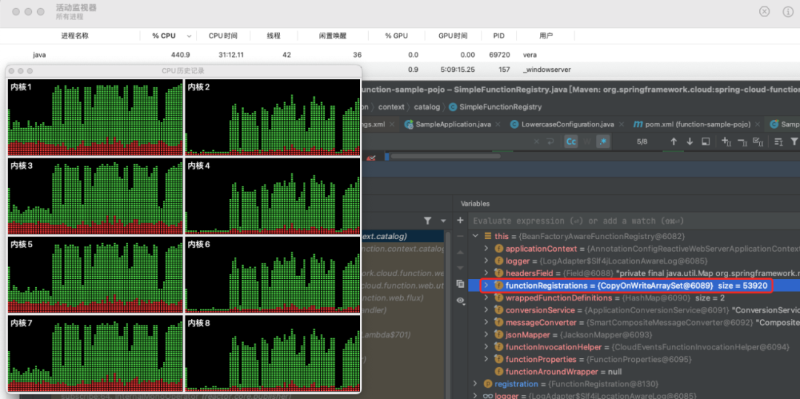

## 核对与使用边界

本文已按保存的全文审阅记录进行文字校订；本轮仅静态核对，未运行 PoC、请求目标或逐图验证。

适用条件与版本记录（来源主张，未列为明确更正的部分仍待权威资料核对）：&lt;3.2.6、修复3.2.6，旧不支持版本笼统

代码与实验材料：仅复现截图，特制请求/函数分配路径缺文本，无法区别普通流量DoS

来源证据范围：Tanzu官方、Checkmarx原研究、固定release较强

- **适用与权限边界（1）**：DoS机制和可达条件过泛；依据：只说大量特制HTTP消耗资源，未说明函数路由/调用限制如何导致22979特定弱点。按此限制解释本文结论，版本相同不足以证明所需角色、入口、配置、依赖或可控参数均已满足；原操作和失败记录一并保留。

- **事实待核（2）**：历史状态与厂商防护需保留日期；依据：PoC已发现/无在野与产品支持是2022-06-28快照，不应当当前结论。该项尚不能从转载本身确定外部事实；下文相应编号、版本或修复说法只作为来源记录，不能据此判定部署受影响或已修复。明确更正另列于本节。

历史原文标识：下文原技术材料按来源保留；仅本节明确确认的更正替代相应旧说法，标为待核的观察仍不是事实确认。

#  【已复现】Spring Cloud Function 拒绝服务漏洞(CVE-2022-22979)安全风险通告   
原创 QAX CERT  奇安信 CERT   2022-06-28 19:32  
  
  
  
奇安信CERT  
  
**致力于**  
第一时间  
为企业级用户提供安全风险  
**通告**  
和  
**有效**  
解决方案。  
  
  
**安全通告**  
  
  
  
近日，奇安信CERT监测到Spring Cloud Function拒绝服务漏洞(CVE-2022-22979)技术细节在互联网上公开，攻击者可以向Spring Cloud Function发送大量特制的HTTP请求消耗服务器资源，从而导致拒绝服务。**鉴于这些漏洞影响范围较大，建议客户尽快做好自查及防护。**  
  
****  
<table><tbody><tr><td style="word-break: break-all;padding: 5px 10px;border-color: rgb(221, 221, 221);" width="89">
<strong>漏洞名称</strong>
</td><td colspan="3" style="padding: 5px 10px;word-break: break-all;border-color: rgb(221, 221, 221);">
Spring Cloud Function拒绝服务漏洞
</td></tr><tr><td style="padding: 5px 10px;border-color: rgb(221, 221, 221);" width="110">
<strong>公开时间</strong>
</td><td style="padding: 5px 10px;border-color: rgb(221, 221, 221);" width="207">
2022-06-21
</td><td style="word-break: break-all;padding: 5px 10px;border-color: rgb(221, 221, 221);" width="158">
<strong>更新时间</strong>
</td><td style="padding: 5px 10px;border-color: rgb(221, 221, 221);" width="229">
2022-06-28
</td></tr><tr><td style="padding: 5px 10px;border-color: rgb(221, 221, 221);" width="128">
<strong>CVE编号</strong>
</td><td style="padding: 5px 10px;border-color: rgb(221, 221, 221);" width="217">
CVE-2022-22979
</td><td style="padding: 5px 10px;border-color: rgb(221, 221, 221);" width="168">
<strong>其他编号</strong>
</td><td style="padding: 5px 10px;border-color: rgb(221, 221, 221);" width="232">
QVD-2022-9758
</td></tr><tr><td style="padding: 5px 10px;border-color: rgb(221, 221, 221);" width="139">
<strong>威胁类型</strong>
</td><td style="padding: 5px 10px;border-color: rgb(221, 221, 221);" width="217">
拒绝服务
</td><td style="padding: 5px 10px;border-color: rgb(221, 221, 221);" width="173">
<strong>技术类型</strong>
</td><td style="padding: 5px 10px;border-color: rgb(221, 221, 221);" width="230">
无限制的资源分配
</td></tr><tr><td style="padding: 5px 10px;border-color: rgb(221, 221, 221);" width="146">
<strong>厂商</strong>
</td><td style="padding: 5px 10px;border-color: rgb(221, 221, 221);" width="213">
VMware
</td><td style="word-break: break-all;padding: 5px 10px;border-color: rgb(221, 221, 221);" width="175">
<strong>产品</strong>
</td><td style="padding: 5px 10px;border-color: rgb(221, 221, 221);word-break: break-all;" width="227">
Spring Cloud Function
</td></tr><tr><td colspan="4" align="center" valign="middle" style="word-break: break-all;padding: 5px 10px;border-color: rgb(221, 221, 221);">
<strong>风险等级</strong>
</td></tr><tr><td colspan="2" align="center" valign="middle" style="padding: 5px 10px;border-color: rgb(221, 221, 221);">
<strong>奇安信CERT风险评级</strong>
</td><td colspan="2" align="center" valign="middle" style="padding: 5px 10px;border-color: rgb(221, 221, 221);">
<strong>风险等级</strong>
</td></tr><tr><td colspan="2" align="center" valign="middle" style="padding: 5px 10px;border-color: rgb(221, 221, 221);">
<strong>高危</strong>
</td><td colspan="2" align="center" valign="middle" style="padding: 5px 10px;border-color: rgb(221, 221, 221);">
<strong>蓝色（一般事件）</strong>
</td></tr><tr><td colspan="4" align="center" valign="middle" style="padding: 5px 10px;border-color: rgb(221, 221, 221);">
<strong>现时威胁状态</strong>
</td></tr><tr><td align="center" valign="middle" style="padding: 5px 10px;border-color: rgb(221, 221, 221);" width="151">
<strong>POC状态</strong>
</td><td align="center" valign="middle" style="padding: 5px 10px;border-color: rgb(221, 221, 221);" width="212">
<strong>EXP状态</strong>
</td><td align="center" valign="middle" style="padding: 5px 10px;border-color: rgb(221, 221, 221);" width="175">
<strong>在野利用状态</strong>
</td><td align="center" valign="middle" style="padding: 5px 10px;border-color: rgb(221, 221, 221);" width="226">
<strong>技术细节状态</strong>
</td></tr><tr><td align="center" valign="middle" style="padding: 5px 10px;border-color: rgb(221, 221, 221);" width="154">
<strong>已发现</strong>
</td><td align="center" valign="middle" style="padding: 5px 10px;border-color: rgb(221, 221, 221);" width="211">
未发现
</td><td align="center" valign="middle" style="padding: 5px 10px;border-color: rgb(221, 221, 221);" width="175">
未发现
</td><td align="center" valign="middle" style="padding: 5px 10px;border-color: rgb(221, 221, 221);" width="225">
<strong>已公开</strong>
</td></tr><tr><td style="word-break: break-all;padding: 5px 10px;border-color: rgb(221, 221, 221);" width="156">
<strong>漏洞描述</strong>
</td><td colspan="3" style="padding: 5px 10px;border-color: rgb(221, 221, 221);">
在Spring Cloud Function 中存在拒绝服务漏洞，攻击者可以发送大量特制的HTTP请求触发漏洞，成功利用此漏洞将消耗大量服务器资源最终导致拒绝服务。
</td></tr><tr><td style="padding: 5px 10px;border-color: rgb(221, 221, 221);" width="158">
<strong>影响版本</strong>
</td><td colspan="3" style="padding: 5px 10px;border-color: rgb(221, 221, 221);">
Spring Cloud Function &lt; 3.2.6

旧的、不受支持的版本也会受到影响
</td></tr><tr><td style="padding: 5px 10px;border-color: rgb(221, 221, 221);" width="159">
<strong>不受影响版本</strong>
</td><td colspan="3" style="padding: 5px 10px;border-color: rgb(221, 221, 221);">
Spring Cloud Function &gt;= 3.2.6
</td></tr><tr><td style="padding: 5px 10px;border-color: rgb(221, 221, 221);" width="160">
<strong>其他受影响组件</strong>
</td><td colspan="3" style="padding: 5px 10px;border-color: rgb(221, 221, 221);">
无
</td></tr></tbody></table>  
  
  
目前奇安信CERT已成功复现**Spring Cloud Function 拒绝服务漏洞(CVE-2022-22979)**，截图如下：  
  
  
  
  
威胁评估  
  
<table><tbody><tr><td style="word-break: break-all;padding: 5px 10px;" width="13">
<strong>漏洞名称</strong>
</td><td colspan="4" style="word-break: break-all;padding: 5px 10px;" align="center" valign="middle" width="467">
Spring Cloud Function 拒绝服务漏洞
</td></tr><tr><td style="padding: 5px 10px;" width="68">
<strong>CVE编号</strong>
</td><td align="center" valign="middle" style="padding: 5px 10px;" width="105">
CVE-2022-22979
</td><td colspan="2" style="word-break: break-all;padding: 5px 10px;" width="204">
<strong>其他编号</strong>
</td><td align="center" valign="middle" style="padding: 5px 10px;" width="101">
QVD-2022-9758
</td></tr><tr><td style="padding: 5px 10px;" width="13">
<strong>CVSS 3.1评级</strong>
</td><td style="padding: 5px 10px;" width="105" align="center" valign="middle">
高危
</td><td colspan="2" style="word-break: break-all;padding: 5px 10px;" width="78">
<strong>CVSS 3.1分数</strong>
</td><td style="padding: 5px 10px;" align="center" valign="middle" width="101">
7.5
</td></tr><tr><td rowspan="8" style="padding: 5px 10px;" width="13">
<strong>CVSS向量</strong>
</td><td colspan="2" align="center" valign="middle" style="word-break: break-all;padding: 5px 10px;" width="329">
<strong>访问途径（AV）</strong>
</td><td colspan="2" align="center" valign="middle" style="padding: 5px 10px;">
<strong>攻击复杂度（AC）</strong>
</td></tr><tr><td colspan="2" align="center" valign="middle" style="padding: 5px 10px;" width="192">
网络
</td><td colspan="2" align="center" valign="middle" style="padding: 5px 10px;" width="78">
低
</td></tr><tr><td colspan="2" align="center" valign="middle" style="word-break: break-all;padding: 5px 10px;" width="261">
<strong>所需权限（PR）</strong>
</td><td colspan="2" align="center" valign="middle" style="padding: 5px 10px;" width="78">
<strong>用户交互（UI）</strong>
</td></tr><tr><td colspan="2" align="center" valign="middle" style="padding: 5px 10px;" width="275">
无
</td><td colspan="2" align="center" valign="middle" style="padding: 5px 10px;" width="78">
不需要
</td></tr><tr><td colspan="2" align="center" valign="middle" style="word-break: break-all;padding: 5px 10px;" width="281">
<strong>影响范围（S）</strong>
</td><td colspan="2" align="center" valign="middle" style="padding: 5px 10px;" width="78">
<strong>机密性影响（C）</strong>
</td></tr><tr><td colspan="2" align="center" valign="middle" style="padding: 5px 10px;" width="284">
不改变
</td><td colspan="2" align="center" valign="middle" style="padding: 5px 10px;" width="78">
无
</td></tr><tr><td colspan="2" align="center" valign="middle" style="word-break: break-all;padding: 5px 10px;" width="285">
<strong>完整性影响（I）</strong>
</td><td colspan="2" align="center" valign="middle" style="padding: 5px 10px;" width="78">
<strong>可用性影响（A）</strong>
</td></tr><tr><td colspan="2" align="center" valign="middle" style="padding: 5px 10px;" width="286">
无
</td><td colspan="2" align="center" valign="middle" style="padding: 5px 10px;" width="78">
高
</td></tr><tr><td style="padding: 5px 10px;" width="13">
<strong>危害描述</strong>
</td><td colspan="4" style="padding: 5px 10px;" width="467">
攻击者可以发送特制的HTTP请求触发漏洞，成功利用此漏洞将消耗大量服务器资源，最终导致拒绝服务。
</td></tr></tbody></table>  
  
  
处置建议  
  
目前VMware官方已发布此漏洞修复版本，建议用户尽快升级至Spring Cloud Function 3.2.6及以上版本。  
  
https://github.com/spring-cloud/spring-cloud-function/releases/tag/v3.2.6  
  
  
产品解决方案  
  
**奇安信网站应用安全云防护系统已更新防护特征库**  
  
奇安信网神网站应用安全云防护系统已全面支持对Spring Cloud Function 拒绝服务漏洞(CVE-2022-22979)的防护。  
  
  
**奇安信开源卫士已支持**  
  
奇安信开源卫士20220628. 1112版本已支持对Spring Cloud Function拒绝服务漏洞(CVE-2022-22979)的检测。  
  
  
参考资料  
  
[1]https://tanzu.vmware.com/security/cve-2022-22979  
  
[2]https://checkmarx.com/blog/spring-function-cloud-dos-cve-2022-22979-and-unintended-function-invocation/  
  
  
时间线  
  
2022年6月28日，奇安信 CERT发布安全风险通告  
  
  
点击**阅读原文**  
到奇安信NOX-安全监测平台查询更多漏洞详情  

---

> 来源：gelusus/wxvl（微信公众号漏洞文章自动归档，原文见文首链接）
