## 核对与使用边界

本文已按保存的全文审阅记录进行文字校订；本轮仅静态核对，未运行 PoC、请求目标或逐图验证。

适用条件与版本记录（来源主张，未列为明确更正的部分仍待权威资料核对）：列多实体范围但 Messaging、Data REST、WebFlow 相互矛盾；Actuator 用 Boot 1–1.4/2.x 粗略代替依赖权限矩阵

代码与实验材料：601 行已全文读取；多处分析依源码截图，若干基础示例不完整，未执行

来源证据范围：明确微信原文，并有 Misaki、Chybeta、Seebug 等十项参考，无逐项官方补丁链接

- **适用与权限边界（1）**：漏洞版本疑似串项及边界错误；依据：8046 写 REST &lt;3.0.1/&lt;2.6.9，与 466 的 3.0RC3/2.6.7 不同，需排查后续修复；4971 又加 2.4.4–2.4.8，未独立标识后续问题；1270 上限与 481 不同。按此限制解释本文结论，版本相同不足以证明所需角色、入口、配置、依赖或可控参数均已满足；原操作和失败记录一并保留。

- **实验改动边界（2）**：基础代码存在明确缺失；依据：@Value 用 ${...} 却声称执行 SpEL；XML demo 没有 test.xml；context 变量声明被注释但后文使用。以下步骤按原实验条件保留；人工改动后的行为只支持该修改环境，不用于证明未修改发行版默认可利用。

- **适用与权限边界（3）**：Spring 组件关系失真；依据：称 Framework 包含 Boot、Boot 内置默认 XML；Bean 示例仅 &lt;bean /&gt; 无 id/class。按此限制解释本文结论，版本相同不足以证明所需角色、入口、配置、依赖或可控参数均已满足；原操作和失败记录一并保留。

- **适用与权限边界（4）**：攻击前提和补丁效果泛化；依据：称 Boot 1.5 以后接口加授权即可解决所有链，忽略 Cloud 写端点配置、依赖和显式关闭鉴权；“多数不需复杂配置”与各段前提冲突。按此限制解释本文结论，版本相同不足以证明所需角色、入口、配置、依赖或可控参数均已满足；原操作和失败记录一并保留。

- **操作与副作用边界（5）**：元数据只覆盖单一 CNVD；依据：一文有六个主实体，frontmatter 仅 CNVD-2016-04742。保留原步骤及请求方法。执行条件包括隔离且获授权的可恢复环境、预先记录相关文件/账号/配置/业务记录状态；响应完成不能等同无副作用，恢复时须核对该操作涉及的实际对象。

历史原文标识：下文原技术材料按来源保留；仅本节明确确认的更正替代相应旧说法，标为待核的观察仍不是事实确认。

# Spring 全家桶各类 RCE 漏洞浅析

<meta name="referrer" content="no-referrer"/>

> 本文由 [简悦 SimpRead](http://ksria.com/simpread/) 转码， 原文地址 [mp.weixin.qq.com](https://mp.weixin.qq.com/s/g3FKo1FkUEVdN8x2OM1H_Q)

**Spring 全家桶简介**
----------------

Spring 发展到现在，全家桶所包含的内容非常庞大，这里主要介绍其中关键的 5 个部分，分别是 spring framework、 springboot、 spring cloud、spring security、spring mvc。其中的 spring framework 就是大家常常提到的 spring， 这是所有 spring 内容最基本的底层架构，其包含 spring mvc、springboot、spring core、IOC 和 AOP 等等。Spring mvc 就是 spring 中的一个 MVC 框架，主要用来开发 web 应用和网络接口，但是其使用之前需要配置大量的 xml 文件，比较繁琐，所以出现 springboot，其内置 tomcat 并且内置默认的 XML 配置信息，从而方便了用户的使用。下图就直观表现了他们之间的关系。

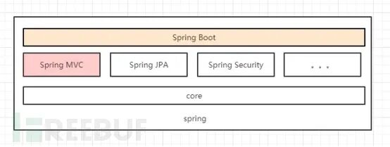而 spring security 主要是用来做鉴权，保证安全性的。Spring Cloud 基于 Spring Boot，简化了分布式系统的开发，集成了服务发现、配置管理、消息总线、负载均衡、断路器、数据监控等各种服务治理能力。

整个 spring 家族有四个重要的基本概念，分别是 IOC、Context、Bean 和 AOP。其中 IOC 指控制反转，在 spring 中的体现就是将对象属性的创建权限回收，然后统一配置，实现解耦合，便于代码的维护。在实际使用过程中可以通过 autowired 注解，不是直接指定某个类，将对象的真实类型放置在 XML 文件中的 bean 中声明，具体例子如下：

```
<bean />

public class WelcomeController {  

    @Autowired  

    private WelcomeService service;  

    @RequestMapping("/welcome")  

    public String welcome() {  

        return service.retrieveWelcomeMessage();  

    }  

}

```

Spring 将所有创建或者管理的对象称为 bean，并放在 context 上下文中统一管理。至于 AOP 就是对各个 MVC 架构的衔接层做统一处理，增强了代码的鲁棒性。下面这张图就形象描述了上述基本概念。

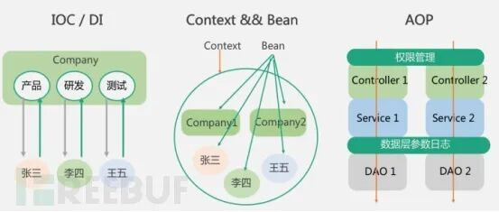

**各子组件介绍**
----------

Spring 发展至今，整个体系不断壮大，子分类非常庞大，这里只对本次涉及的一些组件做简单的介绍。

首先是 Spring Websocket，Spring 内置简单消息代理。这个代理处理来自客户端的订阅请求，将它们存储在内存中，并将消息广播到具有匹配目标的连接客户端。Spring Data 是一个用于简化数据库访问，并支持云服务的开源框架，其主要目标是使数据库的访问变得方便快捷。Spring Data Commons 是 Spring Data 下所有子项目共享的基础框架，Spring Data 家族中的所有实现都是基于 Spring Data Commons。简单点说，Spring Data REST 把我们需要编写的大量 REST 模版接口做了自动化实现，并符合 HAL 的规范。Spring Web Flow 是 Spring MVC 的扩展，它支持开发基于流程的应用程序，可以将流程的定义和实现流程行为的类和视图分离开来。

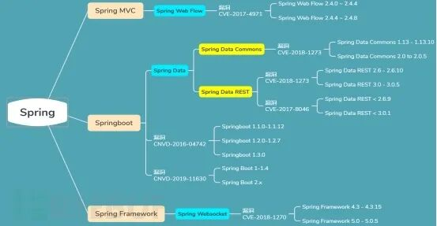

**使用量及使用分布**
------------

根据全网数据统计，使用 Spring 的网站多达 80 万余，其中大部分集中在美国，中国的使用量排在第二位。其中香港、北京、上海、广东四省市使用量最高。通过网络空间搜索引擎的数据统计和柱状图表，如下图所示。

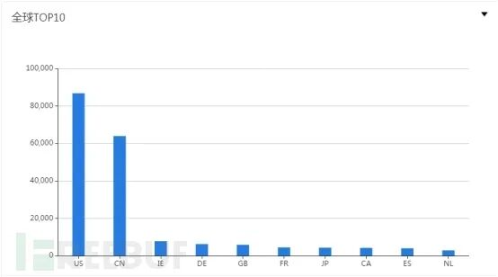

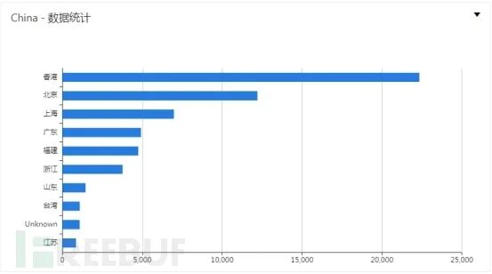

**漏洞背景介绍（SpEL 使用）**
-------------------

### **0x10 SpEL 是什么**

SpEL 是基于 spring 的一个表达式语言，类似于 struts 的 OGNL，能够在运行时动态执行一些运算甚至一些指令，类似于 Java 的反射功能。就使用方法上来看，一共分为三类，分别是直接在注解中使用，在 XML 文件中使用和直接在代码块中使用。

### **0x20 SpEL 能做什么**

● 基本表达式

包括逻辑运算，三目运算和正则表达式等等。

● 类操作表达式

对象方法调用，对象属性引用，自定义函数和类实例化等等。

● 集（平台不让发 jihe）合操作表达式

字典的访问，投影和修改等等。

● 其他表达式

模板表达式

### **0x30 SpEL demo**

**0x31 基于注解的 SpEL**

可以结合 sping 的 @Value 注解来使用，可以直接初始化 Bean 的属性值

```
@RestController

class Sangfor {

    @Value(value = "${'aaa'.toUpperCase()}")

    private String test;

    public String getTest(){return test;}

    public void setTest(String value){this.test = value;}

}

```

在这种情况下可以直接将 test 的值初始化为 **AAA**。

此外，还有很多其他注解的使用方式，可以结合上面提到的表达式的四种使用模式。

**0x32 基于 XML 的 SpEL**

可以直接在 XML 文件中使用 SpEL 表达式如下：

```
public class SpEL {

    public static void main(String[] args){

        ApplicationContext ctx = new ClassPathXmlApplicationContext("test.xml");

        String hello = ctx.getBean("hello", String.class);

        System.out.println(hello);

    }

}

```

上面的代码将会输出 **Hello World!**，可以看到递归往下找到 world 的值，最终成功返回。

**0x33 字符串操作**

```
import org.springframework.expression.Expression;

import org.springframework.expression.ExpressionParser;

import org.springframework.expression.spel.standard.SpelExpressionParser;

public class SpEL {

    public static void main(String[] args){

        ExpressionParser parser = new SpelExpressionParser();

        // Expression exp = parser.parseExpression("'Hello '.concat('World')");

        Expression exp = parser.parseExpression("'Hello ' + 'World'");

        String message = (String) exp.getValue();

        System.out.println(message);

    }

}

```

注：类似的字符串操作比如 toUpperCase()，substr() 等等

**0x34 类相关操作**

使用 T(class) 来表示类的实例，除了 java.lang 的包，剩下的包需要指明。此外还可以访问类的静态方法和静态字段，甚至实例化类。

```
public class SpEL {

    public static void main(String[] args){

        ExpressionParser parser = new SpelExpressionParser();

        Expression exp = parser.parseExpression("T(Runtime).getRuntime().exec('calc.exe')");

        Object message = exp.getValue();

        System.out.println(message);

    }

}

```

如上述操作，最终就可以执行命令，弹出计算器。这也是后面 SpEL RCE 漏洞的利用形式。

**0x35 集（平台不让发 jihe）合相关操作**

```
public class SpEL {

    public static void main(String[] args){

        ExpressionParser parser = new SpelExpressionParser();

        Expression exp = parser.parseExpression("{'sangfor', 'busyer', 'test'}");

        List<String> message = (List<String>) exp.getValue();

        System.out.println(message.get(1));  //busyer

    }

}

```

通过上面的操作，可以将字符串转化成数组，最终可以输出 busyer。

**SpEL 原理**
-----------

首先来了解几个概念：

● 表达式

可以认为就是传入的字符串内容

● 解析器

将字符串解析为表达式内容

● 上下文

表达式对象执行的环境

● 根对象和活动上下文对象

根对象是默认的活动上下文对象，活动上下文对象表示了当前表达式操作的对象

具体的流程如下，其实就是编译原理里面的词法分析和句法分析：

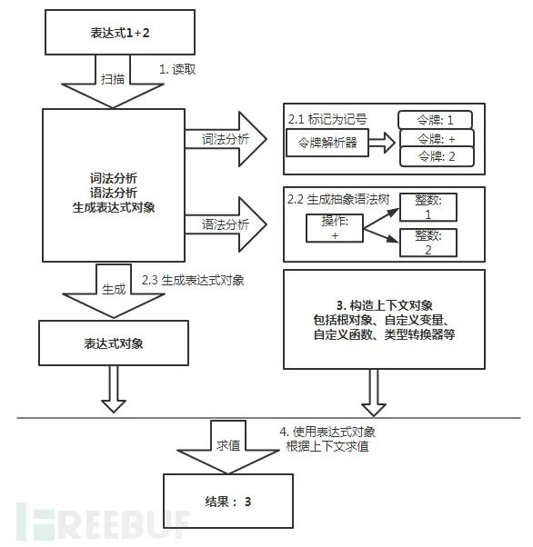

（1）首先给定表达式 1+2

（2）然后给定 SpelExpressionParser 解析器，该解析器就实现了上图中的分析

（3）定义上下文对象，这个是可选的，默认是 StandardEvaluationContext

（4）使用表达式对象求值，例如 getValue

具体代码如下：

```
ExpressionParser parser = new SpelExpressionParser();

Expression exp = parser.parseExpression("{'sangfor', 'busyer', 'test'}");

//StandardEvaluationContext context = new StandardEvaluationContext();

String message = (String)exp.getValue(context, String.class);

```

**root 和 this**

SpEL 中 #root 总是指的刚开始的表达式对象，而 #this 总是指的当前的表达式对象，用他们可以直接操作当前上下文。

**SimpleEvaluationContext 和 StandardEvaluationContext**

SimpleEvaluationContext: 不包含类相关的危险操作，比较安全

StandardEvaluationContext: 包含所有功能，存在风险

**高危漏洞介绍**
----------

通过对 Spring 漏洞的收集和整理，过滤出其中影响较大的远程代码执行高危漏洞，可以得出如下列表：

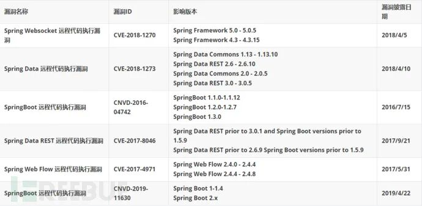

从上表可以看出，这些漏洞分布在 Spring 不同的子分类之间，且大多都是较低的版本，用户只要及时升级高版本并及时关注新的漏洞信息即可轻松规避这些漏洞。尽管近期没有出现相关漏洞，但是这些高风险漏洞依然不可忽视。这里面出现的漏洞大多不需要复杂的配置就可以直接攻击成功，从而执行任意代码，危害较大。所以，**开发者在使用 Spring 进行开发的过程中，一定要关注其历史风险点，尽量规避高危漏洞，减少修改不必要的配置信息。**

**漏洞利用链**
---------

上述漏洞基本不依赖其他 Spring 漏洞即可直接获取权限，下图对其利用方式做了简要概述：

**高可利用漏洞分析**
============

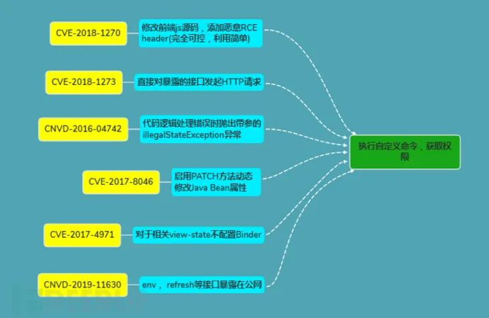

### **1 CVE-2018-1270**

**1.1 威胁等级**

严重

**1.2 影响范围**

Spring Framework 5.0 - 5.0.5

Spring Framework 4.3 - 4.3.15

**1.3 利用难度**

简单

**1.4 漏洞描述**

在上面描述的存在漏洞的 Spring Framework 版本中，允许应用程序通过 spring-messaging 模块内存中 STOMP 代理创建 WebSocket。攻击者可以向代理发送消息，从而导致远程执行代码攻击。

**1.5 漏洞分析**

点击 connect，首先将触发 DefaultSubscriptionRegistry.java 中的 addSubscriptionInternal 方法，

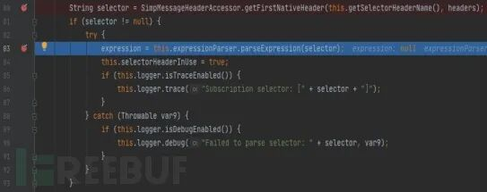第 80 行将首部的 selector 字段的值取出，就是我们之前传入的恶意表达式，接着到 83 行，这一步就很熟悉了，使用解析器去解析表达式，显然这个时候再有一个 getValue 方法触发并且没有使用 simpleEvaluationContext 就能够直接执行我们传入的表达式了。

监听网络流量，发现后面 send 信息的时候，将会将消息分发给不同的订阅者，并且转发的消息还会包含之前 connect 的上下文，即这里的 expression 将会包含在内。

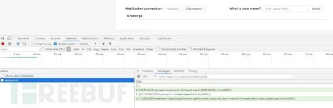于是，尝试随便在文本框中输入一些内容，然后点击 Send，最终可以触发 SimpleBrokerMessageHandler.java 中的 sendMessageToSubscribers 方法如下：

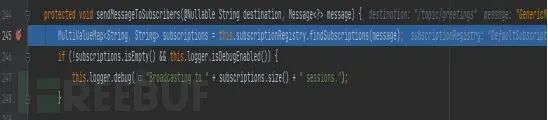继续进入 findSubscriptions 方法，并且不断往下走，最终可以发现在 DefaultSubscriptionRegistry.java 中 filterSubscriptions 方法中对上下文中的 expresion 做了提取，并使用 StandardEvaluationContext 指定了上下文，也就是说这里面可以直接执行代码，没有任何限制。并最终在第 164 行使用 getValue 方法触发漏洞，弹出计算器。

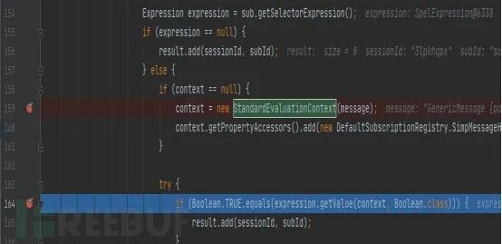

**1.6 补丁分析**

补丁中直接将上面的 StandardEvaluationContext 替换成 SimpleEvaluationContext，使用该方法能够避免了恶意类的加载。

### **2** CVE-2018-1273

**2.1 威胁等级**

严重

**2.2 影响范围**

Spring Data Commons 1.13 - 1.13.10 (Ingalls SR10)

Spring Data REST 2.6 - 2.6.10 (Ingalls SR10)

Spring Data Commons 2.0 to 2.0.5 (Kay SR5)

Spring Data REST 3.0 - 3.0.5 (Kay SR5)

**2.3 利用难度**

简单

**2.4 漏洞描述**

Spring Data Commons 组件中存在远程代码执行漏洞，攻击者可构造包含有恶意代码的 SPEL 表达式实现远程代码攻击，直接获取服务器控制权限。

**2.5 漏洞分析**

从上述 / users 入口，最终会调用到 MapPropertyAccessor 静态类中对用户名进行处理。而在该类中包含了进行 SpEL 注入需要满足的条件如下：

● 首先创建解析器：

● 接着使用 Standard 上下文

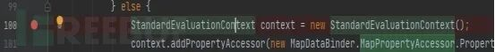● 然后包含待解析表达式

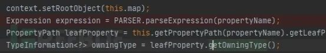● 最后使用 setValue 触发

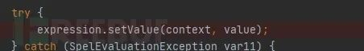

**2.6 补丁分析**

补丁依旧直接将上面的 StandardEvaluationContext 替换成 SimpleEvaluationContext，使用该方法能够避免了恶意类的加载。

### **3** CNVD-2016-04742

**3.1 威胁等级**

严重

**3.2 影响范围**

Springboot 1.1.0-1.1.12

Springboot 1.2.0-1.2.7

Springboot 1.3.0

**3.3 利用难度**

简单

**3.4 漏洞描述**

低版本的 springboot 在处理内部 500 错误时，使用了 spel 表达式，并且递归向下解析嵌套的，其中 message 参数是从外部传过来的，用户就可以构造一个 spel 表达式，达到远程代码执行的效果。

**3.5 漏洞分析**

访问上面的 URL，可以进入到我们的控制器，并紧接着抛出异常如下：

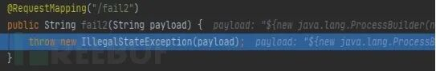进入异常的代码，经过冗长的代码调试，最终可以来到关键点的 render 方法：

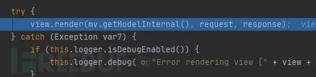接着进入 render 方法查看，这里面的 replacePlaceholders 方法将会进行形如 ${} 的 spel 表达式替换：

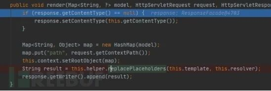进入该方法查看，最后进入 parseStringValue 方法, 该方法会循环将带有 ${} 的错误页面的 HTML 字符串中的一个个 ${} 的内容进行替换，并且这里面的 ${message} 是我们传入的值。

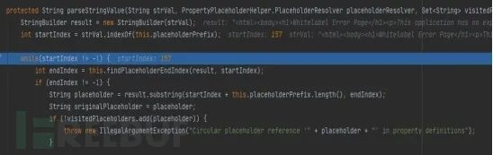于是可以就此构造我们的 payload，借助他的循环，继续解析 spel，最终造成任意代码执行。其中，解析 spel 的代码如下：

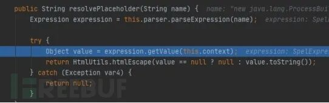**3.6 补丁分析**

通过添加一个 NonRecursivePropertyPlaceholderHelper 类，对于二次解析的值进行限制：

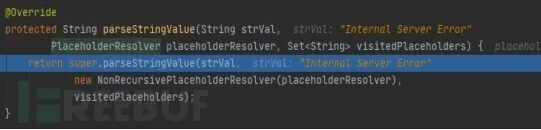

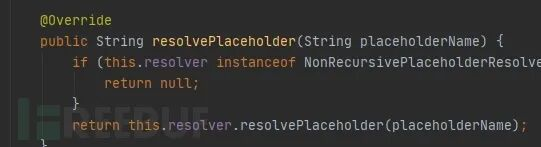**4 CVE-2017-8046**

**4.1 威胁等级**

严重

**4.2 影响范围**

Spring Data REST prior to 3.0.1 and Spring Boot versions prior to 1.5.9

Spring Data REST prior to 2.6.9 Spring Boot versions prior to 1.5.9

**4.3 利用难度**

简单

**4.4 漏洞描述**

用户在使用 PATCH 方法局部更新某个值的时候，其中的 path 参数会被传入 SpEL 表达式，进而导致代码执行。

**4.5 漏洞分析**

执行上述 payload，定位到程序的入口如下：

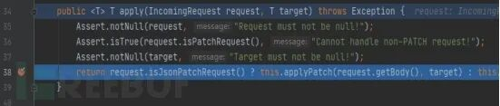

（注：这个类在 springmvc 里面，名字为 JsonPatchHandler）

重点看这个三目运算，其中的判断是看 HTTP 方法是否为 PATCH 和 content-type 是否为我们上面提到的那个，然后会进入 this.applyPatch 方法，接着根据我们指定的 replace 字段进入对应的处理器：

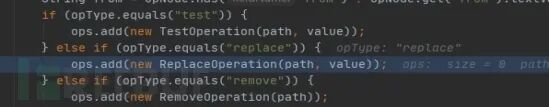

然后实例化 patchOperation，并初始化 spel 解析器：

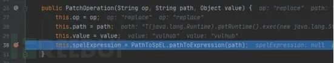

最后再调用 setValue 触发：


**4.6 补丁分析**

这里用 2.6.9 中的修复方案举例子，在 perform 中不是直接 setvalue，而是先做一个参数合法性校验（此处添加了 SpelPath 类），将 path 中的参数用’.’分割，然后依次判断是否是类的属性，只要有一个不是就直接报错，从而解决了上述问题，部分补丁图片如下：


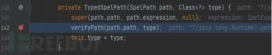

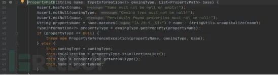

### **5 CVE-2017-4971**

**5.1 威胁等级**

中危

**5.2 影响范围**

Spring Web Flow 2.4.0 ~ 2.4.4

Spring Web Flow 2.4.4 ~ 2.4.8

**5.3 利用难度**

较高

**5.4 漏洞描述**

当用户使用 Spring Web Flow 受影响的版本时，如果配置了 view-state，但是没有配置相应的 binder, 并且没有更改 useSpringBeanBinding 默认的 false 值，当攻击者构造特殊的 http 请求时，就可以导致 SpEL 表达式注入，从而造成远程代码执行漏洞。

**5.5 漏洞分析**

首先通过执行 confirm 请求，断点到如下位置：

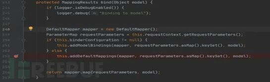这里可以发现可以通过判断 binderConfiguration 是否为空来选择进入哪个处理方法，这里的 binderConfiguration 值指的是在配置文件中配置的 binder 内容。深入查看这两个处理方法。其实都用了 SpEL 表达式，不过 addModelBindings 方法传入的参数的是上面提到的 binder，是写死在 xml 文件中的，无法去更改，所以这里面就考虑当没配置 binder 的情况下走进 addDefaultMapping 方法的情况。

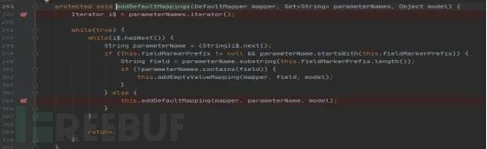addDefaultMappings 方法如上，其作用是遍历所有的参数，包括 GET 参数和 POST 中的参数，然后一个个判断其是否以”_” 开头，如果符合就进入 addEmptyValueMapping 方法进行处理，否则就进入 addDefaultMapping 方法进行处理。本次漏洞的触发点是上面这一个，所以我们深入查看一下 addEmptyValueMapping 方法。

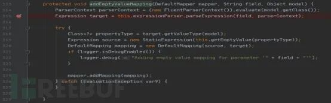可以看到该方法用 SpEL 表达式解析了传入的变量名，并在后面使用了 get 操作，从而可以导致漏洞的产生。

**5.6 补丁分析**

查看官方补丁源码如下：

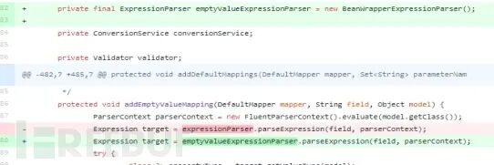将表达式类型换成了 BeanWrapperExpressionParser，因为该类型内部实现不能够处理类所以避免了该问题的发生。

然而上述还提到如果参数类型不是以”_” 开头的将会进入 addDefaultMapping 方法，下面我们进入该方法进行查看：

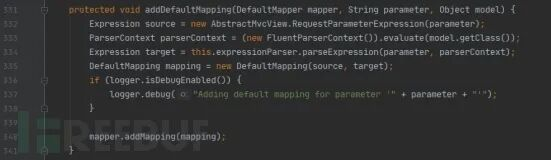可以看到这里也对传入的参数进行了解析但是没有看到明显的 get 方法来触发，继续往下寻找 get 方法。首先这里面将解析器放入了 mapper 中，下面就重点追踪这个 mapper 的使用即可。

首先发现一步步回到之前的 bind 方法，可以发现最后一行对该 mapper 进行了操作，跟进该 map 方法:

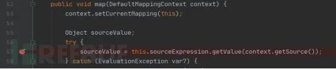在这里就进行了 get 操作，从而再次触发了漏洞。

对此，也可能跟这个没关系，官方最终将全局的解析器换成 SimpleEvaluationContext 来彻底解决此问题。

### **6 CNVD-2019-11630**

**6.1 威胁等级**

严重

**6.2 影响范围**

Spring Boot 1-1.4

Spring Boot 2.x

**6.3 利用难度**

简单

**6.4 漏洞描述**

用户在通过 env 路径修改 spring.cloud.bootstrap.location 的位置，将该地址设置为一个恶意地址时，并在后面使用 refresh 接口进行触发就可以导致靶机加载恶意地址中的文件，远程执行任意代码。

**6.5 漏洞分析**

搭建环境并按上述方式进行攻击，并搜索到 spring-cloud-context-1.2.0.RELEASE.jar 中的 environment 和 refresh，然后下断点跟进，可以发现首先的 env 改变会将下面体现：

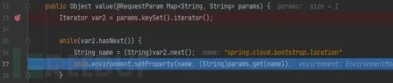其实就是将环境中该变量的属性值进行更新。

之后看一下关键点 refresh 接口，首先一旦 refresh 接口被触发，就会将有变化的信息以及一些基本信息挑选出来，如下图可以看到之前变化的值已经被挑选出来：

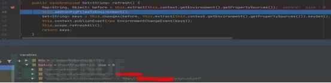接着进入到 addConfigFilesToEnvironment 方法进行处理，先获取到所有的环境值，然后设置一个监听器，依次处理变化的信息：

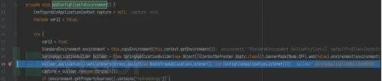

这里我们直接跳转到处理这个恶意地址的关键部分，首先进入 ConfigFileApplicationListener 的 load 方法：

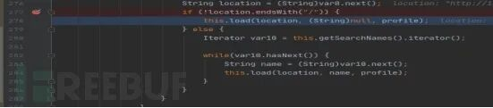

这里面先判断 url 是否存在文件路径，如果存在才进入处理该地址，否则将 name 的参数设置成 searchName 进行处理，这里的值为 “bootstrap”，后面会强行加上后缀。然后一直深入到 PropertySourcesLoader 类中的 load 方法：

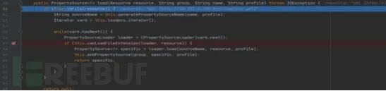首先会发送一个 head 请求判断文件是否存在，以及是否是一个文件，然后会根据文件后缀来判断是否能解析，这里面就是 yml 文件，所以判断可以用 YamlPropertySourceLoader 类来处理。然后进入该类的 load 方法中：

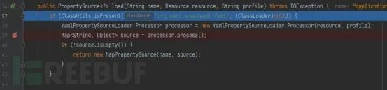在这里将会加载远程 yml 文件，并处理里面的内容，而导致远程代码执行的发生。

**6.6 补丁分析**

在 springboot 1.5 及以后，官方对这些接口添加了授权验证，不能够再肆意的调用他们了。

**参考链接**
--------

> 1.https://leokongwq.github.io/2019/04/17/spring-spel.html
> 
> 2.http://rui0.cn/archives/1043
> 
> 3.https://misakikata.github.io/2020/04/Spring-%E6%A1%86%E6%9E%B6%E6%BC%8F%E6%B4%9E%E9%9B%86%E5%90%88/#CNVD-2016-04742-Spring-Boot%E6%A1%86%E6%9E%B6SPEL%E8%A1%A8%E8%BE%BE%E5%BC%8F%E6%B3%A8%E5%85%A5%E6%BC%8F%E6%B4%9E
> 
> 4.https://chybeta.github.io/2018/04/07/spring-messaging-Remote-Code-Execution-%E5%88%86%E6%9E%90-%E3%80%90CVE-2018-1270%E3%80%91/
> 
> 5.https://www.cnblogs.com/hac425/p/9656747.html
> 
> 6.https://www.cnblogs.com/litlife/p/10183137.html
> 
> 7.https://www.cnblogs.com/co10rway/p/9380441.html
> 
> 8.https://github.com/spring-guides/gs-accessing-data-rest/tree/2.0.3.RELEASE
> 
> 9.https://paper.seebug.org/597/
> 
> 10.https://www.mi1k7ea.com/2020/02/09/%E6%B5%85%E6%9E%90Spring-WebFlow%E4%B9%8BCVE-2017-4971/


 交易担保 FreeBuf+ FreeBuf + 小程序：把安全装进口袋 小程序

精彩推荐

  

  

  

  

********

[](https://mp.weixin.qq.com/s?__biz=Mzg2MTAwNzg1Ng==&mid=2247484287&idx=1&sn=16a9b2dc0e205a0e5fe86ae5cae9fe2e&scene=21#wechat_redirect)[](https://mp.weixin.qq.com/s?__biz=Mzg2MTAwNzg1Ng==&mid=2247484370&idx=1&sn=8b79701a2936e04e390f165344e5fcdc&scene=21#wechat_redirect)

[](https://mp.weixin.qq.com/s?__biz=Mzg2MTAwNzg1Ng==&mid=2247485180&idx=1&sn=06c034789bc8656821df64075e3d9372&scene=21#wechat_redirect)[](https://mp.weixin.qq.com/s?__biz=Mzg2MTAwNzg1Ng==&mid=2247485114&idx=1&sn=0c765c3970ddfd1021b59c6adaea52ce&scene=21#wechat_redirect)

****************************

---

> 来源：MrWQ/vulnerability-paper（https://github.com/MrWQ/vulnerability-paper）
