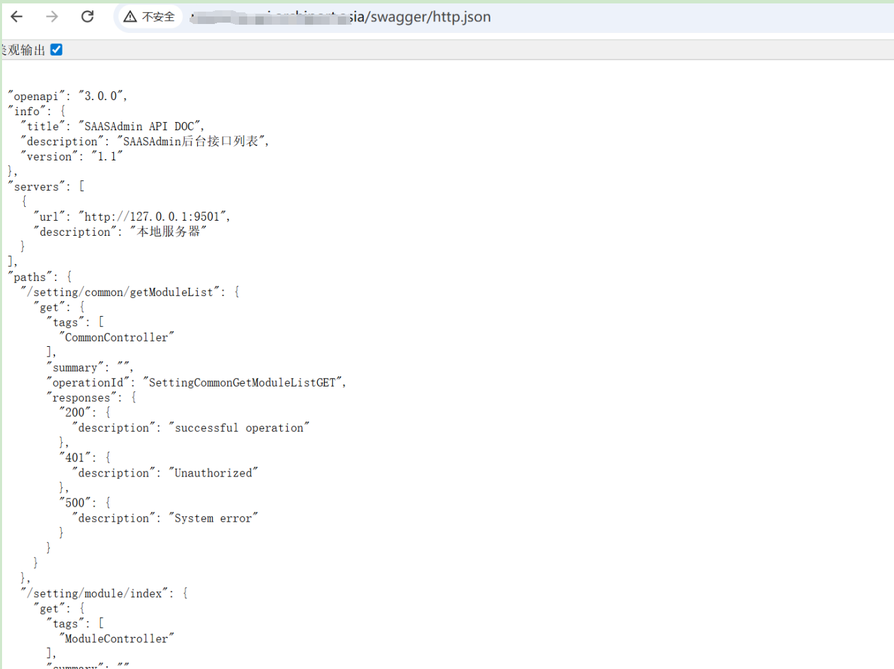

## 核对与使用边界

本文已按保存的全文审阅记录进行文字校订；本轮仅静态核对，未运行 PoC、请求目标或逐图验证。

适用条件与版本记录（来源主张，未列为明确更正的部分仍待权威资料核对）：列 MineAdmin v1.x/v2.x 默认部署，未给具体提交或配置证据

代码与实验材料：只有 GET /swagger/http.json 和截图；检测规则只匹配请求路径

来源证据范围：有 MineAdmin 官方文档和归档仓库来源

- **适用与权限边界（1）**：分类应归 MineAdmin 而非 Swagger 通用漏洞；依据：端点为产品配置暴露，Swagger 是文档组件。按此限制解释本文结论，版本相同不足以证明所需角色、入口、配置、依赖或可控参数均已满足；原操作和失败记录一并保留。

- **适用与权限边界（2）**：信息泄露影响缺具体证据；依据：没有响应正文或泄露敏感字段，也未区分本意公开的 API 文档和越权数据。按此限制解释本文结论，版本相同不足以证明所需角色、入口、配置、依赖或可控参数均已满足；原操作和失败记录一并保留。

- **代码与转录边界（3）**：IDS 规则只能检测访问行为；依据：只匹配 GET 和 URI，不能判断是否返回敏感信息或是否存在漏洞；应说明 Snort 版本语法。相应原代码作为存在此问题的历史样本保留，不能直接当作可运行、成功复现的 PoC；缺失内容需回原稿核对，不据此补造可执行攻击链。

历史原文标识：下文原技术材料按来源保留；仅本节明确确认的更正替代相应旧说法，标为待核的观察仍不是事实确认。

# MineAdmin企业级后台管理系统swagger信息泄露漏洞

MineAdmin官网：https://doc.mineadmin.com/

资产测绘语法：body="MineAdmin"

# 影响版本

MineAdmin v1.x
MineAdmin v2.x

# **漏洞描述**

MineAdmin后台管理系统基于 Hyperf 框架开发。是一个后台权限管理系统，提供完善的权限体系，让开发者把注意力集中到具体业务当中，降低开发成本，提高项目效率。在系统默认配置部署的情况下存在swagger信息泄露

# 漏洞复现

POC/EXP：

```
GET /swagger/http.json   HTTP/1.1
Host: 127.0.0.1
```




sonrt规则：

```
alert http any any -> $HOME_NET any (
    msg:"MineAdmin - Swagger API Information Disclosure";
    flow:to_server,established;
    http.method; content:"GET";
    http.uri; content:"/swagger/http.json";
    metadata:
        service http,
        affected_product "MineAdmin",
        vulnerability_type "Information Disclosure",
        severity "medium";
    classtype:policy-violation;
    sid:1000575;
    rev:1;
    priority:2;
)
```

# 漏洞修复

swagger接口处加强权限校验。


---

> 来源：SourByte05/Vulnerability-Wiki-PoC（https://github.com/SourByte05/Vulnerability-Wiki-PoC）
