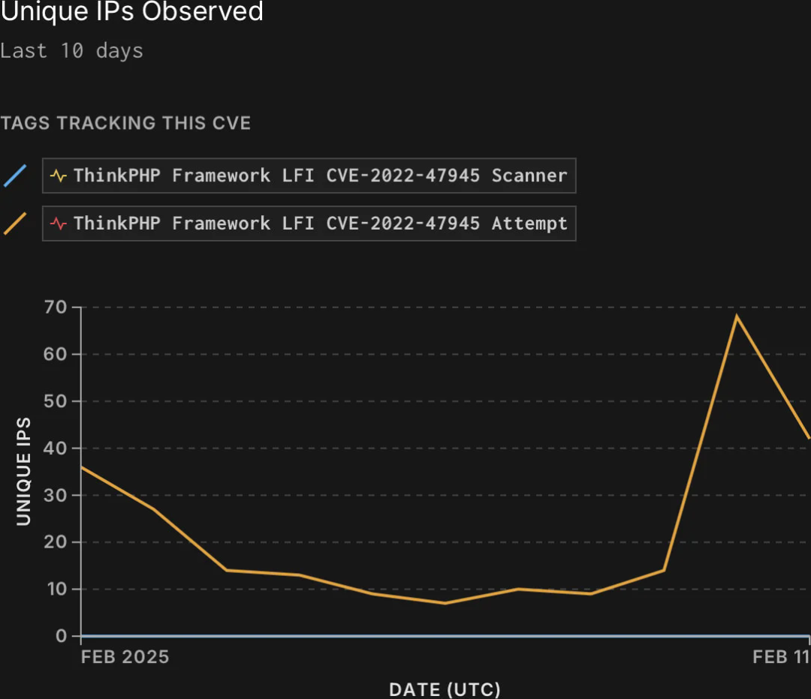
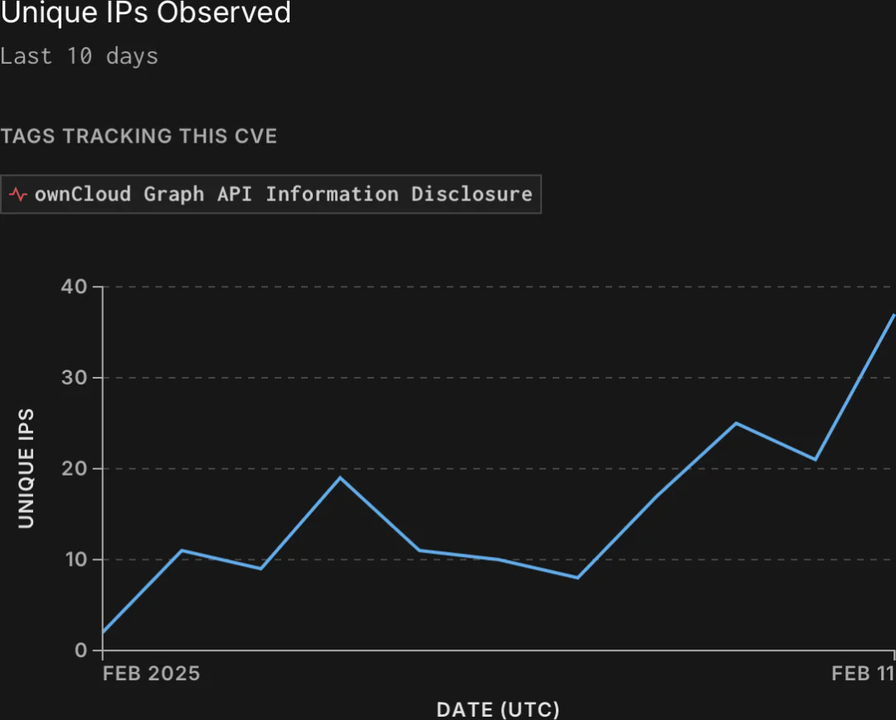
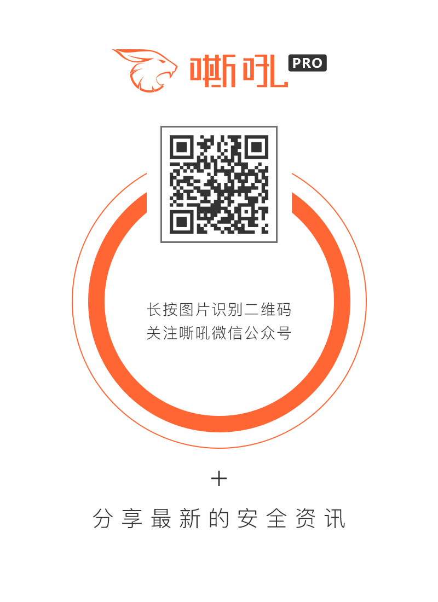

## 核对与使用边界

本文已按保存的全文审阅记录进行文字校订；本轮仅静态核对，未运行 PoC、请求目标或逐图验证。

适用条件与版本记录（来源主张，未列为明确更正的部分仍待权威资料核对）：ThinkPHP&lt;6.0.14且多语言；GraphAPI建议0.3.1；2025-02-17历史统计

代码与实验材料：无PoC，GreyNoise源IP数字/EPSS/KEV状态二手引用

来源证据范围：BleepingComputer来源，未直链GreyNoise/厂商公告

- **事实待核（1）**：时间线算术错误；依据：2023年11月披露到2025年2月约15个月，文称修复已过去2年多。该项尚不能从转载本身确定外部事实；下文相应编号、版本或修复说法只作为来源记录，不能据此判定部署受影响或已修复。明确更正另列于本节。

- **事实待核（2）**：动态情报需冻结日期；依据：572/484源IP、EPSS7%、未入KEV只能按原报道时间保存。该项尚不能从转载本身确定外部事实；下文相应编号、版本或修复说法只作为来源记录，不能据此判定部署受影响或已修复。明确更正另列于本节。

- **事实待核（3）**：CVE元数据和产品遗漏；依据：frontmatter只有ThinkPHP编号，正文ownCloud同等主题，应双实体关联。该项尚不能从转载本身确定外部事实；下文相应编号、版本或修复说法只作为来源记录，不能据此判定部署受影响或已修复。明确更正另列于本节。

- **适用与权限边界（4）**：LFI到命令执行前提过简；依据：多语言LFI本身不等于任意OS命令，需额外文件/PEAR等链条件。按此限制解释本文结论，版本相同不足以证明所需角色、入口、配置、依赖或可控参数均已满足；原操作和失败记录一并保留。

历史原文标识：下文原技术材料按来源保留；仅本节明确确认的更正替代相应旧说法，标为待核的观察仍不是事实确认。

#  利用旧的ThinkPHP和ownCloud漏洞的攻击事件激增   
胡金鱼  嘶吼专业版   2025-02-17 06:00  
  
  
  
威胁监测平台GreyNoise报告称，  
越来越多的黑客正试图破坏维护不善的设备。  
攻击者利用CVE-2022-47945和CVE-2023-49103攻击ThinkPHP框架和开源ownCloud文件共享和同步解决方案。  
  
这两个漏洞都具有临界严重性，可以被利用来执行任意操作  
系统命令或获取敏感数据（例如管理员密码、邮件服务器凭据、许可密钥）。  
  
第一个漏洞是6.0.14之前的ThinkPHP框架语言参数中的本地文件包含（LFI）问题。未经身份验证的远程攻击者可以利用它在启用了语言包特性的部署中执行任意操作系统命令。  
  
根据威胁监测平台GreyNoise的说法，CVE-2022-47945目前正受到大量利用，攻击的源ip越来越多。  
  
该公告警告说：“GreyNoise已经观察到572个独特的ip试图利用这个漏洞，并且最近几天活动不断增加。”  
  
尽管它的漏洞预测评分系统（EPSS）评级很低，只有7%，而且该漏洞没有被包括在CISA的已知被利用漏洞（KEV）目录中。  
  
  
  
日常开发活动  
  
第二个漏洞影响了流行的开源文件共享软件，它源于应用程序对第三方库的依赖，该库通过URL公开了PHP环境细节。  
  
在开发者于2023年11月首次披露该漏洞后不久，黑客就开始利用它从未打补丁的系统中窃取敏感信息。  
  
一年后，CVE-2023-49103被FBI、CISA和NSA列为2023年被利用最多的15个漏洞之一。  
  
尽管自供应商发布解决安全问题的更新以来已经过去了2年多，但许多实例仍然未打补丁并暴露在攻击之下。GreyNoise最近观察到CVE-2023-49103的利用增加，恶意活动来自484个唯一的ip。  
  
  
  
每天针对ownCloud的ip  
  
为了保护系统免受主动利用，安全研究员建议用户升级到ThinkPHP 6.0.14或更高版本，并将ownCloud GraphAPI升级到0.3.1或更高版本。并建议将潜在易受攻击的实例离线或放置在防火墙后面，以减少攻击面。  
  
参考及来源：https://www.bleepingcomputer.com/news/security/surge-in-attacks-exploiting-old-thinkphp-and-owncloud-flaws/  
  
  
  
  
  
  

---

> 来源：gelusus/wxvl（微信公众号漏洞文章自动归档，原文见文首链接）
