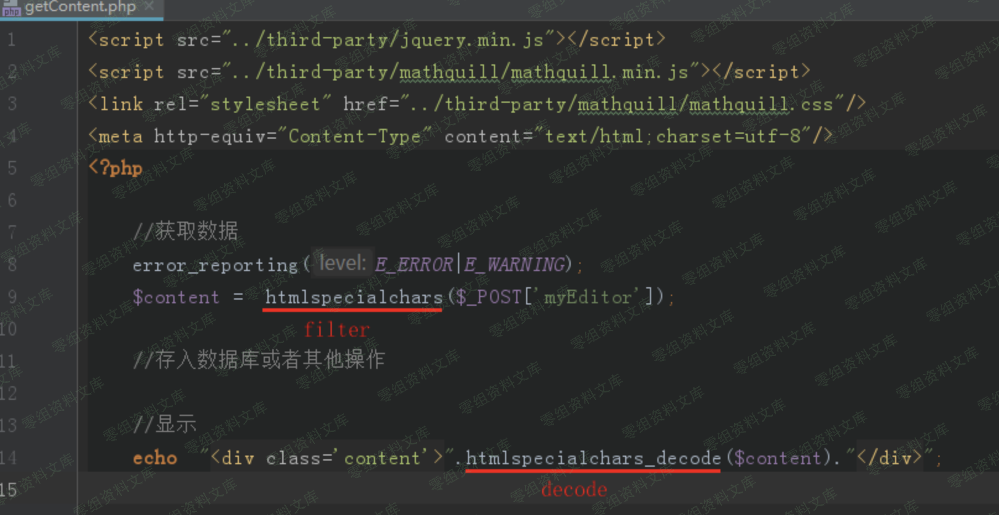
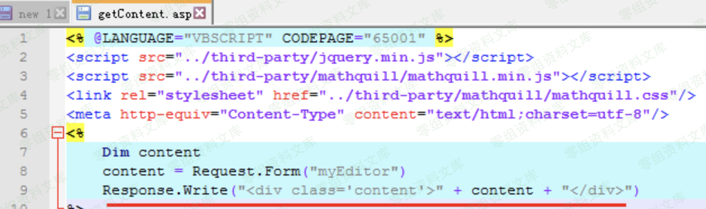
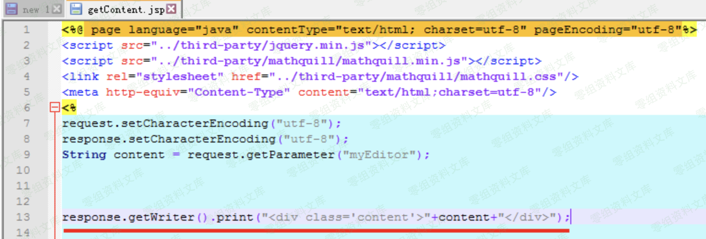
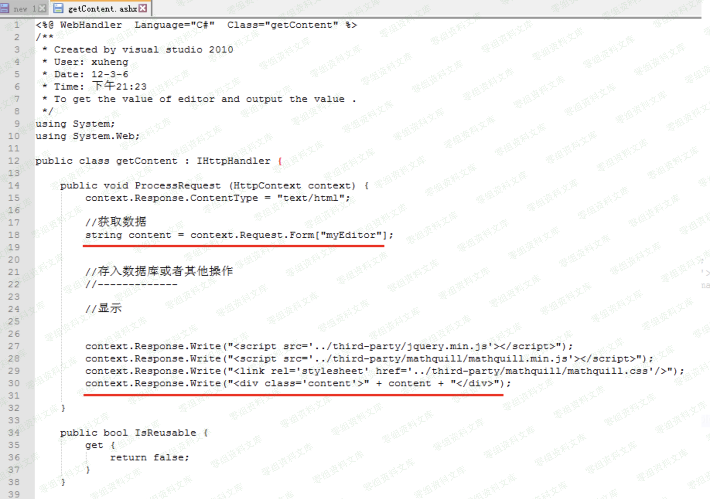
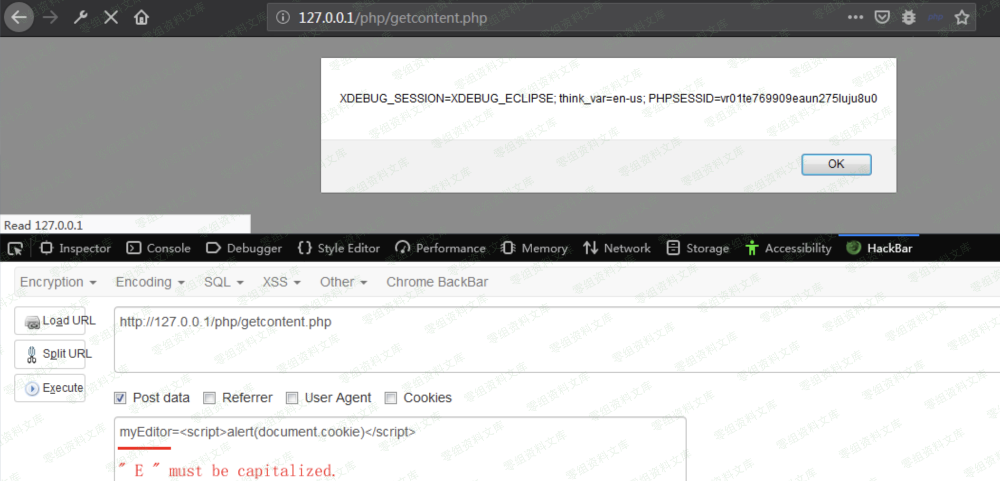

## 核对与使用边界

本文已按保存的全文审阅记录进行文字校订；本轮仅静态核对，未运行 PoC、请求目标或逐图验证。

适用条件与版本记录（来源主张，未列为明确更正的部分仍待权威资料核对）：列PHP/ASP/JSP/NET但无版本；需部署示例getContent文件

代码与实验材料：PHP myEditor载荷与各语言输出分析，结果在图

来源证据范围：CSDN原文及官方产品下载

- **适用与权限边界（1）**：版本和部署前提缺失；依据：示例后端文件未必生产部署，不能只按编辑器存在判漏洞。按此限制解释本文结论，版本相同不足以证明所需角色、入口、配置、依赖或可控参数均已满足；原操作和失败记录一并保留。

- **结论使用边界（2）**：URL大小写不一致；依据：正文getContent.php，PoC getcontent.php在大小写敏感环境会不同。此项限制直接适用于下文对应结论；现有正文不足以作更宽泛推论，所列方法和原始证据均保留。

- **凭据与会话边界（3）**：XSS影响评价过低；依据：反射型不自动低危，取决于用户交互、同源权限及会话，文称“单独影响小”无依据。抓包中的会话不能视为未认证访问证明；可识别的真实会话值按中段星号遮罩处理，默认演示值和攻击语法保留。需重新取得授权测试会话，不能复用文中值。

历史原文标识：下文原技术材料按来源保留；仅本节明确确认的更正替代相应旧说法，标为待核的观察仍不是事实确认。

# 百度ueditor编辑器 xss漏洞

一、漏洞简介
------------

产品官网下载地址：

<https://ueditor.baidu.com/website/download.html#mini>

涉及版本：php , asp, jsp, net

二、漏洞影响
------------

三、复现过程
------------

### 漏洞分析

存在漏洞的文件：

    /php/getContent.php
    /asp/getContent.asp
    /jsp/getContent.jsp
    /net/getContent.ashx

#### /php/getContent.php

入进行了过滤，但是在14行输出时却使用了htmlspecialchars\_decode，造成XSS漏洞。

#### /asp/getContent.asp

获取myEditor参数无过滤，直接输出。

#### /jsp/getContent.jsp

获取myEditor参数无过滤，直接输出。

#### /net/getContent.ashx

获取myEditor参数无过滤，直接输出。

### 漏洞复现

php版本测试，其他版本一样。

url:

    http://0-sec.org/php/getcontent.php

payload:

    myEditor=
    // myEditor中的’ E ’必须大写，小写无效。

由于只是个反弹XSS，单独这个漏洞影响小。若能结合使用该编辑器的网站的其他漏洞使用，则可能产生不错的效果。

四、参考链接
------------

> <https://blog.csdn.net/yun2diao/article/details/91381846>
