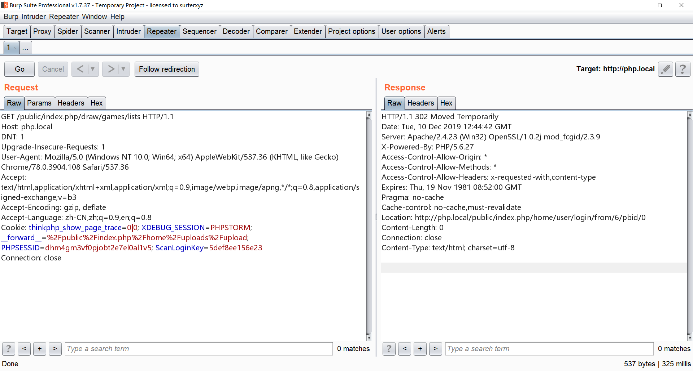
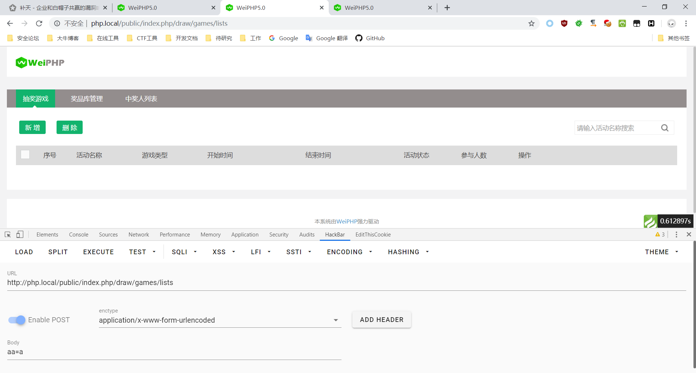
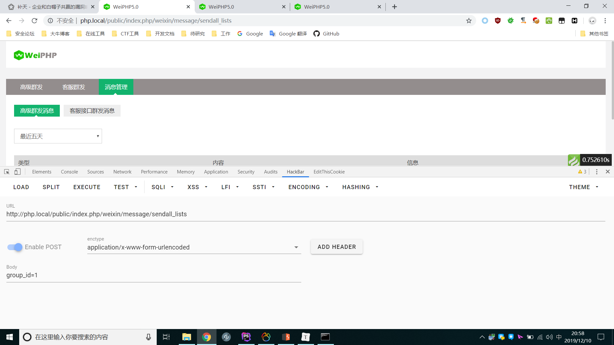
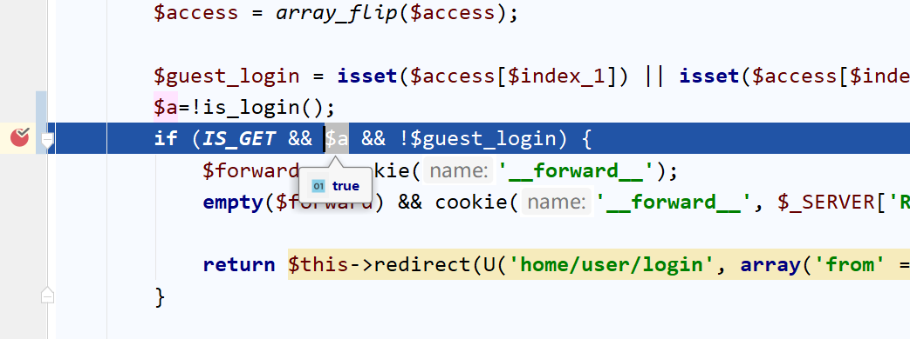
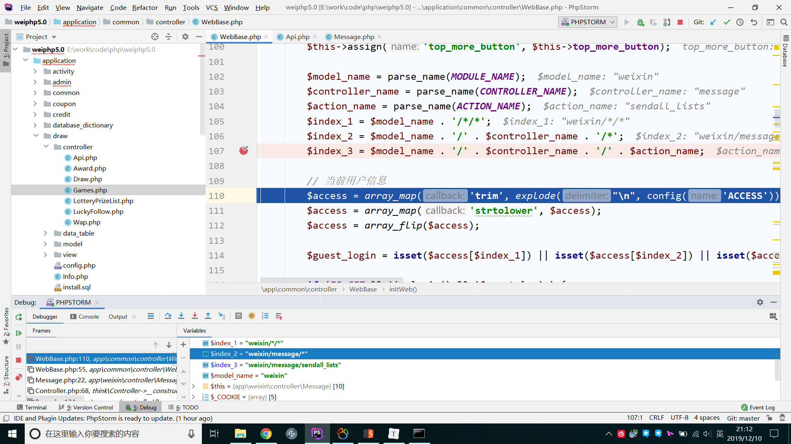
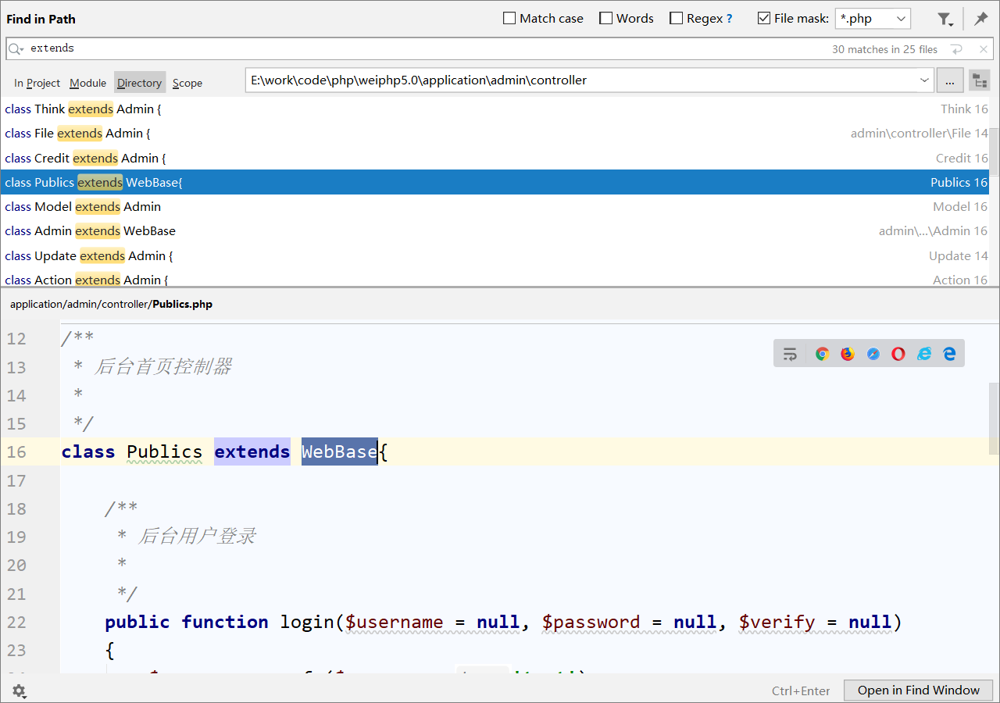
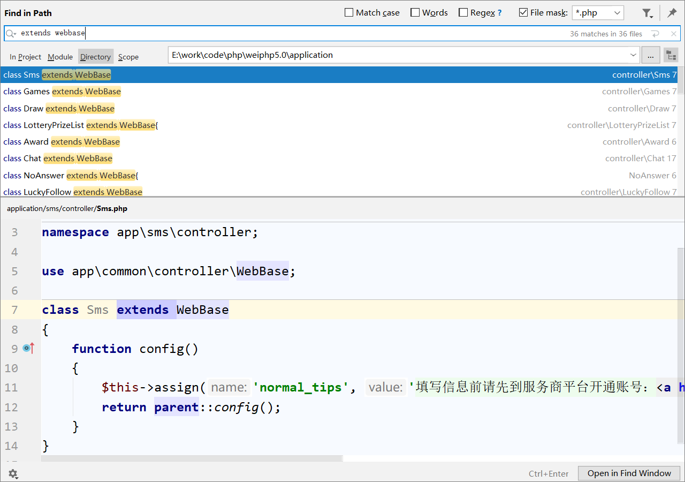

## 核对与使用边界

本文已按保存的全文审阅记录进行文字校订；本轮仅静态核对，未运行 PoC、请求目标或逐图验证。

适用条件与版本记录（来源主张，未列为明确更正的部分仍待权威资料核对）：2019-12-10官网5.0；仅继承WebBase且缺其他校验的页面，Admin独立校验例外明确

代码与实验材料：完整继承链与IS_GET条件，GET跳登录/POST返回对照；无完整原始HTTP包

来源证据范围：Y4er原文，具体修复commit缺

- **适用与权限边界（1）**：末尾“几乎全部通杀”超过证据；依据：正文明确Admin模块及其他限制，不能由一个initWeb条件断言所有动作可越权。按此限制解释本文结论，版本相同不足以证明所需角色、入口、配置、依赖或可控参数均已满足；原操作和失败记录一并保留。

- **适用与权限边界（2）**：状态码/页面不等于所有敏感操作权限；依据：需要具体响应数据和角色对照，正文两例主要图片。按此限制解释本文结论，版本相同不足以证明所需角色、入口、配置、依赖或可控参数均已满足；原操作和失败记录一并保留。

- **事实待核（3）**：影响版本应固定；依据：日期最新版未给不可变commit，后续修复不明。该项尚不能从转载本身确定外部事实；下文相应编号、版本或修复说法只作为来源记录，不能据此判定部署受影响或已修复。明确更正另列于本节。

历史原文标识：下文原技术材料按来源保留；仅本节明确确认的更正替代相应旧说法，标为待核的观察仍不是事实确认。

# Weiphp5 未授权访问 - Y4er的博客

<meta name="referrer" content="no-referrer"/>

> 本文由 [简悦 SimpRead](http://ksria.com/simpread/) 转码， 原文地址 [y4er.com](https://y4er.com/post/weiphp5-unauthorized/)

偶然挖到的

payload
-------

当get请求 [http://php.local/public/index.php/weixin/message/sendall_lists](http://php.local/public/index.php/weixin/message/sendall_lists)

会被程序跳转到 [http://php.local/public/index.php/home/user/login/from/6/pbid/0](http://php.local/public/index.php/home/user/login/from/6/pbid/0) 登录页面



但是随便提交post请求就会返回页面



再来一个



随意提交POST数据导致未授权访问，分析一下。

分析
--

以 [http://php.local/public/index.php/weixin/message/sendall_lists](http://php.local/public/index.php/weixin/message/sendall_lists) 为例子

```
<?php
class Message extends WebBase
{

    public function initialize()
    {
        parent::initialize();
        $param['mdm'] = I('mdm');
        $act = strtolower(ACTION_NAME);

        $res['title'] = '高级群发';
        $res['url'] = U('add', $param);
        $res['class'] = $act == 'add' ? 'current' : '';
        $nav[] = $res;

        $res['title'] = '客服群发';
        $res['url'] = U('custom_sendall', $param);
        $res['class'] = $act == 'custom_sendall' ? 'current' : '';
        $nav[] = $res;

        $res['title'] = '消息管理';
        $res['url'] = U('sendall_lists', $param);
        $res['class'] = $act == 'sendall_lists' ? 'current' : '';
        $nav[] = $res;
        $this->assign('nav', $nav);
    }
    // 群发消息管理
    public function sendall_lists()
    {
        $this->listNav();
        $map = $this->dayMap();

        $map['pbid'] = get_pbid();
        $list = M('message')->where(wp_where($map))
            ->order('id desc')
            ->paginate();
        $list = dealPage($list);

        foreach ($list['list_data'] as &$v) {
            $v = $this->makeContent($v);
        }
        $url = U('sendall_lists', $this->get_param);
        $this->assign('searchUrl', $url);
        $this->assign($list);
        // $this->assign('normal_tips', '当用户发消息给认证公众号时，管理员可以在48小时内给用户回复信息');

        return $this->fetch();
    }
} 
```

可以看到在`initialize()`调用了父类`parent::initialize()`，继承的父类是`WebBase`，跟进

```
<?php
public function initialize()
{
    if (strtolower(MODULE_NAME) == 'install') {
        return false;
    }
    parent::initialize();

    $not_need_wpid = [
        'public_bind',
        'home',
        'admin'
    ];

    if (!in_array(MODULE_NAME, $not_need_wpid) && strtolower(CONTROLLER_NAME) != 'publics' && strtolower(CONTROLLER_NAME) != 'adminmaterial' && strtolower(MODULE_NAME) != 'scene' && strtolower(MODULE_NAME . '/' . CONTROLLER_NAME) != 'weixin/notice' && (!defined('WPID') || WPID <= 0)) {
        $this->error('先增加公众号', U('weixin/publics/lists'));
    }

    $index_3 = strtolower(MODULE_NAME . '/' . CONTROLLER_NAME . '/' . ACTION_NAME);
    if ($index_3 == 'weixin/index/index') {
        return false;
    }

    // 微信客户端请求的用户初始化在weixin/index/index里实现，这里不作处理
    $this->initUser();

    $this->initWeb();

    $this->_nav();
} 
```

在父类的`initialize`中首先判断是否安装了程序，然后判断是否添加了一个微信公众号，然后执行三个自身的方法

```
<?php
private function initUser()
{
    $uid = intval(session('mid_' . get_pbid()));
    $loginUid = is_login();
    if (empty($uid) && $loginUid > 0) {
        $uid = $loginUid;
        session('mid_' . get_pbid(), $loginUid);
    }

    // 当前登录者
    $GLOBALS['mid'] = $this->mid = $uid;
    $myinfo = get_userinfo($this->mid);
    $GLOBALS['myinfo'] = $myinfo;

    // 当前访问对象的uid
    $cuid = input('uid');
    $GLOBALS['uid'] = $this->uid = $cuid > 0 ? $cuid : $this->mid;

    $this->assign('mid', $this->mid); // 登录者
    $this->assign('uid', $this->uid); // 访问对象
    $this->assign('myinfo', $GLOBALS['myinfo']); // 访问对象
} 
```

在`initUser()`中判断了当前登录的用户，并没有判断路由权限，继续看`initWeb()`

```
<?php
private function initWeb()
{
    if (ACTION_NAME == 'logout') {
        return false;
    }
    ...省略...

    $model_name = parse_name(MODULE_NAME);
    $controller_name = parse_name(CONTROLLER_NAME);
    $action_name = parse_name(ACTION_NAME);
    $index_1 = $model_name . '/*/*';
    $index_2 = $model_name . '/' . $controller_name . '/*';
    $index_3 = $model_name . '/' . $controller_name . '/' . $action_name;

    // 当前用户信息
    $access = array_map('trim', explode("\n", config('ACCESS')));
    $access = array_map('strtolower', $access);
    $access = array_flip($access);

    $guest_login = isset($access[$index_1]) || isset($access[$index_2]) || isset($access[$index_3]) || $index_1 == 'admin/*/*' || $index_3 == 'home/application/execute' || $index_2 == 'home/user/*' || $index_2 == 'home/product/*' || $index_2 == 'home/scan/*' || $index_2 == 'weixin/notice/*';

    if (IS_GET && !is_login() && !$guest_login) {
        $forward = cookie('__forward__');
        empty($forward) && cookie('__forward__', $_SERVER['REQUEST_URI']);

        return $this->redirect(U('home/user/login', array('from' => 6)));
    }

    /* 管理中心的导航 */
    if (IS_GET) {
        $menus = D('common/Menu')->getMenu();
        $this->assign('top_menu', $menus);
        $this->assign('now_top_menu_name', $menus['now_top_menu_name']);
    }

    ...省略
} 
```

当满足`IS_GET && !is_login() && !$guest_login`条件时，会`return $this->redirect(U('home/user/login', array('from' => 6)))`返回到登录页面，我们把条件拆开看

*   IS_GET 是否是get请求
*   `!is_login()`判断是否登录
*   `!$guest_login` => `isset($access[$index_1]) || isset($access[$index_2]) || isset($access[$index_3]) || $index_1 == 'admin/*/*' || $index_3 == 'home/application/execute' || $index_2 == 'home/user/*' || $index_2 == 'home/product/*' || $index_2 == 'home/scan/*' || $index_2 == 'weixin/notice/*'`

这是is_login()的定义，从session中取，0-未登录，大于0-当前登录用户ID。未登录时`!is_login()`为真

```
<?php
/**
 * 检测用户是否登录
 *
 * @return integer 0-未登录，大于0-当前登录用户ID
 */
function is_login()
{
    $user = session('user_auth');
    if (empty($user)) {
        $cookie_uid = cookie('user_id');
        if (!empty($cookie_uid)) {
            $uid = think_decrypt($cookie_uid);
            $userinfo = getUserInfo($uid);
            D('common/User')->autoLogin($userinfo);

            $user = session('user_auth');
        }
    }
    if (empty($user)) {
        return 0;
    } else {
        return session('user_auth_sign') == data_auth_sign($user) ? $user['uid'] : 0;
    }
} 
```



那么此时跳不跳转就取决于`!$guest_login`和`IS_GET`

`!$guest_login`取决于`$index_1` `$index_2` `$index_3` 打断点看下他们是什么



可以看到他们三个分别对应`模块/控制器/操作`，根据访问的路由来决定是否登录。

到这里实际上就明了了，如果我们提交POST请求，在未登录的情况下`IS_GET && !is_login() && !$guest_login`始终是`false`，那么就不会跳转到登录页面，如我们的payload所示。

* * *

此时我们第一时间想到的是通过未授权来访问管理页面获取更大权限，很遗憾的是并不行。我们继续分析下。后台页面在admin模块下，除了`Publics`控制器和`Admin`控制器继承了`WebBase`类，其他继承的都是`Admin`控制器



而在`Admin`控制器中

```
<?php
/**
 * 后台控制器初始化
 */
public function initialize()
{
    parent::initialize();

    $this->assign('meta_title', '');

    // 获取当前用户ID
    if (defined('UID')) {
        return;
    }

    define('UID', is_login());
    if (! UID) {
        // 还没登录 跳转到登录页面
        $this->redirect('Publics/login');
    }
    if (config('user_administrator') != UID) {
        $this->redirect('Publics/logout');
    }

    // 是否是超级管理员
    define('IS_ROOT', is_administrator());
    if (! IS_ROOT && config('ADMIN_ALLOW_IP')) {
        // 检查IP地址访问
        if (! in_array(get_client_ip(), explode(',', config('ADMIN_ALLOW_IP')))) {
            $this->error('403:禁止访问');
        }
    }
    // 检测系统权限
    if (! IS_ROOT) {
        $access = $this->accessControl();
        if (false === $access) {
            $this->error('403:禁止访问');
        } elseif (null === $access) {
            // 检测访问权限
            $rule = strtolower(MODULE_NAME . '/' . CONTROLLER_NAME . '/' . ACTION_NAME);

            // 检测分类及内容有关的各项动态权限
            $dynamic = $this->checkDynamic();
            if (false === $dynamic) {
                $this->error('未授权访问!');
            }
        }
    }
} 
```

通过UID严格校验了管理员的权限问题，导致admin模块下的统统不能未授权。

影响范围
----

2019/12/10 weiphp5.0官网最新版

未授权页面
-----

所有继承webbase类的页面，几乎所有模块通杀。



**文笔垃圾，措辞轻浮，内容浅显，操作生疏。不足之处欢迎大师傅们指点和纠正，感激不尽。**

---

> 来源：MrWQ/vulnerability-paper（https://github.com/MrWQ/vulnerability-paper）
