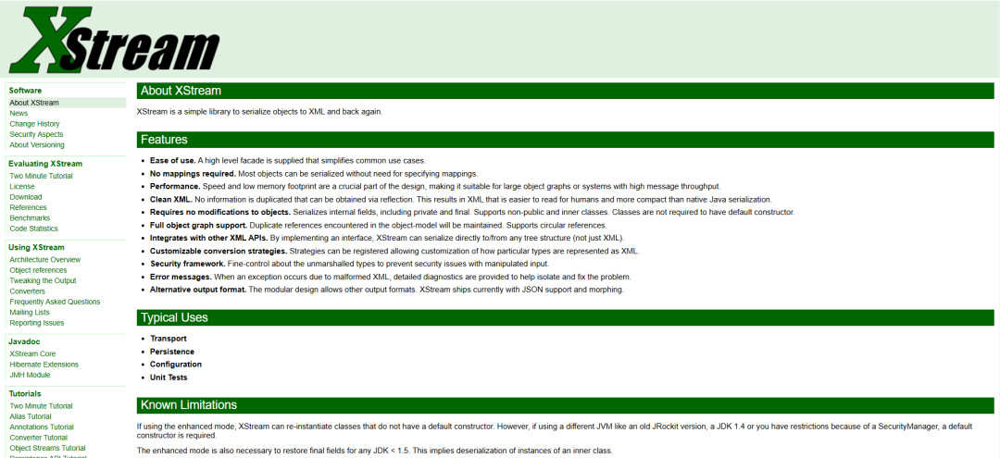

## 核对与使用边界

本文已按保存的全文审阅记录进行文字校订；本轮仅静态核对，未运行 PoC、请求目标或逐图验证。

适用条件与版本记录（来源主张，未列为明确更正的部分仍待权威资料核对）：&lt;1.4.21、必须使用BinaryStreamDriver，非所有XML路径

代码与实验材料：无PoC，明确当时未公开；只说明无限递归栈耗尽

来源证据范围：仅产品首页，无具体官方公告

- **结论使用边界（1）**：栈溢出术语需区分内存破坏；依据：正文是递归StackOverflow拒绝服务，不应泛化为可利用缓冲区溢出或RCE。此项限制直接适用于下文对应结论；现有正文不足以作更宽泛推论，所列方法和原始证据均保留。

- **事实待核（2）**：历史PoC状态和来源不完整；依据：未公开应绑定2024-11-16，需具体CVE补丁链接。该项尚不能从转载本身确定外部事实；下文相应编号、版本或修复说法只作为来源记录，不能据此判定部署受影响或已修复。明确更正另列于本节。

历史原文标识：下文原技术材料按来源保留；仅本节明确确认的更正替代相应旧说法，标为待核的观察仍不是事实确认。

#  漏洞预警 | XStream栈溢出漏洞   
浅安  浅安安全   2024-11-16 00:01  
  
**0x00 漏洞编号**  
- CVE-2024-47072  
  
**0x01 危险等级**  
- 高危  
  
**0x02 漏洞概述**  
  
XStream是一个用于在Java对象和XML之间相互转换的工具，它能够将Java对象序列化为XML或JSON格式，也可以将XML或JSON格式的数据反序列化为Java对象，从而简化了数据的存储、传输和恢复。  
  
  
  
**0x03 漏洞详情**  
###   
###   
  
**CVE-2024-47072**  
  
**漏洞类型：**  
栈溢出  
  
**影响：**  
服务中断  
  
**简述：**  
XStream 1.4.21之前版本中，当XStream配置为使用BinaryStreamDriver时，由于在反序列化某些特定输入时处理不当，攻击者可以通过构造特定的二进制数据流作为输入，导致在反序列化时进入无限递归，从而触发栈溢出，使应用程序崩溃并导致服务中断，造成拒绝服务。  
  
**0x04 影响版本**  
- XStream < 1.4.21  
  
**0x05****POC状态**  
- 未公开  
  
**0x06****修复建议**  
  
******目前官方已发布漏洞修复版本，建议用户升级到安全版本****：******  
  
https://x-stream.github.io/  
  
  
  

---

> 来源：gelusus/wxvl（微信公众号漏洞文章自动归档，原文见文首链接）
