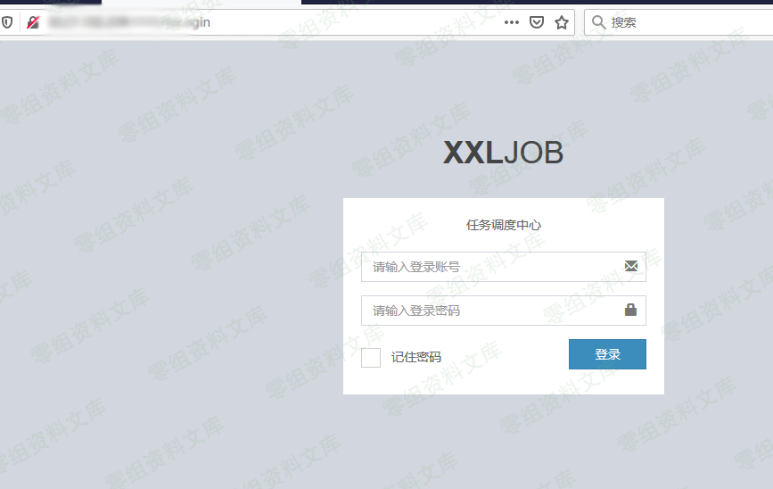
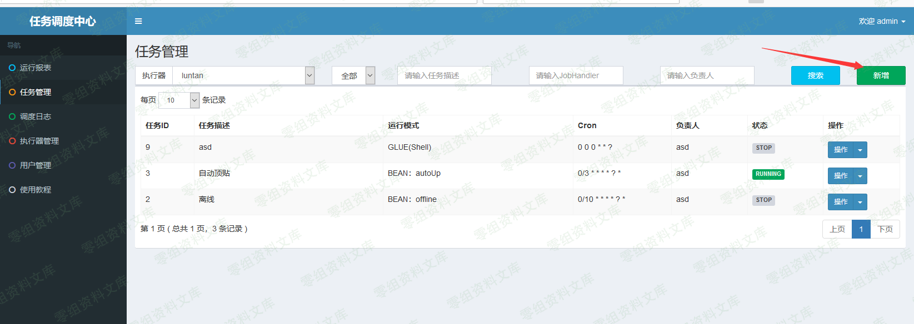
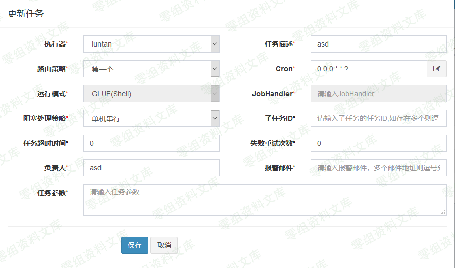
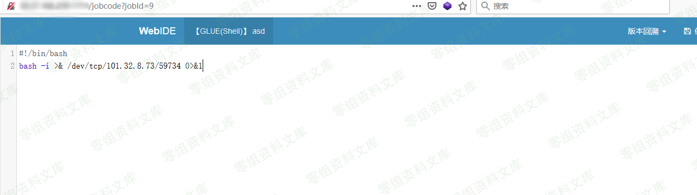
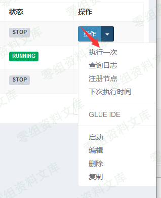
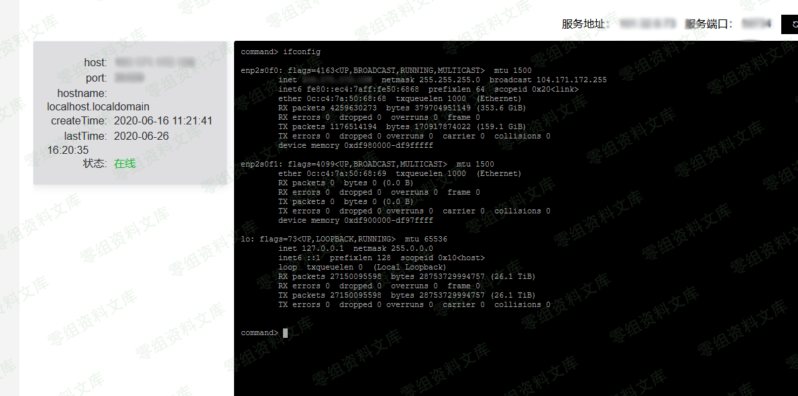

## 核对与使用边界

本文已按保存的全文审阅记录进行文字校订；本轮仅静态核对，未运行 PoC、请求目标或逐图验证。

适用条件与版本记录（来源主张，未列为明确更正的部分仍待权威资料核对）：无版本；已获得管理员/任务编辑权限，默认口令仅示例

代码与实验材料：全GUI截图、新增定时任务与回连，缺文字脚本/cron

来源证据范围：cnblogs原文

- **凭据与会话边界（1）**：应归弱凭据/功能滥用而非未授权框架RCE；依据：先admin登录再使用预期GLUE Shell功能，没有展示权限绕过。抓包中的会话不能视为未认证访问证明；可识别的真实会话值按中段星号遮罩处理，默认演示值和攻击语法保留。需重新取得授权测试会话，不能复用文中值。

- **事实待核（2）**：cron不是一次性时间语义；依据：“0时0分0秒执行一次”缺完整表达式，周期任务可能持续执行。该项尚不能从转载本身确定外部事实；下文相应编号、版本或修复说法只作为来源记录，不能据此判定部署受影响或已修复。明确更正另列于本节。

- **操作与副作用边界（3）**：持久任务缺清理；依据：新建任务、GLUE代码和回连均需停用删除，不可作为无害测试。保留原步骤及请求方法。执行条件包括隔离且获授权的可恢复环境、预先记录相关文件/账号/配置/业务记录状态；响应完成不能等同无副作用，恢复时须核对该操作涉及的实际对象。

历史原文标识：下文原技术材料按来源保留；仅本节明确确认的更正替代相应旧说法，标为待核的观察仍不是事实确认。

# XXL-JOB 任务调度中心 后台反弹shell

一、漏洞简介
------------

二、漏洞影响
------------

三、复现过程
------------

弱口令登录 账号：admin 密码：123456（XXL-JOB的默认账号、密码）

点击任务管理、新增一个执行任务，配置如下（运行模式选择shell，cron是linux定时任务，如下0时0分0秒执行一次）：

进入GLUE面板，写入执行的脚本命令。随意命名备注名称，保存并关闭

服务器监听shell，受害机执行任务

返回shell到服务器

参考链接
--------

> https://www.cnblogs.com/kbhome/p/13210394.html
